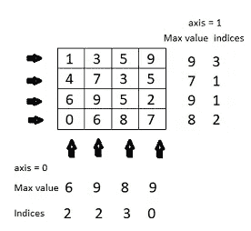

# 解码 FastAI 的深度学习代码—第 1 课

> 原文：<https://towardsdatascience.com/decoding-deep-learning-code-of-fastai-lesson-1-2c763cf4ffa1?source=collection_archive---------21----------------------->

## 我当时正在搭上人工智能炒作的列车，决定一头扎进谷歌搜索的深渊，为我的旅程指引方向。正如每个人和他们的博客所建议的那样，我看了吴恩达的机器学习课程讲座，完全被人工智能可能解决的潜在问题所吸引。但我希望作业是用 Python 写的，这种语言让我的生活变得更简单——[刮网页](https://hackernoon.com/tired-of-bookmarking-pages-scrap-it-instead-b398622f77d)，[布置选修课](https://hackernoon.com/python-comes-to-rescue-again-electives-allocation-1d21a516b79a)，还有[保护我的眼睛](https://hackernoon.com/protect-your-eyes-with-python-f3e7e7b862f0)。而且，感觉我学了太多的理论，却没有足够的实践。

我很快了解到 FastAI 的程序员实用深度学习正是我一直在寻找的。作为一名程序员，我对 FastAI 和他们遵循的自顶向下的方法非常着迷。现在，在课程开始的 15 分钟内，我已经为一个计算机视觉问题训练了一个图像分类器。所以我决定采用同样的方法来学习 Numpy，并一路练习 Python。

我已经试着解释了第一课中的所有代码以及每个函数的作用。所以现在，你可以利用这段时间来尝试不同的时代和学习速度，并改进模型，而不是在小事情上伤脑筋。

最好先看第一课的视频[或阅读第一课的相关文章](https://www.youtube.com/watch?v=IPBSB1HLNLo)。我从[这里](/fast-ai-lesson-1-on-google-colab-free-gpu-d2af89f53604)开始学习使用 Google Colab 运行我的工作空间(生活中最美好的事情是[永远免费](/fast-ai-the-best-things-in-life-are-always-free-3b05c54913cd)——FastAI、Google Colab 和 Python)。在本教程的最后，我有一节解释了代码中使用的 numpy 函数。我们正在处理本课中使用的狗和猫的分类数据集。

基础知识:

我们使用 resnet34 架构(一种卷积神经网络)根据图像属于狗或猫类的概率将图像分类为狗/猫。

*数据*变量包含训练和验证数据。训练数据是关于模型被训练的内容，验证数据用于检查我们的模型在它以前没有见过的图像上的表现如何。

*data.val_y* 是验证数据集标签，即带有猫的图像的标签为 0，带有狗的图像的标签为 1。

```
*data.val_y
array([0, 0, 0, ..., 1, 1, 1])*
```

*学习*变量包含模型。在这里，我们使用迁移学习，我们利用预训练模型已经学会识别的特征，如边缘、曲线、某些形状等。激活是一个数字，它表示—该功能在这个位置具有这个置信度(概率)。

*预计算=真*意味着我们预计算隐藏层的激活，并为我们的图像训练最后的年份。

*learn.fit()* 通过，学习率为 0.02，训练的历元数为 3。

现在让我们深入研究一下实现。

我们预测验证集中的图像，并将其存储在 *log_preds* 中。该值以自然对数表示。

```
log_preds[:2]
*array([[ -0.00323,  -5.73731],
       [ -0.0001 ,  -9.21326]], dtype=float32)*
```

*preds* 在 *log_preds* 的每一行中寻找最大值。

*probs* 通过取 *log_preds* 第二列的指数，包含图像是狗的概率(第一列是对猫的预测，第二列是对狗的预测)。如果 *probs* 小于 0.5，我们将图像分类为猫，如果大于 0.5，我们将其分类为狗。

为了了解我们的模型是如何看到这些图像的，让我们看看一些随机正确/错误分类的图像。定义相同的功能，

*rand_by_mask(mask)* 返回满足 *mask 中条件的四个随机元素的**索引。***我们可以通过改变 np.random.choice. 中的第二个参数 *r 来选择返回多少张图片*

*rand _ by _ correct(is _ correct)*首先检查 *preds* 中的预测标签和 *data.val_y* 中的实际标签是否与用户输入的 *is_correct* 参数中的 **匹配，该参数为布尔变量 True /False。它将这个经过筛选的数据集作为*掩码*发送到 *rand_by_mask，*以获得四个符合标准的随机图像。**

现在我们有了获得**随机正确**/不正确图像的函数，让我们看看获得****最正确**/不正确分类图像的函数。**

***most_by_correct(y，is_correct): y* 对于猫是 0，对于狗是 1。*是 _ 正确*是布尔型。该函数调用 *most_by_mask(mask，mult)。*将*掩码*指定为**逻辑与**的:**

*****preds*中的预测标签和 *data.val_y* 中的实际标签相互匹配，并且*是正确的*参数****

*****与 *y* 参数匹配的 data.val_y*****

****它根据以下逻辑计算 *mult* :****

********

*****most_by_mask(mask，mult):* 该函数通过 *mask* 和 *mult* 实现。首先，我们在 *idxs* 中得到满足遮罩条件的图像。然后我们将 *mult* 乘以 *idxs* 中数据的概率，用 np.argsort 得到结果的最小四个值，为什么要这样做呢？****

****考虑一下狗的情况。****

1.  ****对于正确的狗， *mult* = -1 和 *probs* 的子集看起来像 0.60，0.67，0。87，0.98(都大于 0.5)。所以当你排序( *mult*probs )* 时，得到-0.98，-0。87, -0.67, -0.60 .因为最正确的狗的 *probs* 最接近 1，所以该结果显示从最正确的顺序开始的图像。****
2.  ****对于不正确的狗， *mult* = 1。所以当你排序( *mult*probs )* 时，得到 0.60，0.67，0。87, 0.98.由于最不正确的狗的*探针*距离 1 最远，因此该结果显示最不正确顺序的图像。****

****以猫为例。****

1.  ****对于正确的猫， *mult* = 1 和 *probs* 的子集看起来像 0.04、0.12、0.35、0.43(都小于 0.5)。所以当你排序( *mult*probs )* 时，得到的是 0.04，0.12，0.35，0.43。由于最正确的 cat 的 *probs* 最接近 0，因此该结果显示最正确顺序的图像。****
2.  ****对于不正确的猫， *mult* = -1。所以当你排序( *mult*probs )* 时，得到-0.43，-0.35，-0.12，-0.04。由于最不正确的 cat 的*探针*距离 0 最远，因此该结果显示最不正确顺序的图像。****

****现在让我们看看为我们绘制图像的函数。****

*****绘图:*我们使用 matplotlib 库来绘制图像。我们在 *ims 中得到一个图像数组，*在 *rows、*中得到要显示的行数，在 *titles 中得到标题数组。*我们使用 range 函数在 *ims* 数组的长度上循环遍历 *ims* 中的每个图像，为其添加相应的标题并绘制。****

*****load_img_id:* PIL 是 Python 图像库，我们从数组 *ds* 中打开索引 *idx* 的图像，并将其作为一个 np 数组返回。****

*****plot_val_with_title:* 我们得到的 *idxs* 是由 *most_by_correct* 或 *rand_by_correct* 返回的图像的子集。我们使用列表理解从 *idxs* 中获取单个索引 *x* ，并使用 *load_img_id(data.val_ds，x)从验证集 *data.val_ds* 中加载每个图像。*****

****我们还将每个图像索引 *x* 的分类概率存储在 *title_probs* 数组中。我们将这些传递给 *plots* ()函数。****

*****most _ uncertainty:*这里我们的目标是找到概率非常接近 0.5 的图像(它们不确定该靠哪边)。我们把概率减去 0.5，取绝对值，排序。我们取最小的四个值，并返回对应于这些概率的元素的索引。****

****要获得结果图像，请尝试 FastAI 中的代码。你可以在 Google Colab 中实现它，它的教程在这个[链接中。](/fast-ai-lesson-1-on-google-colab-free-gpu-d2af89f53604)您可以自己试验这些函数，比如将参数更改为 *plot_val_with_title()* 并调整返回的图像数量。****

****NUMPY 函数解释如下:****

1.  ******np.argmax(array，axis = None，out = None) :** 返回数组中最大元素在特定轴上的索引。对于 2 D 矩阵，axis = 0 表示列，axis = 1 表示行。考虑以下阵列:****

********

****np.argmax( array，axis = 0) = [2 2 3 0]****

****np.argmax( array，axis = 1 ) = [3 1 1 2]****

******2) np.exp(** **array，out = None)** 计算输入数组中所有元素的指数****

****现在让我们看看这些图像，了解一下哪种图像被正确/错误地预测了。在这里，我们继续定义自定义函数来选择要显示的图像。****

****理解这里使用的 numpy 函数:****

******3) np。其中(condition[，x，y])** 返回满足给定条件的输入数组中元素的索引。****

****-> **条件是布尔:**根据可选值 x 和 y 有两种变化。****

****I)当 x 和 y 都不是时:****

****返回满足条件的值的索引。****

```
**x = np.arange(4).reshape(2, 2)
#Note: np.arange() returns array of evenly spaced values.print(x)
# [ [0, 1], [2, 3]]print(np.where( x > 0))
# (array([0, 1, 1]), array([1, 0, 1]))**
```

****ii) x 和 y 包含值:当条件为真时，使用 x 的值，如果条件为假，则使用 y 替换原始值。****

****在这里，当数组值大于 0.5 时，该值将更改为 1。对于其他情况，该值将被更改为零。****

```
**arr = [ 0.1 , 0.7, 0.3, 0.6 ]
res = (np.where(arr>0.5, 1, 0))
print(res)   
#res = [0, 1, 0, 1]**
```

****-> **条件类似于数组:**当条件为真时，使用 x 的位置值，如果条件为假，则在结果数组中使用 y 的相应值。这里，对于数组中的 True 值，使用 array_true，对于 False 值，使用 array_false。****

```
**array =  [[True, False], [False, True]] 
array_true = [[1, 2], [3, 4]] 
array_false = [[5, 6], [7, 8]] 
res = np.where(array,array_cond_true,array_cond_false)print(str(res))
# [[1,6], [7,4]]**
```

******4) np.random.choice (a，size=None，replace=True，p=None)** 返回从其元素生成的随机样本。****

******一个**可以是整数也可以是一维数组。如果是数组，则从其元素中生成随机样本。如果是 int，则生成随机样本，就像 a 是 np.arange(a)一样。****

****可选参数包括:****

******size:** 要返回的数组的大小。****

******替换:**样品是否有替换****

******p:** 与 a 中每个条目相关的概率。如果没有给定，样本假设在 a 中的所有条目上均匀分布。****

```
**np.random.choice(5, 3)
# array([0, 3, 4])np.random.choice(5, 3, replace=**False**)
# array([3,1,0]) . This is like permutation, values are not repeated**
```

******5) np.argsort(a)** 返回以 numpy 数组形式对数组进行排序的索引****

```
**a = np.array([5,7,4,1]) 
print(a)    #  [5 7 4 1]b = np.argsort(a)
print(b)    #  [3 2 0 1]c=a[b]
print(c)    #  [1 4 5 7]**
```

****返回一个 numpy 数组****

****请参考以下链接了解 numpy 数组。****

****[](https://www.scipy-lectures.org/intro/numpy/array_object.html) [## 1.3.1.NumPy 数组对象—科学讲义

### 创建一个简单的二维数组。首先，重做上面的例子。然后创造你自己的:如何奇数…

www.scipy-lectures.org](https://www.scipy-lectures.org/intro/numpy/array_object.html) 

我希望我在第一课解释了代码背后的直觉。非常感谢 [Jeremy](https://twitter.com/jeremyphoward) 和 [Rachel](https://twitter.com/math_rachel) 通过 [FastAI](https://www.fast.ai/) 开发并民主化了这门深度学习的精彩课程。****