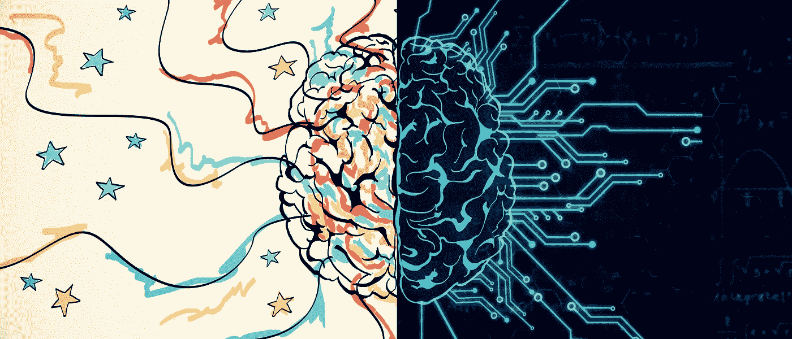
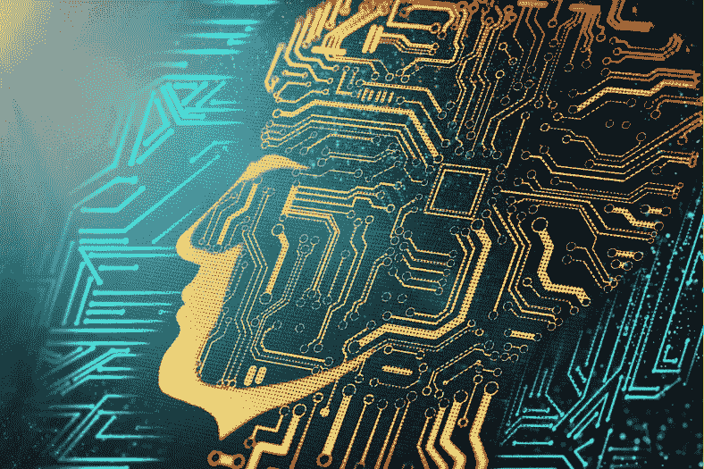
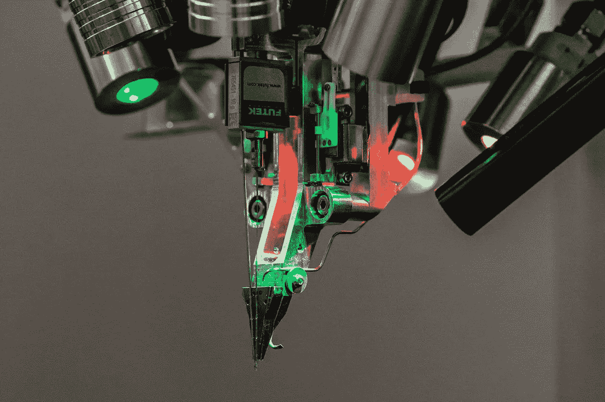
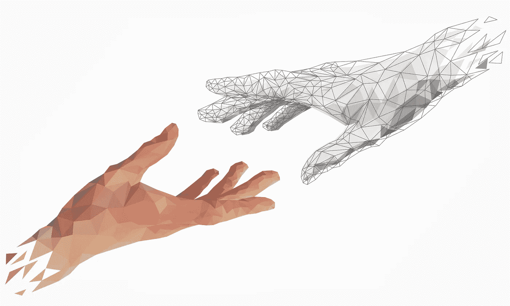
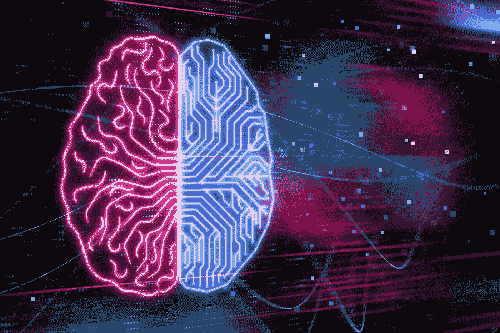

# 解码我们自己的大脑

> 原文：<https://towardsdatascience.com/decoding-our-own-brain-95f861d0d94a?source=collection_archive---------21----------------------->

## 科技会释放我们大脑的真正潜力吗？

SOURCE: © ADOBE STOCK

 我 一直着迷于我们的大脑可以达到超乎寻常的潜能这一想法。我们可以做远远超出我们想象的事情，发现我们未知的能力。然而，纵观历史，人类大脑的进化已经产生了一定程度的“舒适”。这种水平在某种程度上限制了我们将大脑推出其边界，并阻止我们提高我们的能力。

在过去的十年中，我们看到了神经科学和技术进步如何合作，在技术和人脑之间建立联系。这些进步旨在发展一种“共生关系”，即技术与人类的融合。这当然引发了许多问题——包括对这些创新的过程和实施的困惑，以及许多与伦理相关的问题。

有这么多要讨论的，但我们至少应该首先考虑的是，技术将帮助我们更有效地使用我们的大脑。这就是我们将在这篇文章中探讨的。

# 技术和人脑

SOURCE: © ADOBE STOCK

想象一下，有一天我们可以改变我们的记忆来解决抑郁和焦虑问题，或者将一整年的研究直接下载到我们的大脑中，或者体验人们的情绪，或者甚至能够只用我们的思维将我们的想法传递给其他人。这听起来似乎遥不可及，但事实是，我们正在取得很大进展，我们正在实现这一目标。

以脑机接口(BCI)为例，这项技术已经发展了几十年。这项技术允许计算机记录大脑信号，并产生转化为行动的反应，如控制机器人假肢或用大脑玩视频游戏。

该领域最有希望的发展之一归功于埃隆·马斯克，他最近的一项宣布是: [**Neuralink**](https://www.neuralink.com/) 。

Neuralink´s Robotic Surgery. SOURCE: © NEURALINK

该项目主要基于通过细电极线将人脑与智能手机或电脑等不同设备连接起来的想法，这些电极线允许我们用思想控制这些设备。第一个目标是利用这项技术来改善那些患有瘫痪或类似疾病的人的生活质量，但这只是一个开始。

在大脑和计算机之间建立一条通信路径将允许我们做一些我们认为不可能的事情。

# 人工智能——人类共生

SOURCE: © ADOBE STOCK

M usk 认为 BCI 对我们的未来至关重要，它将通过[允许人类与未来的超级智能人工智能发展合作](/what-if-your-colleague-is-a-robot-e1256b3e2c94)来减少人工智能(AI)的负面影响。

在这种情况下，共生指的是人工智能和人类之间的有益关系，我们在其中合作和共同进化。听起来有点怪异，但基本上，当人类教会机器如何改进时，机器将以“共生”的方式与人类并肩发展。

这种连接的目的是实现人类和机器之间的某种创造性协作，在这种协作中，我们不仅仅是发布命令，还可以一起集思广益，并接收彼此的反馈。

实施脑机接口技术将提高残疾人和非残疾人的学习和记忆等技能。有了这项技术，人类大脑将能够更快地访问和处理信息。想象一下，能够随时接触到世界上所有的知识，并理解它。

从长远来看，这一过程可能会在不同的阶段发展:从浏览我们大脑内部的特定信息开始，如“谷歌搜索”，到我们的大脑将成为某种“云”——一个我们可以存储、下载、上传、修改并与其他人和计算机实时分享信息的地方，以及立即了解一切的地方。

科技将显著改善我们的记忆，让我们能够储存和获取更多的信息。它可以帮助许多人，如有记忆问题的老人，轻松回忆起来。此外，对于像阿尔茨海默氏症这样的记忆没有完全丧失的残疾人来说，技术将帮助他们建立一种联系，以恢复那些隐藏的记忆。

在 Neuralink 的首次亮相期间，马斯克透露已经用老鼠做了几次测试，他们甚至用一只显然成功控制了计算机的猴子**做了测试。现在，他们正在等待食品药品监督管理局(FDA)批准开始人体试验。**

马斯克有一个非常有趣的观点，他认为人类大脑除了有边缘系统和皮层之外，还有某种额外的“数字层”。不同的是，我们通常通过手指而不是大脑来连接它。这是一个有趣的观点。

# 对我们大脑能力的未来研究

SOURCE: © ADOBE STOCK

想想你只用大脑能做的最奇怪、最神奇、最疯狂的事情。

很多想法可能会突然出现在你的脑海里…

还记得 x 战警里的泽维尔教授(X 教授)吗？他有心灵感应。他可以读取你的思想，改变你的感官，甚至放置或删除思想和记忆。这听起来很极端，但我们不应该忽视未来可能与此类似。

未来是非常不确定的，因此发展的顺序将成为现实。人类和技术的结合可能比人工智能更强大。也许我们不会成为“泽维尔教授”，但我们一定会拥有通过心灵交流的力量，不仅是与机器交流，也可以与其他人类交流；在这个层面上我们将能够体会彼此的感受。

现在，这很疯狂，但是考虑一下将我们的大脑提取到一个可以插入一个全新身体的装置中的可能性。一个更强、更快、更灵活的身体，一个只要大脑还活着就不一定会死的身体。这是能防止我们死亡的解药吗？

这些进步旨在释放我们真正的力量，我们大脑的全部潜力，同时将我们从人工智能的末日中拯救出来——如果我们不学会如何控制技术并与之合作，人类就会成为劣等物种。

埃隆·马斯克自己说过，谁想拥有自己的人工智能扩展，谁就可以拥有一个。人类与人工智能的共生可以对未来做出决定，这将建立一个人工智能是***民有、民治、民享*** 的世界。