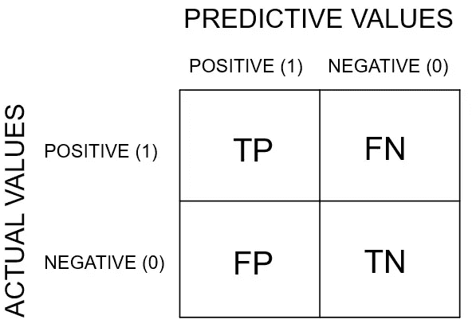
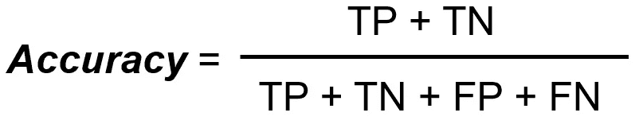
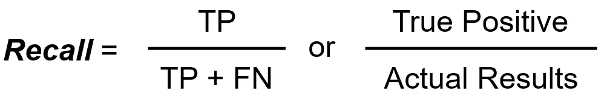
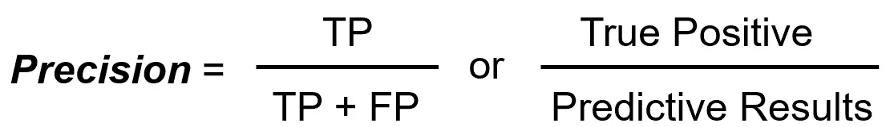
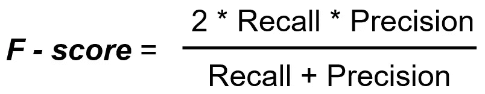
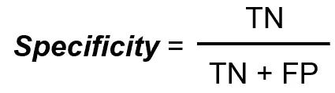
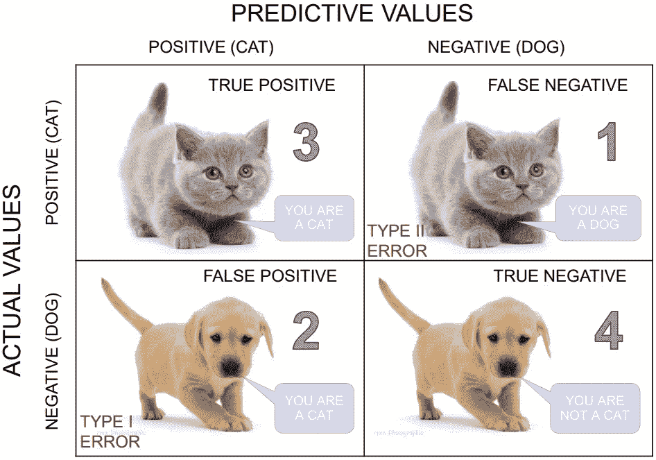
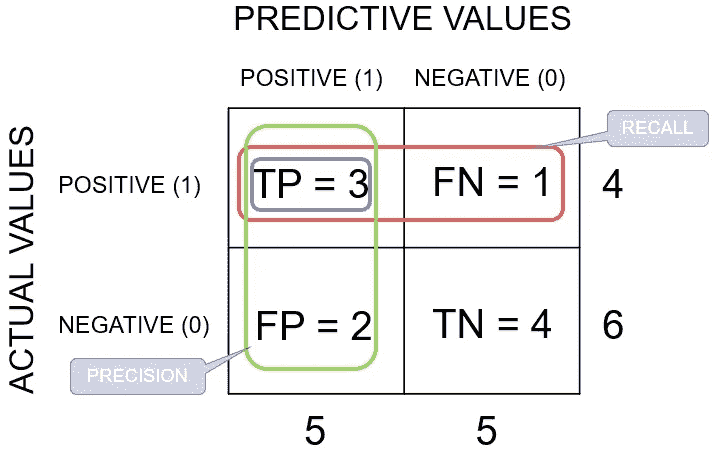

# 解码混淆矩阵

> 原文：<https://towardsdatascience.com/decoding-the-confusion-matrix-bb4801decbb?source=collection_archive---------4----------------------->

在分类问题的情况下，只有一个分类精度可能无法给出全貌。因此，混淆矩阵或误差矩阵用于总结分类算法的性能。


Photo by [Joshua Sortino](https://unsplash.com/@sortino?utm_source=unsplash&utm_medium=referral&utm_content=creditCopyText) on [Unsplash](https://unsplash.com/search/photos/matrix?utm_source=unsplash&utm_medium=referral&utm_content=creditCopyText)

计算混淆矩阵可以让您了解分类模型在哪里是正确的，以及它会产生什么类型的错误。

混淆矩阵用于检查分类模型对一组真实值已知的测试数据的性能。大多数性能指标，如精确度、召回率，都是从混淆矩阵中计算出来的。

**本文旨在:
1。什么是混淆矩阵，为什么需要它。
2。如何用一个猫狗的例子计算一个 2 类分类问题的混淆矩阵？
3。如何在 Python 中创建混淆矩阵& R.
4？对不同指标的总结和直觉:准确度、召回率、精确度&特异性**

# 1.混淆矩阵:

混淆矩阵提供了分类问题中预测结果的总结。表中总结了正确和不正确的预测及其值，并按类别进行了细分。



Confusion Matrix for the Binary Classification

当类别不平衡时，我们不能依赖单一的分类精度值。例如，我们有一个 100 名患者的数据集，其中 5 名患有糖尿病，95 名健康。然而，如果我们的模型仅预测大多数类别，即所有 100 个人都是健康的，即使我们具有 95%的分类准确度。因此，我们需要一个混淆矩阵。

# 2.计算混淆矩阵:

让我们举个例子:

我们总共有 10 只猫和狗，我们的模型预测它是否是一只猫。

实际值= ['狗'、'猫'、'狗'、'猫'、'狗'、'猫'、'狗']
预测值= ['狗'、'狗'、'狗'、'猫'、'狗'、'狗'、'狗'、'猫'、'猫'、'猫']


> 请记住，我们将预测值描述为正/负，将实际值描述为真/假。

**术语定义:**
真阳性:你预测阳性，是真的。你预言一种动物是猫，它确实是。

真阴性:你预测为阴性，这是真的。你预测动物不是猫，它实际上也不是(它是一只狗)。

假阳性(类型 1 错误):你预测阳性，但它是假的。你预测动物是猫，但它实际上不是(它是狗)。

假阴性(第二类错误):你预测的是阴性，它是假的。你预测那种动物不是猫，但它实际上是。

**分类精度:**
分类精度由下式给出:



**召回(又名敏感度):**
召回定义为正确分类的正类总数除以正类总数的比值。或者说，在所有的积极类中，我们正确预测了多少。召回率应该很高。



**精度:**
精度定义为正确分类的正类总数除以预测的正类总数的比值。或者说，在所有的预测积极类中，我们预测正确的有多少。精度要高。



> 需要记住的技巧: **Pre** cision 在分母中有 **Pre** dictive 结果。

**F-score 或者 F1-score:**
两个精度和召回率不同的模型很难比较。所以为了使它们具有可比性，我们使用 F-Score。这是精确和回忆的调和平均值。与算术平均相比，调和平均对极值的惩罚更大。f 分应该很高。



**特异性:**
特异性决定了被正确识别的实际阴性的比例。



**解释混淆矩阵的例子:**
让我们用上面的猫和狗的例子来计算混淆矩阵:



**分类精度:**
精度=(TP+TN)/(TP+TN+FP+FN)=(3+4)/(3+4+2+1)= 0.70

回忆:回忆让我们知道什么时候它实际上是肯定的，它预测肯定的频率有多高。
回忆= TP / (TP + FN) = 3/(3+1) = 0.75

精度:精度告诉我们什么时候它预测是，它正确的频率是多少。
精度= TP / (TP + FP) = 3/(3+2) = 0.60

**F-score:**
F-score =(2 *召回率*准确率)/(召回率+准确率)=(2 * 0.75 * 0.60)/(0.75+0.60)= 0.67

**特异性:**
特异性= TN / (TN + FP) = 4/(4+2) = 0.67

# 3.在 Python & R 中创建混淆矩阵

让我们用 python 和 R 代码来理解上面的狗和猫的例子，这会让你更好地理解到目前为止你对混淆矩阵的了解。

**混乱矩阵的 Python 代码:**

首先让我们用 python 代码创建一个混淆矩阵。我们必须从 sklearn 库中导入混淆矩阵模块，这有助于我们生成混淆矩阵。

下面是上面解释的 Python 实现:

Python Code

```
**OUTPUT ->**Confusion Matrix :
[[3 1]
 [2 4]]
Accuracy Score : 0.7
Classification Report : 
        precision    recall  f1-score   supportcat       0.60      0.75      0.67         4
dog       0.80      0.67      0.73         6micro avg          0.70      0.70      0.70        10
macro avg          0.70      0.71      0.70        10
weighted avg       0.72      0.70      0.70        10
```

**混淆矩阵的 R 代码:**

现在让我们用 R 代码创建一个混淆矩阵。我们将使用 R 中的插入符号库来计算混淆矩阵。

R Code

```
**OUTPUT ->**Confusion Matrix and Statistics Reference
Prediction   0 1
           0 4 1
           1 2 3Accuracy : 0.7 
95% CI : (0.3475, 0.9333)
No Information Rate : 0.6 
P-Value [Acc > NIR] : 0.3823Kappa : 0.4Mcnemar's Test P-Value : 1.0000Sensitivity : 0.6667 
Specificity : 0.7500 
Pos Pred Value : 0.8000 
Neg Pred Value : 0.6000 
Prevalence : 0.6000 
Detection Rate : 0.4000 
Detection Prevalence : 0.5000 
Balanced Accuracy : 0.7083'Positive' Class : 0
```

# 4.总结:

*   精确是你对自己的真实想法有多确定。回忆是你有多确定你没有错过任何积极的东西。
*   如果**假阴性的出现不可接受/不可容忍，选择**召回**。**例如，在糖尿病的情况下，你宁愿有一些额外的假阳性(假警报),而不是保存一些假阴性。
*   如果你想对你真正的阳性结果更加**自信，选择**精确**。例如，在垃圾邮件的情况下，你宁愿在你的收件箱中有一些垃圾邮件，而不是在你的垃圾邮件箱中有一些普通邮件。在我们将电子邮件 X 放入垃圾邮件箱之前，您想要额外确定它是垃圾邮件。**
*   如果您想要**覆盖所有真阴性，选择**特异性**，**即意味着我们不想要任何假警报或假阳性。例如，在毒品测试中，所有测试呈阳性的人都会立即入狱，你不会希望任何没有吸毒的人入狱。

我们可以得出结论:

*   准确度值为 70%意味着每 10 只猫中有 3 只识别不正确，7 只识别正确。
*   精度值为 60%意味着每 10 只猫中有 4 只不是猫(即狗)，6 只是猫。
*   召回值为 70%意味着实际上每 10 只猫中有 3 只被我们的模型遗漏，7 只被正确识别为猫。
*   特异性值为 60%意味着现实中每 10 只狗(即非猫)中有 4 只被误标记为猫，6 只被正确标记为狗。

如果您有任何意见或问题，请在下面留下您的反馈。更多文章请访问 [KeytoDataScience](https://keytodatascience.com/) 。你可以在 LinkedIn 上找到我。