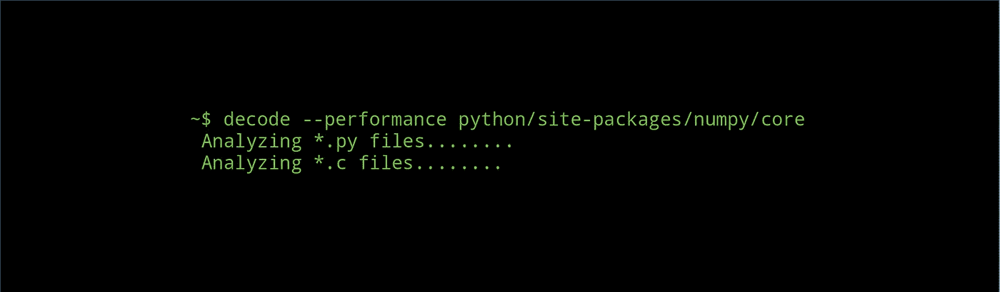
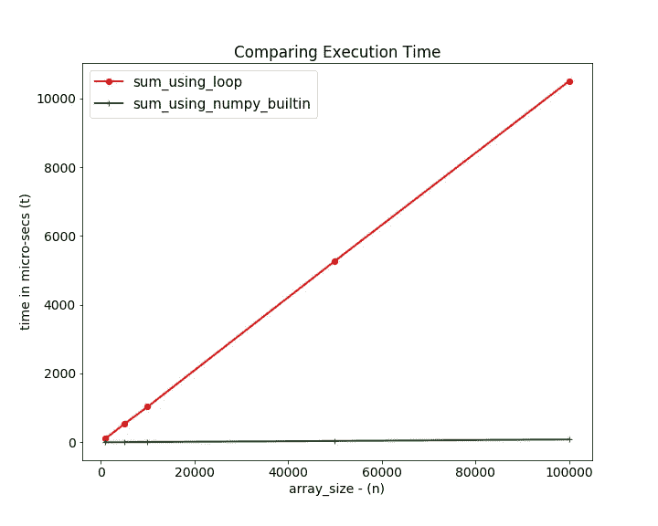
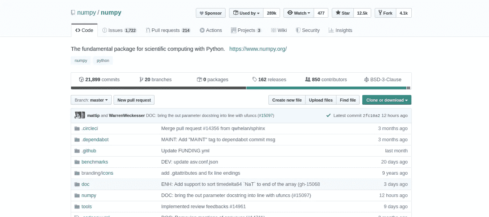
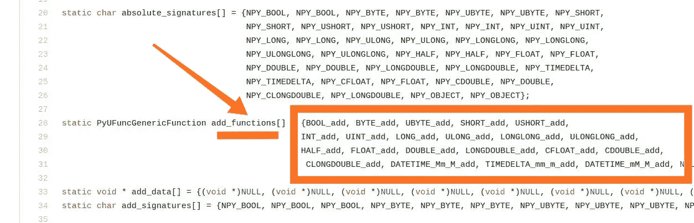
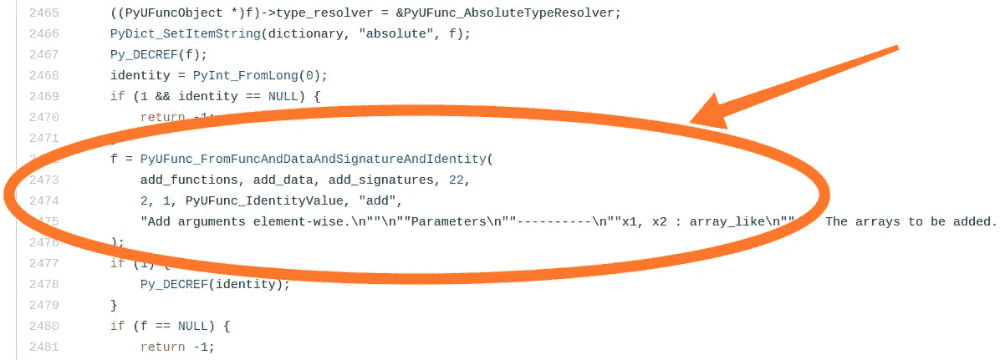
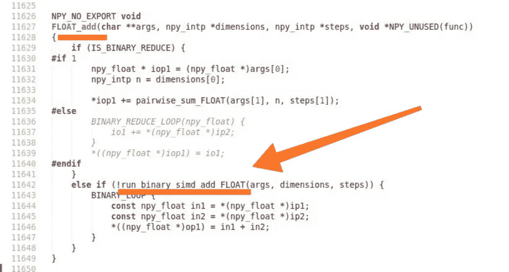
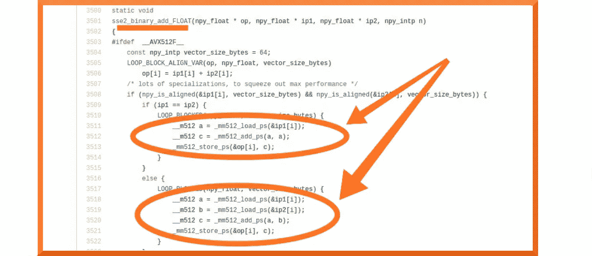
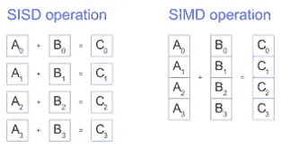
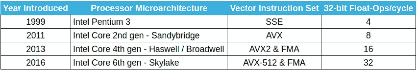

# 解码世界上最流行的数据科学库——Numpy 的性能秘密

> 原文：<https://towardsdatascience.com/decoding-the-performance-secret-of-worlds-most-popular-data-science-library-numpy-7a7da54b7d72?source=collection_archive---------9----------------------->



没有这个魔咒，任何机器学习脚本都无法启动


无论是数据科学爱好者，还是经验丰富的从业者，每个人都知道这个精彩的 Python 库的威力。

当涉及到处理大型多维数组(表格、图像等)时。)，用 numpy 也不会错的很离谱。

但是你知道吗，除了超级方便之外，强大的软件包还包含相当多的性能果汁！

事实上，使用 numpy 内置的基于元素的数组操作通常比遍历标准 python list 要快得多。

考虑这个简单的任务，按元素添加两个列表

比较这两者的性能，我们可以观察到



随着元素数量从 1000 增加到 100，000，Python-lists 所用的时间成线性比例——O(n ),相对于此,`*np.add()*`所用的时间几乎保持不变——O(1)。

为了让您了解阵列大小为 100，000 的一些情况，这些数字如下:

```
%timeit sum_using_loop(a,b,c)
# Average run time: 10.5 ms ± 15.9 µs%timeit sum_using_numpy_builtin(a, b)
# Average run time: 79.6 µs ± 835 ns
```

> numpy 方法快了将近 130 倍！！

问题是—

> Numpy 是如何实现如此荒谬的加速的？？

一些显而易见的答案包括:

*   Numpy 主要是用 C 写的，比 Python 快。
*   Numpy 数组是同构的(所有数组元素都有固定的数据类型- `*np.float32, np.uint8*`等等)。与没有这种限制的 python 列表相比)，从而允许将数字存储在连续的存储器位置中以便更快地访问(*利用* [*引用位置*](https://en.wikipedia.org/wiki/Locality_of_reference) )

尽管如此，上述原因还不足以解释处理时间为何不与数组大小成比例。

# 走到幕后

为了找到答案，让我们开始在 Numpy Land 的秘密任务——解构源代码。



为了理解这一点，让我们先熟悉一些本地术语:

*   **通用函数**(uf unc)—numpy 中的函数，对“N”维数组(又名 ndarray)执行快速元素运算
*   **umath** — Numpy 模块，包含常见数学运算的实现，如加、减、乘、正弦、余弦等。)

> **剧透警告** : Numpy 使用矢量指令(SIMD)来加速“ufunc ”,你可以跳到下一节，或者如果你有兴趣了解如何加速，请继续阅读。

经过一番挖掘，我们可以在`*__umath_generated.c*`中找到一些我们感兴趣的添加函数的引用

我们看到，`*add_functions*`是一个数组，包含对所有特定类型加法函数的引用，包括`*INT_add*, *FLOAT_add*, *DOUBLE_add*`等。



How Numpy stores references to all data-type specific addition functions — Numpy source

这些`*add_functions*`通过下面的代码映射到我们的 python 的`*numpy.add*`函数调用。



Where ‘numpy.add’ comes from — Numpy source

现在为了简单起见，让我们只关注一种数据类型，比如说浮点加法，并弄清楚是什么让它如此快速！

我们的查询将我们带到了实现相关方法的文件— `*loops.c*`



‘Float_add’ method inside ‘loops.c’ — Numpy source

流程是这样的:

1.  确定它是否是一个归约操作——组合输入参数并返回一个聚合结果*(在我们的例子中不是这样)*

2.尝试使用`*run_binary_simd_add_FLOAT()*` 将它们相加(这里的‘二进制’指的是对两个输入的运算，可以是数组或标量或者两者的组合)

3.如果对 *simd_add* 函数的调用失败，那么它使用标准的循环元素加法。

> 注意:这些名字- ' *sse2* '，' *simd* '可能现在看起来很陌生，但是以后会有意义的

沿着`*run_binary_simd_add_FLOAT()*` *，*的轨迹，我们最终会找到我们最感兴趣的那段代码`*sse2_binary_add_FLOAT()*`



仔细观察，我们可以发现一些奇怪的代码，这些代码(*如果你还记得你的“计算机架构”课*)类似于汇编语言。

```
*_mm512_load_ps* _*mm512_add_ps
_mm512_store_ps*
```

事实上，这些是 *'* [英特尔内部函数](https://software.intel.com/sites/landingpage/IntrinsicsGuide/#techs=SSE4_2,AVX,AVX2) ' — *C 函数，它们提供对汇编指令的访问，而无需实际编写汇编代码！*

更确切地说，这些是矢量指令！！

# 向量:什么鬼东西？？

在你开始思考汇编代码之前，请允许我解释一下。

> 现代 CPU 有称为向量寄存器的专用硬件寄存器，能够同时对多个操作数(相同类型/大小)进行操作，引入了被称为**‘单指令多数据**’(或 SIMD)机制的并行性



[**Image Credit: NativeScript**](https://www.nativescript.org/blog/nativescript-now-supports-vector-types)

向量指令(也称为向量扩展)是访问这些向量寄存器的手段，允许在大型数组(也称为向量扩展)上更快地处理最常见的算术和逻辑运算。向量)。

这些通常用于涉及大型多维数组操作的应用程序，例如

*   图形处理(视频游戏、4K 视频渲染等。)
*   统计(寻找大型数组的平均值/模式)
*   机器学习(矩阵乘法->输入*权重+偏差)

> 啊哈！！

# 是什么让这些寄存器这么酷(快)？

这是他们的能力。

典型地，CPU 具有多个 32 位和 64 位通用寄存器，而向量寄存器的大小是 128/256 位，或者在较新的情况下甚至是 512 位。(我们将会看到)。

> 更大的容量意味着，一个 256 位向量寄存器可以在一个时钟周期内并行保存和操作“8”个 32 位浮点！—与最大的通用寄存器相比，速度提高了近**4 倍**

SSE 和 AVX 是最流行的向量扩展。

[SSE ( **流 SIMD 扩展)**](https://en.wikipedia.org/wiki/Streaming_SIMD_Extensions) 最早于 1999 年在英特尔奔腾 III 中推出，附带**‘8’-128**位向量寄存器。

12 年后，随着“ *Sandy bridge* ”，英特尔推出了新的 [AVX ( **高级向量扩展** )](https://en.wikipedia.org/wiki/Advanced_Vector_Extensions) ，它拥有 **256 位**寄存器(几乎是上一代的两倍)



Intel Processor vectorization capacity increasing as the generations progress

*因此，现在我们有了一些很酷的东西来欣赏现代 CPU 能够进行的硬件优化，而不仅仅是痴迷于它们的时钟速度。*

总之，Numpy 对向量指令的利用，使得它在大型数组上执行操作的速度超快，这与标准 python-lists 相反。此外，在内部，numpy 使用了许多其他性能提升技巧，包括'[](https://www.jessicayung.com/numpy-arrays-memory-and-strides/)**'*，&其他编译器级优化标志，以执行'[](https://gcc.gnu.org/projects/tree-ssa/vectorization.html)*'自动向量化。**

# **常见问题**

> ****问:上述加速仅适用于英特尔 CPU 吗？AMD 处理器呢？****

> **AMD 确实支持 SSE 和 AVX，但是它的支持仅限于 AVX2 (256 位)，而较新的英特尔处理器配备 AVX-512 (512 位)**

> ****问。)这些新获得的知识如何让我成为更聪明的数据科学家？****

> **既然你已经知道了内部秘密，那么对你最有利的是:**
> 
> **-尽可能避免使用 for 循环，使用 numpy 内置的操作和方法。**
> 
> **-如果代码包含一维数组上的条件循环，一种快速矢量化代码的方法是使用`np.vectorize`。这里有一个帖子告诉你如何去做。**
> 
> **-对于复杂运算，技巧是尝试将循环转换为一系列矩阵运算(点积/矩阵乘法/加法等)。).[这里有一个帖子用一个例子](https://hackernoon.com/speeding-up-your-code-2-vectorizing-the-loops-with-numpy-e380e939bed3)描述了同样的情况。**