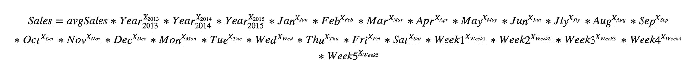
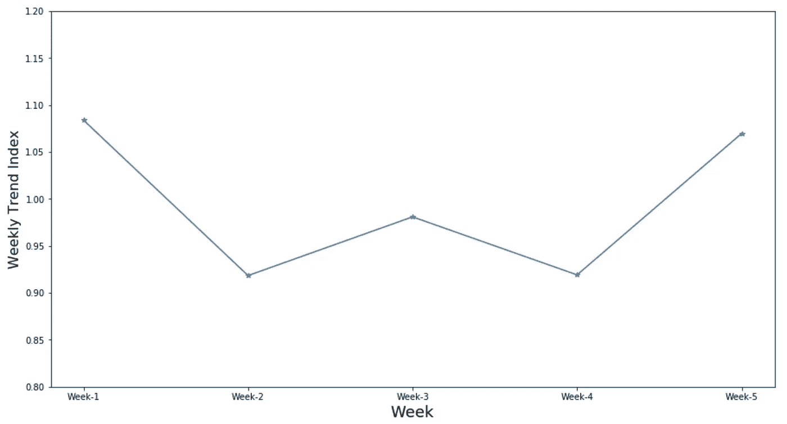

# 以简单直观的方式分解时间序列

> 原文：<https://towardsdatascience.com/decomposing-a-time-series-in-a-simple-and-intuitive-way-19d3213c420b?source=collection_archive---------14----------------------->

## 可解释的时间序列模型


Predict store sales

我们都曾与传统的时间序列模型如 ARIMA、指数平滑等进行过斗争，这些模型不太直观，如果不用纯粹的统计术语，很难向企业解释。

给定基于时间的销售数据，直觉上我们想到的是计算出像月度趋势、同比趋势、日间趋势、周峰值等模式。因此，这促使我设计了一种方法，可以分解时间序列以轻松找到所有这些参数，并使我们能够以更简单和直观的方式对未来进行预测。

在本帖中，我们将使用从 2013 年 1 月*日*到 2015 年 6 月*日*约 2.5 年的商店销售数据，从[罗斯曼商店销售卡格尔挑战](https://www.kaggle.com/c/rossmann-store-sales)。


**Table 1: Sales Data for Store XYZ**

# 创造流动

为了实现我们的最终目标，即识别(分解)时间序列的不同组成部分，并将我们的学习转化为更简单、更直观的模型，我们对任务的总体看法是:

1.  数据分析( [EDA](https://en.wikipedia.org/wiki/Exploratory_data_analysis) )
2.  功能创建和平均销售额计算
3.  推导模型的方程式
4.  训练模型
5.  分解时间序列的不同组成部分
6.  使用分解的组件创建一个更简单和直观的模型
7.  模型的质量分析并利用它获得其他有用的信息
8.  结论

# 1.数据分析

> 让我们开始我们的旅程。我们有特定日期的商店销售。字段**打开**表示商店当天是否正常营业。XYZ 商店在星期天仍然关闭。所以，我们会考虑到日子，只有当商店开门。

一段时间内商店销售的图形可视化。

随时间推移可视化销售的代码


Store sales over time

我们在每年的 12 月份看到一个明显的高峰。除此之外，多年来的下降趋势也很明显。2014 年和 2015 年显示出类似的趋势，但与 2013 年相比明显下降。一个好的方法应该能够捕捉这些变化。

接下来，我们将执行 [EDA](https://en.wikipedia.org/wiki/Exploratory_data_analysis) 来了解一周内几天的销售变化。

可视化一周内销售额的代码


Store sales during days in a week

星期天没有销售，因为商店仍然关闭。我们可以在周六和周一看到一个明显的高峰。周末可能是周六销售额增加的一个原因。类似地，商店在周日停止营业可能会导致周一销售额增加。一个好的方法应该能够捕捉这些变化。

我们已经看到了 12 月份的销售高峰，但是让我们用类似的 EDA 来重新确认我们的假设，就像我们对一周内几天的销售所做的那样。

跨月销售可视化代码


Store sales across months

另一件事，我们可以调查的是一个月中几周的销售模式。我有一种直觉，这不会是一个很强的模式，一个月中几周的销售应该表现类似。但是，为什么不测试一下呢？这个世界充满了惊喜，不是吗？我们将分析一周中每天的平均销售额。

可视化一个月中几周销售额的代码


Sales across weeks in a month

在一个月的第一周和最后一周的几天里，销售额都比较高。一个随机的猜测可能是月末工资和更多人购物的功劳。

# 2.特色创造和平均销售额

> 每个日期都可以通过其年、月、周和日来唯一标识。以这种方式表示日期的主要原因是为了发现月趋势、年趋势、日趋势和周趋势。
> 
> 保持周数的原因是为了确定销售是否随着月份的进展而增加、减少或者根本没有影响。我们称之为每周趋势。
> 
> 此外，我们将删除商店仍然关闭的数据点。星期天，商店仍然关门。

执行特征创建和清理步骤后，数据如下所示


Table2: Data Overview

接下来，我们将对年、月、日和周字段执行一次性编码。一种热门编码是分类数据的二进制表示。这一步的结果是，我们将拥有以下字段。

```
'Sales', 'weekday_0', 'weekday_1', 'weekday_2',
'weekday_3', 'weekday_4', 'weekday_5', 'year_2013', 'year_2014',
'year_2015', 'month_01', 'month_02', 'month_03', 'month_04', 'month_05','month_06', 'month_07', 'month_08', 'month_09', 'month_10', 'month_11','month_12', 'weeknbr_1', 'weeknbr_2', 'weeknbr_3', 'weeknbr_4','weeknbr_5'
```

## 平均销售额

> 我们将从计算平均销售额开始。我们将用 **avgSales** 来表示。我们有 2.5 年的数据，即 2013 年、2014 年和 2015 年年中。由于没有 2015 年全年数据，如果用于平均销售额计算，很可能会添加噪声。我们将仅使用 2013 年和 2014 年的销售数据来计算 avgSales。

计算平均销售额的代码

*avgSales* 出来是 **4825.98**

# 3.推导模型的方程式

主要的想法是找到每月，每年，每天和每周的趋势。我们希望给它加上一个值，叫做指数。因此，我们希望获得月度、年度、日和周趋势指数。我们假设这些趋势是一天中销售额的唯一原因，超过了我们上面计算的平均销售额(avgSales)。


Model’s equation (1)

我们有一次性编码输入功能。在一个时间，只有一个月会高或设置为 1，随着一天，一周数和一年。输入会处理好的。因此，我们的输入等式被修改为:



Model’s equation (2)

让我们看看 2014 年 5 月 17 日模型方程的形式。在这种情况下，年将是 2014 年，月将是 5 月，周数将是 3 日，日将是星期六。所有其他输入将为 0。系数的 0 次方将变成 1。


Model’s equation form for 17th May 2014

我们将两边都取对数，以简化方程，并将其转换为易于应用线性回归的形式。我们将应用无截距回归，并取模型系数的反对数，以获得月度、同比、每日和每周趋势指数。


Model’s equation to apply regression

# 4.训练模型

这里的因变量是 ln(销售)-ln(avg 销售)，我们将采用以 2 为基数的对数。我们有一家店铺从 2013 年 1 月*日到 2015 年 6 月*日*约 2.5 年的销售数据。我们不会使用上个月的数据并保留它来验证模型的性能。*

训练模型

接下来，我们将对模型的系数取反对数，以获得相应的指数。

取模型系数的对数


Yearly Index


Monthly Index


Day-wise Index


Weekly Index

# 5.从回归模型中学习分解时间序列

## 年度趋势

时间序列的一个重要组成部分是逐年趋势。与 2014 年和 2015 年相比，我们的模型学习的年度指数在 2013 年明显捕捉到了更高的趋势。捕获的年度指数将帮助我们从时间序列数据中分解年度趋势。让我们想象一下结果。


Yearly Index


Yearly trend

我们可以清楚地看到一个逐年下降的趋势。下降趋势可能有许多原因，如商店质量下降或竞争对手商店开业等。需要做更深入的分析才能发现。这将是一个有趣的发现。

## 月度趋势

时间序列的另一个重要组成部分是月趋势。我们的模型学习的月度指数已经清楚地捕捉到了 12 月份的较高趋势。这将有助于我们从时间序列数据中分解月趋势。让我们想象一下结果。


Monthly Index

可视化月度趋势


Monthly trend

## 日间趋势

在 EDA 部分中，我们分析了一周中几天的销售情况。我们已经看到星期六和星期一的销售额较高。模型学习的日指数能够捕捉这些模式。让我们想象一下结果。

可视化每日趋势


Day-wise trend

## 每周趋势

在 EDA 部分，我们在一个月的第一周和最后一周看到了一个小高峰。模型学习的周线指数能够捕捉到这种模式。让我们想象一下结果。


Weekly Index

可视化每周趋势



Weekly trends

# 6.使用分解组件的更简单和直观的模型

我们将利用上述知识设计一个新的简单直观的模型，我们称之为乘法模型。最终的模型方程将是:


Model’s equation (1)

根据日期，将从计算表中使用 yearly_index、monthly_index、day_index 和 weekNbr_index。


Coefficients table

使用上述模型对 2015 年 9 月 21 日进行预测。它发生在 2015 年 9 月的第三周

销售= avg sales * Sep _ index * 3rd week _ index * 2015 _ index
= 4825.98 * 0.880 * 0.98 * 0.9425 = 3922.54

2015 年 12 月 31 日的预测？它发生在 2015 年 12 月的第 5 周

sales = avg sales * Dec _ coefficient * 5th week _ coefficient * 2015 _ index
= 4825.98 * 1.244 * 1.069 * 0.9425 = 6048.74

# 7.模型的质量分析并利用它获得其他有用的信息

同时，还训练了对截距或特征对数没有任何限制的线性回归模型。让我们称之为模型 1 和我们的乘法模型，模型 2。我们对这两个模型进行了为期 3 个月的测试，测试数据来自 50 多家商店的未公开数据。

在 RMSE 值相似的情况下，这两种模型在均方根误差[方面的表现基本相同。在某些情况下，与模型 1 相比，模型 2 明显是 RMSE 较低的赢家。一个可能的原因可能是领域知识的供给，avgSales，不允许它过度适应和在看不见的数据上表现良好。](https://en.wikipedia.org/wiki/Root-mean-square_deviation)

比较两个模型性能的代码


Both model performing similarly for most of the cases

乘法模型(模型-2)是商店 39、85 和 88 的明显赢家


Multiplicative Model is a winner

## 从乘法模型中获取其他有用信息

一些重要的信息和有趣的事实可以很容易地从乘法模型中推导出来。比如，如果企业问我们该怎么回答，或者我们如何比较 2014 年 5 月和 2014 年 11 月的销售额。我们使用学到的月、年、日和周指数的值来回答这些问题。

2014 年 5 月= 5 月指数* 2014 年指数= 1.02 * 0.9879 = 1.007

2014 年 11 月= 11 月指数* 2014 指数= 1.051 * 0.9879 = 1.038

与 2014 年 5 月相比，2014 年 11 月的销售额增加了多少

(1.038–1.007)/1.007 = 0.0307

因此，2014 年 11 月的季节性比 2014 年 5 月高 3.07%。我们可以跨年度对月、周、日进行类似的比较，并从分解的预测模型中获得更清晰的图像。

# 8.结论

这篇博文的主要思想是调整传统模型来分解时间序列，并创建一个更简单和直观的模型。希望目的达到了。让我知道你的想法和我如何能进一步改善这种方法。

***我的 Youtube 频道更多内容:***

[](https://www.youtube.com/channel/UCg0PxC9ThQrbD9nM_FU1vWA) [## 阿布舍克·蒙戈利

### 嗨，伙计们，欢迎来到频道。该频道旨在涵盖各种主题，从机器学习，数据科学…

www.youtube.com](https://www.youtube.com/channel/UCg0PxC9ThQrbD9nM_FU1vWA)