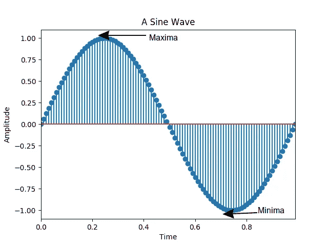
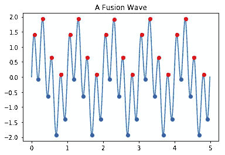

# 用经验模式分解法分解信号——哑元算法解释

> 原文：<https://towardsdatascience.com/decomposing-signal-using-empirical-mode-decomposition-algorithm-explanation-for-dummy-93a93304c541?source=collection_archive---------5----------------------->


经验模式分解(EMD)是一只什么样的‘野兽’？这是一种分解信号的算法。而**我说的信号，指的是一个时序数据**。我们**输入一个信号到 EMD，我们将得到一些分解的信号**，也就是我们信号输入的“基本成分”。它类似于快速傅立叶变换(FFT)。FFT 假设我们的信号是周期性的，它的“基本成分”是各种简单的正弦波。在 FFT 中，我们的信号是从时间频谱转换到频率频谱。

EMD 的不同之处在于输出保留在时间谱中，并且 **EMD 不假设我们的信号是周期性的，它不是基于简单的正弦波**，而是基于固有模式函数(IMF)。EMD 实际上是基于数据集的，没有关于数据的假设(这就是为什么它被称为经验的)。IMF 是一个波，它有两个特性:

1.  **最大值和最小值最多相差 1 个**。最大值是波峰，最小值是波谷。



假设我们的数据集已经使用


z is the standardized value of data, x is the real value of data, μ is the mean of the dataset, and σ is the standard deviation of the dataset

然后**最大值不总是大于零，最小值不总是小于零**。最大值是信号的值，当信号的趋势继续上升，然后突然下降时，正好在值下降之前的值是最大值。另一方面，最小值是当信号的趋势继续下降，然后突然上升时，上升前的值是最小值。

2.**IMF 的波动均值为零**。

一个简单的正弦波就是一个 IMF(最小值和最大值之间的差值最多为 1，数据集的平均值为零)。

```
>>> import numpy as np
>>> frequency = 1
>>> total_time = 1
>>> res = 0.01
>>> time = np.arange(0, total_time, res)
>>> amplitude = np.sin(2 * np.pi * frequency * total_time * (time/time[-1]))
>>> np.mean(amplitude)
-2.6319088627735572e-17 #this value literally equal 0
```


The difference between maxima and minima in 1 Hz sine wave is 0

但是一个 IMF 可以有不止一个频率，而且更复杂。

为了让我们更容易理解算法，这里我呈现一个玩具测试信号。

该信号(1 Hz 正弦波)


和这个(4 Hz 正弦波)


结合成这样


瞧，我们将试着通过这一步一步的算法解释来分解这个信号。

这里是 EMD 的算法。

**第一步，求最小值和最大值。**



**步骤 2，从最小值和最大值数组中创建最小值和最大值的包络**。使用三次样条插值最小值和最大值以创建最小值和最大值的包络。


**第四步，从最小值和最大值的包络中，得到中间值**。


**步骤 5，将真实玩具测试信号的值减少包络线的中间值**。


如果你仔细看，这是我们成功提取的 4 Hz 正弦波。但是看起来有一些误差，比如波的两边有一个突然的跳跃。**这来自于三次样条**的插值误差。**三次样条插值在信号**开始和结束时变得如此糟糕。解决方法是我们必须定义一个边界条件。关于边界条件，我的意思是**在**进行三次样条之前，我们必须定义信号开始和结束时的最小值和最大值的包络。在这篇文章中，信号开始和结束时的最小值和最大值的包络与离它们最近的最大值和最小值相同。让我们从步骤 1 到步骤 5 重新开始，但是这次，我们定义边界条件。


哎哟，这一次的错误是影响整个提取的信号。但是这种突然的飞跃已经消失了。

**步骤 6，检查该提取的信号是否是 IMF** 。

```
#here is the ouput of python script
mean: -0.002681745482482584 
Total minima 20 
Total maxima 21
```

平均值几乎为零，我认为我们可以忽略它，将其四舍五入为零。最小值和最大值的数量也满足要求，**我们得到一个 IMF** 。如果您对提取信号的平均值不满意，您可以按照步骤 2-步骤 6 再处理一次。但是**这一次，我们使用提取的信号**，而不是输入真实的玩具测试信号。当在第一次或第二次等尝试中，提取的信号不满足 IMF 条件时，这是算法的路线。为了使它更简单，让我们承认信号是一个国际货币基金组织。

**第七步，用这个 IMF** 降低原来的玩具测试信号。


哇，我们得到了我们的 1 Hz 信号(但正如我们所想的，开始和结束是错误的)。看来我们成功地分解了融合信号。但是，在 EMD 算法中停止的条件是当我们的残差信号只是一个常数，单调的，或只有 1 个极值(只有 1 个最小值或最大值)。**我们之前被 IMF 减少的信号被称为残差**。让我们继续这个过程。


```
mean: -0.002681745482482584 
Total minima 6 
Total maxima 6
```


看起来渣油的要求还没有满足。让我们再处理一遍。


```
mean: -0.002681745482482584 
Total minima 2 
Total maxima 2
```


最后，我们找到了剩余(单调的)。由于边界的累积误差，最后提取的像噪声一样。**这可以通过提高信号平均值的阈值**来防止。当信号的平均值不满足阈值时(提取的信号不是 IMF)，它将按照步骤 2–6 再次尝试，直到提取的信号满足阈值。阈值越趋近于零，这种噪声就越有可能消失。所以这篇文章不会太长，在前面的 EMD 算法演示中，我们使用的阈值并不是太严格。因为最终我们想要达到的是，读者一步一步地理解 EMD 算法。

**第一次，我在尝试使用 google colab，所以所有构建上面所有图的代码和解释都可以通过这个链接** **访问**[(PS:有些代码必须按顺序运行才能正常工作)。](https://colab.research.google.com/drive/1omi4RFZRp4-FY2yhGWnmAlE9MnIkxkfj)

再见。

参考资料:

[https://medium . com/@ rrfd/standardize-or-normalize-examples-in-python-E3 f 174 b 65 DFC](https://medium.com/@rrfd/standardize-or-normalize-examples-in-python-e3f174b65dfc)，2019 年 10 月 2 日获取

a .泽勒、r .法特尔迈尔、I. R .凯克、A. M .汤姆、C. G .蓬托内特和 E. W .朗(2010 年 7 月)。经验模态分解-导论。在*2010 年国际神经网络联合会议(IJCNN)* (第 1-8 页)。IEEE。