# 解构伯特，第 2 部分:视觉化注意力的内部运作

> 原文：<https://towardsdatascience.com/deconstructing-bert-part-2-visualizing-the-inner-workings-of-attention-60a16d86b5c1?source=collection_archive---------4----------------------->

## 一种新的可视化工具展示了伯特如何形成其独特的注意力模式。

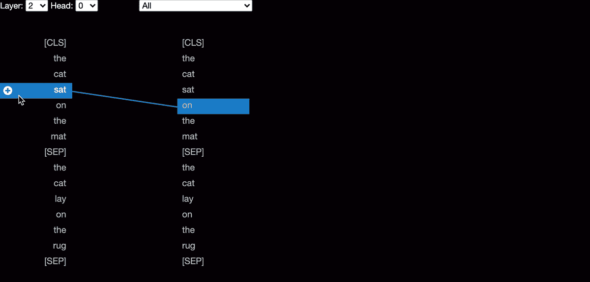

*在* [*第一部分*](/deconstructing-bert-distilling-6-patterns-from-100-million-parameters-b49113672f77) *(非先决条件)中我们探讨了 BERT 语言模型是如何学习各种直观结构的。在第二部分中，我们将深入探讨伯特的注意力机制，并揭示其变形超能力的秘密。*

> **试玩一款* ***互动演示*** *搭配*[***bertviz***](https://github.com/jessevig/bertviz)*。**

*自人工智能领域诞生以来，赋予机器理解自然语言的能力一直是该领域的一个愿望，但事实证明这一目标难以实现。在某种意义上，理解语言需要解决更大的人工智能问题(AGI)。例如，图灵测试——最早构想的机器智能测量之一——是基于机器用自然语言与人类对话的能力。*

*然而，就在最近几年，自然语言处理(NLP)领域发生了一场静悄悄的革命。新的深度学习模型已经出现，大大提高了机器处理语言的能力，导致从情感分析到问题回答的 NLP 任务的性能大幅提高。*

*也许这些模型中最著名的是 BERT([BI directional**E**n coder**R**表示来自**T**transformers](https://arxiv.org/abs/1810.04805))。BERT 基于 NLP 领域的两个最新趋势:(1)迁移学习和(2)转换模型。*

*[**迁移学习**](https://en.wikipedia.org/wiki/Transfer_learning) 的思想是在一个任务上训练一个模型，然后利用获得的知识提高模型在一个相关任务上的表现。BERT 首先接受两项无监督任务的训练:掩蔽语言建模(预测句子中缺失的单词)和下一句预测(预测一个句子是否自然跟随另一个句子)。通过在大型语料库(所有英语维基百科和 11，000 本书)上进行预训练，BERT 可以在英语工作的坚实基础上完成任何新任务。*

*BERT 的基础是 [**变换器**](https://arxiv.org/pdf/1706.03762.pdf) 模型，这是一种接受序列作为输入(例如单词序列)并产生一些输出(例如情感预测)的神经网络。不同于传统的循环网络，如 [LSTMs](https://en.wikipedia.org/wiki/Long_short-term_memory) 依次处理每个序列元素，变压器通过*注意*机制*在各个元素之间形成直接连接，从而同时处理所有元素。*这不仅实现了更高的并行性，还提高了一系列任务的准确性。*

# *伯特的建筑*

*BERT 有点像 Rube Goldberg machine(鲁布·戈德堡机器)( T17 ):虽然端到端系统看起来很复杂，但是各个组件都很简单。在这篇文章中，我将关注 BERT 的核心部分:注意力。*

*粗略地说，注意力是模型根据输入特征对某项任务的重要性为其分配权重的一种方式。例如，当决定一幅图像是否包含一只狗或猫时，模特可能会更多地关注图像中毛茸茸的部分，而不是背景中的灯或窗户。*

*类似地，一个试图完成句子“*狗从街那头跑到我和 ____* ”的语言模型可能想对单词*狗*比对*街、*更关注，因为知道主语是*狗*对预测下一个单词比知道狗从哪里来更重要。正如我们稍后将看到的，注意力还可以用来在单词之间形成连接*，使伯特能够学习各种丰富的词汇关系。**

## *你注意到了吗？*

*幸运的是，伯特的注意力机制非常简单。假设你有一些序列 **X** ，其中每个元素是一个向量(称为*值*)。在下面的例子中， **X** 由 3 个向量组成，每个向量的长度为 4:*

**

*Attention 只是一个函数，它将 **X** 作为输入，并返回另一个相同长度的序列 **Y** ，由与 **X** 中相同长度的向量组成:*

*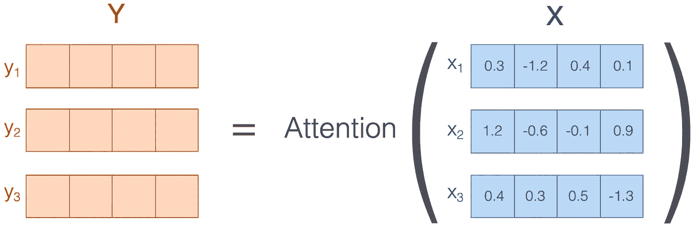*

*其中 **Y** 中的每个向量只是 **X** 中的向量的加权平均值:*

**

*就是这样——注意力只是加权平均的一个花哨名字！权重显示了在计算加权平均值时，模型*对 **X** 中的每个输入的关注度*，因此被称为*注意力权重*。稍后，我们将讨论这些注意力权重是如何计算的。*

*(注意，注意力不是 BERT 的唯一成分；还有[前馈层](https://www.google.com/url?sa=t&rct=j&q=&esrc=s&source=web&cd=1&cad=rja&uact=8&ved=2ahUKEwi17L3rmbXkAhUvFTQIHZnJBMcQFjAAegQIAxAB&url=https%3A%2F%2Fen.wikipedia.org%2Fwiki%2FFeedforward_neural_network&usg=AOvVaw3rDG-BPMXT8xxLxhU6yJlG)、[残差连接](/residual-blocks-building-blocks-of-resnet-fd90ca15d6ec)和[层归一化](https://mlexplained.com/2018/11/30/an-overview-of-normalization-methods-in-deep-learning/)模块，它们都与注意力组件一起工作以产生模型输出。但是注意力才是真正的主力，所以我们会关注这一点。有关其他组件的更多详细信息，请查看参考资料部分的教程。)*

## *关注语言*

*那么注意力是如何应用于语言的呢？好吧，假设 **X** 表示像“*狗跑了”这样的单词序列。*我们可以将每个单词与一个连续的向量相关联——称为*单词嵌入—* ,它捕获单词的各种属性:*

**

*可以想象，这些属性代表了单词的情感，是单数还是复数，词性指示符等等。在实践中，单词嵌入不那么容易解释，但是仍然有很好的特性。例如，在嵌入空间中，具有相似含义的单词通常彼此接近。此外，可以对单词嵌入执行算术运算并产生有意义的结果，例如嵌入(*国王*)—嵌入(*男人* ) +嵌入(*女人* ) ≈嵌入(*女王*)。*

*由于注意力也是简单算术的一种形式，因此将注意力应用于这些单词嵌入似乎是合理的:*

*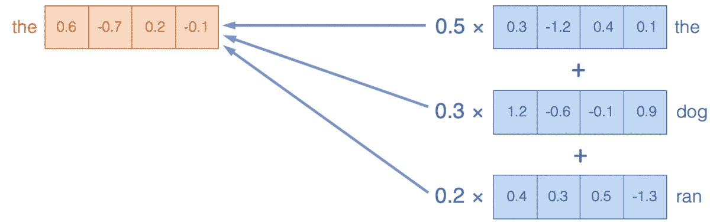*

*通过关注 **X** 中的单词嵌入，我们在 **Y** 中产生了复合嵌入(加权平均)。例如， **Y** 中 *dog* 的嵌入是分别具有权重 0.2、0.7 和 0.1 的 *the、*和*ran*in***X***、*的嵌入的组合。**

**构建单词嵌入如何帮助模型实现其理解语言的最终目标？要完全理解语言，仅仅理解组成句子的单个单词是不够的；模型必须理解单词在句子的上下文中是如何相互关联的。注意机制通过形成模型可以推理的复合表示，使模型能够做到这一点。例如，当语言模型试图预测句子“the running dog was __”中的下一个单词时，除了单独理解概念 *running* 或 *dog* 之外，该模型还应该理解 *running dog* 的复合概念；例如，走狗经常喘气，所以*气喘吁吁*是句子中合理的下一个词。**

## **视觉化注意力**

**注意力为我们提供了一个镜头(尽管模糊不清)，通过这个镜头我们可以看到伯特是如何形成复合表征来理解语言的。我们可以使用 [BertViz](https://github.com/jessevig/bertviz) 来访问这个镜头，这是一个我们开发的交互式工具，可以从多个角度可视化 BERT 中的注意力。**

**下面的图像(在这里有交互形式**)显示了一个样本输入文本引起的注意。这个视图将注意力可视化为连接被更新的单词(左)和被关注的单词(右)的线，遵循上面图的设计。颜色强度反映了注意权重；接近 1 的权重显示为非常暗的线，而接近 0 的权重显示为模糊的线或者根本看不到。用户可以突出显示特定的单词，以仅看到来自该单词的关注。这种可视化被称为*注意力-头部视图*，原因稍后讨论。它基于来自 [Llion Jones](https://medium.com/@llionj) 的优秀 [Tensor2Tensor 可视化工具](https://github.com/tensorflow/tensor2tensor/tree/master/tensor2tensor/visualization)。****

****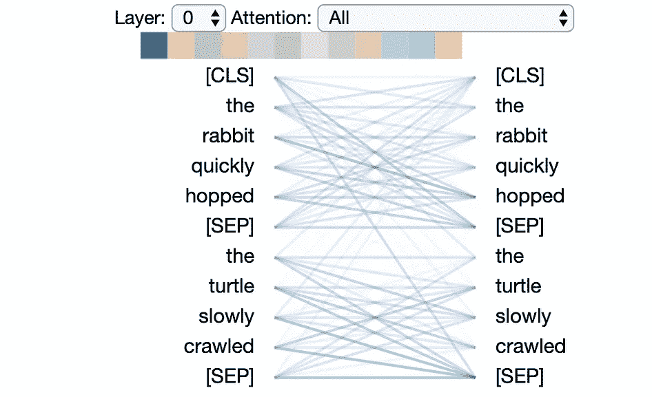********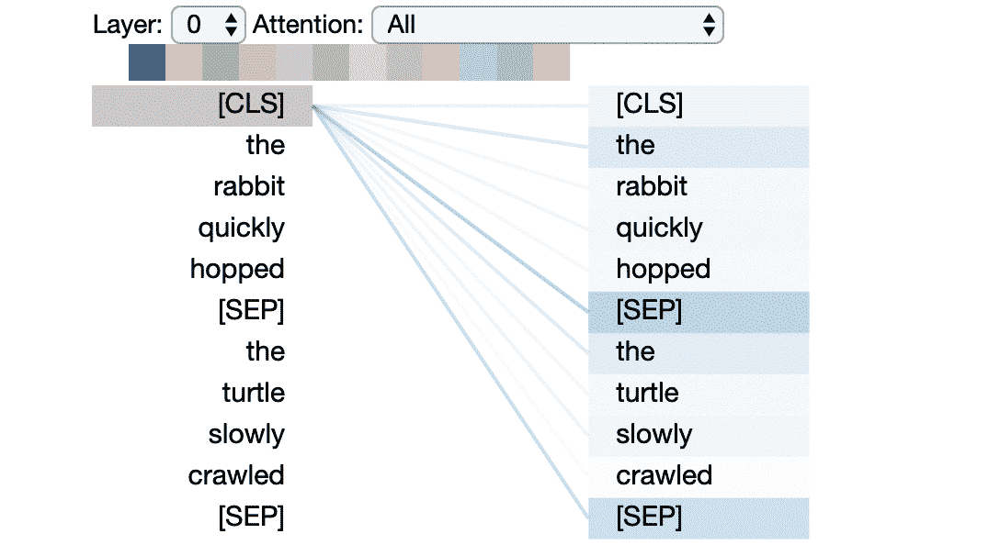****

******Left:** visualization of attention between all words in the input. **Right:** visualization of attention from selected word only.****

****在这个例子中，输入由两个句子组成:“兔子快速跳跃”和“乌龟缓慢爬行”。*【SEP】*符号是表示句子边界的特殊分隔符，而*【CLS】*是附加在输入前面的符号，用于分类任务(详见参考文献)。****

****可视化显示，在没有跨越句子边界的单词之间，注意力最高；该模型似乎明白，它应该将单词与同一个句子中的其他单词相关联，以便最好地理解它们的上下文。****

****然而，一些特定的词对比其他词对具有更高的注意力权重，例如*兔子*和*蹦出。*在这个例子中，理解这些单词之间的关系可能有助于模型确定这是对自然场景的描述，而不是肉食美食家对供应兔子的跳跃餐厅的评论。****

## ****多头注意力****

****上面的可视化显示了模型中的一种注意力机制。伯特实际上学会了多种注意力机制，称为*头*，它们彼此平行运作。我们很快就会看到，与单个注意力机制相比，多头注意力使模型能够捕捉更广泛的单词之间的关系。****

****伯特还堆叠了多层注意力，每一层都对上一层的输出起作用。通过单词嵌入的这种重复组合，BERT 能够在到达模型的最深层时形成非常丰富的表示。****

****因为注意力头部不共享参数，所以每个头部学习独特的注意力模式。我们在这里考虑的 BERT 版本— *BERT Base —* 有 12 层和 12 个头，导致总共 12 x 12 = 144 个不同的注意机制。我们可以使用*模型视图*(在交互形式[中可用**这里**](https://github.com/jessevig/bertviz#model-view) )一次可视化所有头部的注意力:****

****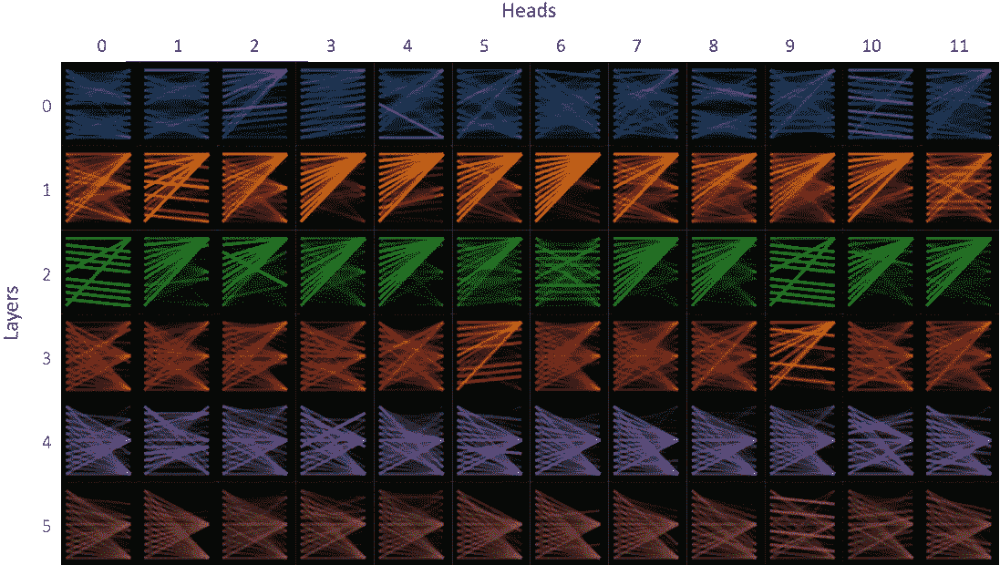****

****Model view (first 6 layers) for input sentences “the rabbit quickly hopped” and “the turtle slowly crawled”.****

****模型视图中的每个单元显示特定层(由行指示)中特定头部(由列索引)的注意模式，使用先前的注意头部视图的缩略图形式。注意模式是特定于输入文本的(在这种情况下，与上面的注意头视图的输入相同)。从模型的角度来看，我们可以看到伯特产生了丰富的注意模式。在本文的后半部分，我们将探索 BERT 是如何生成如此多样的模式的。****

## ****解构注意力****

****前面我们看到了模型如何使用注意力来计算单词嵌入的加权平均值，但是注意力权重本身是如何计算的呢？****

****答案是 BERT 使用了一个*兼容性函数*，它给每一对单词分配一个分数，表明它们应该多重视彼此。为了测量兼容性，模型首先为每个单词分配一个*查询*向量和一个*关键字*向量:****

********

****这些向量可以被认为是一种单词嵌入类型，就像我们前面看到的*值*向量一样，但是是专门为确定单词的兼容性而构造的。在这种情况下，兼容性得分只是一个单词的查询向量和另一个单词的关键向量的点积，例如:****

********

****为了将这些兼容性得分转化为有效的注意力权重，我们必须将它们归一化为正，并且总和为 1(因为注意力权重用于计算加权平均值)。这是通过对给定单词的分数应用 [softmax](https://en.wikipedia.org/wiki/Softmax_function) 函数来实现的。例如，当计算从*狗*到*狗*和*跑*的注意力时，我们有:****

****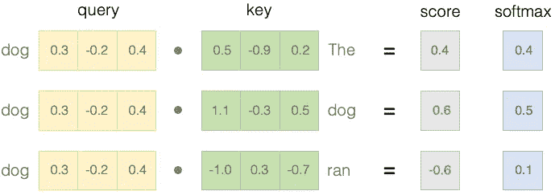****

****右侧的 softmax 值代表最终的注意力权重。注意，在实践中，点积首先通过除以矢量长度的平方根来缩放。这是因为长矢量可能会产生非常高的点积。****

****所以我们现在知道注意力权重是从查询和关键向量中计算出来的。但是查询和关键向量来自哪里呢？与前面提到的值向量一样，它们是基于前一层的输出动态计算的。这个过程的细节超出了本文的范围，但是您可以在最后的参考资料中读到更多关于它的内容。****

****我们可以使用*神经元视图，下面的**(在这里以交互形式**)来可视化如何从查询和关键向量中计算注意力权重。这个视图跟踪注意力的计算，从左边的选定单词到右边的完整单词序列。正值表示蓝色，负值表示橙色，颜色强度表示大小。就像前面提到的注意力-头部视图一样，连接线表示连接单词之间的注意力强度。*******

*******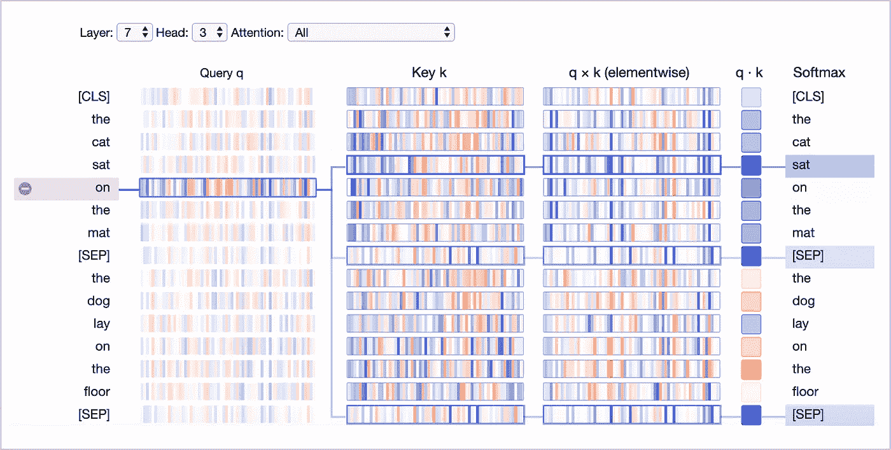*******

*******Neuron View*******

*******让我们一次浏览一个神经元视图中的列，并重温前面讨论的一些概念:*******

*********查询 q:****查询向量 *q* 对左侧正在关注的单词进行编码，即正在“查询”其他单词的那个单词。在上例中，突出显示了“on”(所选单词)的查询向量。*********

***********键 k:** 键向量 *k* 对关注的右边的单词进行编码。关键向量和查询向量一起确定两个单词之间的相容性分数。*********

*********q×k** 这是点积(元素乘积之和)的前身，包含它是为了可视化，因为它显示了查询中的单个元素和关键向量是如何构成点积的。*******

*********q k** :所选查询向量和每个关键向量的比例点积(见上图)。这是未标准化的注意力得分。*******

*********Softmax** :缩放后的点积的 Softmax。这将注意力分数归一化为正值，并且总和为 1。*******

*******神经元的观点最好通过交互来理解。您可以观看下面的简短视频演示(或直接访问[工具](https://github.com/jessevig/bertviz#neuron-view)):*******

# *******解释伯特的注意力模式*******

*******正如我们在前面的模型视图中看到的，伯特的注意力模式可以呈现出许多不同的形式。在本系列的第 1 部分中，我描述了其中有多少可以用少量的可解释结构来描述。在本节中，我们将重温这些核心结构，并使用神经元观点来揭示伯特可塑性力量的秘密。*******

## *******聚焦定界符的注意模式*******

*******让我们从最受关注的句子分隔符*【SEP】*标记(来自 [Part 1](/deconstructing-bert-distilling-6-patterns-from-100-million-parameters-b49113672f77) 的模式 6)这个简单的案例开始。正如本文中[所讨论的，这种模式充当一种“无操作”；当注意力头在输入句子中找不到任何其他可以关注的东西时，它会关注*【SEP】*标记:](https://arxiv.org/abs/1906.04341)*******

*******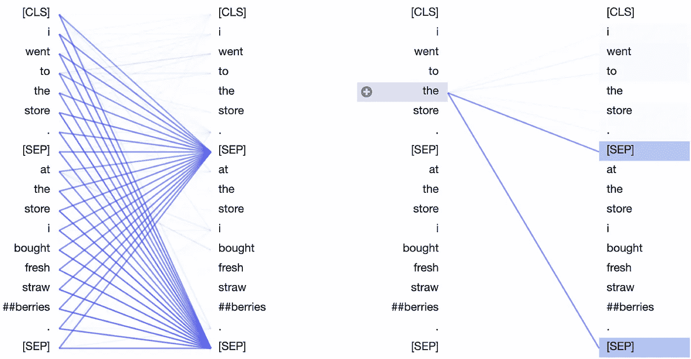*******

*******Delimiter-focused attention pattern for Layer 7, Head 3 of the BERT-base pretrained model.*******

*******那么，伯特究竟是如何能够专注于*【SEP】*记号的呢？让我们看看可视化是否能提供一些线索。这里我们看到上面例子的神经元视图:*******

*******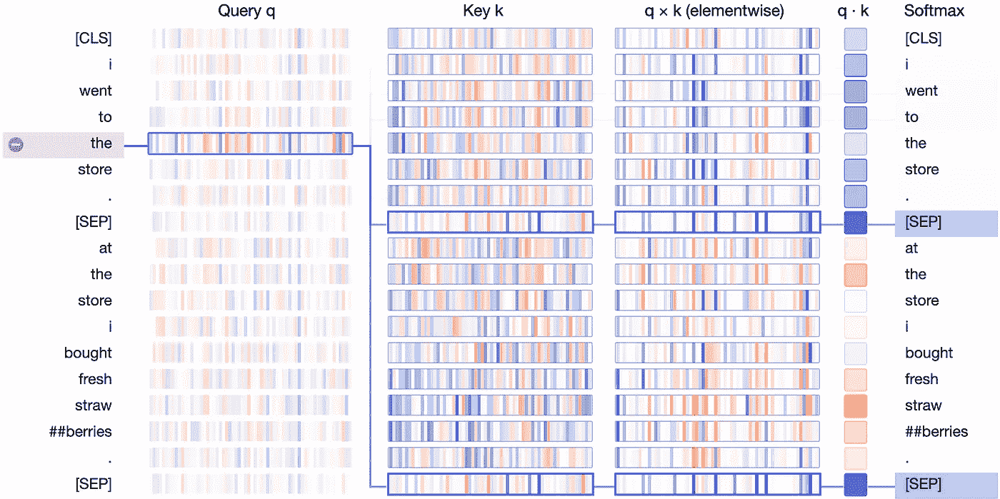*******

*******在**键**列中，两次出现的*【SEP】*的键向量带有一个独特的签名:它们都有少量具有强正(蓝色)或负(橙色)值的活跃神经元，以及大量具有接近于零(浅蓝色/橙色或白色)值的神经元:*******

**************

*******Key vector for first [SEP] token.*******

*******查询向量倾向于与那些活动神经元的*【SEP】*关键向量相匹配，从而导致元素态乘积 *q×k* 的高值，如下例所示:*******

*******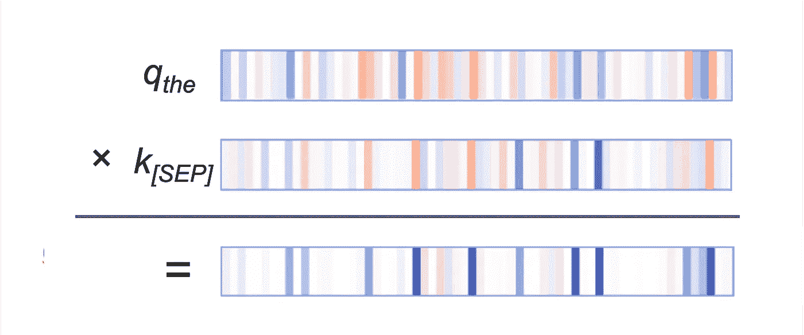*******

*******Query vector for first occurrence of “the”, key vector for first occurrence of [SEP], and elementwise product of the two.*******

*******其他单词的查询向量遵循类似的模式:它们沿着同一组神经元匹配*【SEP】*关键向量。因此，看起来 BERT 已经将一小组神经元指定为“[SEP]-匹配神经元”，并且查询向量被分配与这些位置处的 *[SEP]* 关键向量相匹配的值。结果就是*【SEP】*——集中注意力模式。*******

## *******单词袋注意模式*******

*******这是一种不太常见的模式，在[第 1 部分](/deconstructing-bert-distilling-6-patterns-from-100-million-parameters-b49113672f77)中没有讨论。在这个模式中，注意力被平均分配到同一个句子中的所有单词*:********

*******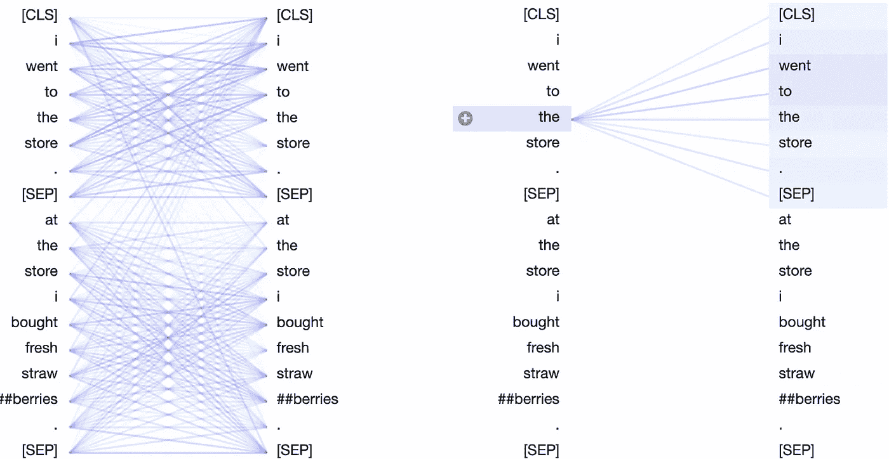*******

*******Sentence-focused attention pattern for Layer 0, Head 0 of the BERT-base pretrained model.*******

*******BERT 本质上是通过对同一个句子中的单词嵌入进行(几乎)未加权平均来计算单词包的嵌入。*******

*******那么，BERT 是如何巧妙处理这些查询和关键字来形成这种注意力模式的呢？让我们再次回到神经元的角度:*******

*******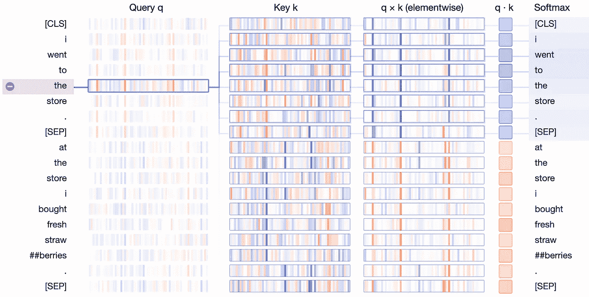*******

*******Neuron view of sentence-focused attention pattern for Layer 0, Head 0 of the BERT-base pretrained model.*******

*******在 **q×k** 列中，我们看到了一个清晰的模式:少数神经元(2-4 个)主导了注意力分数的计算。当查询和关键向量在同一个句子中时(在这种情况下是第一个句子)，乘积在这些神经元上显示高值(蓝色)。当查询和关键向量在不同的句子中时，在这些相同的位置，乘积是强负的(橙色)，如下例所示:*******

*******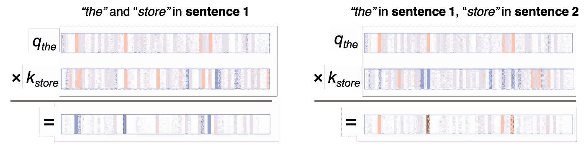*******

*******The query-key product tends to be positive when query and key are in the same sentence (left), and negative when query and key are in different sentences (right).*******

*******当 query 和 key 都来自句子 1 时，它们倾向于具有沿着活动神经元的相同符号的值，导致正乘积。当查询来自句子 1，而关键字来自句子 2 时，相同的神经元倾向于具有符号相反的值，导致负乘积。*******

*******但是 BERT 是怎么知道“句子”这个概念的，尤其是在更高层次的抽象形成之前的网络第一层？如前所述，BERT 接受特殊的*【SEP】*记号来标记句子边界。此外，BERT 合并了添加到输入层的句子级嵌入(参见下面的图 1)。这些句子嵌入中编码的信息流向下游变量，即查询和关键字，并使它们能够获得特定于句子的值。*******

*******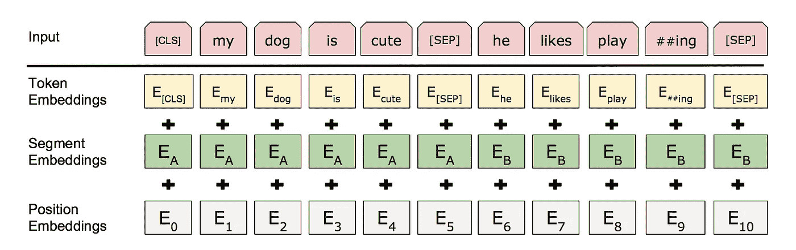*******

**********Figure 1****: Segment embeddings* for Sentences A and B are added to the input embeddings, along with position embeddings. (From [BERT paper](https://arxiv.org/pdf/1810.04805.pdf).)*******

## *******下一个词的注意模式*******

*******在下一个单词注意模式中，除了在*【SEP】*和*【CLS】*标记处，几乎所有的注意力都集中在输入序列中的下一个单词上:*******

*******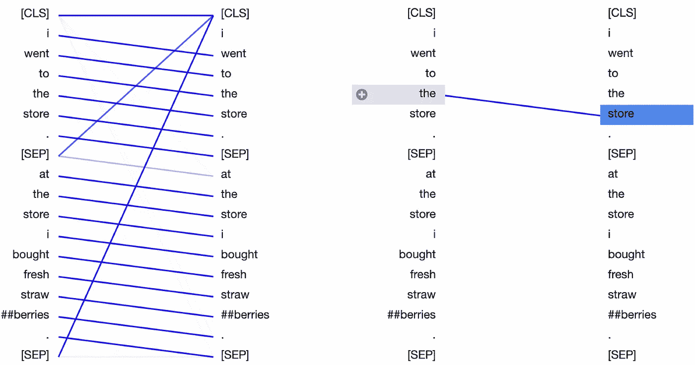*******

*******Next-word attention pattern at Layer 2, Head 0 of the BERT-base pretrained model.*******

*******该模型将重点放在下一个单词上是有意义的，因为相邻的单词通常与理解单词在上下文中的含义最相关。传统的 [*n* -gram](https://en.wikipedia.org/wiki/N-gram) 语言模型也是基于同样的直觉。让我们看看上面例子的神经元视图:*******

*******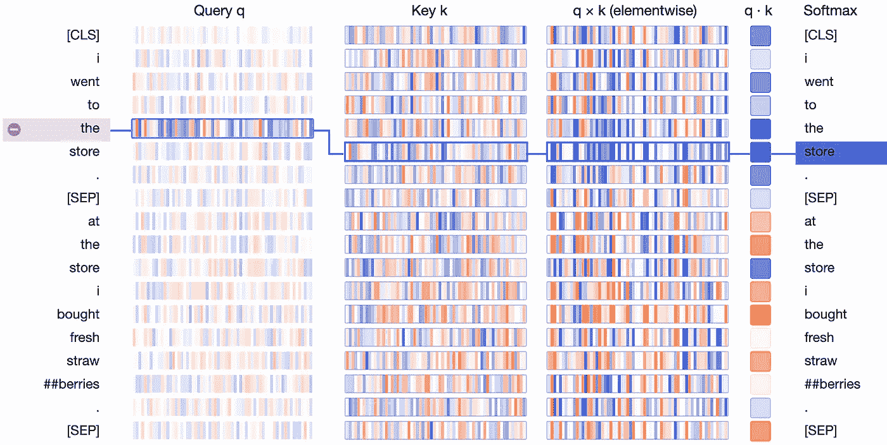*******

*******我们看到“the”的查询向量和“store”(下一个单词)的关键向量的乘积在大多数神经元中都是强正的。对于除了下一个标记之外的标记，键查询产品包含一些正值和负值的组合。结果是“The”和“store”之间的关注度得分较高。*******

*******对于这种注意力模式，大量的神经元被纳入注意力得分，并且这些神经元根据标记位置而不同，如下所示:*******

*******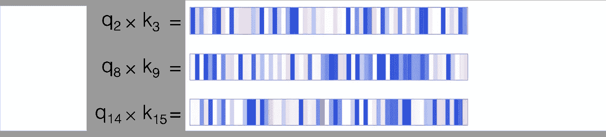*******

*******Elementwise product of query and key vectors, for query at position i and key at position i+1, for i = 2, 8, 14\. Note that the active neurons differ in each case.*******

*******这种行为不同于以定界符为中心和以句子为中心的注意模式，在这两种模式中，一小组固定的神经元决定注意分数。对于这两种模式，只需要几个神经元，因为模式非常简单，而且受到关注的单词几乎没有变化。相反，下一个单词注意模式需要跟踪 512 个单词中的哪一个从给定位置受到注意，即，哪一个是下一个单词。为此，它需要生成查询和键，使得每个查询向量与来自 512 种可能性的唯一键向量匹配。使用一小部分神经元很难做到这一点。*******

*******那么 BERT 是如何生成这些位置感知查询和密钥的呢？在这种情况下，答案在于 BERT 的位置嵌入，它在输入层被添加到单词嵌入中(见图 1)。BERT 为输入序列中的 512 个位置中的每一个学习唯一的位置嵌入，并且该特定于位置的信息可以通过模型流到键和查询向量。*******

**********关于我的可视化工作和其他人工智能项目的更新，请随时关注我的***[***Twitter***](https://twitter.com/jesse_vig)***。**********

# *******笔记*******

*******我们只涉及了第一部分[中讨论的一些粗略的注意力模式，还没有触及围绕](/deconstructing-bert-distilling-6-patterns-from-100-million-parameters-b49113672f77)[语言现象](https://arxiv.org/abs/1906.04341)的更低层次的动态，如共指、同义等。我希望这个工具可以帮助为这些案例提供直觉。*******

# *******试试吧！*******

*******你可以在 [**Github**](https://github.com/jessevig/bertviz) 上查看可视化工具。请玩玩它，分享你的发现！*******

# *******参考*******

*******您可以在这些优秀的教程中找到有关 BERT 和其他变压器模型的架构的更多详细信息:*******

*******有插图的伯特:一本关于伯特建筑的精美插图教程。*******

*******从零开始的变形金刚:这是一个详细而直观的从零开始构建变形金刚的教程，包括 PyTorch 代码。*******

# *******承认*******

*******我要感谢 Richelle Dumond、John Maxwell、Lottie Price、Kalai Ramea 和 Samuel rnqvist 为本文提供的反馈和建议。*******

*******为了进一步阅读，请查看我最近的文章 ，其中我探索了 OpenAI 的文本生成器 GPT-2。*******