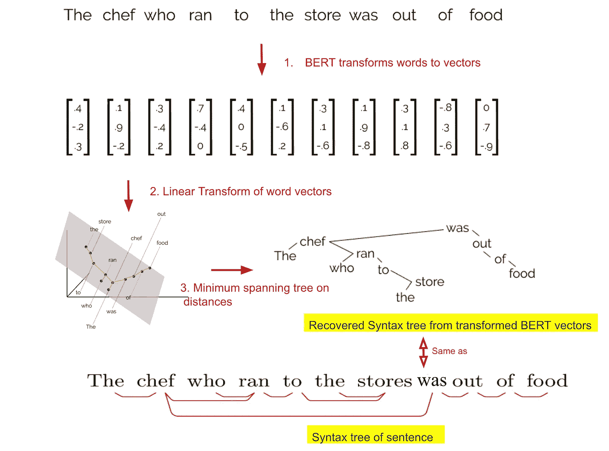
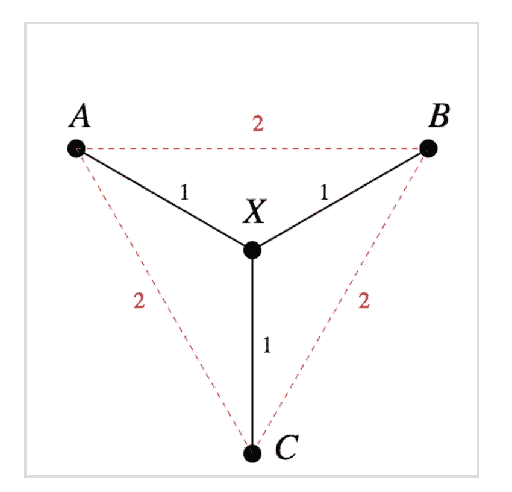
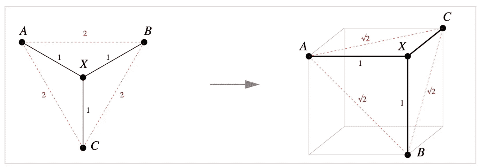
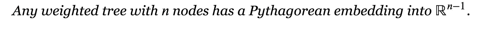
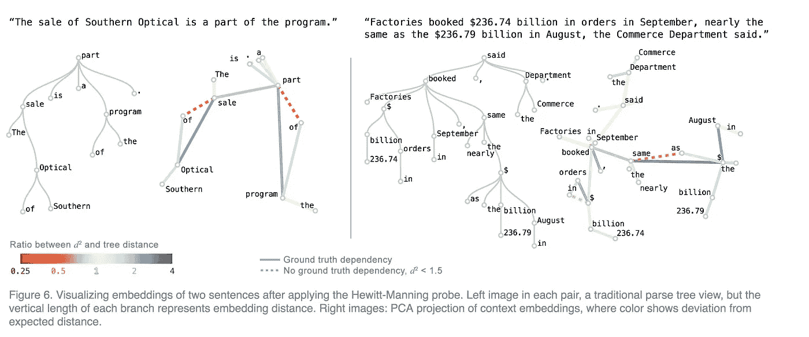
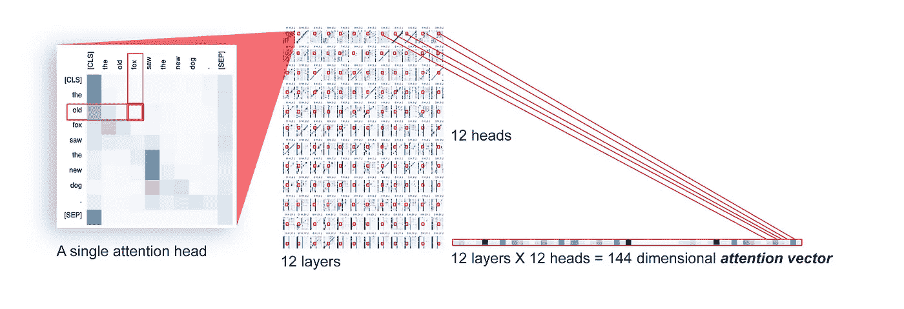
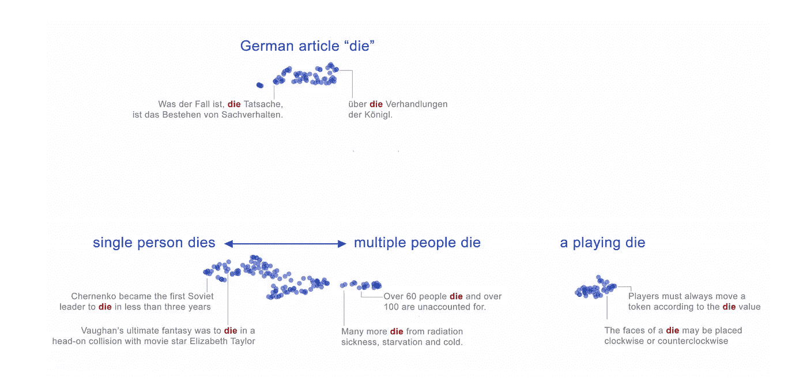
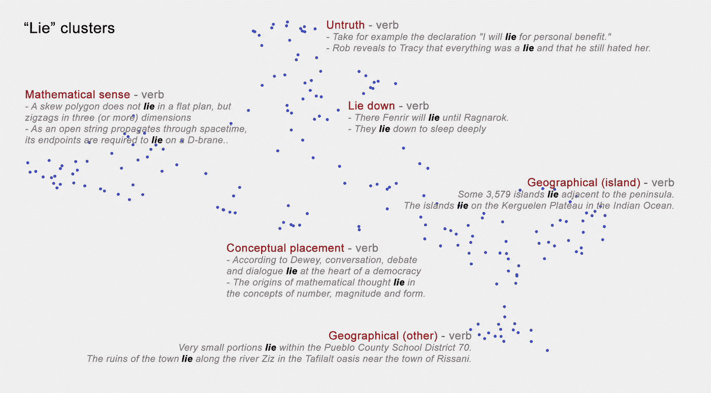
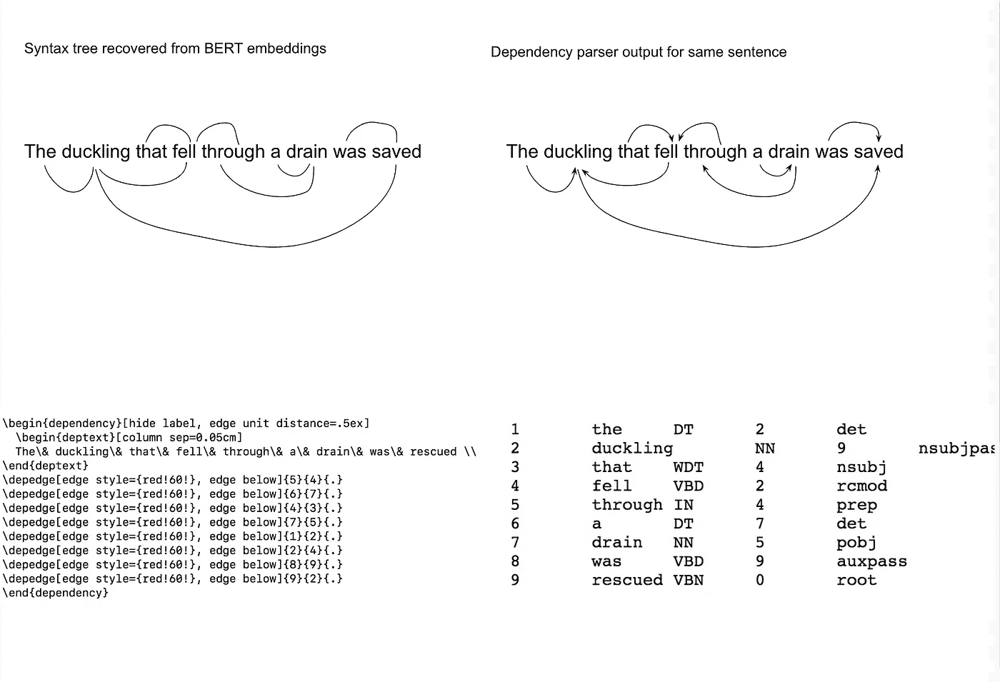

# 解构伯特

> 原文：<https://towardsdatascience.com/deconstructing-bert-reveals-clues-to-its-state-of-art-performance-in-nlp-tasks-76a7e828c0f1?source=collection_archive---------14----------------------->

## 揭示了它在 NLP 任务中最先进的表现的线索

This picture is an adaptation of a figure in the [blog](https://nlp.stanford.edu//~johnhew//structural-probe.html?utm_source=quora&utm_medium=referral#the-structural-probe) for paper — [a structural probe for finding syntax in word representations](https://nlp.stanford.edu/pubs/hewitt2019structural.pdf)

变压器架构模型，尤其是 BERT，已经被证明在许多自然语言处理任务中非常有效，只需对在大型语料库上以无监督方式预训练的模型进行微调。BERT 模型将单词序列作为输入，并产生一系列跨层的单词嵌入。这些单词嵌入考虑了单词出现的上下文。

两篇最近*(2019 年 4 月和 2019 年 6 月 6 日)*发表的论文 *(* [*1*](https://nlp.stanford.edu/pubs/hewitt2019structural.pdf) *及其* [*博*](https://nlp.stanford.edu//~johnhew//structural-probe.html?utm_source=quora&utm_medium=referral#the-structural-probe) *，* [*2*](https://arxiv.org/pdf/1906.02715.pdf) *及其* [*博*](https://pair-code.github.io/interpretability/bert-tree/) *)* 提供一些几何洞见

这些论文的一些关键发现

*   BERT 的单词向量输出编码了丰富的语言结构。BERT 近似地将[语法树](http://Recovered Parse tree from BER vectors)编码到它为一个句子输出的单词嵌入中。有可能通过单词嵌入的线性变换来恢复这些树。( [*1*](https://nlp.stanford.edu/pubs/hewitt2019structural.pdf) *及其* [*博客*](https://nlp.stanford.edu//~johnhew//structural-probe.html?utm_source=quora&utm_medium=referral#the-structural-probe) *)*
*   BERT 出现在互补子空间中对单词向量中的句法和语义特征进行编码( [*2*](https://arxiv.org/pdf/1906.02715.pdf) *及其* [*博客*](https://pair-code.github.io/interpretability/bert-tree/) *)。*
*   一个词的不同义项有着空间上细粒度分离的表征*(由句子语境决定)*([*2*](https://nlp.stanford.edu/pubs/hewitt2019structural.pdf)*及其* [*博客*](https://pair-code.github.io/interpretability/bert-tree/) *)*

## 从句子的 BERT 词向量中恢复分析树

语言由离散的结构组成——符号序列*(单词)*，句子的句法结构被捕获在一棵树中。相比之下，神经网络模型对连续数据进行操作——它们将符号信息转化为高维空间中的向量。已知这些向量*(单词嵌入)*在其长度/方向*(例如，word2vec、fasttext 等)中捕捉语义相似性。)*。

如上所述，[最近的发现](https://nlp.stanford.edu//~johnhew//structural-probe.html?utm_source=quora&utm_medium=referral#the-structural-probe)显示伯特单词向量输出编码了丰富的语言结构。在向量输出中编码的句子是语法树的几何近似副本。句子中的单词被给定在高维空间中的位置，如果我们对这些单词向量进行特定的变换，这些位置之间的欧几里德距离映射到语法树距离。本质上，我们可以通过使用特定的线性变换来变换单词向量，然后根据单词向量*之间的距离找到[最小生成树](https://en.wikipedia.org/wiki/Minimum_spanning_tree)，来恢复句子的语法树*(以及具有方向边的依存树】*。*

语法树中的树距离*(两个节点之间的树距离是它们之间的路径中的边数)*和欧几里德距离*(从单词嵌入导出的最小生成树中的节点之间)*之间的映射不是线性的。两个单词之间的语法树距离对应于提取的最小生成树中相应节点之间的欧几里德距离 的 ***的平方。第二篇论文给出了为什么它是欧几里德距离的平方而不是欧几里德距离的平方的原因*(本节的剩余部分对于理解伯特模型来说不是核心，可以跳过)*。***

Figure from [blog on second paper](https://pair-code.github.io/interpretability/bert-tree/)

由于树枝的存在，不可能将一棵树映射到欧几里得空间。

比如左边节点 A 和 B 之间的树距离是 2 — ***d*** *(A，X)+****d****(X，B)*

由于 ***d*** *(A，B)=****d****(A，X)+****d****(X，B)*在到欧氏空间的等距映射中，A，X，B 必须共线 *( X 必须在连接 A 和 B 的线上，以上条件成立)*

同样的道理应用到 A 点、X 点、C 点， ***d*** *(A，C)=****d****(A，X)+****d****(X，C)*A、X、C 也必须共线。但这隐含着 B = C，这是一个矛盾。

然而，从树到平方距离(勾股嵌入)有一个等距映射，如下图所示

[Figure from blog on second paper](https://pair-code.github.io/interpretability/bert-tree/)

博客文章有更多的例子。总的来说，它们说明了

还有，

这个博客还有其他有趣的结果。例如，随机分支的树，如果被映射到足够高维的空间，其中每个子树从其父树偏移一个随机单位高斯向量，将近似为勾股嵌入。这一点的实际含义是，上下文嵌入近似于句子的依存分析树的勾股嵌入。根据平方距离属性，我们从向量中恢复了嵌入树的整体形状。

恢复的树的形状*(受节点间边长的影响)*仅近似类似于理想树——差异具有一些模式。依赖关系之间的平均嵌入距离变化很大。不知道这些差异意味着什么。也许 BERTs 表示除了依赖关系解析树之外还有其他信息。

Figure [from second paper](https://arxiv.org/pdf/1906.02715.pdf)

*顺便说一句，如果我们对基因/蛋白质序列做同样的练习来检查它们是否包含信息，那么看到接近的异常边缘(部分/相同/如上图所示)将是有趣的——不一定证实实际的 3-D 几何构型。*

**句法树也在句子的注意力矩阵中被捕获**

第二篇论文还展示了句子捕获句法树的注意矩阵。想想“老狐狸看见新狗”这句话。考虑词对*“老，狐狸”。*我们可以通过从所有层 *(12 层，每层有 12 个注意力头)的每个注意力头中选取该对的标量值来构建向量*如果我们训练线性分类器，这些线性分类器将每个单词对的这种模型范围的注意力向量作为输入，并且如果两个单词之间存在关系以及关系的类型，则进行分类，这些分类器表现得相当好*(即使不是现有技术的结果)*表明句法信息被编码在句子的注意力矩阵中。

Figure [from second paper](https://arxiv.org/pdf/1906.02715.pdf)

## BERT 似乎在其嵌入中编码了语义特征

通过简单地将单词如 die 在不同句子上下文中的嵌入可视化，我们可以看到词义是如何影响嵌入的。

Figure [from second pape](https://arxiv.org/pdf/1906.02715.pdf)r

一般来说，单词嵌入显示

*   一个词的不同义项被分开*(上面三簇为“死”字)。词义消歧是通过这种分离来完成的*
*   在群集内部，似乎存在着更细微的意义差别(参见下面单词“lie”的嵌入)

Figure from [second paper](https://arxiv.org/pdf/1906.02715.pdf)

*   类似于我们前面看到的表示语法的位置，这里嵌入的位置表示语义

*第二篇论文声称词义是在低维空间中捕捉的，尽管还不清楚这是怎么回事。鉴于这种观察，似乎向量在互补的子空间中编码句法和语义信息*

## 对已发布代码的实验

第一篇论文的 [Github 库](https://github.com/john-hewitt/structural-probes/)有代码从上述句子中恢复语法树

例如，对于输入的句子

*掉进下水道的小鸭子获救了*

从上面句子的单词嵌入中恢复的解析树以及同一个句子的依存解析器输出如下所示

## 结论

未来沿着上述路线解构模型

*   可能揭示更多的语言结构(比如解析树)或者等价的更多的子空间
*   理解内部表示的几何可以潜在地发现改进模型架构的区域