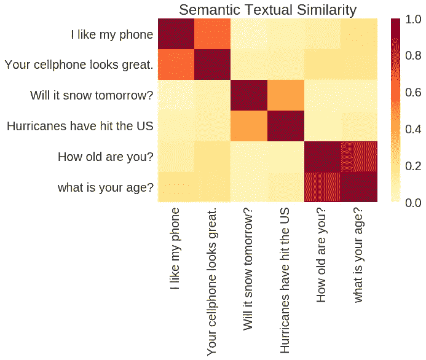
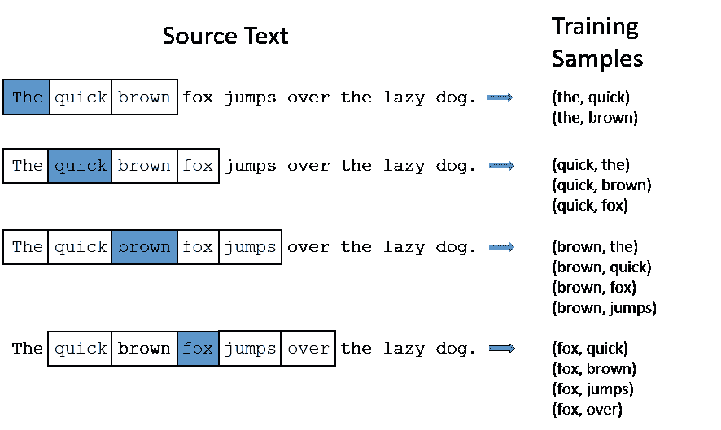
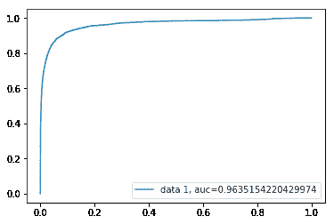
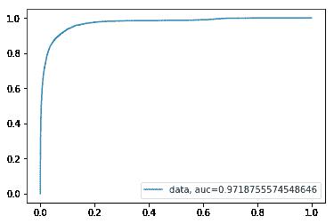
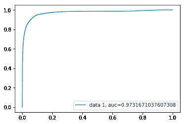

# 重复数据删除

> 原文：<https://towardsdatascience.com/deduplication-deduplication-1d1414ffb4d2?source=collection_archive---------13----------------------->

## 是的，这就是我想帮你解决的问题。删除那些造成伤害、阻碍某些任务的效率甚至污染我们系统的肮脏的小副本。

> **重复数据删除**
> /diːˌdjuːplɪˈkeɪʃ(ə)n/
> 
> ***名词***消除重复或多余的信息，尤其是计算机数据。
> 
> “重复数据删除在存储之前删除重复信息”

正如定义所说，我们要做的任务是删除重复的文本/句子等等。这只不过是检查文本彼此有多相似的行为。他们可以一模一样的像:
**深度学习牛逼！**和**深度学习牛逼！**。或者，就句子试图传达的内容而言，它们可能非常相似，比如:
**深度学习太棒了！**和**深度学习太酷了。** 我们知道这两句话传达的是同一个东西，这也是我们希望我们的机器捕捉到的东西。



这样的任务在文献中被称为**语义文本相似性(STS)。**它处理确定两段**文本**有多相似。这将不仅包括**句法相似度**，即两个句子中使用的单词有多相似或相同，还包括**语义相似度**，它捕捉了使用两个句子所传达的内容的相似度，即文本的含义在确定相似和不相似方面起着重要作用。

# **问题**

问题。是的，这是我们的主要目标。来解决问题。我给你举个例子。比方说，你必须通过电子邮件向一群人发送非常有趣的笑话(你的笑话可以是一句话或一串话)。你的老板要求你确保人们不会收到同样的笑话。所以你必须确保你所有的笑话都是独一无二的，人们不会对其内容感到厌烦。
*什么工作，认真？*

作为一名出色的程序员，你决定自动完成这项任务。你有这个神奇的 API，可以免费给你很多笑话，你写一个脚本，把这些笑话发给你老板喜欢的那群人。但是，我们不能真的相信这个神奇的 API，不是吗？简直*神奇。*API 给你开类似的玩笑怎么办？你不能冒险惹恼你的老板。
这是你可以使用 ***重复数据删除引擎*** 的地方，确保发送的笑话不会与过去发送的笑话相似。

我在这里的主要目的不是谈论这些模型。而是为了帮助您在实际工作中使用它们，就像上面提到的那样。我承认，为了给你的老板留下深刻印象而向别人发送笑话并不实际。

# 在 STS 的空间里…

让我们试着把它分解成这种相似性度量是如何定义的，以及我们试图找出哪两个实体之间的相似性(字面上是文本本身，还是别的什么？).

**首先是**，说到相似性度量，可以使用的有不少。只是为了完整起见，列举几个:
1。 [**Jaccard 相似度**](https://en.wikipedia.org/wiki/Jaccard_index)2。[**余弦相似度**](https://en.wikipedia.org/wiki/Cosine_similarity)3。[**推土机距离**](https://en.wikipedia.org/wiki/Earth_mover%27s_distance)4。[**詹森-香农距离**](https://en.wikipedia.org/wiki/Jensen%E2%80%93Shannon_divergence)


但是为了切入正题，我们将使用**余弦相似度。**数学上，**余弦相似度**是[内积空间](https://en.wikipedia.org/wiki/Inner_product_space)的两个向量(非零)之间相似度[的度量，度量它们之间角度的](https://en.wikipedia.org/wiki/Measure_of_similarity)[余弦](https://en.wikipedia.org/wiki/Cosine)。

如果两个文档相似，并且在欧几里得空间中相距很远，它们仍然可以彼此非常接近。这是由余弦距离捕获的，因此是有利的。

**其次，**这个余弦距离我们用在哪里？成对的句子串之间？没有。这就是我们利用*自然语言处理*和*深度学习*的力量。我们使用*向量*。

***一个单词/句子向量是一行实数值*** (与虚拟数字相反)，其中 ***每个点捕捉单词/句子的一个维度的含义*** 和 ***，其中语义相似的单词/句子具有相似的向量。***

同样，有很多方法可以得到这些向量。举几个:
**单词嵌入** : word2vec、GloVe、BERT 单词嵌入、ELMo 等等。
**语句嵌入** : BERT 语句嵌入，通用语句编码器等。

我将直接进入我亲自试验过的方法，这些方法对我非常有效。

```
 [word2vec](https://github.com/mmihaltz/word2vec-GoogleNews-vectors) + [Universal Sentence Encoder](https://tfhub.dev/google/universal-sentence-encoder-large/3)
```

为了避免这篇文章成为一篇纯粹的面向实现的文章(这正是我们想要的)，我将试着简单地解释一下这些模型是什么。

# word2vec

word2vec 有两种变体: **Skip-Gram** 和**连续单词包模型(CBOW)。**如果你想寻找详细的解释，关于这两种变体有大量的材料。我会很干脆的。skip-gram 模型速度稍慢，但通常在处理不常用的单词时效果更好。因此，这是经常使用的。这个我们简单说一下。

你会在几乎所有的 word2vec (Skip-Gram model)博客和教程中找到这个图表。在这种架构中，模型使用当前单词来预测上下文单词的周围窗口。它对附近的上下文单词的加权比对远处的上下文单词的加权更重。



这里，我们看一个上下文单词的窗口(在这种情况下，每边 2 个单词),并尝试预测中心单词。


The Skip-gram model architecture ([https://arxiv.org/pdf/1301.3781.pdf](https://arxiv.org/pdf/1301.3781.pdf))

考虑 *w(t)* 是输入字，通常权重矩阵和输入向量 *w(t)* 之间的点积是由单隐层完成的。我们将 *softmax* 函数应用于隐藏层的输出向量和权重矩阵之间的点积。这给出了单词在当前单词位置出现在 *w(t)* 的上下文中的概率。

隐藏层中的矢量成为了这个单词的矢量表示。但是这些都是'*字'嵌入，*和我们要找的相似的'句子'。那么，*我们如何得到句子的向量表示而不仅仅是单词嵌入呢？*

一种简单而琐碎的方法(我今天将展示的方法)是简单地对该句子的所有单词的单词嵌入进行平均。很简单，不是吗？

现在对于主要部分，让我们把它编码进去。

```
w2vmodel = **gensim.models.KeyedVectors.load_word2vec_format**(
'models/GoogleNews-vectors-negative300.bin.gz'), binary=True) **def** sent2vec**(s)**:                               
'''
Finding word2vec vector representation of sentences                               @param s  : sentence                                
'''                               
    words = **str**(s).**lower**()                               
    words = **word_tokenize**(words)                               
    words = [w **for** w **in** words **if** **not** w **in** stop_words]
    words = [w **for** w **in** words **if** w.**isalpha**()]

    featureVec = **np.zeros**((300,), dtype="float32")
    nwords = 0

    **for** w **in** words:                                   
        **try**:                                       
            nwords = nwords + 1                                       
            featureVec = **np.add**(featureVec, w2vmodel[w])
        **except**:                                       
            **continue**                               
        # averaging                               
        **if** nwords > 0:                                   
            featureVec = **np.divide**(featureVec, nwords)
    **return** featureVec **def** get_w2v_vectors**(list_text1, list_text2)**: 
‘’’
Computing the word2vec vector representation of list of sentences
@param list_text1 : first list of sentences
@param list_text2 : second list of sentences 
‘’’ 
    **print**(“Computing first vectors…”) text1_vectors = **np.zeros**((len(list_text1), 300))
    **for** i, q **in** tqdm(enumerate(list_text1)):
        text1_vectors[i, :] = sent2vec(q) text2_vectors = **np.zeros**((len(list_text2), 300))
    **for** i, q **in** tqdm(enumerate(list_text2)):
        text2_vectors[i, :] = sent2vec(q) **return** text1_vectors, text2_vectors
```

就是这样！🤷‍♂你有你的句子嵌入使用 **word2vec** 。

# 通用句子编码器

谷歌展示了一系列用于将句子编码成向量的模型。作者特别针对下游任务，即迁移学习任务。STS 就是这样一个任务。

它有两种变体:
1。一个带有 [**变压器**](http://jalammar.github.io/illustrated-transformer/) 编码器
2。一用一 [**深度平均网络**](http://mlexplained.com/2018/05/11/paper-dissected-deep-unordered-composition-rivals-syntactic-methods-for-text-classification-explained/)

他们每个人都有不同的设计目标:
1。以更大的模型复杂性和资源消耗为代价来实现高精度。
2。目标是以稍微降低的准确度进行有效的推理。

我已经用我最喜欢的博客将这两种架构都做了超链接，这些博客对它们都做了很好的解释。让我们更关注如何实现它们。

```
usemodel = **hub.Module**('models/sentence_encoder')**def** get_use_vectors**(list_text1, list_text2)**:
'''
Computing the USE vector representation of list of sentences
@param  list_text1  :   first list of sentences
@param  list_text2  :   second list of sentences 
'''
    **print**("Computing second vectors...")
    messages1 = list_text1
    messages2 = list_text2 num_batches = **math.ceil**(len(messages1) / BATCH_SIZE) # Reduce logging output.
    **tf.logging.set_verbosity**(tf.logging.ERROR) message_embeddings1 = []
    message_embeddings2 = [] **with** tf.Session() **as** session:
        session.**run**([tf.global_variables_initializer(),
             tf.tables_initializer()]) **for** batch **in** range(num_batches):
        **print**(batch * BATCH_SIZE, batch *
              BATCH_SIZE + BATCH_SIZE)
        batch_msgs1 = messages1[batch * BATCH_SIZE: batch *
                    BATCH_SIZE + BATCH_SIZE]
        batch_msgs2 = messages2[batch * BATCH_SIZE: batch *
                    BATCH_SIZE + BATCH_SIZE] message_embeddings1_temp, message_embeddings2_temp =  session.**run**([usemodel(batch_msgs1), usemodel(batch_msgs2)])

        message_embeddings1.**append**(message_embeddings1_temp)
        message_embeddings2.**append**(message_embeddings2_temp) all_embedding1 = **np**.**concatenate**(**tuple**(message_embeddings1))
    all_embedding2 = **np**.**concatenate**(**tuple**(message_embeddings2)) **return** all_embedding1, all_embedding2
```

再说一遍，就是这样！🤷‍♂

现在我们有了来自两个不同模型的笑话的句子嵌入。

现在我们需要余弦相似度！

```
**def** cosine_similarity**(list_vec1, list_vec2)**:
'''
Computing the cosine similarity between two vector representation
[@param](http://twitter.com/param)  list_text1  :   first list of sentences
[@param](http://twitter.com/param)  list_text2  :   second list of sentences 
'''
    cosine_dist = [cosine(x, y) **for** (x, y) **in** **zip**(np.nan_to_num(list_vec1), np.nan_to_num(list_vec2))] cosine_sim = [(1 - dist) **for** dist **in** cosine_dist] **return** cosine_sim
```

当我在你之前做这份工作时，我有一堆不重复的笑话，很少有重复的。具体来说，我有 **385K** 非重复对和 **10K** 重复对。我仅使用 **word2vec** 模型绘制了这项任务的 *AUC-ROC* 。



AUC-ROC

不错！曲线看起来很漂亮。(我故意省略了混淆矩阵)。

**TPR/召回率/敏感度**:77%
**FPR**:2.2%

让我们看看**通用句子编码器**的表现如何。



AUC-ROC

曲线下的区域稍微好一点，不是吗？

**TPR/召回/敏感度**:77%
**FPR**:2.2%

让我们看看当我们把它们结合在一起时会发生什么。通过组合，我的意思是平均来自两种方法的余弦相似性，并检查度量。“一个平均的**集合**的模型”。



迄今为止最好的一个！

**TPR/召回/敏感度**:78.2%
**FPR**:1.5%

喔喔喔！🎉🎉我们有一个明确的赢家！

这是一种快速查找重复项的方法。无需培训，只需下载现有的优秀模型并将其用于您的 STS 任务！

有了这一块，您可以轻松构建您的**重复数据删除引擎。只需存储你第一天发送到老板小组的所有笑话，然后对于每个新来的笑话，将它们与之前看到的所有笑话配对，并使用这个集合模型来确定它们是否重复。如果是，就扔掉。**

通过这种方式，让你老板的朋友开心，老板开心，得到一份不错的薪水，让你自己开心:)