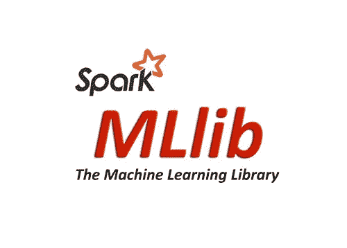
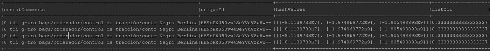
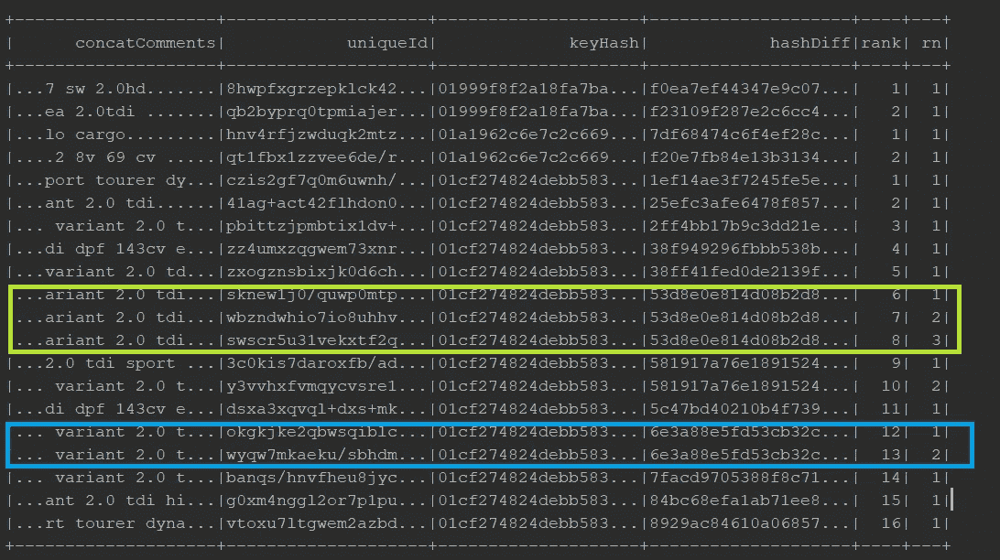

# 使用 spark 的 MLlib 进行数据集重复数据删除

> 原文：<https://towardsdatascience.com/deduplication-using-sparks-mllib-4a08f65e5ab9?source=collection_archive---------10----------------------->

对于拥有大量数据的公司来说，重复数据删除过程始终非常重要。首先，重复数据删除最大限度地减少了存储业务数据所需的空间，并将为我们的管道带来更低的基础设施成本和更好的性能。另一方面，通过持续集成和持续交付 **(CI/CD)** ，减少重复的数量将降低管道的复杂性，并增加业务时间。



有时，重复数据删除过程由简单的文本到文本匹配组成，您可以简单地选择 **CRC32 校验和**或 **MD5** 匹配。然而，在一些情况下，数据集的行仅仅因为一些列上的一些小的文本差异而不同，即使它们表示相同的实体**。**因此，本文展示了一个**实体识别和链接过程**使用了两种不同的 spark 方法，对报废电子商务网站收集的特定产品数据集进行处理。

下面描述完整代码和过程可以在这里找到:

[](https://github.com/ronald-smith-angel/dataset_deduplication_sparkml) [## Ronald-Smith-angel/dataset _ 重复数据删除 _sparkml

### 使用 spark ML 库和 Scala-Ronald-Smith-angel/dataset _ de duplication _ spark ML 进行数据集重复数据删除

github.com](https://github.com/ronald-smith-angel/dataset_deduplication_sparkml) 

一般的过程可以在这个特质上找到( **…是的，我用 scala 做数据科学！！！**):

```
package com.sample.utils

import org.apache.spark.sql.DataFrame

trait OperationsHelper {
  def ds: DataFrame

  def preparedDataSet()(df: DataFrame): DataFrame

  def deduplicateDataSet()(df: DataFrame): DataFrame

  def resultsDataFrame()(df: DataFrame): DataFrame
}
```

正如你将看到的，这个助手背后的想法将是有一个函数管道，从这里可以轻松地调用链数据帧 [**转换**](https://medium.com/@mrpowers/chaining-custom-dataframe-transformations-in-spark-a39e315f903c) 。

## 预处理产品数据

数据科学界广泛使用降维技术来获得更小的特征集，以便在训练和评估模型时进行分析并获得更好的性能。PCA 方法允许降维，同时保留那些描述大量信息的特征。因此**，**该预处理阶段遵循以下步骤:

*   ***数据清洗:*** 清洗数据要有一个通用的刻度。对于产品的情况，数据集由一个简单的文本清理组成，包括大小写、空白、编码和符号。
*   **特征选择:**使用 PCA 技术选择一组特征。*(“标题块”、“内容块”、“颜色”、“产品类型”)*

上述特性中的内容包含候选重复产品的大部分差异。

## 1 —方法 A:区分位置的散列法(LSH)

位置敏感散列是一种用于实体解析的技术，然后将找到代表相同实体的记录。spark MLlib 有一个自定义的 [LSH 实现](https://spark.apache.org/docs/2.1.0/ml-features.html#locality-sensitive-hashing)，这里使用它来查找如下重复项:

*   首先，使用所选特征的串联来生成散列(上面的 PC)。对于真实世界的例子，可以生成每个特征的散列。但是，对于这个示例，为了更快地获得结果，使用了一个简单的串联列。
*   然后，该列用于生成 LSH 向量，如下所示:

—**分词器**使用 [**单词停止器**](https://kb.yoast.com/kb/list-stop-words/) 为记录生成单词列表。

—**计数矢量模型**为 LSH 算法创建带有哈希和桶(类似哈希)的矢量。

```
**val** pccTokenizer = **new** Tokenizer()
  .setInputCol(OperationsHelperLSH.*ConcatComments*)
  .setOutputCol(OperationsHelperLSH.*ColumnWordsArray*)
**val** wordsArrayDF = pccTokenizer.transform(df)

**val** remover = **new** StopWordsRemover()
  .setCaseSensitive(**false**)
  .setStopWords(OperationsHelperLSH.*stopWords*)
  .setInputCol(OperationsHelperLSH.*ColumnWordsArray*)
  .setOutputCol(OperationsHelperLSH.*ColumnFilteredWordsArray*)

**val** wordsFiltered = remover.transform(wordsArrayDF)

**val** validateEmptyVector = *udf*({ v: Vector => v.numNonzeros > 0 }, DataTypes.*BooleanType*)**val** vectorModeler: CountVectorizerModel = **new** CountVectorizer()
  .setInputCol(OperationsHelperLSH.*ColumnFilteredWordsArray*)
  .setOutputCol(OperationsHelperLSH.*ColumnFeaturesArray*)
  .setVocabSize(*VocabularySHLSize*)
  .setMinDF(10)
  .fit(wordsFiltered)

**val** vectorizedProductsDF = vectorModeler.transform(wordsFiltered)
  .filter(validateEmptyVector(*col*(OperationsHelperLSH.*ColumnFeaturesArray*)))
  .select(*col*(OperationsHelperWindowStrategy.*ConcatComments*),
    *col*(OperationsHelperLSH.*ColumnUniqueId*),
    *col*(OperationsHelperLSH.*ColumnFilteredWordsArray*),
    *col*(OperationsHelperLSH.*ColumnFeaturesArray*))

(vectorizedProductsDF, vectorModeler)
```

class:***com . sample . products . operations helper LSH . Scala***

*   为了完成训练步骤，使用 MinHashLSHModel 来训练产品数据，生成类似产品的最终桶。
*   最后，使用 KNN 相似的哈希可以找到一个类别。

```
 */**
    * Uses the dataset to train the model.
    *
    */* **def** deduplicateDataSet(df: DataFrame): (DataFrame, MinHashLSHModel) = {

    **val** minLshConfig = **new** MinHashLSH().setNumHashTables(hashesNumber)
      .setInputCol(OperationsHelperLSH.*ColumnFeaturesArray*)
      .setOutputCol(OperationsHelperLSH.*hashValuesColumn*)

    **val** lshModel = minLshConfig.fit(df)

    (lshModel.transform(df), lshModel)
  }

  */**
    * Applies KNN to find similar records.
    ****/* **def** filterResults(df: DataFrame,
                    vectorModeler: CountVectorizerModel,
                    lshModel: MinHashLSHModel,
                    categoryQuery: (String, String)
                   ): DataFrame = {
    **val** key = Vectors.*sparse*(*VocabularySHLSize*,
      *Seq*((vectorModeler.vocabulary.indexOf(categoryQuery._1), 1.0),
        (vectorModeler.vocabulary.indexOf(categoryQuery._2), 1.0)))

**lshModel**.approxNearestNeighbors(df, key, nearNeighboursNumber).toDF()} 
```

运行一个例子:转到测试`com.sample.processor.products.ProcessorProductsLshTest`，你会看到一个完整的流程在运行。

**输入参数:**

*类别* → color = 'negro '和*产品类型* = 'tdi '。

*近邻*

*散列数* → 3 ***(散列越多精度越高，但计算开销越大)。***



3 products with almost the same text for selected features.

## **结果分析:**

**优点:**

*   *准确:*如果使用了一组完整的字段(表示字符串)，正确的哈希值和邻居值可以检测到几乎所有的重复值。
*   更快:与其他 ML 策略如**项频反**等相比。

**缺点:**

*   需要一个资源好的集群。
*   需要一个数据清理的过程。

## 2 —方法 B:使用 Levenshtein +火花窗口的模糊匹配:

[Levenshtein](https://medium.com/@mrpowers/fuzzy-matching-in-spark-with-soundex-and-levenshtein-distance-6749f5af8f28) 是一种用于字符串模糊匹配的算法。基本上，这个方法测量两个字符串之间的差异。此外，spark 窗口函数以简洁的方式允许数据集分析功能，避免了多个 *groupBy* 和 *Join* 操作。因此，该方法定义了一个 2 级窗口来分组相似的数据，然后将 Levenshtein 应用于相同窗口中的值以发现重复项。该过程描述如下:

*   首先选择一组描述为**非模糊**的记录**。**该列表包含代表**类别**的列，并且在 PCA 过程中大多数时候是没有错误的:*(“产品类型”、“城市”、“国家”、“地区”、“年份”)。*

此窗口表示用于分析的常规窗口哈希。

*   其次，应用第二个窗口来发现非常相似的记录。该列表表示既不是**模糊**列表(PCA) **中的**零件，也不是**非模糊**列表中的零件的**记录:*(“门”、“燃料”、“制造”、“里程”、“型号”、“颜色”、“价格”)***

**注意:**“日期”字段有助于仅订购和获取最新的。

*   然后，对于每个组，将 [**levenshtein**](https://medium.com/@mrpowers/fuzzy-matching-in-spark-with-soundex-and-levenshtein-distance-6749f5af8f28) (仅在第二个窗口中的字符串差异)应用于来自 PCA 结果的串接的最模糊字段: ***(“标题块”、“内容块”)。***

如您所见，使用了列的 **MD5** 表示，而不是每个字符串，以获得更好的性能:

**keyhash:** MD5 为类别列集合。下图显示了同一类别的许多产品。

**hashDiff** :表示*非模糊*集合的 MD5 hash。下图显示了属于同一类别但具有**不同**描述(> levenshteinThreshold)的产品，以及具有相同 *hashDiff* **且 levenshtein(<levenshteinThreshold)差异较小的产品。**

*   最后，hashes(两者)和 rank 相同的值只改变 ***row_num*** 。过滤 ***row_num == 1*** 有可能得到去重数据集。

```
*/**
  * Applies windows functions and Levenshtein to group similar  categories.
  ****/* **override def** deduplicateDataSet()(df: DataFrame): DataFrame = {
  df
    .withColumn(OperationsHelperWindowStrategy.*ColumnRank*, *dense_rank*().over(*windowProductKeyHash*))
    .withColumn(OperationsHelperWindowStrategy.*ColumnHashWithDiff*,
      *concat*(*col*(OperationsHelperWindowStrategy.*ColumnCategoryFieldsHash*),
        *when*(*levenshtein*(
          *first*(OperationsHelperWindowStrategy.*ConcatComments*).over(*windowProductsCategoryRank*),
          *col*(OperationsHelperWindowStrategy.*ConcatComments*)) >= levenshteinThreshold, *lit*("1"))
          .otherwise(*lit*(""))))
    .withColumn(OperationsHelperWindowStrategy.*ColumnRowNum*, *row_number*().over(*windowProductsCategoryRank*))
}
```

class:***com . sample . products . operationshelperwindowstrategy . Scala***

运行一个例子:转到测试`com.sample.processor.products.ProcessorProductsWindowsTest`，你会看到一个完整的流程在运行。

**输入参数:** levenshteinThreshold → 6

**结果:**



2 groups example with almost exact values.

过滤 rn == 1 后，会对结果进行重复数据删除。这将删除样本数据集中的 **> 1/3** 。

## 结果分析:

**优点:**

*   更多的控制在火花分割和功能。

**缺点:**

*   可能会有更多的假阳性。

# **最终结论**

重复数据删除流程始终取决于公司需求和要分析的数据量。本文描述了两种不同的策略。因此，带有窗口函数的 Levenshtein 对于小维数问题已经足够好了；否则，LSH 永远是最好的选择