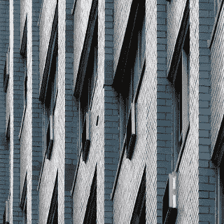
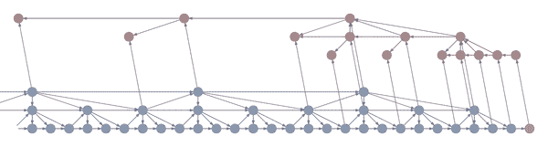
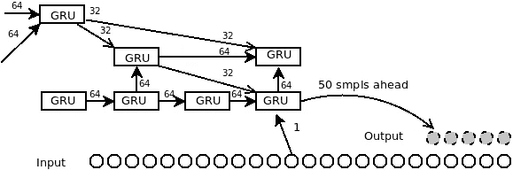
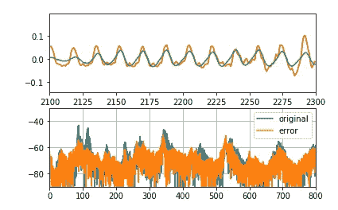
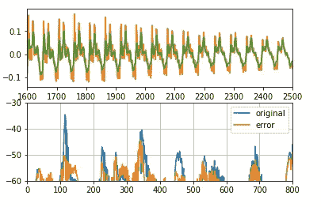

# 递归神经主动噪声消除

> 原文：<https://towardsdatascience.com/deep-active-noise-cancellation-e364ce4562d4?source=collection_archive---------18----------------------->

## RNN 预测一个结构化的噪音，以抑制它在复杂的声学环境

[Flickr](https://flic.kr/p/RVPv83), CC BY-NC 2.0

在我的[上一篇文章](https://medium.com/coinmonks/acoustic-noise-cancellation-by-machine-learning-4144af497661)中，我讲述了我基于神经网络的主动噪声消除系统。在这里，我概述了我用递归神经网络进行声音预测的实验，这是我为了改进我的降噪器而做的。

噪声声音预测对于主动噪声消除系统可能变得重要，因为非平稳噪声难以通过诸如 FxLMS 的经典方法来抑制。这就是我之前尝试简单的两层感知器的原因，也是我这次尝试递归网络的原因。

工作很简单:我挑战预测未来样本的任务，我用[莱瓦的波尔卡](https://www.youtube.com/watch?v=sBvt0lsoInc)作为试验品。这项任务需要大量的计算能力，所以我将这首歌缩短到前 5 秒，以便能够在没有独立 GPU 的笔记本电脑上训练 RNN。

# 回传脉冲

Image from [Magenta blog](https://magenta.tensorflow.org/blog/2017/06/01/waybackprop/)

网络架构的核心思想源自 Magenta 项目博客中的[帖子](https://magenta.tensorflow.org/blog/2017/06/01/waybackprop/)。作者在 RNN 域中引入了多速率信号处理的思想。帖子完美地描述了这个想法，它甚至有清晰的插图，所以我不打算与之竞争。虽然，我在这里给出了这个想法的简短描述。

一般来说，音乐或音频具有长期的潜在过程，因此需要用这样长的例子来学习模型。在那个实验中，我制作了具有 400 个样本输入宽度的神经网络。只有 50 毫秒，其他信息 NN 从以前的输出。

RNN 在音乐预测(或生成)问题上的主要问题是学习的复杂性。截断反向传播将输入样本和输入状态的历史展开数十或数百次。这意味着前馈路径的计算速度比反馈路径快几十倍或几百倍。

主要思想是建立几层公共递归神经网络单元，通常包括获取前一级的状态和输入值并返回下一状态和输出的单元。

# 履行

与之前的实验一样，我使用了 python 3.4、tensorflow 1.0 和 Linux Mint 17.2，但由于大量的计算需求，没有进行实时实验。

我制作了一个由 GRU 细胞组成的三层深度神经网络。GRU 单元也是我自己实现的，因为它更容易集成到整个系统中。每一层都接受来自以下方面的输入:

*   下面一层的输出，它是更快的一层(更大的采样率)；
*   本身以前的输出；
*   上一层的输出。

第一层以 8 kHz 的采样率获取原始样本，输入的宽度为 1 个样本。内部状态是 64 个值的向量。

Outline

我也尝试过我自己的由普通感知器组成的细胞，它也工作，但 GRU 细胞的性能更好，我停止了使用它们。最顶层在那个实验中没有给出任何足够的值，但我还是把它留下了。

# 结果

用于实验的歌曲部分:

原始和复制样品(上图)及其光谱:

另一部分:

目标范数是均方误差，第一个历元具有 0.0176689 的误差范数，最后第 800 个历元具有 0.000453576 的范数。

这个问题没有专利，到目前为止我也没有商业计划。然而，我希望有一份全职工作致力于这个主题，这就是为什么我不把源代码放在 github.com。然而，也许有一天我会释放他们。