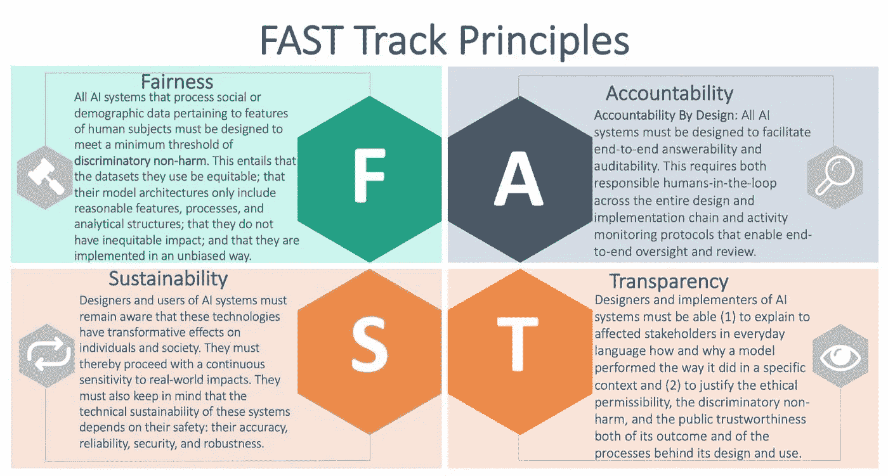

# 深度偏见？修正艾无意的偏见

> 原文：<https://towardsdatascience.com/deep-biases-fixing-ais-unintentional-prejudices-234893a40a3b?source=collection_archive---------27----------------------->

随着人工智能(AI)在这十年里引起了很大的轰动，这个生态系统中的算法模型无疑已经进入了我们日常生活的方方面面。无论它们是用来解决紧迫的社会问题，还是为你的通勤推荐新的歌曲播放列表，这些模型都很常见。随着研究和技术进步为更先进的系统让路成为常态，必须认真考虑偏见和成见的意外后果。如果系统建立在我们对种族、性别和文化多样性的偏见之上，人类真的能够创造出取代我们自己认知能力的人工超级智能吗？

***过去的表现并不代表未来的表现***

我不是第一个写这个的人，也不会是最后一个。我真的相信人工智能给社会带来的好处会超过它的成本。然而，过于信任当前的机器学习系统所带来的问题越来越明显。简单地说，监督机器学习算法采用现有的数据集，并学习从输入到输出的映射，以便做出未来的预测。如果这些现有的数据集有偏差，那么输出也会有偏差。去年这个时候，[路透社宣布亚马逊放弃了一个潜在的人工智能招聘工具](https://www.reuters.com/article/us-amazon-com-jobs-automation-insight/amazon-scraps-secret-ai-recruiting-tool-that-showed-bias-against-women-idUSKCN1MK08G)，许多人希望它成为招聘的“圣杯”。

> “……亚马逊的计算机模型被训练成通过观察 10 年间提交给公司的简历模式来审查申请人。大多数来自男性，反映了男性在整个科技行业的主导地位。

同样，在过去五年里，也出现了许多错误的行业算法。例如，深色皮肤的人被错误地归类为 gorrilas，或者相机将亚洲人的特征误读为眨眼。其他形式的计算机视觉算法可能会给个人带来更严重的后果，特别是如果用于预测性分析、数据驱动的政策执行措施或就业推荐引擎。

金融界有一个非常典型的免责声明，警告投资者过去的表现并不代表未来的表现。这非常贴切。机器学习系统的好坏取决于所使用的训练数据。当我们进入 2020 年时，所有的“…主义”和“…恐惧症”都真正地爆发了。已知超过 180 种人类偏见，人类的这些负面倾向可能被认为是不可治愈的，但在人工智能模型中修复偏见可能要简单得多。人工智能的竞赛正在迫使人们就道德使用展开公开讨论，因为我们的先入之见可能会因数据驱动的模型对商业决策产生不利影响而加剧。

**伦理框架？好吧，这是个开始。**

从根本上说，这是一个数据问题。如果算法继续从有缺陷的数据中学习，输出将继续没有代表性。上面写的案例*很有可能*已经被纠正，但是规范和共享未来的训练数据库必须取得进展。自 2016 年以来，AI 上的[伙伴关系无疑是朝着正确方向迈出的一步；世界科技巨头走向自我监管。PAI 寻求的一个解决方案是减少科技公司中的代表性不足，允许从数据收集到产品开发的更加多样化。](https://www.partnershiponai.org)

> “这种持续的危机在设计下一代产品的技术团队中尤为明显，这些产品会影响来自各种背景的人，通常与开发它们的团队不同。”

个人与科技公司的关系在不断变化。尽管最近进行了监管，但持续的数据泄露和数据共享政策带来了一个话题:**信任。**[*数据是新的石油*](https://www.economist.com/leaders/2017/05/06/the-worlds-most-valuable-resource-is-no-longer-oil-but-data) ”用那句话来说，每个个体生产的商品应该带来新的公民权利，而不仅仅是消费者权利。

围绕减少无意识偏见建立法律伦理框架或文化，无疑是提高企业信任度的一个开端。围绕数据使用建立正确的公司文化框架将使企业脱颖而出，并创造出更具包容性的思维定势。例如，[谷歌人工智能概述了他们的原则](https://ai.google/principles/)完全有益于社会，为安全和负责任而建造，并对此保持透明。其他公司如 T2 的 IBM T3 和 T4 的微软 T5 也这么做了。Alan Turing Institute 还提供了对待个人数据的全面价值观原则。

(Source: Leslie, D. 2019 - [Alan Turing Institute](https://www.turing.ac.uk/sites/default/files/2019-06/understanding_artificial_intelligence_ethics_and_safety.pdf))

过程也应该被监控。敏捷实践正在成为规范，随着企业经历产品开发生命周期，质疑新产品或新功能的影响也应该成为规范。

数据集会变得无偏吗？

> “因为人工智能可以[帮助揭示杂乱数据集内的真相](https://techcrunch.com/2018/11/06/3-ways-to-avoid-bias-in-machine-learning/)，算法有可能帮助我们更好地理解我们尚未隔离的偏见。”

除了监管和监控之外，实际实现允许审查数据源的过程无疑是困难的。IBM 的 K. Varney 提出了一个有趣的解决方案，通过三个目标和约束条件:群体歧视控制、个体扭曲控制和效用保护，数据“与具有一个或多个属性(如种族或性别)的人有关”。学术研究也看这个问题。 [Kleigr、Bahnik 和 Furnkranz](https://arxiv.org/pdf/1804.02969.pdf) (2019)也概述了一项关于如何减少算法系统中的偏差的研究。

> “涵盖了 20 种认知偏差，以及机器学习算法和软件的设计者可能采用的去偏差技术。”

有许多科学方法，如确保选择的模型是合适的，加强监测以减少样本、排除、偏见和观察偏差。我们会有一个既有代表性又实用的人工智能设计，同时不降低程序的公平性，最终不需要任何人类治理吗？就我而言，我不能确定——但我们已经有了一个开始。