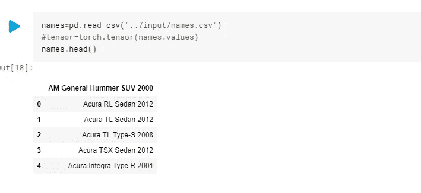
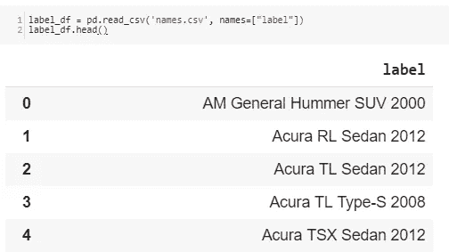
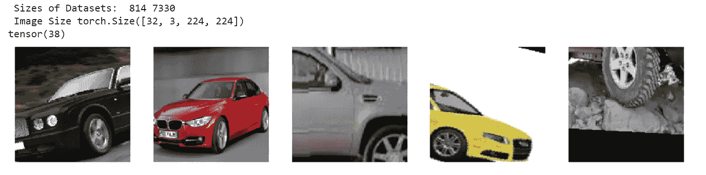
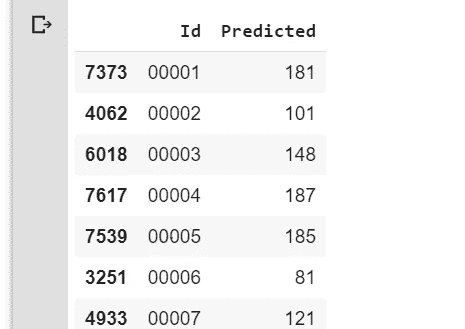

# 深度汽车 Pytorch 迁移学习

> 原文：<https://towardsdatascience.com/deep-cars-transfer-learning-with-pytorch-3e7541212e85?source=collection_archive---------10----------------------->

> 完成 *Hackathon Auto-matic* 的逐步指南


Source: [Honda Small Sports EV Concept Electric Car](https://www.freewebheaders.com/transport/cars-headers/)

你如何教计算机识别不同的汽车品牌？你想给任何一辆车拍照，然后你的手机自动告诉你这辆车的品牌吗？

如果这让你兴奋，那么你来对地方了。我们要写一个可以识别 196 种不同类型汽车的模型。

> ***侧注***
> 
> 自动黑客马拉松是我和四位女士(来自世界各地)发起的组织周末黑客马拉松的第二个项目
> 
> 作为 facebook 赞助的 Udacity 上的**安全和私人 AI 奖学金挑战赛的 5000 名学生的一部分，**我们决定组织周末黑客马拉松；用 Pytorch 解决一个问题的 48 小时，玩得开心，互相竞争。令我们惊讶的是，在我们的第一次黑客马拉松中，有 41 个团队参加了🙌。 [**黑客马拉松开花**](https://www.kaggle.com/spaics/hackathon-blossom-flower-classification) 是给第一届黑客马拉松起的名字。[**Hackathon Auto-matic**](https://www.kaggle.com/c/virtual-hack)**和 Hackathon Blossom 一样也是基于图像分类。**
> 
> **我可以继续讲述这个机会是多么不可思议，以及我们在那里拥有的令人惊叹的社区。我最好就此打住，回到我们今天的目标:)**

# **入门指南**

**我们将使用神经网络来实现我们的目标。更准确地说，我们将使用一个非常深的神经网络，因此命名为**深车。****

**本教程分为两部分:**

****第 1 部分:构建汽车分类器****

****第 2 部分:部署分类器(进行中…)****

**在本文中，我们将浏览第 1 部分**

# **第 1 部分:构建汽车分类器**

***先决条件:***

**为了跟进，需要以下方面的一些知识:**

*   ***Python*——uda city 提供了一个关于[Python 简介](https://www.udacity.com/course/introduction-to-python--ud1110)的很棒的课程**
*   ***卷积神经网络* — Adit 在 CNN 上提供了一个伟大的[解释](https://adeshpande3.github.io/adeshpande3.github.io/A-Beginner's-Guide-To-Understanding-Convolutional-Neural-Networks/)**
*   ***Pytorch* 的基础知识**

**我们将使用一种叫做**迁移学习**的方法来训练我们的分类器。**

# **什么是迁移学习？**

**迁移学习是深度学习中的一种方法，其中为解决一项任务而开发的模型被重新用作另一项任务的起点。比方说，你想建立一个网络来识别鸟类，而不是从头开始编写一个模型，这可能是一个非常复杂的任务，至少可以使用一个已经存在的模型来完成相同或类似的任务(在我们识别鸟类的情况下，我们可以使用一个识别其他动物的网络)。运用迁移学习的优势；*学习过程更快、更准确，需要的训练数据更少*。已经存在的模型被称为**预训练模型。****

**迁移学习中使用的大多数预训练模型都基于大型卷积神经网络。一些人预训练的模型有 VGGNet，ResNet，DenseNet，Google 的 Inception 等。这些网络中的大多数都是在 [ImageNet](http://www.image-net.org/) 上训练出来的。ImageNet 是一个大规模数据集，包含 1000 个类别中超过 100 万个带标签的图像。**

**在 Pytorch 中，很容易加载基于 ImageNet 的预训练网络，这些网络[可从 torchvision](https://pytorch.org/docs/0.3.0/torchvision/models.html) 获得。我们将使用这些预先训练好的模型来训练我们的网络。**

**我们的模型将使用以下步骤在 Google Colab 上构建(笔记本可在此处找到[](https://github.com/ivyclare/DeepCars---Transfer-Learning-With-Pytorch/blob/master/Ivy__Deep_Cars_Identifying_Car_Brands.ipynb)*):***

1.  ***加载数据并执行转换***
2.  ***建立模型***
3.  ***训练模型***
4.  ***在看不见的数据上测试模型***

*****导入库*****

***在这里，我们只是加载库，并确保 GPU 是打开的。由于我们将使用预先训练的模型，这些模型是非常深的网络，所以 CPU 上的训练不是一个真正的选项，因为这将需要很长时间。GPU 并行执行线性代数计算，因此训练速度提高了 100 倍。***

***如果你的 GPU 是关闭的，并且你正在使用 Colab，在你的笔记本上进入**编辑= >笔记本设置**。确保**运行时**设置为 **Python 3** 并且在**硬件加速器**下选择 **GPU。*****

***你会注意到我们正在检查 cuda 是否可用。大多数深度学习框架使用 CUDA 来计算 GPU 上的向前和向后传递。***

# *****1。执行转换并加载数据集*****

*****1.1 下载数据集*****

***现在我们的库已经导入，我们从 [Kaggle](https://www.kaggle.com/c/virtual-hack/data) 加载数据集。该数据集包含 196 个汽车品牌。***

***在这里，我们下载数据集并使用 Pytorch 数据加载器加载它们。我们将数据直接下载到谷歌硬盘，因此我们必须获得授权访问。***

```
*#Mounting google drive inorder to access data
from google.colab import drive
drive.mount('/content/drive')*
```

***运行后:点击出现的链接，登录到你的帐户，点击允许，然后复制生成的文本并粘贴到你的笔记本上。查看这篇[文章](/setting-up-kaggle-in-google-colab-ebb281b61463)，这篇文章向您展示了如何轻松获得 API 密钥和下载数据集。我们加上这一行*！解压缩\*。zip* 解压下载的文件。您的代码应该是这样的:***

***注意我们有两个目录；培训和测试目录。稍后，我们将使用我们的模型来预测测试集的值。我们必须将训练数据分为训练数据和验证数据。在拆分之前，让我们了解什么是转换，并写出我们的转换。***

*****1.2 数据转换*****

***既然数据集已经下载，我们就对数据执行转换。转换是将数据从一种形式转换成另一种形式。我们将对我们的图像应用两个主要的变换:***

*   *****数据增强*****

***这是一种在不实际收集新数据的情况下增加用于训练的数据集的多样性和大小的策略。诸如调整大小、裁剪、水平翻转、填充甚至 GANs 等技术被应用于数据集上的图像，并且“新的”图像被创建。它有两个主要优点:**从有限的数据中生成更多的数据，并防止过拟合**。***

***但是，不要期望在数据集中看到这些生成的图像。它们仅在批量生成期间创建，因此即使您没有看到数据集中的图像数量增加，训练期间的实际图像也会增加。***

***在我们的模型中，我们应用了 3 种增强策略；*调整大小(RandomResize)、裁剪(RandomCrop)和水平翻转(HorizontalFlip)。****

***请注意，对于测试数据，我们不执行 RandomResizedCrop、RandomRotation 和 RandomHorizontalFlip 转换。相反，我们只是将测试图像的大小调整为 256×256，并裁剪掉中心 224×224，以便能够将它们用于预训练的模型。***

*   *****数据标准化*****

***执行增强后，图像被转换为张量，并通过使用 ImageNet 中所有图像的平均值和标准偏差进行归一化。通常，对于非常大的数据集，使用数据集本身的平均值和标准差。鉴于我们的数据集不是太大，我们使用 ImageNet 的数据集:*【0.485，0.456，0.406】，【0.229，0.224，0.225】****

***执行这些转换后，我们使用 Pytorch 中的 ImageFolder 加载数据。但是首先我们需要验证数据，所以我们拆分了训练集。我们的数据中只有 1%被选择用于验证，其余的用于训练。***

*   *****可视化标签*****

***我们可视化我们的标签来查看文件的结构。***

******

***Output from printing names.csv***

***我们看到 0 上面出现了一个车名。因此，在读取 csv 文件时，我们必须添加一个头名，这样才能得到正确的输出。需要注意的是，我们的标签从 0 到 195 开始(非常重要)***

******

*****3 可视化图像*****

***我们现在可以加载和可视化我们的数据。创建了一个方法 *imshow()* (来自挑战课程)来显示我们的图像。***

***训练集中的图像如下所示。我们注意到其中一些已经翻转或旋转。***

******

***Images from train set after transformations***

# *****2。构建和训练模型*****

***如前所述，我们将使用基于 ImageNet 的预训练模型。***

***我们将用于构建和培训的步骤是:***

1.  ***加载预训练模型***
2.  ***冻结卷积层中的参数***
3.  ***创建自定义分类器并定义超参数***
4.  ***训练自定义分类器***

*****2.2 加载预训练模型*****

***我们将尝试不同的架构； **densenet161** 、 **inceptionv3** 、 **resnet121** 和 **vggnet** 架构。在这里，我们加载不同的模型，并在模型的全连接层中指定输入要素的数量，因为我们在构建自定义分类器时将需要这一点。***

*****2.3 冻结参数并创建自定义分类器*****

***因为我们的预训练模型中的大多数参数已经为我们训练好了，所以我们不通过它们进行反向投影。这将允许我们保留早期卷积层的预训练权重(其目的是用于特征提取)。我们通过将 *requires_grad* 字段重置为 false 来实现这一点。***

***在此之后，我们替换完全连接的网络，该网络将具有与我们的预训练神经元相同的输入、自定义隐藏层和我们的输出。我们的*build _ classifier*方法很灵活，当我们不希望网络中有隐藏层，或者我们希望有多个隐藏层时，这种方法很有效。激活功能(在本例中为 *relu* )和*漏失*也被定义。***

***现在我们指定我们的超参数和隐藏层。***

***我们指定了标准，不同的优化器，如 Adam，Adadelta，SGD，其中包含了学习率和动量。我们为不同的预训练网络使用这些超参数，并选择给我们最好结果的那些。我们为 resnet 和 vggnet 使用两种不同的调度程序。他们是这样做的:***

***`torch.optim.lr_scheduler`提供了几种根据时期数调整学习率的方法。`[torch.optim.lr_scheduler.ReduceLROnPlateau](https://pytorch.org/docs/stable/optim.html#torch.optim.lr_scheduler.ReduceLROnPlateau)`允许基于某些验证测量的动态学习率降低。更多阅读[此处](https://pytorch.org/docs/stable/optim.html)***

*****2.4 培训和验证*****

***为了用 PyTorch 训练我们的模型，我们通常在迭代每个时期时执行以下步骤:***

*   ***使用 *forward(images)* 向前通过网络***
*   ***使用*标准*功能中的网络输出来计算损耗***
*   ***使用 *loss.backward()* 对网络进行反向遍历，以计算梯度***
*   ***与优化器一起更新权重 *optimizer.step()****

****optimizer.zero_grad()* 用于清除累积的梯度***

***称为**提前停止**的技术用于防止过度拟合。当验证数据集的性能开始下降时，它会导致训练停止。随着训练的进行，当我们获得最佳准确度时，我们也保存模型(检查点)。这样，如果断电或训练由于某种原因中断，可以恢复检查点并继续训练。***

***该模型改编自 [PyTorch 网站](https://pytorch.org/tutorials/beginner/transfer_learning_tutorial.html)***

***现在我们训练我们的模型。***

```
*Epoch 1/60 
---------- 
train Loss: 0.5672 Acc: 0.8441 
valid Loss: 0.6750 Acc: 0.8329 
 Epoch 2/60 
---------- 
train Loss: 0.6184 Acc: 0.8357 
valid Loss: 0.5980 Acc: 0.8415  
Epoch 3/60 
---------- 
train Loss: 0.5695 Acc: 0.8487 
valid Loss: 0.5503 Acc: 0.8575  
...*
```

***这看起来很有希望。这个模型似乎在不断学习。此外，我们的模型似乎没有过度拟合(至少是过度拟合)，因为训练和验证指标没有偏离太多。该模型的特定时期结果是通过 ResNet 架构获得的，这是第二次培训。精度开始很低，但随着时间的推移而提高。对我们得到的精度影响很大的超参数是**优化器、调度器、历元数和架构**。调整这些值要么给出非常低的精度(低至 0，甚至为负)，要么以 0.013 这样的精度开始，该精度随着历元数的增加而增加(这里耐心是关键)。***

*****4。在看不见的数据上测试模型*****

***一旦我们对我们的验证准确性感到满意，我们就加载我们保存的模型，并对测试数据进行预测。课堂竞赛要求我们以 csv 格式提交结果，格式为 **Id，预测**。 *Id* 这是我们图像文件的名称，不带扩展名。jpg 和*预测的*是我们的模型为每张图片预测的类(应该在 1 到 196 之间)。请记住，我们的标签从 0 到 195 开始，所以我们必须在预测的类中加 1 才能得到正确的值。***

***我们加载我们保存的模型***

```
*model.load_state_dict(torch.load('/content/drive/MyDrive/ResnetCars.pt'))
model.to(device)*
```

***现在，我们加载测试数据集，并通过数据集传递我们的模型。因为我们只做预测，所以不需要计算梯度。我们通过 *torch.no_grad()* 并设置为 evaluation *model.eval()来实现这一点。我们计算预测。****

***得到结果后，我们打印数据框，并将结果写入一个. csv 文件，然后在竞赛网站上提交。***

******

***CSV FIle to be submitted***

***看看 Khush Patel 的令人惊叹的内核，它以 99.18%的准确率赢得了黑客马拉松的冠军。他使用了 inceptionV3 架构，带有 CrossEntropyLoss 和一个 SGD 优化器。你的模型能打败这个吗？:)***

***你可以在 Kaggle 上参加[的班级竞赛。](https://www.kaggle.com/c/virtual-hack/overview)***

***我们结束了。***

***恭喜👏这是一篇很长的文章，但你坚持到了最后。现在你可以用迁移学习建立你自己的模型。代码是可重用的，您也可以将它用于其他数据集。***

***感谢阅读！你可以随时在 Twitter 和 LinkedIn 上联系。***

*****参考文献*****

***[1] F. Zaidi，[py torch 中的迁移学习，第 1 部分:如何使用数据加载器并构建完全连接的类](https://www.datascience.com/blog/transfer-learning-in-pytorch-part-one) (2019)***

***[2] G. Adjei，[用 PyTorch](https://heartbeat.fritz.ai/transfer-learning-with-pytorch-cfcb69016c72) ，(2019)，心跳***