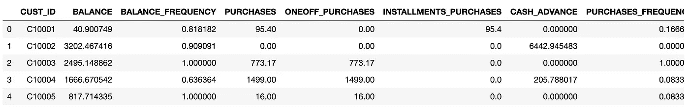
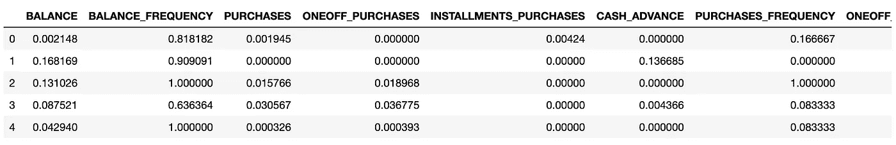
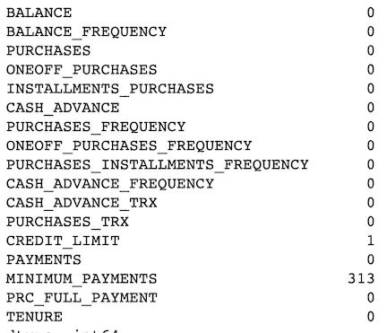
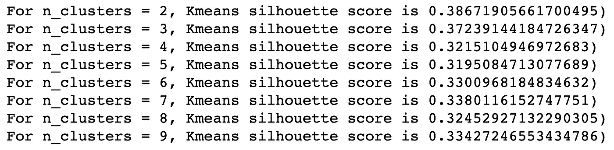
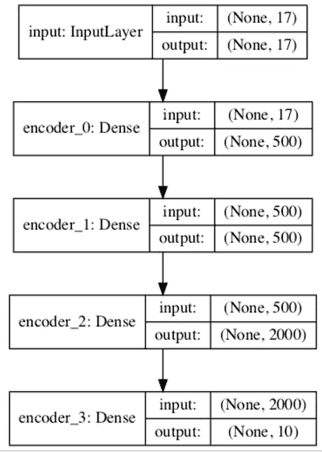
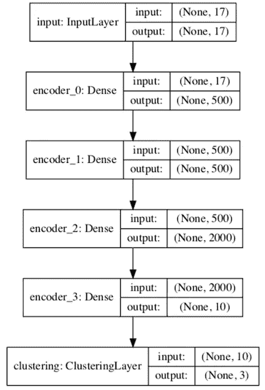
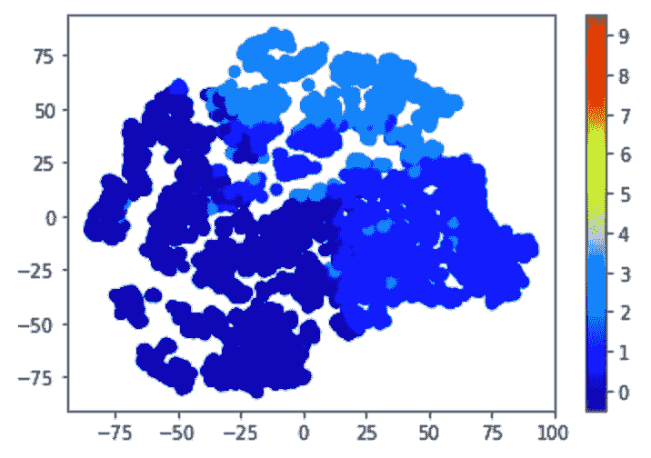
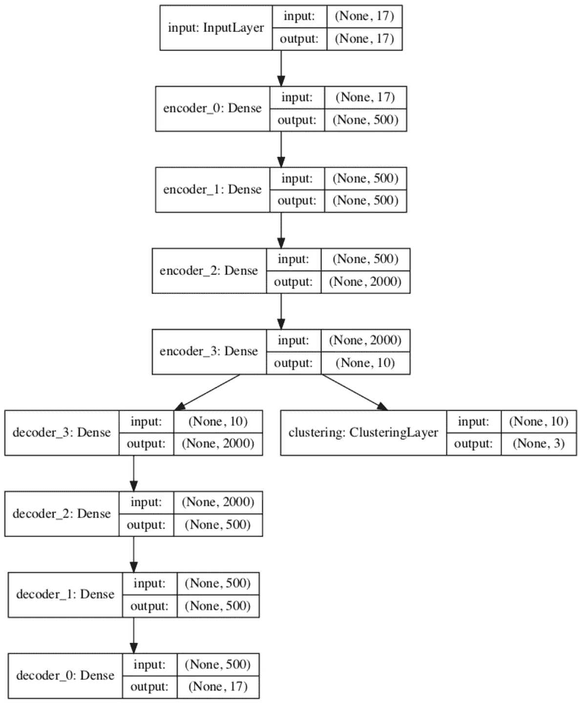
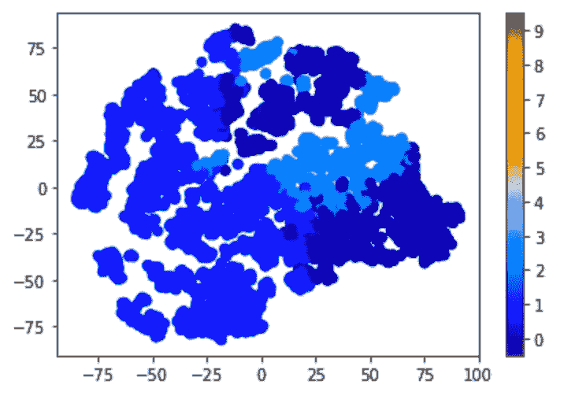

# 金融市场细分的深度聚类

> 原文：<https://towardsdatascience.com/deep-clustering-for-financial-market-segmentation-2a41573618cf?source=collection_archive---------5----------------------->

## 一种无监督的信用卡客户聚类深度学习方法


[无监督学习](https://en.wikipedia.org/wiki/Unsupervised_learning)、[监督学习](https://en.wikipedia.org/wiki/Supervised_learning)和[强化学习](https://en.wikipedia.org/wiki/Reinforcement_learning)是机器学习方法的三大类。无监督学习有许多应用，如聚类、降维等。机器学习算法 [K-means](https://en.wikipedia.org/wiki/K-means_clustering) 和[主成分分析](https://en.wikipedia.org/wiki/Principal_component_analysis) (PCA)分别广泛用于聚类和降维。与 PCA 类似，[T-分布式随机邻居嵌入](https://en.wikipedia.org/wiki/T-distributed_stochastic_neighbor_embedding) (t-SNE)是另一种用于维数约简的无监督机器学习算法。t-SNE 通常用于在二维或三维空间中嵌入高维数据以进行数据可视化。

随着无监督深度学习的发展，[自动编码器](https://en.wikipedia.org/wiki/Autoencoder)神经网络现在经常用于高维度(例如，具有数千或更多特征的数据集)的约简。Autoencoder 也可以与监督学习(如随机森林)相结合，形成[半监督学习](https://en.wikipedia.org/wiki/Semi-supervised_learning)方法(见[深度病人](https://www.nature.com/articles/srep26094)举例)。

最近发表了一个[深度嵌入聚类](https://arxiv.org/pdf/1511.06335.pdf) (DEC)方法【1】。它将 autoencoder 与 K-means 和其他机器学习技术相结合，用于聚类而不是降维。DEC 的[原实现基于](https://github.com/piiswrong/dec) [Caffe](https://caffe.berkeleyvision.org/) 。在【2】中可以找到 [MNIST](https://en.wikipedia.org/wiki/MNIST_database) 数据集的 [Keras](https://keras.io/) 中 DEC 的实现。

在本文中，与[2]类似，我在 Keras 中实现了 DEC 算法，并使用公共数据集 [Kaggle 信用卡数据集进行聚类](https://www.kaggle.com/arjunbhasin2013/ccdata) [3]来展示如何使用新实现的 DEC 模型对信用卡数据集进行聚类以进行客户细分。本文其余部分安排如下:

*   数据准备
*   在 Keras 中实现 DEC 方法
*   摘要

# 1.数据准备

本节描述聚类所需的常见数据预处理步骤。

## 1.1 加载数据

将 Kaggle 信用卡数据集[3]下载到本地机器后，可以将其加载到 Pandas 数据框架中，如下所示:

```
import Pandas as pd
data = pd.read_csv('./data/CC_GENRAL.csv')
data.head()
```



## 1.2 选择功能

从上面的数据帧可以看出，CUST ID 字段对于每个客户数据记录都是唯一的。具有唯一值的该字段对聚类没有用，因此可以删除:

```
data_x = data.drop(['CUST_ID'], axis=1)
```

## 1.3 重缩放特征

从数据帧中还可以看出，对于不同的字段/特征，值的范围是非常不同的。众所周知，K-means 对特征值的尺度很敏感，因为它使用欧氏距离作为相似性度量。为了避免这个问题，所有要素的值都被重新调整到[0，1]的范围内:

```
from sklearn.preprocessing import MinMaxScaler
numeric_columns = data_x.columns.values.tolist()
scaler = MinMaxScaler() 
data_x[numeric_columns] = scaler.fit_transform(data_x[numeric_columns])
data_x.head()
```



## 1.4 处理缺失数据

以下代码用于检查数据集中是否存在任何缺失的数据:

```
data_x.isnull().sum()
```



上表显示有一个缺失的信用限额记录和 313 个缺失的最低付款额。在这种情况下，用零填充缺失的数据是有意义的:

```
data_x.fillna(0, inplace=True)
```

# 2.在 Keras 中实现 DEC 方法

与[2]类似，[1]中的 DEC 算法在本文中用 Keras 实现如下:

*   步骤 1:估计聚类数
*   步骤 2:创建和训练 K 均值模型
*   步骤 3:创建和训练自动编码器
*   步骤 4:实施 DEC 软标签
*   步骤 5:创建一个新的 DEC 模型
*   步骤 6:训练新的 DEC 模型
*   步骤 7:使用训练好的 DEC 模型预测聚类类
*   第八步:共同细化 DEC 模型
*   步骤 9:使用改进的 DEC 模型预测聚类类
*   步骤 10:与 K 均值比较

## 2.1 估计聚类数

如前所述，DEC 方法将 Autoencoder 与 K-means 和其他机器学习技术相结合。为了训练 K-均值模型，需要估计的聚类数。本文通过研究不同 K-means 模型执行的[剪影](https://en.wikipedia.org/wiki/Silhouette_(clustering))值来估计聚类的数量:

```
for num_clusters in range(2,10):
    clusterer = KMeans(n_clusters=num_clusters, n_jobs=4)
    preds = clusterer.fit_predict(x)
    # centers = clusterer.cluster_centers_
    score = silhouette_score (x, preds, metric='euclidean')
    print ("For n_clusters = {}, Kmeans silhouette score is {})".format(num_clusters, score))
```



轮廓值衡量数据记录与其自己的分类(内聚力)相比与其他分类的相似程度。轮廓值的范围从 1 到+1，其中高值表示数据记录与其自己的分类匹配良好，而与其相邻的分类匹配较差。

上面的轮廓值表明聚类数的前两个选择是 2 和 3。本文选择了 3 个簇的数目。

## 2.2 创建和训练 K 均值模型

一旦确定了聚类的数量，就可以创建 K 均值模型:

```
n_clusters = 3
kmeans = KMeans(n_clusters=n_clusters, n_jobs=4)
y_pred_kmeans = kmeans.fit_predict(x)
```

## 2.3 创建和培训自动编码器

除了 K-means，DEC 算法中还需要一个自动编码器[1]。以下函数用于创建自动编码器:

```
def autoencoder(dims, act='relu', init='glorot_uniform'):
    n_stacks = len(dims) - 1

    input_data = Input(shape=(dims[0],), name='input')
    x = input_data

    # internal layers of encoder
    for i in range(n_stacks-1):
        x = Dense(dims[i + 1], activation=act,  kernel_initializer=init, name='encoder_%d' % i)(x) # latent hidden layer
    encoded = Dense(dims[-1], kernel_initializer=init, name='encoder_%d' % (n_stacks - 1))(x) x = encoded
    # internal layers of decoder
    for i in range(n_stacks-1, 0, -1):
        x = Dense(dims[i], activation=act, kernel_initializer=init, name='decoder_%d' % i)(x) # decoder output
    x = Dense(dims[0], kernel_initializer=init, name='decoder_0')(x)

    decoded = x

    autoencoder_model = Model(inputs=input_data, outputs=decoded, name='autoencoder')
    encoder_model     = Model(inputs=input_data, outputs=encoded, name='encoder')

    return autoencoder_model, encoder_model
```

自动编码器模型创建如下:

```
n_epochs   = 100
batch_size = 128
dims = [x.shape[-1], 500, 500, 2000, 10] 
init = VarianceScaling(scale=1\. / 3., mode='fan_in',
                           distribution='uniform')
pretrain_optimizer = SGD(lr=1, momentum=0.9)
pretrain_epochs = n_epochs
batch_size = batch_size
save_dir = './results'autoencoder, encoder = autoencoder(dims, init=init)
```

如[1]中所述，层的大小[500，500，2000，10]被选择作为用于任何数据集的自动编码器神经网络的一般配置。

生成的编码器模型的图表可以创建如下:

```
from keras.utils import plot_model
plot_model(encoder, to_file='encoder.png', show_shapes=True)
from IPython.display import Image
Image(filename='encoder.png')
```



自动编码器的训练如下:

```
autoencoder.compile(optimizer=pretrain_optimizer, loss='mse')
autoencoder.fit(x, x, batch_size=batch_size, epochs=pretrain_epochs)
autoencoder.save_weights(save_dir + '/ae_weights.h5')
```

被训练的自动编码器的权重被保存以备后用:

```
autoencoder.save_weights(save_dir + '/ae_weights.h5')
autoencoder.load_weights(save_dir + '/ae_weights.h5')
```

## 2.4 实施 DEC 软标签

DEC 方法[1]中的一个关键组成部分是软标记，也就是说，为每个数据样本分配一个估计类，以使其可以迭代地改进。为此，与[2]类似，定义了一个新的 *ClusteringLayer* 类:

```
class ClusteringLayer(Layer): def __init__(self, n_clusters, weights=None, alpha=1.0, **kwargs):
        if 'input_shape' not in kwargs and 'input_dim' in kwargs:
            kwargs['input_shape'] = (kwargs.pop('input_dim'),)
        super(ClusteringLayer, self).__init__(**kwargs)
        self.n_clusters = n_clusters
        self.alpha = alpha
        self.initial_weights = weights
        self.input_spec = InputSpec(ndim=2) def build(self, input_shape):
        assert len(input_shape) == 2
        input_dim = input_shape[1]
        self.input_spec = InputSpec(dtype=K.floatx(), shape=(None, input_dim))
        self.clusters = self.add_weight(name='clusters', shape=(self.n_clusters, input_dim), initializer='glorot_uniform') 

        if self.initial_weights is not None:
            self.set_weights(self.initial_weights)
            del self.initial_weights
        self.built = True def call(self, inputs, **kwargs):
        q = 1.0 / (1.0 + (K.sum(K.square(K.expand_dims(inputs, axis=1) - self.clusters), axis=2) / self.alpha))
        q **= (self.alpha + 1.0) / 2.0
        q = K.transpose(K.transpose(q) / K.sum(q, axis=1)) 

        return q def compute_output_shape(self, input_shape):
        assert input_shape and len(input_shape) == 2
        return input_shape[0], self.n_clusters def get_config(self):
        config = {'n_clusters': self.n_clusters}
        base_config = super(ClusteringLayer, self).get_config()
        return dict(list(base_config.items()) + list(config.items()))
```

## 2.5 创建新的 DEC 模型

一旦定义了软标注图层，就可以使用它来形成 DEC 模型，如下所示:

```
clustering_layer = ClusteringLayer(n_clusters, name='clustering')(encoder.output)
model = Model(inputs=encoder.input, outputs=clustering_layer)
```

可以创建新 DEC 模型的图表，如下所示:

```
from keras.utils import plot_model
plot_model(model, to_file='model.png', show_shapes=True)
from IPython.display import Image
Image(filename='model.png')
```



新的 DEC 模型可以编译如下:

```
model.compile(optimizer=SGD(0.01, 0.9), loss='kld')
model.get_layer(name='clustering').set_weights([kmeans.cluster_centers_])
```

## 2.6 培训新的 DEC 模型

迭代训练新的 DEC 模型:

```
# computing an auxiliary target distribution
def target_distribution(q):
    weight = q ** 2 / q.sum(0)
    return (weight.T / weight.sum(1)).Tloss = 0
index = 0
maxiter = 1000 
update_interval = 100 
tol = 0.001 # tolerance threshold to stop trainingindex_array = np.arange(x.shape[0])

for ite in range(int(maxiter)):
    if ite % update_interval == 0:
        q = model.predict(x, verbose=0)
        p = target_distribution(q) idx = index_array[index * batch_size: min((index+1) * batch_size, x.shape[0])]
    loss = model.train_on_batch(x=x[idx], y=p[idx])
    index = index + 1 if (index + 1) * batch_size <= x.shape[0] else 0
```

如[1]中所述，上述训练过程通过在辅助目标分布函数 *target_distribution* )的帮助下从高置信度分配中学习来迭代地改进聚类。具体而言，通过将软分配与目标分布相匹配来训练 DEC 模型。为此，在 DEC 模型中，目标/损失函数被定义为软分配和辅助分布之间的 [Kullback-Leibler](https://en.wikipedia.org/wiki/Kullback%E2%80%93Leibler_divergence) (KL)发散损失。

已训练模型的模型权重被保存以备后用:

```
model.save_weights(save_dir + '/DEC_model_final.h5')
model.load_weights(save_dir + '/DEC_model_final.h5')
```

## 2.7 使用训练的 DEC 模型来预测聚类类别

一旦 DEC 模型被定型，它就可以用于预测聚类类，如下所示:

```
q = model.predict(x, verbose=0)
p = target_distribution(q) 
y_pred = q.argmax(1)
```

如下获得 0.291 的轮廓分数:

```
from sklearn.metrics import silhouette_score
score = silhouette_score(x, y_pred, metric='euclidean')
```

以下代码可用于使用 t-SNE 将数据集嵌入二维空间，然后使用预测聚类标签的颜色编码来可视化预测聚类结果:

```
import numpy as np
from sklearn.manifold import TSNEx_embedded = TSNE(n_components=2).fit_transform(x)vis_x = x_embedded[:, 0]
vis_y = x_embedded[:, 1]
plt.scatter(vis_x, vis_y, c=y_pred, cmap=plt.cm.get_cmap("jet", 256))
plt.colorbar(ticks=range(256))
plt.clim(-0.5, 9.5)
plt.show()
```



**图 1:** 剪影得分为 0.291 的新 DEC 模型的聚类。

## 2.8 联合提炼 DEC 模型

DEC 方法[1]背后的主要思想是使用深度神经网络同时学习特征表示和聚类分配。为此，以下代码使用预训练的 autoencoder 和 K-means 模型来定义一个新模型，该模型将预处理的信用卡数据集作为输入，并输出预测的聚类分析类和解码的输入数据记录。

```
autoencoder, encoder = autoencoder(dims, init=init)
autoencoder.load_weights(save_dir + '/ae_weights.h5')
clustering_layer = ClusteringLayer(n_clusters, name='clustering')(encoder.output)
model = Model(inputs=encoder.input, outputs=[clustering_layer, autoencoder.output])
```

可以按如下方式创建连接模型的图表:

```
from keras.utils import plot_model
plot_model(model, to_file='model.png', show_shapes=True)
from IPython.display import Image
Image(filename='model.png')
```



DEC 模型的优化执行如下:

```
kmeans = KMeans(n_clusters=n_clusters, n_init=20)
y_pred = kmeans.fit_predict(encoder.predict(x))
model.get_layer(name='clustering').set_weights([kmeans.cluster_centers_])
y_pred_last = np.copy(y_pred)model.compile(loss=['kld', 'mse'], loss_weights=[0.1, 1], optimizer=pretrain_optimizer)for ite in range(int(maxiter)):
    if ite % update_interval == 0:
        q, _  = model.predict(x, verbose=0)
        p = target_distribution(q)  
        y_pred = q.argmax(1) # check stop criterion
        delta_label = np.sum(y_pred != y_pred_last).astype(np.float32) / y_pred.shape[0]
        y_pred_last = np.copy(y_pred)
        if ite > 0 and delta_label < tol:
            print('delta_label ', delta_label, '< tol ', tol)
            print('Reached tolerance threshold. Stopping training.')
            break
    idx = index_array[index * batch_size: min((index+1) * batch_size, x.shape[0])]
    loss = model.train_on_batch(x=x[idx], y=[p[idx], x[idx]])
    index = index + 1 if (index + 1) * batch_size <= x.shape[0] else 0
```

保存联合细化的模型权重:

```
model.save_weights(save_dir + '/b_DEC_model_final.h5')
model.load_weights(save_dir + '/b_DEC_model_final.h5')
```

## 2.9 使用改进的 DEC 模型预测聚类类别

以下代码将使用改进的 DEC 模型来预测聚类分析类:

```
q, _ = model.predict(x, verbose=0)
p = target_distribution(q)  
y_pred = q.argmax(1)
```

下面的代码可用于重用 t-SNE 嵌入的二维空间( *vis_x* ， *vis_y* )，并使用新的预测聚类标签的颜色编码来可视化新的预测聚类结果:

```
plt.scatter(vis_x, vis_y, c=y_pred, cmap=plt.cm.get_cmap("jet", 256))
plt.colorbar(ticks=range(256))
plt.clim(-0.5, 9.5)
plt.show()
```


**图 2:** 轮廓得分为 0.318 的细化 DEC 模型的聚类。

## 2.10 与 K 均值比较

图 3 显示了 K-means 的聚类结果。通过比较图 3 和图 2，我们可以看到 K-means 取得了相对较高的轮廓得分。然而，可以看出，改进的 DEC 模型预测了具有更清晰可分边界的聚类。



图 3:轮廓得分为 0.372 的 K 均值模型的聚类。

# 摘要

在本文中，与[2]类似，我基于[1]中的原始 DEC 算法在 Keras 中实现了一个新的 DEC 模型，然后将新模型应用于公共数据集 [Kaggle 信用卡数据集进行聚类](https://www.kaggle.com/arjunbhasin2013/ccdata)【3】。

模型评估结果表明，与 K-means 方法相比，新的改进的 DEC 模型更清楚地预测了信用卡数据集的可分离聚类。这种新的 DEC 模型具有用于信用卡客户细分、其他金融市场细分等的潜力。

Github [4]中提供了一个 Jupyter 笔记本，其中包含了本文中使用的所有源代码。

# 参考

[1] J .谢，r .吉希克，a .，[聚类分析的无监督深度嵌入](https://arxiv.org/pdf/1511.06335.pdf)，2016 年 5 月 24 日

[2]程维，[如何用 Keras 做无监督聚类](https://www.dlology.com/blog/how-to-do-unsupervised-clustering-with-keras/)

[3] Kaggle [用于聚类的信用卡数据集](https://www.kaggle.com/arjunbhasin2013/ccdata)

[4] Y. Zhang， [Github](https://github.com/yzzhang/machine-learning/tree/master/deep_learning/unsupervised_learning/dec_keras_clustering) 中的 Jupyter 笔记本

披露声明:2019 首创一。观点是作者个人的观点。除非本帖中另有说明，否则 Capital One 不隶属于所提及的任何公司，也不被这些公司认可。使用或展示的所有商标和其他知识产权是其各自所有者的财产。