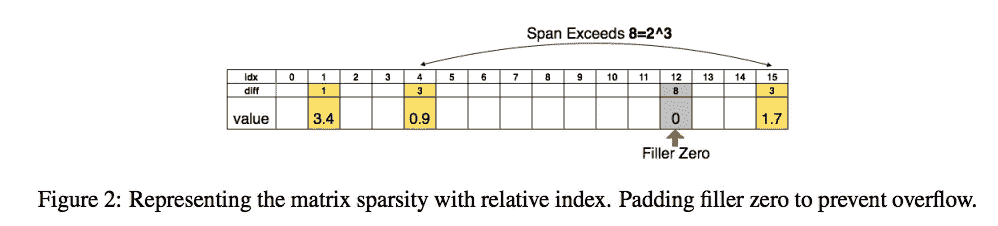
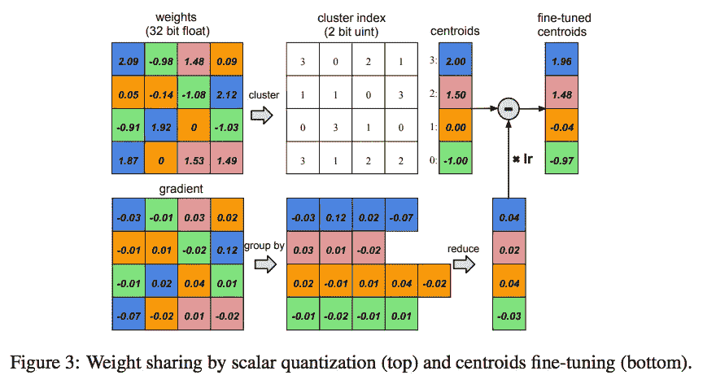

# 深度压缩

> 原文：<https://towardsdatascience.com/deep-compression-7b771b3aa773?source=collection_archive---------17----------------------->

在目前的形式下，深度神经网络需要巨大的内存来支持其大规模的过度参数化。AlexNet 和 VGG-16 等经典神经网络分别需要大约 240 和 552 MB。已经进行了许多努力来减小神经网络的文件大小，通常依赖于诸如权重修剪或量化或者权重矩阵的 SVD 分解之类的技术。这篇名为 [Deep Compression](https://arxiv.org/abs/1510.00149) 的论文将剪枝、量化和霍夫曼编码结合到一个三级流水线中，将 AlexNet 的大小减少了 35 倍，将 VGG-16 的大小减少了 49 倍。这导致 AlexNet 从 240 兆字节减少到 6.9 兆字节，VGG-16 从 552 兆字节减少到 11.3 兆字节。

管道由三个阶段组成:

```
Pruning, Quantization, and Huffman Encoding
```

# 修剪

修剪描述了在深度神经网络中屏蔽掉某些权重的过程。这需要在神经网络层上实现一个掩码，以便它们通过 y = Wx + b 运算进行不同的迭代。权重修剪不同于简单地将某些权重设置为 0。在论文中实现的修剪操作屏蔽了低于某个阈值的权重。例如，如果权重位于区间[-0.5，0.5]之间，它将被屏蔽掉。

修剪后，权重以压缩的稀疏行格式表示。这样做是为了不浪费稀疏权重矩阵的空间。下图描述了这种 CSR 格式:



# 量化

量化是一种通过权重共享来减少在神经网络中存储每个权重所需的位数的技术。深度神经网络中的权重通常由 32 位浮点表示，采取例如“2.70381”的形式。在量化中，使用 k-Means 算法来搜索描述网络中权重的聚类。如果权重用 3 比特表示，这将导致 2 = 8 个质心用于聚类权重。然后，每个权重被映射到其各自的质心。比如‘2.70381’→‘2’。因此，这 8 个质心形成了用于将原始权重映射到相应的 3 比特权重的“码本”。然后，在训练期间对该码本进行微调。

码本通过与经典 backprop / SGD 类似的机制进行微调。计算每个权重的偏导数，并对每个离散的 3 位权重进行合计。例如，一系列“2”3 位权重可以具有“0.2”、“0.1”、“0.2”和“0.3”的相应偏导数更新。这些导数被聚合，并且“2”被优化为“2.2”。

这个过程描述如下:



# 霍夫曼编码

霍夫曼编码是一种流行的压缩技术，它利用了值的偏斜/有偏分布。例如，如果 20 个权重映射到“2”，10 个权重映射到“3”，3 个权重映射到“8”，则将 2 编码为“00”，将 3 编码为“10”，将 8 编码为类似“1110”的内容是有意义的。在这种情况下，使用霍夫曼编码来减少表示量化码本中的权重所需的比特数量。

# **放在一起**

我发现剪枝和权重量化如何在不破坏网络准确性的情况下协同工作非常有趣。我希望通过使用分布式同步 SGD 等机制，使用这种技术来改善元学习算法的周转时间。我希望其他人发现这很有用，并可以找到移动和嵌入式系统的深度学习应用。请查看下面的视频以了解更多关于深度压缩的信息，感谢阅读！