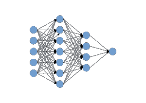
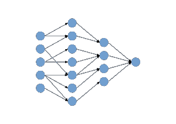
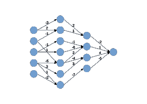
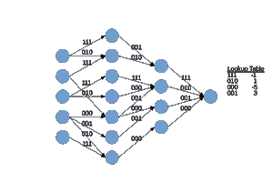

# 深度压缩:推理和效率的优化技术

> 原文：<https://towardsdatascience.com/deep-compression-optimization-techniques-for-inference-efficiency-615252c18f18?source=collection_archive---------24----------------------->

随着技术迎合摩尔定律的物理极限，计算越来越受到散热的限制，而不是在给定的硅面积上可以封装的晶体管数量。现代芯片已经经常闲置其区域的整个部分，形成所谓的[“暗硅”，](https://en.wikipedia.org/wiki/Dark_silicon)指的是在危险地超过热设计限制之前，限制芯片可以长时间通电的比例的设计。因此，对于任何机器学习加速器，包括经过试验的和真正的通用图形处理单元(GPU ),一个重要的度量是设备在大约 250 W 功耗下的训练或推理性能。

正是这种对效率的驱动力促使谷歌开发了他们自己的[张量处理单元(TPU)](https://en.wikipedia.org/wiki/Tensor_processing_unit) ，用于提高模型推理的效率，以及在其数据中心的 v2 单元中的培训。过去几年已经出现了过多的深度学习硬件创业公司，它们寻求生产高能效的深度学习芯片，这些芯片专门从事当前流行的深度学习架构所需的有限混合操作。如果深度学习主要由矩阵乘法和卷积组成，为什么不建造一个芯片来做这些，用通用计算能力换取专用效率？但是这种权衡比看起来要复杂得多。

# 深度学习的能源成本

包括大规模机器学习在内的现代高性能计算的主要动力来源不是计算，而是通信。对 32 位数据执行乘法运算通常需要不到 4 pJ 的，而从 DRAM 中读取相同数量的数据需要大约 640 pJ，这使得片外存储器读取比常用的数学运算符多消耗大约 160 倍的能量。当我们考虑发送超过几厘米的数据时，这种不平衡的功耗变得更糟(导致数据中心用光纤取代中等长度的数据通信线)。突然之间，将你的深度学习推理需求外包到谷歌云平台的 TPUs 上运行，似乎并不像它本来可以做到的那样环保。

几乎不用说，鉴于人工智能和机器学习的创新步伐，在投资 2 年开发周期开发仅限于卷积和矩阵乘法高性能的专用硬件后，无法保证主导架构将保持不变足够长的时间，以充分获得回报。就在过去的几个月里，我们已经看到了有前途的[神经微分方程](https://arxiv.org/abs/1806.07366)网络的演示，它的操作与我们备受尊敬的 conv 网络截然不同，这十年来对深度学习的兴趣增加只能意味着更多的创新和新型模型。任何专门为加速当前一代顶级机型而开发的专用硬件都有迅速过时的风险。

# 深度压缩:受生物启发的效率提升

深度学习卷积神经网络，顾名思义，以其深度和宽度而闻名，其中一些例外的例子是大约有 1000 层的 resnets。在训练结束时，所有这些参数中的所有精度都可能是过度的，只不过是浪费了对电力有着贪婪胃口的计算资源。这是 Nvidia 可变精度张量内核背后的一个主要原因，它支持最新一代[图灵架构 GPU](https://blog.exxactcorp.com/nvidia-announces-new-tesla-t4-on-turing-gpu-architecture/?utm_source=web%20referral&utm_medium=backlink&utm_campaign=towardsdatascience.com&utm_term=deep%20compression)中低至 8 位整数的计算。

因此，用更小的模型(如恰当命名的 [SqueezeNet](https://arxiv.org/abs/1602.07360) )实现最先进的性能是一个活跃的研究领域。经过充分训练的较小模型非常适合在自动驾驶汽车、物联网设备和智能手机中进行移动部署，但当参数搜索量很大时，训练仍然是最有效的。幸运的是，在人类大脑的发展过程中有一种生物模拟。使用突触修剪，随着人们从童年进入成年，人类大脑变得更加有效。正是哺乳动物神经发育的这一特征，激发了一套深度学习模型的压缩技术。

据估计，在儿童早期发育期间，突触的最大数量高达 1000 万亿个，但在突触修剪后，成年人的突触数量减少了约 10 倍，约为 100 万亿个。这不仅降低了组织的代谢需求，而且有助于学习对世界更复杂的结构理解。同样在深度学习中，在 GPU 上的广泛训练出现之前，修剪权重源于一种用于改善模型泛化的[正则化](https://www.sciencedirect.com/science/article/pii/S0925231209000186) [技术](https://www.researchgate.net/publication/220829564_Pruning_and_Regularization_Techniques_for_Feed_Forward_Nets_Applied_on_a_Real_World_Data_Base)。将参数剪枝、参数量化、参数编码结合在一个被称为[深度压缩](https://arxiv.org/abs/1510.00149)的模型压缩优化过程中，获得了宋瀚*等*2016 年 [ICLR 最佳论文奖](https://www.youtube.com/watch?v=kQAhW9gh6aU&feature=youtu.be)。深度压缩不仅使模型尺寸缩小了 35-50 倍，运行速度更快，所需能源更少(非常适合部署在电池供电的应用中)，而且这些模型通常比原始的未压缩模型具有更好的性能。

# 密集-稀疏-密集训练

就像新生儿多变的思维一样，典型的多层感知器架构以神经元之间密集的互连为特征，如下图所示:

训练之后，如果我们要探索定义每个加权连接的参数值，我们会发现两个重要的特征。首先，许多权重值非常接近于零，因此我们应该能够丢弃它们，而不会显著影响网络的整体性能。第二，权重所代表的许多信息实际上是多余的。丢弃几乎无关紧要的权重并在多次迭代中重新训练网络减少了网络学习的冗余，这很像优雅有效的[丢失正则化技术。](https://iamtrask.github.io/2015/07/28/dropout/)在所谓的密集-稀疏-密集训练中反复修剪和重新训练模型可以移除高达 90%的参数[，而不会损失测试精度(PDF)](https://web.stanford.edu/class/ee380/Abstracts/160106-slides.pdf) 。

# 参数量化

参数减少 90%相当不错，但此时仍有充分的机会来优化模型，它可能仍然太小，无法挤入片内 SRAM。在训练过程中，我们通常会使用高精度数据类型，如 64 位浮点数，但在一天结束时，我们通常会发现，无论权重值是正还是负 1e-33，在测试时都不会有太大的差异。通过量化其余参数，我们可以利用 Nvidia 的 INT8 推理精度等功能的效率和加速，并进一步减小模型大小。如果我们正在为自动驾驶汽车或物联网设备部署空中更新，较小的型号相当于为我们的客户和我们自己节省了通信成本和时间，同时避免了常规功能的[设备外云计算](https://blog.exxactcorp.com/cloud-vs-on-premises-which-is-really-better-for-deep-learning/?utm_source=web%20referral&utm_medium=backlink&utm_campaign=towardsdatascience.com&utm_term=deep%20compression)的一些陷阱。

# 霍夫曼编码(额外学分)

在密集-稀疏-密集训练和参数量化后停止已经足以将标志性的 AlexNet 的存储需求减少超过 26 倍，而没有任何明显的性能损失。要实现深度压缩的全部优势，还有一个步骤，那就是重量分担。您应该还记得，在从完全连接到卷积神经网络架构的过程中，我们已经受益于显著的权重共享优势，因为每个卷积内核中的每个权重都作为滑动窗口应用于整个前一层。这将给定模型中的参数总数减少了几个数量级，仅次于可比的密集连接的多层感知器。但是，我们可以通过将 [k 均值聚类](https://en.wikipedia.org/wiki/K-means_clustering)应用于权重群体，使用质心值作为每个组的参数值，并将这些值放在查找表中，来实现进一步的权重共享优势。

在漫画中，这个概念看起来像这样:

# 结论

深度压缩是一种鼓励深度学习模型更智能地工作而不是更困难的方法，并能够提高能效、推理速度和移动部署。此外，在灵活的通用 GPU 上训练大模型，然后压缩它们以进行推理和部署，这结合了深度和广度模型的一些最佳功能，主要是在学习过程中在参数搜索方面撒下一张大网，并能够部署小得多的成品模型以用于设备上部署。设备上的机器学习增强了隐私，并为自动驾驶等[应用的基本功能提供了更高的可靠性。深度压缩等模型优化技术缩小了科技巨头周围的护城河，使其有资源雇佣半导体工程师团队来开发内部机器学习硬件，并减少了对云服务上运行大模型的依赖。](https://blog.exxactcorp.com/reinforcement-learning-from-grid-world-to-self-driving-cars/?utm_source=web%20referral&utm_medium=backlink&utm_campaign=towardsdatascience.com&utm_term=deep%20compression)

*原载于 2019 年 2 月 12 日*[*【blog.exxactcorp.com*](https://blog.exxactcorp.com/deep-compression-optimization-techniques/?utm_source=web%20referral&utm_medium=backlink&utm_campaign=towardsdatascience.com&utm_term=deep%20compression)*。*