# 解释了深层确定性策略梯度

> 原文：<https://towardsdatascience.com/deep-deterministic-policy-gradients-explained-2d94655a9b7b?source=collection_archive---------2----------------------->

## **连续动作空间中的强化学习**

这篇文章是对 Deepmind 的出版物*“深度强化学习的连续控制”* (Lillicrap 等人，2015 年)的**彻底的**回顾，其中提出了深度确定性政策梯度(DDPG)，并且是为希望理解 DDPG 算法的人写的。如果你只对实现感兴趣，你可以跳到本文的最后一节。

> 本文假设读者熟悉基本的强化学习概念、价值&政策学习和行动者评论方法。如果你不完全熟悉这些概念，我还写过关于[政策梯度](https://medium.com/@thechrisyoon/deriving-policy-gradients-and-implementing-reinforce-f887949bd63)和[演员评论方法](/understanding-actor-critic-methods-931b97b6df3f)的文章。
> 
> 熟悉 python 和 PyTorch 对阅读这篇文章也很有帮助。如果您不熟悉 PyTorch，请尝试按照代码片段进行操作，就像它们是伪代码一样。

# 浏览报纸

## 网络示意图

DDPG 使用四种神经网络:Q 网络、确定性策略网络、目标 Q 网络和目标策略网络。

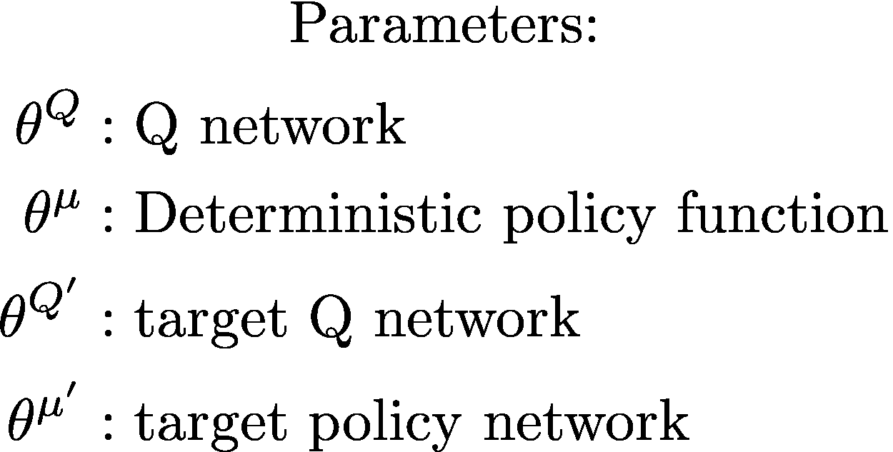

Q 网络和策略网络非常类似于简单的优势行动者-批评家，但是在 DDPG，行动者直接将状态映射到行动(网络的输出直接是输出)，而不是输出跨离散行动空间的概率分布

目标网络是其原始网络的延时副本，缓慢地跟踪已学习的网络。使用这些目标值网络大大提高了学习的稳定性。原因如下:在不使用目标网络的方法中，网络的更新方程依赖于网络本身计算的值，这使得它容易发散。例如:

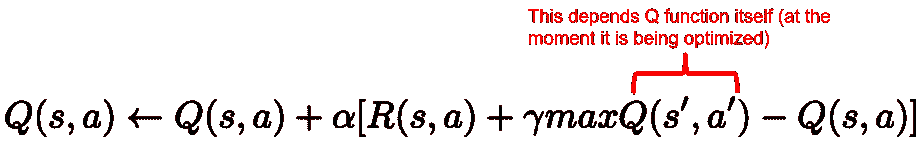

因此，我们有了确定性策略网络和 Q 网络的标准参与者和批评家架构:

我们将网络和目标网络初始化为:

# 学问

这是我们想要实现的算法的伪代码:

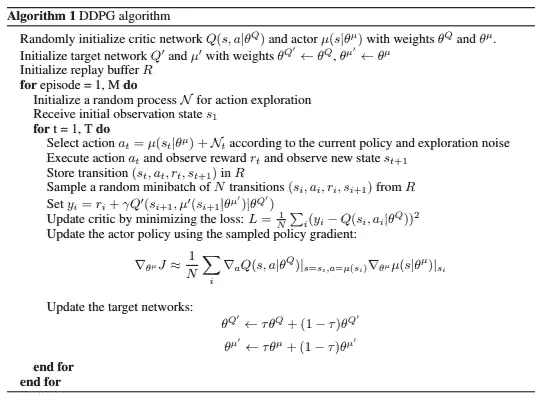

Taken from *“Continuous Control With Deep Reinforcement Learning”* (Lillicrap et al, 2015)

我们将把它分解为:

1.  体验回放
2.  演员和评论家网络更新
3.  目标网络更新
4.  探测

## 重放缓冲器

正如在深度 Q 学习(和许多其他 RL 算法)中使用的那样，DDPG 也使用重放缓冲区对经验进行采样，以更新神经网络参数。在每次轨迹推出期间，我们保存所有的体验元组(状态、动作、奖励、下一个状态)，并将它们存储在一个有限大小的缓存中——一个“重放缓冲区”然后，当我们更新值和策略网络时，我们从重放缓冲器中随机抽取小批量的经验。

以下是重放缓冲区的样子:

我们为什么要用经验回放？在优化任务中，我们希望数据独立分布。当我们以一种基于策略的方式优化一个连续的决策过程时，情况就不是这样了，因为那时的数据不会是相互独立的。当我们将它们存储在重放缓冲区中并随机进行批量训练时，我们克服了这个问题。

## 行动者(政策)和批评家(价值)网络更新

价值网络的更新类似于 Q-learning 中所做的。更新的 Q 值通过贝尔曼方程获得:

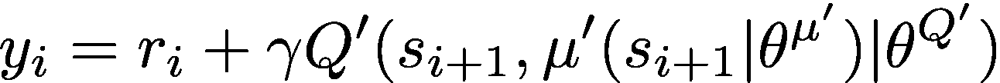

然而，在 DDPG，**下一状态 Q 值是用目标值网络和目标策略网络**计算的。然后，我们将更新后的 Q 值与原始 Q 值之间的均方损耗降至最低:

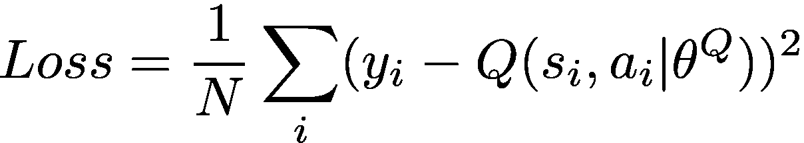

***注意原 Q 值是用价值网计算的，不是目标价值网。**

在代码中，这看起来像:

对于保单功能，我们的目标是最大化预期收益:

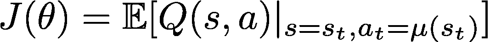

为了计算保单损失，我们取目标函数相对于保单参数的导数。请记住，参与者(策略)函数是可微的，因此我们必须应用链式法则。

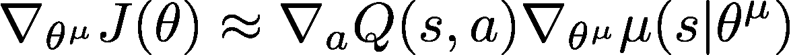

但是，由于我们是通过批量经验以非策略方式更新策略，因此我们采用从小批量计算的梯度总和的平均值:

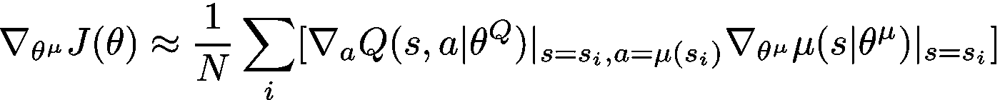

在代码中，这看起来像:

其中优化器使用自适应矩估计(ADAM):

## 目标网络更新

我们复制目标网络参数，并让它们通过“软更新”缓慢跟踪已学习网络的参数，如下所示:

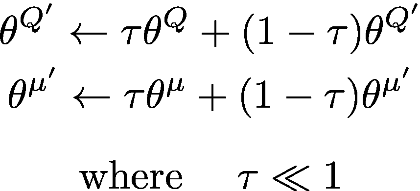

这可以非常简单地实现:

## 探测

在离散动作空间的强化学习中，探索是通过概率性地选择随机动作来完成的(例如ε-贪婪或玻尔兹曼探索)。对于连续动作空间，探索是通过向动作本身添加噪声来完成的(也有参数空间噪声，但我们现在将跳过它)。在 DDPG 的论文中，作者使用*奥恩斯坦-乌伦贝克过程*将噪声添加到动作输出中(乌伦贝克&奥恩斯坦，1930):

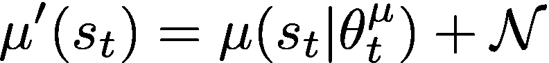

*奥恩斯坦-乌伦贝克过程*产生与先前噪声相关的噪声，以防止噪声抵消或“冻结”整体动态**【1】**。[维基百科对*奥恩斯坦-乌伦贝克过程*提供了详尽的解释。](https://en.wikipedia.org/wiki/Ornstein%E2%80%93Uhlenbeck_process)

下面是 Pong 等人编写的 python 实现:

于是我们把演员网络产生的动作输入到`get_action()`函数中，得到一个新的动作，在这个动作中加入了时间相关噪声。

我们现在都准备好了！

# 把它们放在一起

我们在这里有重放缓冲区，奥恩斯坦-乌伦贝克过程，以及 OpenAI Gym 连续控制环境的规范化动作包装器，在 *utils.py* 中:

以及 *models.py* 中的演员&评论家网络:

以及 *ddpg.py* 中的 DDPG 代理:

以及 *main.py* 中的测试:

我们可以看到 DDPG 代理是否学习到经典倒立摆任务的最优策略:

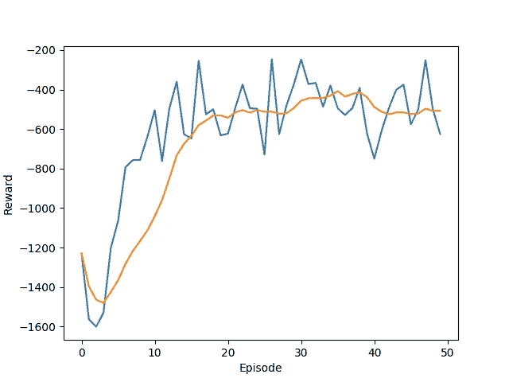

这就是 DDPG！

点击此处查看完整实施:

 [## 基督教 08/强化学习

### 用 Python 和 PyTorch 实现强化学习算法的模块化…

github.com](https://github.com/thechrisyoon08/Reinforcement-Learning) 

# 参考

[Timothy P. Lillicrap，Jonathan J. Hunt，Alexander Pritzel，Nicolas Heess，Tom Erez，Yuval Tassa，David Silver 和金奎大·威斯特拉，*深度强化学习的持续控制*，CoRR abs/1509.02971 (2015)。](https://arxiv.org/abs/1509.02971)

[**【1】**Edouard leu rent 对 Quora post 的回答**“***我们为什么要在 DDPG 的探索中使用奥恩斯坦乌伦贝克过程？”*](https://qr.ae/TW8NAa)