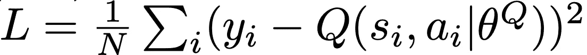

# 索尼 NNabla 的深度确定性策略梯度

> 原文：<https://towardsdatascience.com/deep-deterministic-policy-gradients-with-sonys-nnabla-24357a0a87bb?source=collection_archive---------23----------------------->

你好，我是一名研究深度强化学习的研究生。我之前写过一篇关于用 NNabla 实现 Deep Q-Network 的博文。

[](/deep-q-network-implementation-with-sonys-nnabla-490d945deb8e) [## 利用索尼的 NNabla 实现深度 Q 网络

### NNABLA 是什么？

towardsdatascience.com](/deep-q-network-implementation-with-sonys-nnabla-490d945deb8e) 

在这里，我将通过 NNabla 引入深度确定性策略梯度(DDPG)。完整实现是[这里](https://gist.github.com/takuseno/055e822516f1e12df1f0a0a1811ef2c2)。

# DDPG

DDPG 是一种用于连续控制任务的策略梯度方法。

 [## 具有深度强化学习的连续控制

### 我们将深度 Q 学习成功背后的思想应用于持续行动领域。我们提出一个…

arxiv.org](https://arxiv.org/abs/1509.02971) 

在 DDPG，有两个网络:一个政策网络(行动者)和一个行动价值网络(批评家)。这种算法被称为“行动者-评论家”，因为行动者学习政策函数以最大化累积回报，评论家学习(行动)价值函数以正确预测回报。

让我们用 NNabla 制作这两个神经网络。

```
import nnabla as nn
import nnabla.functions as F
import nnabla.parametric_functions as PFdef q_network(obs_t, action_t):
    with nn.parameter_scope('critic'):
        out = PF.affine(obs_t, 64, name='fc1')
        out = F.tanh(out)
        out = F.concatenate(out, action_t, axis=1)
        out = PF.affine(out, 64, name='fc2')
        out = F.tanh(out)
        out = PF.affine(out, 1, name='fc3')
        return outdef policy_network(obs, action_size):
    with nn.parameter_scope('actor'):
        out = PF.affine(obs, 64, name='fc1')
        out = F.tanh(out)
        out = PF.affine(out, 64, name='fc2')
        out = F.tanh(out)
        out = PF.affine(out, action_size, name='fc3')
        return F.tanh(out)
```

相当简单！NNabla 基于由`nn.parameter_scope()`声明的类似 TensorFlow 的命名空间系统来管理权重和偏差。

# 批评家的流失

用一步时差(TD)误差训练评论家:



from the original paper.

这可以用 NNabla 写成如下形式:

```
# N is a batch size
# state_size is a size of input vectors
# action_size is a size of the policy output
obs_t = nn.Variable((N, state_size))   # observation at t
act_t = nn.Variable((N, action_size))  # take action at t
rew_tp1 = nn.Variable((N, 1))          # reward value at t+1
obs_tp1 = nn.Variable((N, state_size)) # observation at t+1
ter_tp1 = nn.Variable((N, 1))          # 1.0 if terminal statewith nn.parameter_scope('trainable'):
    q_t = q_function(obs_t, act_t)with nn.parameter_scope('target'):
    act_tp1 = policy_function(obs_tp1, action_size)
    q_tp1 = q_function(obs_tp1, act_tp1)y = rew_tp1 + gamma * q_tp1 * (1.0 - ter_tp1)
critic_loss = F.mean(F.squared_error(q_t, y))
```

上面的代码构造了计算 TD 误差平方的计算图。

# 演员的损失

相比之下，地面实况操作不是直接可用的。因此，演员被训练来最大化评论家的价值估计。策略网络的梯度计算如下。


from the original paper

这个梯度计算也可以写成 NNabla。

```
with nn.parameter_scope('trainable'):
    policy_t = policy_function(obs_t, action_size)
    q_t_with_actor = q_function(obs_t, policy_t)actor_loss = -F.mean(q_t_with_actor) # gradient ascent
```

`-`有必要更新行动者以最大化价值估计。最终，行动者被引导到在行动-价值函数中获得的高价值空间。

# 目标更新

与 DQN 不同，DDPG 的目标更新是逐步将目标功能与最新参数同步。

```
with nn.parameter_scope('trainable'):
    trainable_params = nn.get_parameters()with nn.parameter_scope('target'):
    target_params = nn.get_parameters()update_ops = []
for key, src in trainable_params.items():
    dst = target_params[key]
    update_ops.append(F.assign(dst, (1.0 - tau) * dst + tau * src)))
target_update = F.sink(*update_ops)
```

`F.assign`和`tf.assign`差不多。`F.sink`是同时运行所有输入的终端节点。

# 放在一起

# 结论

我介绍了索尼深度学习框架 NNabla 的 DDPG 实现。如果你用 GPU 尝试这个实现，你会发现它的训练速度很快。

如果您需要更多关于 NNabla 的信息，请访问[此处](https://nnabla.org/)。