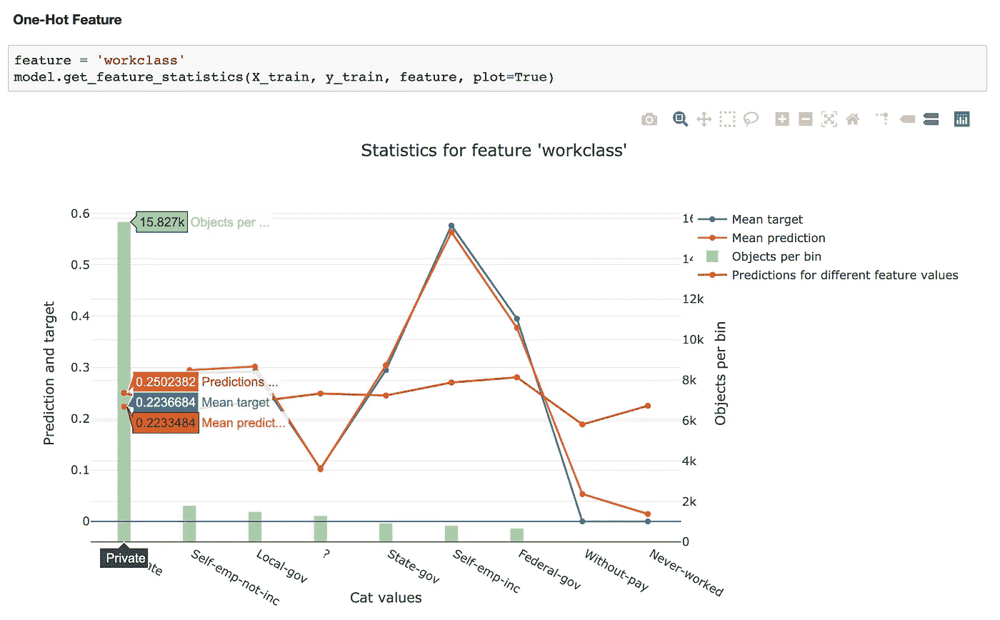

# 深入研究用于模型解释的 Catboost 功能

> 原文：<https://towardsdatascience.com/deep-dive-into-catboost-functionalities-for-model-interpretation-7cdef669aeed?source=collection_archive---------2----------------------->

## 我们真的了解我们构建的 ML 模型内部发生了什么吗？我们来探索一下。


在我之前的博客中，我们看到了 XGBoost 和 LightGBM 的对比研究。通过分析，我们可以得出结论，catboost 在速度和准确性方面都优于其他两个。在这一部分中，我们将深入研究 catboost，探索 catboost 为高效建模和理解超参数提供的新特性。

对于新读者， [catboost](https://catboost.ai/) 是 [Yandex](https://en.wikipedia.org/wiki/Yandex) 团队在 2017 年开发的开源梯度提升算法。这是一种机器学习算法，允许用户快速处理大型数据集的分类特征，这与 XGBoost & LightGBM 不同。Catboost 可以用来解决**回归、分类、排序问题**。

作为数据科学家，我们可以轻松地训练模型并做出预测，但是，我们经常无法理解那些花哨的算法内部发生了什么。这也是为什么我们看到离线评测和最终生产的模型性能存在巨大差异的原因之一。我们早就应该停止将 ML 作为一个**【黑箱】**来对待，并在提高模型准确性的同时重视模型解释。这也将帮助我们识别数据偏差。在本部分中，我们将了解 catboost 如何通过以下功能帮助我们分析模型并提高可见性:


# 特征重要性

**为什么要知道？** 

除了选择要素重要性的类型之外，我们还应该知道要使用哪些数据来确定要素的重要性——训练、测试或完整数据集。选择一个比另一个有利也有弊，但是最终，您需要决定您是否想要知道模型在多大程度上依赖每个特征来进行预测(**使用训练数据**)或者该特征在多大程度上有助于模型在看不见的数据上的性能(**使用测试数据**)。我们将在本博客的后面看到，只有一些方法可以用来发现不用于训练模型的数据的特征重要性。

如果你关心第二个，并假设你有所有的时间和资源，找到特性重要性的最粗略和最可靠的方法是训练多个模型，一次留下一个特性，并在测试集上比较性能。如果性能相对于基线(当我们使用所有特性时的性能)变化很大，这意味着该特性很重要**。**但是由于我们生活在一个需要优化准确性和计算时间的现实世界中，这种方法是不必要的。以下是 catboost 让您找到模型最佳功能的几种智能方法:

## **预测值变化**

对于每个要素，PredictionValuesChange 显示了当要素值发生变化时，预测的平均变化量。重要性的值越大，如果该特征被改变，则预测值的平均改变越大。

> 优点:计算成本很低，因为你不必进行多次训练或测试，也不用存储任何额外的信息。您将得到作为输出的**标准化值**(所有的重要性加起来为 100)。
> **缺点:**它可能会给排名目标带来误导性的结果，它可能会将 groupwise 功能放在顶部，即使它们对最终的损失值有一点影响。

## **LossFunctionChange**

为了获得该特征的重要性，catboost 简单地采用在正常情况下(当我们包括该特征时)使用模型获得的度量(损失函数)和没有该特征的模型(该模型近似地使用原始模型构建，该特征从集合中的所有树中移除)之间的差异。差异越大，该特征越重要。catboost 文档中没有明确提到我们如何找到没有特征的模型。

> **优点&缺点:**这适用于大多数类型的问题，不像`*predictionvalueschange*`那样，在排序问题时会得到误导性的结果，同时，它的计算量很大。

## 形状值


[https://github.com/slundberg/shap](https://github.com/slundberg/shap)

[**SHAP**](https://github.com/slundberg/shap)**值将预测值分解成每个特征的贡献。与基线预测(训练数据集的目标值的平均值)相比，它测量特征对单个预测值的影响。**

**shap 值的两个主要用例:**

1.  ****特征的对象级贡献****

****

**[https://github.com/slundberg/shap](https://github.com/slundberg/shap)**

****2。整个数据集的摘要(整体特征重要性)****

```
shap.summary_plot(shap_values, X_test)
```

****

**虽然我们可以通过 shap 获得准确的特征重要性，但它们在计算上比 catboost 内置的特征重要性更昂贵。关于 SHAP 值的更多细节，请阅读这个[内核](https://www.kaggle.com/dansbecker/shap-values)。**

****加成**
另一个基于相同概念但不同实现的特征重要性是——[**基于排列的特征重要性**](https://christophm.github.io/interpretable-ml-book/feature-importance.html) **。**尽管 catboost 不使用这个，但这纯粹是**与模型无关的**并且易于计算。**

## **我们如何选择一个呢？**

**虽然`PredictionValuesChange` & `LossFunctionChange` 都可用于所有类型的指标，但建议使用`LossFunctionChange`对指标进行排名。除了`PredictionValuesChange`之外，其他所有方法都可以使用测试数据，使用在训练数据上训练的模型来发现特征重要性。**

**为了更好地理解差异，下面是我们讨论的所有方法的结果:**

********

**Results of catboost feature imp. to predict if people will report over $50k of income from the classic [“adult” census dataset](https://archive.ics.uci.edu/ml/datasets/adult) (using log-loss)**

********

**从上面的图中，我们可以看到大多数方法在顶部特性上是一致的。看起来`LossFunctionChange`最接近 shap(更可靠)。然而，直接比较这些方法是不公平的，因为`predictionvalueschange`是基于列车数据，而所有其他方法都是基于测试数据。**

**我们还应该看到运行所有这些应用程序所需的时间:**

****

## **互动**

**使用此参数，可以找到一对特征的强度(两个特征加在一起的重要性)。**

****

**在输出中，您将获得每对要素的列表。该列表将有 3 个值，第一个值是该对中第一个要素的索引，第二个值是该对中第二个要素的索引，第三个值是该对的要素重要性分数。有关实现细节，请查看嵌入式笔记本。**

****

**有趣的是，单个特征重要性中的前两个特征不一定是最强的一对。**

## **笔记本**

**[笔记本中使用的数据集](https://archive.ics.uci.edu/ml/datasets/adult)**

# **对象重要性**

## **你为什么要知道？**

*   **从训练数据中移除最无用的训练对象**
*   **根据哪些对象被认为是最“有帮助”的，对一批新对象进行优先排序，类似于主动学习**

**利用这个功能，您可以计算每个对象对测试数据的优化指标的影响。正值反映优化指标增加，负值反映优化指标减少。这个方法是在[这篇文章](http://This mode is an implementation of the approach described in the Finding Influential Training Samples for Gradient Boosted Decision Trees paper)中描述的方法的一个实现。这些算法的细节超出了本博客的范围。**

## **对象重要性的 Catboost 教程**

**[](https://github.com/catboost/tutorials/blob/master/model_analysis/object_importance_tutorial.ipynb) [## catboost/教程

### CatBoost 教程存储库。在 GitHub 上创建一个帐户，为 catboost/教程开发做贡献。

github.com](https://github.com/catboost/tutorials/blob/master/model_analysis/object_importance_tutorial.ipynb) 

`cb.get_object_importance`中有三种类型的`update_method`:

*   单点:最快和最不精确的方法
*   TopKLeaves:指定叶子的数量。该值越高，计算越精确，速度越慢
*   AllPoints:最慢也是最准确的方法

例如，以下值将方法设置为 TopKLeaves，并将叶子数限制为 3:

```
TopKLeaves:top=3
```

# 模型分析图

Catboost 最近在其最新更新**中推出了这一功能。**有了这个功能，我们将能够直观地看到算法如何分割每个特征的数据，并查看特定于特征的统计数据。更具体地说，我们将能够看到:

*   每个条柱(条柱用于连续要素)或类别(当前仅支持 OHE 要素)的平均目标值
*   每个箱/类别的平均预测值
*   每个箱中的对象数量
*   不同特征值的预测:对于每个对象，特征值是变化的，以使其落入某个箱中。然后，该模型根据该特征的新值来预测目标，并在一个箱(由红点给出)中取预测的平均值。

> 该图将为我们提供信息，如我们的分割有多均匀(我们不希望所有对象都在一个容器中)，我们的预测是否接近目标(蓝色和橙色线)，红线将告诉我们我们的预测对某个特征有多敏感。

## 数字特征分析


## 一键编码特征分析



感谢您阅读本文。希望下次您能够利用这些工具来更好地理解您的模型。

在机器学习社区对我之前关于[CatBoost vs . Light GBM vs . XGBoost](/catboost-vs-light-gbm-vs-xgboost-5f93620723db)的博客做出积极回应后，CatBoost 团队联系我，看我是否有兴趣报道关于该库的更深入的主题。感谢 CatBoost 团队帮助回答我的问题！

**关于我:**我目前是优步地图团队的一名数据科学家。如果你有兴趣在优步解决具有挑战性的问题，请通过 [LinkedIn](http://www.linkedin.com/in/alvira-swalin) 联系我。你可以在这里阅读我的其他博客。

# 参考

*   [Catboost 文档](https://tech.yandex.com/catboost/doc/dg/concepts/about-docpage/)
*   [SHAP 价值观](https://github.com/slundberg/shap)
*   [Catboost 官网](https://catboost.ai/)
*   [CatBoost 纸](https://arxiv.org/abs/1706.09516)
*   [笔记本](https://gist.github.com/aswalin/595ac73f91c6268f9ca449a4ee05dee1)
*   [关于寻找有影响力的训练样本的论文](https://arxiv.org/pdf/1802.06640.pdf)
*   [Catboost 教程](https://github.com/catboost/tutorials/tree/master/model_analysis)**