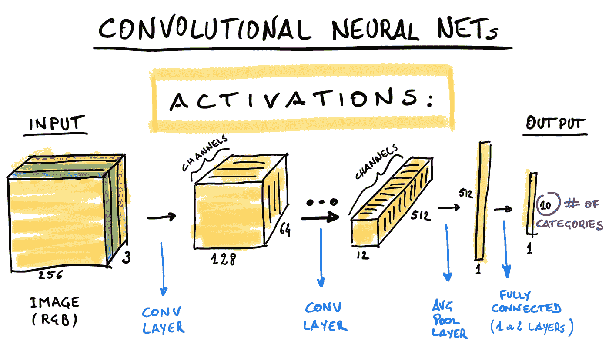

# 深入了解卷积网络

> 原文：<https://towardsdatascience.com/deep-dive-into-convolutional-networks-48db75969fdf?source=collection_archive---------10----------------------->

Visualization from [http://terencebroad.com/convnetvis/vis.html](http://terencebroad.com/convnetvis/vis.html)

## 从积木到最先进的架构，触及可解释性和偏见。

By the end of this post you will understand this diagram. Image courtesy of [FloydHub](https://blog.floydhub.com/building-your-first-convnet/).

# 介绍

卷积网络(ConvNets)是一类高效的神经网络，在感知任务(如对象识别)中实现了令人印象深刻的性能。他们的建筑是由视觉皮层松散地启发而来的[。2012 年](https://www.deeplearningbook.org/contents/convnets.html#pf21) [AlexNet](https://en.wikipedia.org/wiki/AlexNet) ，一种 ConvNet，以较大优势赢得了 ILSVRC 2012 竞赛，引发了对深度学习的巨大兴趣，这种兴趣一直持续到今天。2019 年，对象检测的最先进架构是 ResNet，这是一种 ConvNet。

在本文中，我假设对标准的全连接神经网络(或多层感知器，MLP)有所了解。在概述了 ConvNets 激活之后，我将深入了解卷积的概念和其他构建模块(池化、批处理规范化、1x1 过滤器等)。接下来，我将简要说明一些实现最先进结果的高级架构(Inception、ResNet)。在最后部分，我将触及*可解释性*和*偏见*的话题。每个部分都包含一个参考文献和链接列表，以供进一步研究。一些概念通常适用于深度神经网络，但我将在 ConvNets 的上下文中说明它们。

如果您是 ConvNets 的新手，需要花一些时间来消化这些材料，慢慢来，阅读许多资料。你可以用这篇文章作为围绕 ConvNets 的想法的快速参考。如果您发现任何错误，或者如果您认为我错过了其他主题，请在评论部分告诉我。

## 目录

*   [一个 ConvNets 的概述](https://medium.com/p/48db75969fdf#28b3)
*   [卷积步骤](https://medium.com/p/48db75969fdf#53d2)
*   [感受野](https://medium.com/p/48db75969fdf#90eb)
*   [参数数量](https://medium.com/p/48db75969fdf#5738)
*   [小批量](https://medium.com/p/48db75969fdf#a105)
*   [批量正常化](https://medium.com/p/48db75969fdf#a07c)
*   [其他标准化](https://medium.com/p/48db75969fdf#fbde)
*   [联营](https://medium.com/p/48db75969fdf#db48)
*   [1x1 卷积](https://medium.com/p/48db75969fdf#d8f9)
*   [盗梦空间](https://medium.com/p/48db75969fdf#9916)
*   [ResNet](https://medium.com/p/48db75969fdf#5055)
*   [可解释性](https://medium.com/p/48db75969fdf#d7d7)
*   [偏向](https://medium.com/p/48db75969fdf#006f)
*   [参考文献](https://medium.com/dataseries/deep-dive-into-convolutional-networks-48db75969fdf#11b2)

# 一个网络的概述

卷积神经网络(ConvNets)是一类专门用于图像处理的神经网络。与其他神经网络一样，它们通过许多层将输入转换为输出。在 **ConvNets** 中，层有一个**卷积步骤**，一个**汇集步骤**(可选)和一个**非线性激活**。神经网络中的每一层通过线性和非线性运算将输入张量转换为输出张量。所有这些中间张量(包括网络输入和输出)被称为**激活**，它们都是输入的不同*表示*。

**Figure 1.** Activation tensors in a convolutional neural net.

当我们从输入到输出时，我喜欢通过可视化激活的形状来开始说明 ConvNets(参见**图 1** )。每一层都通过线性和非线性操作来转换激活(我们将在下一节的[中看到细节)。当我们穿过这些层时，激活的空间维度会缩小，而深度会增加。ConvNet 的最后一部分将 3D 激活转换为 1D，通常通过平均池化(参见](https://medium.com/p/48db75969fdf#53d2)[池化部分](https://medium.com/p/48db75969fdf#db48))。最后，1 或 2 个完全连接的层将激活投射到最终分类的输出空间。在这篇文章中，我用分类作为最终任务的例子。一些架构通过直接生成长度与类别数量匹配的 1D 激活来避免最终的密集层。

激活的流程显示了输入是如何在一个越来越“丰富”的特征空间(增加的深度)中表示的，同时牺牲了空间信息(降低的高度/宽度)。最后完全连接的层放弃任何空间信息，以实现最终的分类任务。当我们经过各层时，特征不仅在数量上(深度大小)增加，而且复杂性也增加，是前一层特征的组合。换句话说，网络构建输入的*层次表示*:第一层根据基本特征(如边)表示输入，第二层根据更复杂的特征(如角等)表示输入。更深的一层可以识别抽象的特征，如眼睛甚至人脸。引人注目的是，ConvNet 将在训练过程中自主学习这一特征层次。

在训练过程中，网络将学习一种有利于解决指定任务的表示法。对于像 ImageNet(数百万张图像，分为 1000 个类别)这样的大型和多样化的数据集，学习到的表示将足够通用，可用于许多其他视觉感知任务，即使是在不同或非常特定的领域。这是[迁移学习](https://en.wikipedia.org/wiki/Transfer_learning)的基础:在大数据集上训练一次模型，然后在新的特定领域(可能很小)数据集上微调模型。这允许快速调整预先训练的网络，以快速和高精度地解决新问题。

# 卷积步骤

现在让我们放大到一个*卷积层*。请记住，我们在神经网络中所说的卷积与信号处理中的经典 2D 卷积有点不同。虽然广义的想法是相似的，但在数学上并不相同。

***Figure 1.1*** *Convolution of a 5x5 input (blue) with 3x3 kernel (grey) with a stride of 2 and padding of 1\. The 3x3 output is in green (*[*source*](https://github.com/vdumoulin/conv_arithmetic)*).*

经典卷积和深度学习卷积都是通过对输入数组应用核来计算输出的。每个输出像素是输入和内核之间的逐元素乘积之和(*点积*)。通过在输入上移动核，我们获得不同的输出像素。我们每步移动的像素数(1 或更多)称为**步幅。**

一个基本的区别是输入和输出张量的形状:在神经网络中，我们有额外的维度。

如果你不熟悉 2D 卷积，看看这个[伟大的互动演示](http://setosa.io/ev/image-kernels/)获得一些直觉。

*   [http://setosa.io/ev/image-kernels/](http://setosa.io/ev/image-kernels/)

**Figure 2.** A single convolution layer. The convolution output is a tensor with increased depth. Each spatial position in the output (yellow “rod”, middle) depends on a portion of the input (the “receptive field”, left) and on a bank of filters (kernels).

## 与经典 2D 卷积的区别

在 2D 卷积网中，卷积具有以下性质:

1.  *输入*和*输出*激活(也叫**特征图** ) 是 3D 数组(*高度、宽度、深度*)。第一层输入深度为 3 (RGB)。我们越深入地层，深度就越大。注意，当考虑小批量时，输入实际上是 4D。
2.  和*输入*和*输出*一样，**内核**也是 3D 的。空间大小通常为 3x3、5x5 或 7x7，深度等于*输入深度*。内核也被称为**过滤器**。
3.  每层有*多个内核* 称为一个**滤波器组。**内核的数量决定了输出的*深度(通常大于输入深度)。*
4.  与经典卷积不同，在 ConvNets 中，我们在单个步骤中计算多个卷积(一个卷积对应一层中的一个内核)。
5.  与经典卷积不同，在乘法之前，核不沿空间维度翻转(这使得卷积不可交换，但该属性与神经网络无关)。

## 感受野

*感受域*是对输出像素有贡献的输入的 3D 区域(见图 2 中的黄色立方体)。注意，一个输出像素有许多“值”，每个内核一个(图 2 中的 64)。通过排列对应于不同感受野的所有输出向量，我们获得了完整的 3D 激活。

通常，两个相邻输出位置的感受野会部分重叠。只有当步幅等于内核大小时，才没有重叠。

## 参数数量

层中的所有核(图 2 中的 64)可以排列成单个 4-D 形状张量

> (#内核，内核大小，内核大小，输入深度)

这些参数包括核中的所有权重加上 1D 偏移向量。

**偏差**为*每个内核*引入了一个额外的参数。像核一样，每个空间位置的偏差都是相同的，因此偏差参数与核的数量(或输出深度)一样多。

将偏差和权重放在一起，层中的总参数总计为:

> (#内核数 x 内核大小 x 内核大小 x 输入深度)
> 
> + #内核

## 小批量

实际上，图 1 的激活不是针对单个图像计算的，而是针对小批量计算的。在这种情况下，所有激活都将有一个大小为 *batch_size* 的额外维度。必须考虑批量大小，因为它直接影响训练和评估模型所需的 RAM。通常，我们使用 GPU RAM 中能够容纳的最大批量。

# 批量标准化

批处理规范化(BatchNorm)是近年来深度学习领域最重要的进展之一。BatchNorm 可以在几乎任何神经网络架构上加速和稳定训练，包括 ConvNets。

**Figure 3\.** The batch normalization algorithm from the original paper. Before entering the ReLU, each batch is normalized with zero mean and unit standard deviation. Then, each activation is scaled and shifted using two parameters (gamma and beta). This last addition turns out to be the critical step making BatchNorm so effective. The scale-shift transform allows the optimization to directly control the scale of each activation through one parameter (gamma). Without it, a change of scale can only be achieved with a coordinated change in multiple weights that contribute to the activation.

奇怪的是，最初的 BatchNorm 作者将性能的提高归因于“*内部协方差偏移*的减少。但最近发现，BatchNorm 反而平滑了优化前景，允许更大的学习率快速收敛到更准确的解决方案。只是提醒一下，理论，即使是令人信服的或“直觉的”，也必须经过经验验证。

*   “批量标准化:通过减少内部协变量转移加速深度网络训练”，Sergey Ioffe，Christian Szegedy，[arXiv:1502.03167](https://arxiv.org/abs/1502.03167)(**2015**)
*   [《批量归一化](https://www.deeplearningbook.org/contents/optimization.html#pf2b)》，I. Goodfellow，J. Bengio，a .库维尔，**深度学习书** Ch 8.7.1 ( **2016** )
*   "批处理规范化如何帮助优化？"、桑图尔卡*等人*[arXiv:1805.11604](https://arxiv.org/abs/1805.11604)(**2018**)

## 其他标准化

BatchNorm 无疑是深度学习中最流行的规范化方法，但不是唯一的。这一领域的研究非常活跃，在不久的将来我们可能会看到新的进展。问题是双重的。一方面，BachNorm 难以应用于递归网络，因为它依赖于小批量均值和标准差。另一方面，BatchNorm 的效果是相当偶然的，对 BatchNorm 如何帮助优化的更多研究可以带来更好的规范化方法。

为了简洁起见，我将只提到一种替代的归一化方案:**权重归一化。**在该方案中，我们对权重进行归一化，而不是对激活进行归一化。特别地，我们将每个核(对单次激活有贡献的所有权重)归一化为具有单位范数。然后，为了保持模型的表现力，我们还为每个激活添加了一个比例参数。原则上，这应该有助于以类似于 BatchNorm 的方式进行训练，通过提供一个单一的直接“旋钮”来改变每个激活，从而提供一个通向最小值的“更容易”(即更平滑)的路径。

**Figure 4.** Different approaches to normalize of activations in a mini-batch. ([source](https://mlexplained.com/2018/11/30/an-overview-of-normalization-methods-in-deep-learning/))

已经提出了许多其他的归一化方法，每种方法都有其利弊。要获得出色的概述，请参见 Keita Kurita 的“[深度学习中的规范化方法概述](https://mlexplained.com/2018/11/30/an-overview-of-normalization-methods-in-deep-learning/)”。

*   “权重归一化:加速深度神经网络训练的简单重新参数化”，Tim Salimans，Diederik P. Kingma，[arXiv:1602.07868](https://arxiv.org/abs/1602.07868)(**2016**)
*   [深度学习中归一化方法概述，](https://mlexplained.com/2018/11/30/an-overview-of-normalization-methods-in-deep-learning/) Keita Kurita，(2018 年 11 月 30 日**)**

# **联营**

****

****Figure 5\.** Example of a max-pooling block.**

**卷积块之后通常是汇集块，以减少激活空间维度。池有助于减少更深层的内存消耗。这也是将空间信息转化为特征的重要步骤。根据伊恩·戈德费罗*等人*的**深度学习书籍****

> **池化有助于使表示对于输入的小平移近似不变。**

**有不同的汇集策略。最常见的是**最大轮询**和**平均池**。在所有情况下，池化将输入“块”(感受野)减少为 1×1 输出块，同时保持深度不变。通过选择最大输入激活(max-pooling)或取平均值(average-pooling)来实现减少。与卷积类似，汇集块将感受野映射到输出中的单个“像素”。出于这个原因，我们可以定义一个轮询空间大小(2x2、3x3 等。)和大步走。通常，步幅被选择为具有不重叠的感受野，以实现空间尺寸的减小。通常，最后的汇集层是整个空间激活的平均值(*全局平均汇集*或**间隙)**，导致 1x1 输出激活(图 1 中大小为 512 的 1D 激活)。与卷积不同，池化没有任何参数，输出要素(深度)的数量始终与输入相同。**

**具有“可学习结构”的池层已被提出，但迄今为止受欢迎程度有限([贾等人 2012](https://doi.org/10.1109/CVPR.2012.6248076) )。**

*   **网络中的网络，，，水城颜，[arXiv:1312.4400](https://arxiv.org/abs/1312.4400)(**2013**)**
*   **"[Ch 9.3:Pooling](https://www.deeplearningbook.org/contents/convnets.html#pfa)" I . good fellow，J. Bengio，a .库维尔，**深度学习书**[Ch 9.3](https://www.deeplearningbook.org/contents/convnets.html#pfa)(**2016**)**
*   **“超越空间金字塔:融合图像特征的感受野学习”，贾，黄畅，Trevor Darrell doi:[10.1109/cvpr . 2012.6248076](https://doi.org/10.1109/CVPR.2012.6248076)(**2012**)**

# **1x1 卷积**

**一些架构使用 1x1 滤波器。在这种情况下，过滤器映射形状的输入**

> **(数量 _ 过滤器 _i，高度 _i，宽度 _i)**

**到形状的输出:**

> **(数量 _ 过滤器 _o，高度 _i，宽度 _i)**

**注意**只有特征的数量发生变化**，而高度和宽度保持不变。在这种情况下，每个输出像素是仅依赖于一个输入像素的 *num_filters_o* 特征的向量(大小为 *num_filters_i* 的向量)。每个输出特征是同一像素的输入特征的(不同)线性组合，该像素是大小为 1x1 的感受野。**

**1x1 滤波器用于减少输出要素的数量，从而在保持空间维度不变的同时降低计算成本。例如, **inception network** 使用 1x1 过滤器来减少功能并创建“瓶颈”,从而使架构在计算上更加经济实惠。然而，如果瓶颈太紧，可能会损害网络性能。**

**当卷积核的大小大于 1×1 时，
每个输出特征仍然是感受野中所有输入特征
的线性组合，在这种情况下是> 1 像素宽。**

**在林等人*的[原始论文](https://arxiv.org/abs/1312.4400)中，1x1 卷积被称为网络*中的*网络*原始论文将其描述为 1x1 输入和输出特性之间的“迷你”全连接层。请注意，使用相同的权重将相同的全连接层应用于每个空间位置。**

*   **网络中的网络，，，水城颜，[arXiv:1312.4400](https://arxiv.org/abs/1312.4400)(**2013****

# **开始**

**ILSVRC 2014 获奖者是 Szgedy *等人*的 GoogLeNet 架构。其中介绍了下面所示的**初始模块**。**

****

****Figure 6.** Inception module, the building block of the GoogLeNet architecture.**

**在卷积网络中，一个重要的选择是卷积核的空间大小。第一层的大小通常为 7x7，后面所有层的大小通常为 3x3。初始模块并行执行许多卷积，而不是为卷积选择一个大小。图 5 显示了在 inception v1 论文中提出的 inception 块。对同一输入执行大小为 1x1、3x3 和 5x5 的卷积(*蓝色块*)以及最大池(*红色块*)。额外的 1x1 卷积(*黄色块*)减少了深度大小，从而大大降低了内存需求。这些平行路径产生输出张量(具有相同的空间大小),这些输出张量沿着深度被连接起来以形成层输出。**

**自第一篇论文以来，已经提出了对 *inception* 架构的许多更新，包括 inception v2、v3、v4 和 *inception-resnet* 。后者结合了多重卷积和跳跃连接的初始思想(参见[下一节](https://medium.com/p/48db75969fdf#5055))。**

*   **“用卷积更深入”，C. Szegedy 等人(**2014**)[arXiv:1409.4842](https://arxiv.org/abs/1409.4842)**
*   **《Inception-v4、Inception-ResNet 以及剩余连接对学习的影响》，克里斯蒂安·塞格迪、谢尔盖·约菲、文森特·范霍克、亚历克斯·阿莱米，(**2016**)[arXiv:1602.07261](https://arxiv.org/abs/1602.07261)**
*   **[盗梦空间网络](/a-simple-guide-to-the-versions-of-the-inception-network-7fc52b863202)版本的简单指南，Bharath Raj(2018 年 5 月**)****

# ****雷斯内特****

****多层神经网络中的一个已知问题是消失梯度。本质上，在反向传播期间，导数乘以前一层的导数。所以，当我们到达第一层的时候，梯度会变得非常小或者爆炸(溢出)。这种效应使得很难训练深度神经网络，包括神经网络。为了解决这个问题，何*等人*引入了“跳过连接”这一构成 ResNet 架构的构建模块。****

********

******Figure 7\.** Illustration of the skip-connection, the building block of the ResNet architecture. ([source](https://arxiv.org/abs/1512.03385))****

****在 ResNet 中，一层的输出不仅被馈送到下一层，而且被馈送到前面两层的输入。输入被添加到层输出，然后被馈送到下一层。****

****自从赢得 ILSVRC 2015 竞赛以来，ResNet 仍然是最先进的 ConvNet 架构。预训练的 ResNet34 或 ResNet50 是[迁移学习](https://en.wikipedia.org/wiki/Transfer_learning)中事实上的标准，用于实现从医学成像到泰迪熊探测器的专业应用。****

*   ****《深度残差学习用于图像识别》，，，，，任，，(**2015**)[arXiv:1512.03385](https://arxiv.org/abs/1512.03385)****
*   ****“[ResNet 及其变种](/an-overview-of-resnet-and-its-variants-5281e2f56035)概述”，Vincent Fung ( **2017** )****

# ****可解释性****

> ****为了建立对智能系统的信任，并将其有意义地融入我们的日常生活，很明显，我们必须建立“透明”的模型，解释它们为什么预测它们所预测的东西。****

*****来自****Grad-CAM****[*arXiv:1610.02391*](https://arxiv.org/abs/1610.02391)*。******

*****众所周知，理解神经网络如何做出决定是一项艰巨的任务。解释神经网络的结果不仅是重要的科学努力，也是许多应用所需要的。神经网络可解释性是一个活跃的研究课题，涉及多种网络可视化技术。*****

*****概括地说，有两种广义的可解释性技术。一个称为**属性**，旨在找到输入图像中用于做出决定的区域。第二种称为**特征可视化**，旨在可视化输入图像中的哪些特征激活了特定的神经元或神经元群。*****

**********

*******Figure 8.** Two approaches in interpreting ConvNets: feature visualization and attribution. Source [Olah et al. 2017.](https://doi.org/10.23915/distill.00007)*****

*****在一些架构上，**属性**可以通过将隐藏层中的空间激活与输入图像叠加并绘制所谓的*显著性图*来完成(图 8，右图)。显著图具有与上一次 3D 激活相同的空间分辨率，这是低的，但通常是足够的。适用于任何架构的这种方法的扩展是 Grad-CAM，其中显著图是最后空间激活(具有 3D 形状的最后激活)的加权平均值。这个加权平均值中的权重是从关于每次激活的损失函数的梯度计算的。Grad-CAM 可以应用于任何网络，甚至非分类任务。*****

**********

*******Figure 9.** Feature visualization. The top row shows the “optimization objective”: single neuron, channel, layer, a class before soft-max, a class after soft-max. The bottom row shows an input image resulting from optimizing the corresponding objective. Source [Olah et al. 2017.](https://doi.org/10.23915/distill.00007)*****

*****对于**特征可视化**，我们可以在每一层中绘制内核权重。每个内核显示在层输入中检测到的模式。在这种情况下，解释在第一层比较容易，但在更深的层变得更加困难。另一种简单的方法是绘制给定输入的激活。*****

*****生成(通过优化)输入图像以最大限度地激活神经元、通道、层或类的更细致的方法(图 9)。这允许构建“特征”的地图集，其可视地表示网络在每一层中响应什么。这种方法的缺点是生成的图像缺乏多样性，可能无法代表网络所响应的全部空间特征。关于进一步的信息，Distill.pub 发表的论文既有深刻的见解，又有令人惊叹的图表。*****

*   *****" Grad-CAM "，R. R. Selvaraju，M. Cogswell，A. Das，R. Vedantam，D. Parikh，D. Batra ( **2016** )， [arXiv:1610.02391](https://arxiv.org/abs/1610.02391)*****
*   *****[“理解 CNN](http://cs231n.github.io/understanding-cnn/) ”，安德烈·卡帕西，CS231n 课程*****
*   ******"* 特征可视化 *"* ，克里斯奥拉，亚历山大莫尔德温采夫，路德维希舒伯特( **2017** )，**distilt . pub**，[doi:10.23915/distilt . 00007](http://doi.org/10.23915/distill.00007)*****
*   *****《用激活图谱探索神经网络》，Shan Carte，Zan Armstrong，Ludwig Schubert，Ian Johnson，Chris Olah ( **2018** )，**distilt . pub**，[doi:10.23915/distilt . 00015](https://doi.org/10.23915/distill.00015)*****

# *****偏见*****

**********

*******Figure 10.** Bias in state-of-the-art face-recognition systems [(source)](https://www.fast.ai/2019/01/29/five-scary-things/).*****

*****如果不提到偏倚问题，对 ConvNets 的讨论是不完整的。机器学习中的偏差来自数据集和/或算法中的偏差，这反过来反映了创建系统的人的偏差。虽然偏见是机器学习中的一个严重问题，但 ConvNets 应用程序提供了一些突出的例子，说明它如何影响人们的生活。*****

*****请记住，网络将“学习”对解决任务有用的表示。例如，如果我们的目标是识别人脸，理想的数据集应该尽可能多样化，以便以平衡的方式表示所有的种族、年龄和性别组。实际上，大多数流行的数据集都过度代表了白人男性。正如研究员 Joy Buolamwini 发现的那样，这导致了当前商业人脸识别系统的严重偏见。在这些系统中，有色人种女性的面部识别准确率比男性低*个数量级*(图 4)。例如，这些系统已经或将要被部署来识别犯罪嫌疑人。不幸的是，如果你是一个黑皮肤的女人，你会被误认为是一个比白人高一百倍的罪犯！*****

*****作为机器学习实践者，我们不能放弃我们的道德责任。我们知道我们创造的系统会以前所未有的规模扰乱人们的生活。因此，我们必须采取措施克服这种偏见。根据《福布斯》杂志，雷切尔·托马斯是“人工智能领域 20 位不可思议的女性”之一，她写了很多关于偏见问题的文章，她的帖子是一个极好的信息来源。*****

*   *****[关于 AI 让我害怕的五件事](https://www.fast.ai/2019/01/29/five-scary-things/)，Rachel Thomas，fast.ai 博客( **2019** )*****
*   *****[性别阴影](https://www.media.mit.edu/projects/gender-shades/)，Joy Buolamwini，( **2018** )麻省理工学院媒体实验室*****
*   *****[AI 安全需要社会科学家](https://distill.pub/2019/safety-needs-social-scientists/)，杰弗里欧文，阿曼达阿斯克尔，(**2019**doi:[10.23915/distilt . 00014](https://doi.org/10.23915/distill.00014)*****

# *****其他主题*****

*****这里涵盖的主题还远未完成。这里有几个我没有谈到的话题:*****

*   *******优化**:培训需要使用[众多优化方法](http://ruder.io/optimizing-gradient-descent/)中的一种。*****
*   *******卷积运算**:步幅和填充的效果形成一个题目叫做“[卷积运算](https://arxiv.org/abs/1603.07285)”。一个**分数步距**定义了*转置卷积*(也称为不恰当的“去卷积”)，其在生成模型中用于生成图像。*****
*   *****敌对攻击:网络很容易被[微小的敌对干扰](https://openai.com/blog/adversarial-example-research/)所欺骗。精心选择的图像扰动(人眼不可见)可以改变网络输出。使 ConvNets 对敌对例子具有鲁棒性的研究正在进行中。*****

# *****结论*****

*****在这篇文章中，我谈到了 ConvNets 的几个基本方面。即使是最先进的架构也是基于卷积层的基本构建模块。*****

*****ConvNets 可能已经“解决”了图像识别问题，但许多问题仍然存在。尽管最近取得了进展，解释结果仍然是一个挑战，一个阻碍某些领域应用的问题。用更小的数据集进行更好的泛化也将极大地扩展可处理问题的类别。但是，最重要的是，我们需要承认并努力克服社会偏见。鉴于对个人和社区的巨大影响，在这些系统中争取更多的公平是至关重要的。*****

# *****参考*****

*****在这里你可以找到关于 ConvNets 的一般参考资料。具体主题的参考资料在每一节的末尾。*****

1.  *****[Ch。9.卷积网络](https://www.deeplearningbook.org/contents/convnets.html)》，I. Goodfellow，J. Bengio，a .库维尔，**深度学习著作** (2016)。*****
2.  *****[“第六课:正规化；盘旋；数据伦理](https://course.fast.ai/videos/?lesson=6)、 **Fast.ai 程序员实用深度学习、v3"*******
3.  *****[谓 Ch。6:深度学习](http://neuralnetworksanddeeplearning.com/chap6.html)、**神经网络与深度学习**，迈克尔·尼尔森(**2015**)[https://neuralnetworksanddeeplearning.com/](https://neuralnetworksanddeeplearning.com/)*****
4.  *****[用于视觉识别的 CS231n 卷积神经网络](http://cs231n.github.io/convolutional-networks/)安德烈·卡帕西**斯坦福 CS231n 讲座*******
5.  *****《深度学习的卷积算法指南》，文森特·杜穆林，弗朗切斯科·维辛( **2016** )， [arXiv:1603.07285](https://arxiv.org/abs/1603.07285) (另见[他们的动画](https://github.com/vdumoulin/conv_arithmetic#convolution-arithmetic))*****

*******其他博文:*******

1.  *****Adit Deshpande 的《理解卷积神经网络的初学者指南》*****
2.  *****Irhum Shafkat 的“直观理解用于深度学习的卷积”*****

*****来自[卷积神经网络](http://terencebroad.com/convnetvis/vis.html)拓扑可视化的标题图像。*****