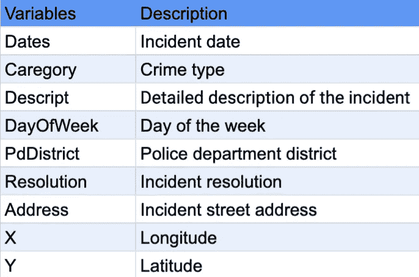
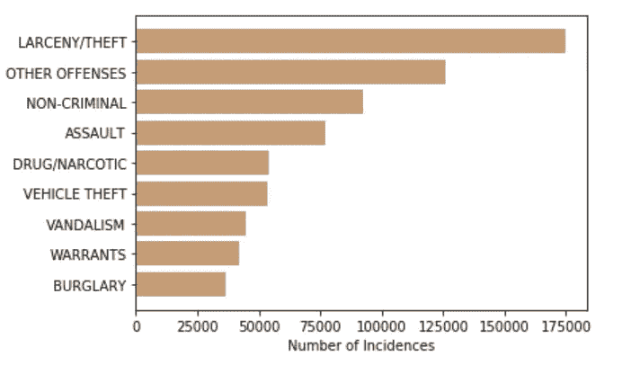
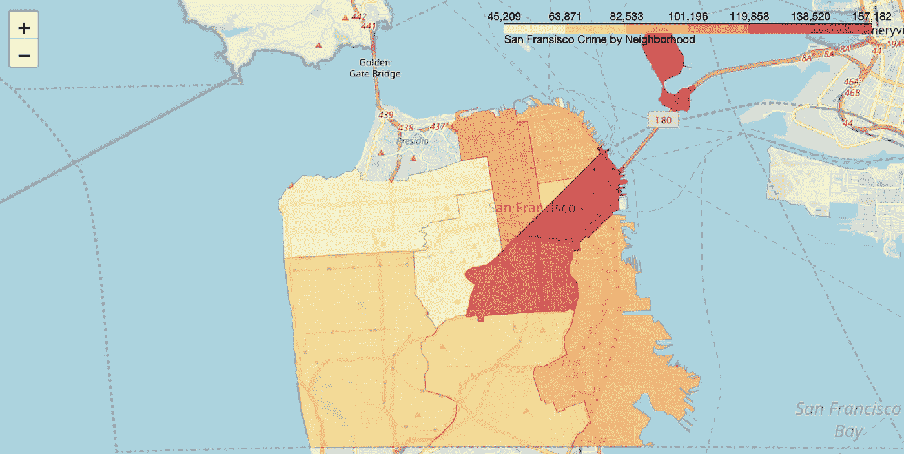
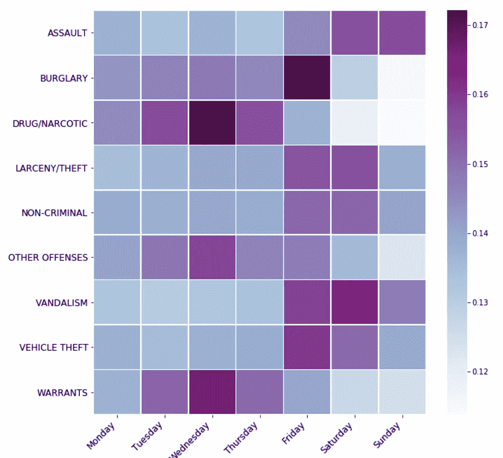
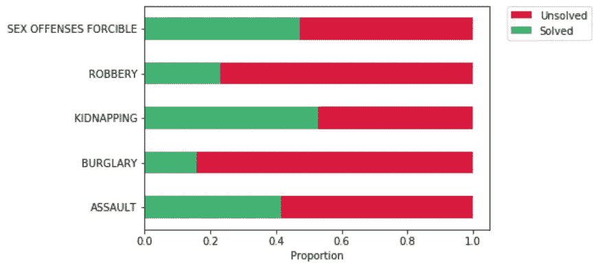

# 深入探究科幻犯罪

> 原文：<https://towardsdatascience.com/deep-dive-into-sf-crime-cb8f5870a9f6?source=collection_archive---------33----------------------->

## 生成数据可视化以分析旧金山的犯罪率

旧金山因许多事情而闻名:它充满活力的科技环境、标志性的金门大桥、迷人的缆车和(可以说是)世界上最好的餐馆。它也是 LGBT 和潮人文化的中心，这使它成为极具吸引力的旅游和移民目的地。然而，随着旅游业的蓬勃发展，财富不平等的加剧，以及成千上万的无家可归者，这个城市并不缺少犯罪。在本帖中，我邀请您深入研究旧金山的犯罪数据，以获得对旧金山犯罪环境的一些见解，并为您自己的犯罪分类模型设计特征。

# 探索性分析

你可以从 [Kaggle](https://www.kaggle.com/c/sf-crime/data) 下载旧金山犯罪分类数据。该数据集包含 2003 年至 2015 年来自该市所有社区的近 800，000 份犯罪报告。它包括以下变量:



San Francisco Crime Rates Dataset Variable Description

让我们首先探索我们的目标变量，并找出旧金山最常见的 10 种犯罪类型。我们将根据事件数量对类别进行排序，然后使用水平条形图展示我们的调查结果:

```
*# Get 10 most common crimes*
most_common_cat = train['Category'].value_counts()[0:9].sort_values()
most_common_cat.values

categs = most_common_cat.index
y_pos = np.arange(len(categs))
counts = most_common_cat.values

plt.barh(y_pos, counts, align='center', alpha=0.5)
plt.barh(y_pos, counts, align='center', alpha=0.5)
plt.yticks(y_pos, categs)
plt.xlabel('Number of Incidences')
plt.show()
```



Most Common Crime Types

得知暴力犯罪不在犯罪发生率之首，令人颇感欣慰。然而，财产犯罪似乎相当普遍。现在让我们来看看哪些区的登记犯罪数量最高。

为此，我们将使用[叶](https://github.com/python-visualization/folium)，这是一个易于使用的工具，创建交互式地图。要运行下面的代码块，你需要在你的终端上运行`pip install folium`来安装 Folium，或者直接在笔记本上添加“！”在司令部前面。然后，您需要下载这个单元格中指定的 JSON 文件:

```
by_zone = train.apply(pd.Series.value_counts).reset_index()

*# Load SF data*
!wget --quiet https://cocl.us/sanfran_geojson -O sf_neighborhoods.json
sf_zones = r'sf_neighborhoods.json'

SF_COORDINATES = (37.76, -122.45)

*# Create an empty map zoomed in on San Francisco*
sf_crime_map = folium.Map(location=SF_COORDINATES, zoom_start=12)

sf_crime_map.choropleth(
    geo_data=sf_zones,
    data=by_zone,
    columns=['index', 'PdDistrict'],
    key_on='feature.properties.DISTRICT',
    fill_color='YlOrRd', 
    fill_opacity=0.7, 
    line_opacity=0.2,
    legend_name='San Fransisco Crime by Neighborhood'
)

sf_crime_map
```

该单元的输出是一个交互式地图，其中包含按警察局辖区分类的犯罪率:



San Francisco Crime Rate by Neighborhood

您可以通过绘制单个犯罪类别或检查分布随时间的变化来随意试验这个情节。

接下来，我们来看看犯罪在工作日的分布。我首先构建了一个交叉表来获取每个工作日的犯罪数量。之后，我使用 seaborn library 中的热图对计数进行了标准化和可视化:

```
*# Extract the most common crimes from the data*
most_commons = train[train['Category'].apply(**lambda** x: x **in** categs)]

*# Build a cross table to get the number of each crime type per day of week*
cat_per_week_common = pd.crosstab(most_commons['Category'], most_commons['DayOfWeek']) 
*# Calculate percentages of crimes*
cat_per_week_common = cat_per_week_common.div(cat_per_week_common.sum(axis=1), axis=0)
*# Rearrange columns*
cat_per_week_common = cat_per_week_common[['Monday', 
                                           'Tuesday', 'Wednesday', 
                                           'Thursday', 'Friday', 
                                           'Saturday','Sunday']]
*# Transform into a heat map*
fig = plt.figure(figsize=(10,10))
ax = sns.heatmap(cat_per_week_common,
                 cmap="BuPu", linewidths=.5)
plt.xticks(fontsize=12,rotation=45,ha='right')
plt.yticks(fontsize=12)
plt.xlabel("")
plt.ylabel("")
```



Most Common Crimes per Day of Week

如上图所示，大多数犯罪类型，如袭击和破坏行为，都发生在周末人们外出的时候。一些其他类型的犯罪更经常发生在工作日，这可能与警察工作时间有关。

最后，我们来看看 SF 警察局的成功率。具体来说，有多少暴力犯罪得到解决。让我们先从类别列表中划分出暴力犯罪的子集。我选择了我认为有趣的，但也可以随意探索其他类别！之后，我们可以创建逮捕变量，将所有可能的决议分为两类:起诉或不起诉。我假设“未被起诉”和“无”是仅有的两个对应于负面类别的决议。我们将计算已解决案件的比例，并使用水平图绘制它们。这一次，我们将绘制比例图，而不是绝对计数:

```
*# Pick crime types of interest*
violent = train[train.Category.isin(['ASSAULT', 'BURGLARY',
                                       'KIDNAPPING', 'ROBBERY',  
                                       'SEX OFFENSES FORCIBLE'])].copy()
*# Create Arrest variable*
violent['Arrest'] = np.where(violent['Resolution'].isin(['NONE', 'NOT PROSECUTED']), 0,1)

*# Calculate counts*
arrest_counts = violent['Category'][violent.Arrest==1].value_counts()[0:9]
total_counts = violent['Category'].value_counts()[0:9]
arrest_counts = arrest_counts/(total_counts).sort_index()
total_counts = total_counts/(total_counts).sort_index()

*# Plot values*
total_counts.plot.barh(color='crimson', label= 'Unsolved')
arrest_counts.plot.barh(color='mediumseagreen', label='Solved')
plt.legend(bbox_to_anchor=(1.05, 1), loc='upper left', borderaxespad=0.)
plt.xlabel('Proportion')
plt.show()
```



Solved and unsolved violent crimes in SF

我们可以看到，在我们挑选的所有暴力犯罪中，警方的成功率都在 50%以下。在入室盗窃案中，这一比例仅为 17%。

# 特征工程

我们的数据集有许多观测值，但只有有限数量的要素。在本节中，我们将创建两组要素:时间要素和空间要素。时态特征可以从日期变量中提取。除了月、日和小时等明显的特征之外，我还提取了营业时间、周末和国定假日。要访问所有的美国假日，只需从 pandas.tseries.holiday 导入 USFederalHolidayCalendar。下面的函数将帮助您提取所有的功能:

```
**def** time_engineer(data):
    *'''*
 *Extract temporal features from dates.*
 *'''*
    *# Turn strings into timestamp objects*
    data.Dates = pd.to_datetime(data.Dates)

    *# Extract years, months, times of the day, and weeks of year*
    data['Year'] = data['Dates'].dt.year
    data['Month'] = data['Dates'].dt.month
    data['Day'] = data['Dates'].dt.day
    data['Hour'] = data['Dates'].dt.hour
    data['WeekOfYear'] = data['Dates'].dt.weekofyear

    *# Add a dummy for public holidays*
    cal = calendar()
    holidays = cal.holidays(start=data['Dates'].min(), end=data['Dates'].max())
    data['Holiday'] = data['Dates'].dt.date.astype('datetime64').isin(holidays).astype('bool')

    *# Add times of a day*
    data['Night'] = np.where((data['Hour']< 6), 1, 0)
    data['Morning'] = np.where((data['Hour']>=6) & (data['Hour']<12), 1, 0)
    data['Afternoon'] = np.where((data['Hour']>= 12) & (data['Hour']<18), 1, 0)
    data['Evening'] = np.where((data['Hour']>= 18) & (data['Hour']<24), 1, 0)
    data['BusinessHour'] = np.where((data['Hour']>= 8) & (data['Hour']<18), 1, 0)

    *# Add seasons*
    data['Spring'] = np.where((data['Month']>=3) & (data['Month']<6), 1, 0)
    data['Summer'] = np.where((data['Month']>=6) & (data['Month']<9), 1, 0)
    data['Autumn'] = np.where((data['Month']>=9) & (data['Month']<12), 1, 0)
    data['Winter'] = np.where((data['Month']<=2) | (data['Month']==12), 1, 0)

    *# Encode weekdays*
    data_dummies = pd.get_dummies(data['DayOfWeek'])
    data = pd.concat([data, data_dummies], axis=1)

    *# Create a dummy for weekends*
    data['Weekend'] = np.where((data['DayOfWeek']=='Saturday') & (data['DayOfWeek']=='Sunday'), 1, 0)

    *# Encode districts*
    data_dummies = pd.get_dummies(data['PdDistrict'])
    data = pd.concat([data, data_dummies], axis=1)
    data = data.drop(columns=['PdDistrict'])
    *# Drop categorical variables and variables that are not in test set*
    *# School valiables contain too many NaNs*
    data.drop(columns=(['Address', 'Dates', 'Descript', 'DayOfWeek',
                        'Resolution', 'Enrolled In Public School',
                        'Enrolled In Private School', 'Not Enrolled In School']))
    **return** data
```


Word Cloud of Temporal Features

提取空间特征有点复杂，因为它们基于可以作为包加载的`uszipcode`数据库。在笔记本中，您将找到清理邮政编码数据和提取相关人口统计特征所需的所有功能。请注意，要素工程过程需要花费大量时间(几个小时)，主要是因为需要输入每个纬度和经度的邮政编码。

您的最终数据集应包括 89 个变量，这些变量包含犯罪发生率的时间和空间方面的信息。现在，您可以随意使用这些数据并训练自己的模型，它将在 Kaggle 排行榜上名列前茅！首先，这里有一个简单的函数，它训练一个模型，对测试集进行预测，并计算挑战中指定的 logloss:

```
# Try out different models
models = [LogisticRegression, RandomForestClassifier, KNeighborsClassifier]def run_model(model, X_train, y_train, X_test, y_test):
    model = model()
    model.fit(X_train, y_train)
    y_preds = model.predict(X_test)
    return (log_loss(y_test, y_preds))

results = [run_model(model) for model in models]
```

# 结论

在这篇文章中，我们研究了旧金山犯罪分类数据集，并了解了如何制作数据可视化来探索数据的不同方面。我们还使用地理位置和日期来设计空间和时间特征。在另一篇文章中(希望如此),我们将探索模型和特征选择技术、超参数调整和一些流行的降维方法！敬请期待:)

完整笔记本:[https://github . com/ritakurban/Practical-Data-Science/blob/master/SF _ crime . ipynb](https://github.com/ritakurban/Practical-Data-Science/blob/master/SF_crime.ipynb)