# 深入了解计算机视觉世界:第 1 部分

> 原文：<https://towardsdatascience.com/deep-dive-into-the-computer-vision-world-f35cd7349e16?source=collection_archive---------15----------------------->

## 从 VGG、ResNet、GoogLeNet 和 MobileNet 开始

在完成了神经网络的基础知识之后，下一步将是学习这个领域中的一些“著名摇滚明星模型”。ResNet，Inception Net，Faster R-CNN，YOLO 等等。研究这些模型可以分为三个部分:这些架构背后的应用程序、实现和直觉。关于如何使用预训练模型以及如何构建它们，已经有大量的资源。但抓住模型背后真正的直觉有时会被忽略。研究人员用这种结构建立模型的意图是什么？是什么促使他们采取这样的方法？我们能从结果中推断出什么？

本文是下一个系列 [**最直观最简单的指南**](/the-most-intuitive-and-easiest-guide-for-artificial-neural-network-6a3f2bc0eecb?source=friends_link&sk=a9021d009dcd1651c16b59c6e48d0533) 教程，该系列的完整设置如下:

1.  从 VGG 开始，ResNet，Inception Network 和 MobileNet
2.  [CNN 地区，让我们开始物体探测吧！](/deep-dive-into-the-computer-vision-world-part-2-7a24efdb1a14?source=friends_link&sk=4fec4dfc9499c930f263c6808b2f369d)
3.  [YOLO，SSD 和 RetinaNet，比较统一的](/deep-dive-into-the-computer-vision-world-part-3-abd7fd2c64ef?source=friends_link&sk=876a90f05dcef8f9f0546b42adaec42d)
4.  从对象检测到实例分割(TBU)

本文假设你已经熟悉了卷积神经网络的基本概念。除此之外，我们还将深入了解 VGG、ResNet、Inception Network 和 MobileNet 的各种卷积变换和修改。一个接一个地浏览它们，我们将回答上面提到的问题，这样我们才能真正理解这些架构的潜在含义。

# VGG

ImageNet 是一个用于计算机视觉领域研究的大型数据集。自 2010 年以来，每年都举办名为 [ImageNet 大规模视觉识别挑战赛](http://www.image-net.org/challenges/LSVRC/) (ILSVRC)的比赛。VGGNet 是 2014 年 ILSVRC 竞赛的获胜者。尽管与其他复杂的网络相比，它的体系结构简单，但它仍然是最受欢迎的网络之一。

这个网络的一个有趣的部分是，即使在第一层中，它也只使用了 3×3 滤波器。如果和之前的比较， [**AlexNet**](https://papers.nips.cc/paper/4824-imagenet-classification-with-deep-convolutional-neural-networks.pdf) **，**2012 年的赢家，在前两层使用了 **11x11** 和 **5x5** 滤镜。还有 [**ZFnet**](https://arxiv.org/pdf/1311.2901.pdf) **，**2013 年的冠军，用的是 **7x7** 滤镜。代替在第一卷积层中使用相对大尺寸的滤波器，所使用的 VGG 网络滤波器的尺寸仅为 3×3。

那么尝试这个的意图是什么呢？答案是减少参数的数量。让我们在这里做一些计算。通道尺寸为 C 的单个 **7x7** 卷积层需要多少个参数？是 **49C** 。现在，通道尺寸相同的 3 层 **3x3** 卷积层的数量是多少？(9C )x3 = **27C** 。看看有多少参数减少了。减少权重的数量可以通过降低网络的复杂性来处理过拟合。此外，由于我们可以为每个卷积层设置一个激活层，这也有助于模型的学习。

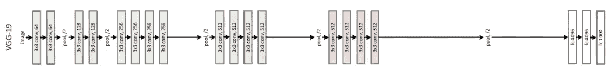

[The architecture of VGG-19](https://arxiv.org/pdf/1512.03385.pdf)

与 VGG 网络或 AlexNet 一样，大多数卷积网络都遵循基本结构:一系列卷积层、一个汇集层和一个带有一些规范化的激活层。但是越来越深入，人们遇到了一些严重的问题，并开始重新设计这种方法。

# 雷斯内特

直觉上，我们希望“越深越好”然而，研究人员发现事实并非如此。随着网络变得越来越深，性能越来越差。原因之一是消失/爆炸梯度问题。虽然我们已经有几种方法来解决这个问题，如梯度裁剪，有一个退化问题，不是由于过度拟合。ResNet 的诞生就是从这里开始的。 ***为什么会这样？***

让我们假设我们有一个具有理想精确度的良好网络。现在，我们将复制这个网络，只添加 1 层，但没有额外的功能。这被称为**身份映射**，这意味着获得与输入完全相同的输出。与其他具有许多参数的复杂层相比，这对于我们的“智能”模型来说是小菜一碟。所以对网络的性能应该没有什么危害吧？

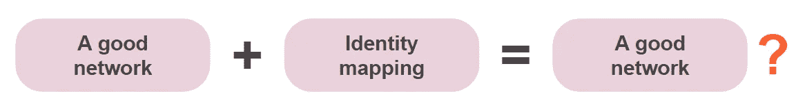

那么如果我们附加越来越多的身份层会有什么结果呢？由于身份层对输出没有影响，因此性能不会下降。这似乎是一个合理的猜测，但这个实验的结果与我们的预期不同。该模型的性能比没有身份层的较浅模型差。

这个结果表明“越深越好”不适用于神经网络，即使有身份映射。仅仅将身份层直接附加到网络上就很难训练。*好吧，那么把身份层作为一个附加层怎么样？*

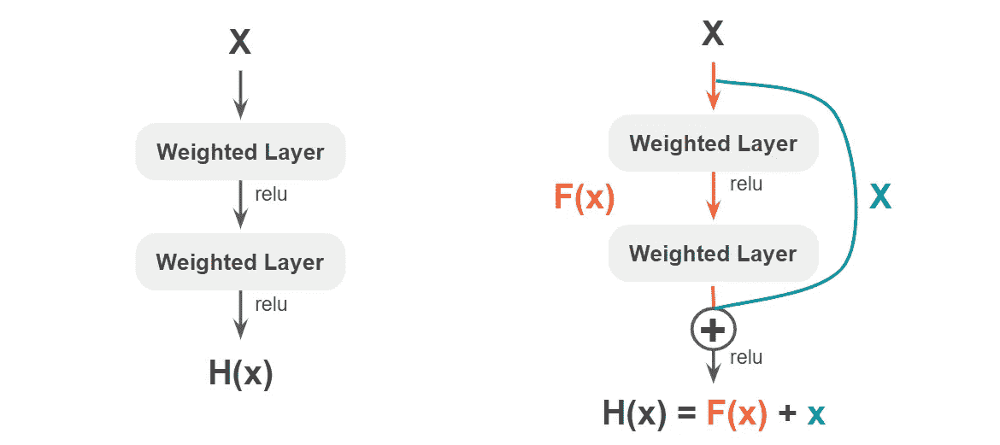

现在，这就是 ResNet 发挥作用的地方。假设 **H(x)** 是网络的结果。而如果我们放一条额外的路径，原来的函数就变成了 **F(x) + x** 其中 **F(x)** 是**主分支**的函数如上图。身份层也被称为**快捷连接**或**跳过连接**。这就给网络带来了“剩余学习”的概念。现在主分支被训练为逼近 **H(x) — x** 并使 **F(x)** 更接近零。这意味着给予各层一定的学习方向，从而使培训更容易。此外，网络可以通过身份层跳过一些层。这允许我们有更深的层，但仍然具有高性能。

你可能会问，当两层的大小不同时，怎么可能把 **F(x)** 和 x 相加。我们可以通过在快捷连接处进行零填充或线性投影来解决这个问题。所以 ResNet 中有两种快捷连接，一种是没有权重的，一种是有权重的。

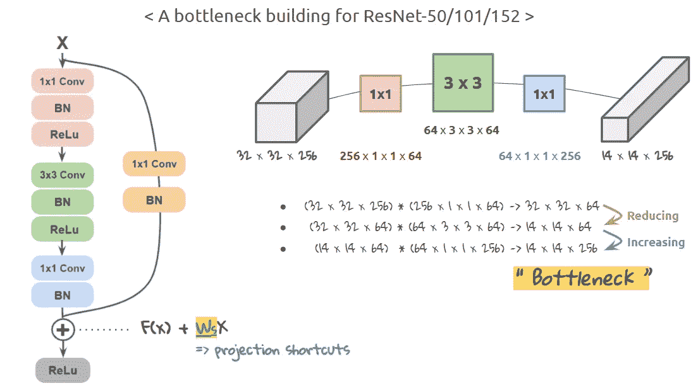

上图是 ResNet 50 层的卷积块。它有一个具有 3 个回旋层的主分支和一个 **1x1** 回旋的快捷连接。这里我们可能需要问， ***为什么要 1x1–3x 3–1x1 卷积？***

要回答这个问题，需要了解数据的维度是如何根据过滤器大小而变化的。请看看右边的图片。如果我们说输入的形状是(32，32，256)，那么与上一步相比，当它通过 **3x3** 过滤器时，维数会减小。当它通过第二个 1x1 滤波器时，它再次增加。这是一个瓶颈。通过强制数据适应更小的维度，我们可以获得更有效的特征表示。

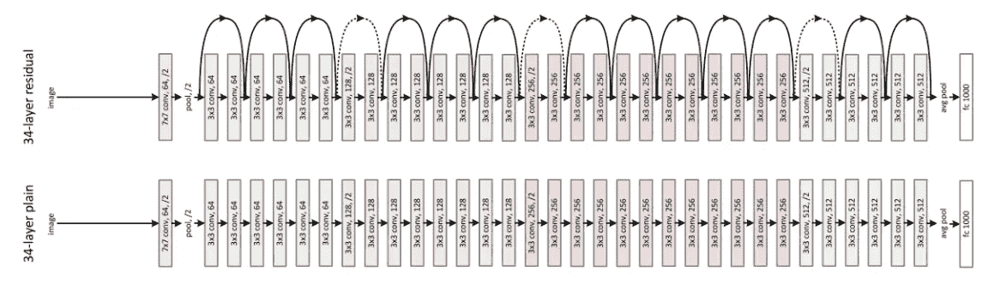

[The comparison of a plain network and ResNet](https://arxiv.org/pdf/1512.03385.pdf)

用更少的滤波器、更少的计算量和更高的精度来容易地优化深度神经网络。这种简单而新颖的重构带来了如此美丽的成就，这就是 ResNet 在 2015 年如何震撼人们的心灵。带着 ResNet 上的这种根本直觉，我想让你从 [**原论文**](https://arxiv.org/abs/1512.03385) 开始探索网络。而 [**这里的**](https://arxiv.org/pdf/1603.05027.pdf) 是实验残块变体研究的第二部分。或者你可以在 ResNet [**这里**](/an-overview-of-resnet-and-its-variants-5281e2f56035) 找到一个简单的解释。

# 谷歌网

高性能越深入越好。我们需要深度神经网络来执行复杂而具有挑战性的任务。但是，当我们评估网络时，还有一个因素需要考虑。想想我们什么时候必须在移动应用程序中嵌入模型。肯定不希望有一个“太重”的模型。但除此之外，还有一个在实际应用中非常关键的计算成本问题。所以现在的问题就变成了， ***怎样才能以更高的效率深入？***

[Know your meme](https://knowyourmeme.com/memes/we-need-to-go-deeper)

研究人员发现低效计算发生的一个地方是完全连接的架构。在卷积方法中，全连接架构表示层 ***l*** 从层***l-1****馈入，并连接到下一层 ***l+1*** ，如下左图所示。研究人员发现，过滤器数量的任何均匀增加都会使计算加倍。所以他们建议从密集连接的架构转移到稀疏连接的架构。*

*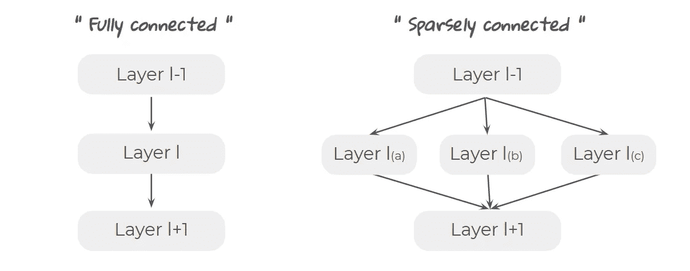*

*不是实现一个 ***类型*** 的卷积，稀疏架构执行具有多个滤波器大小的多个卷积，如上所示。并且来自这些层的输出的维度可以与“相同的”填充相匹配。*

*这里有几个不同尺寸的过滤器有一个重要的意义。在训练过程中，网络检测到的特征的规模起初是小的和局部的，并且随着其深入而变大。例如，假设模型检测到一只猫。该模型看到小比例的特征，例如猫的皮毛图案，然后它移动到更大比例，例如它的耳朵形状，然后是腿的数量。*

****

*因此，即使图片中的猫处于不同的比例，模型仍然处理相同比例的特征映射。这是低效的，并且会损害性能。因此，拥有多个过滤器表明它现在知道如何根据输入图像“放大和缩小”。它使模型能够一次检测不同比例的图像。通过这样做，我们还可以处理选择参数的工作以及减少无效的计算。这是《盗梦空间》的第一脚。*

*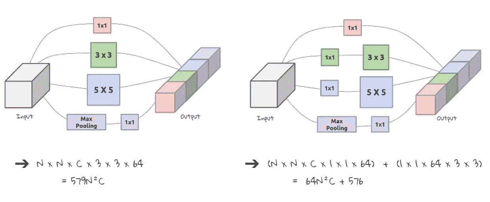*

*因此，Inception 模块看起来就像上图左边的那个。但是有一个问题。 ***但是计算成本呢？*** 无论如何，稀疏连接的架构仍然需要相同或更多的计算量！研究人员解决这个问题的方法是实现 **1x1** 卷积，如上图右侧所示。这里的 **1x1** 卷积的目的是降维，就像我们在 ResNet 中讨论的那样。考虑到输入图像的(N，N，C)形状，计算时间减少了。如果图像的大小是 32×32，有 129 个通道，我们可以将参数的数量减少 9 倍！*

*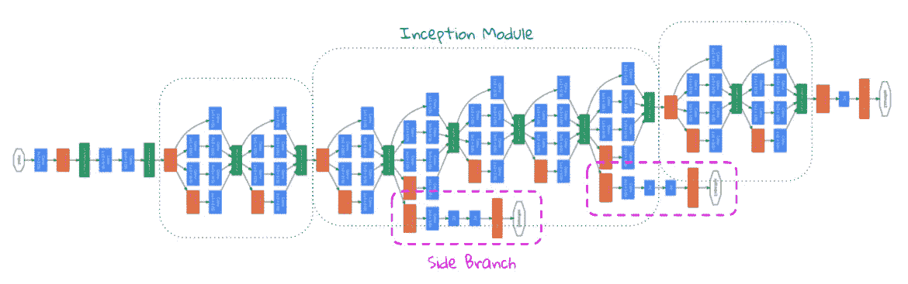*

*[The architecture of Inception Network](https://arxiv.org/abs/1409.4842)*

*GoogleNet 的最终架构如上图所示。这些模块串联在一起，总共形成 22 层。这是一个相当深的网络，它也无法避免臭名昭著的消失梯度问题。所以研究人员处理这个问题的方法是制造侧枝。*

*“渐变消失”是什么意思它表明梯度的值随着深度的增加而变得越来越小，这意味着梯度没有多少信息可以学习。所以我们可以说，从早期阶段的梯度携带更多的信息。换句话说，我们可以通过在中间层添加辅助分类器来获得额外的信息。此外，正如我们上面讨论的，检测到的特征随着层的不同而不同。因此，“中间产品”也有利于标签的分类。我们将这些支路的损耗加到加权网络的总损耗中。*

# *MobileNet*

*受我们上面讨论的网络的启发，“更深入和更复杂”是 CNN 研究的高度趋势。虽然这些网络带来了更高的准确性，但对于现实世界的应用来说，它们不够高效或“轻便”。为了在计算有限的平台上及时执行，它们需要更小更快。*

*研究人员提出的一个解决方案是形成分解卷积。分解卷积表示将标准卷积分解成深度卷积和点态卷积。这被称为深度方向可分卷积。*

*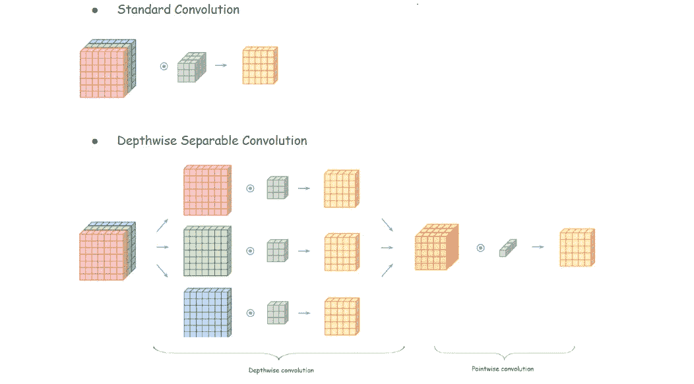*

*在深度方向可分离卷积中，我们首先分离输入和滤波器的每个通道，然后用相应的滤波器或以*深度方向*的方式对输入进行卷积。然后将输出连接在一起。这是 ***深度方向的卷积*** 。之后我们做 ***逐点卷积*** ，和 *1x1 卷积*一样。现在看最后的结局。和标准的 3x3 卷积不一样吗？如果是，那么这样做有什么意义？*

*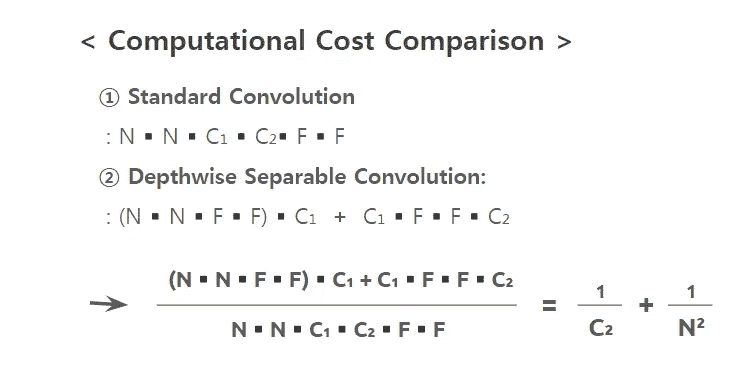*

*答案是计算。我们来比较一下两者的计算成本。当输入的波形为( **N** 、 **N** 、 **C1** )，输出通道为 **C2** ，滤波器大小为 **F** 时，两者的总运算量应该如左图所示。如你所见，深度方向可分离卷积降低了计算成本。根据原始论文中的[所述，与采用标准卷积的相同架构相比，MobileNet 所需的计算量减少了 8 到 9 倍，精确度仅略有下降。](https://arxiv.org/pdf/1704.04861.pdf)*

*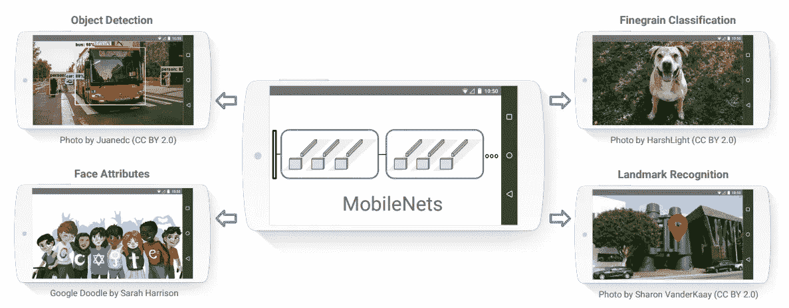*

*[The applications of MobileNet](https://arxiv.org/pdf/1704.04861.pdf)*

*深度方向可分卷积也用于 Xception，其论文发表早于 MobileNet。但是我发现 MobileNet 论文对深度方向可分离卷积的概念给出了更直接的解释。*

# *减去*

*现在，架构对你来说变得更简单和有形了吗？如我所说，理解结构背后的论点是至关重要的。所以我想再回顾一下电视网的一些亮点。*

*首先，卷积层的滤波器大小不仅仅具有特征映射的意义。它可以像 VGG 一样改变参数的数量。我们还可以创建瓶颈来提取有意义的数据表示。 **1x1** 卷积不仅仅是线性变换。它可以作为一个有用的技巧，在不显著影响输入数据的情况下，给出更多的非线性，改变维度，并减少计算。*

*为了获得更高的性能，ResNet 通过快捷连接来利用残差。这一层通过跨层有效地传递权重来更好地促进优化。另一方面，初始网络的策略是通过构建稀疏架构来使用多个过滤器。这是为了应对训练中音阶的变化。最后，MobileNet 选择将卷积分解为两个步骤。利用深度方向可分离的卷积，MobileNet 可以显著减少计算量和模型大小。*

# *参考*

*   *卡伦·西蒙扬和安德鲁·齐泽曼， [*用于大规模图像识别的极深度卷积网络*](https://arxiv.org/abs/1409.1556) ，2015*
*   *、何等 [*深度残差学习用于图像识别*](https://arxiv.org/abs/1512.03385) ，2015*
*   *Christian Szegedy 等人*2014 年**
*   **Christian Szegedy 等人， [Inception-v4，Inception-ResNet 以及剩余连接对学习的影响](https://arxiv.org/pdf/1602.07261.pdf)，2016**
*   **Franc ois Chollet，[异常:深度可分卷积深度学习](https://arxiv.org/pdf/1610.02357.pdf)，2017**
*   **Andrew G. Howard 等人， [MobileNets:面向移动视觉应用的高效卷积神经网络](https://arxiv.org/pdf/1704.04861.pdf)，2017**

**这个故事引起你的共鸣了吗？请与我们分享您的见解。我总是乐于交谈，所以请在下面留下评论，分享你的想法。我还在 [**LinkedIn**](https://www.linkedin.com/in/jiwon-jeong/) 上分享有趣和有用的资源，所以请随时关注并联系我。下次我会带来另一个有趣的故事。一如既往，敬请期待！**