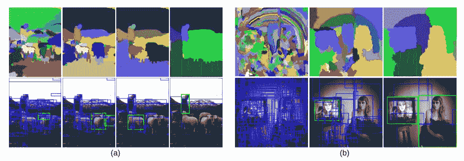
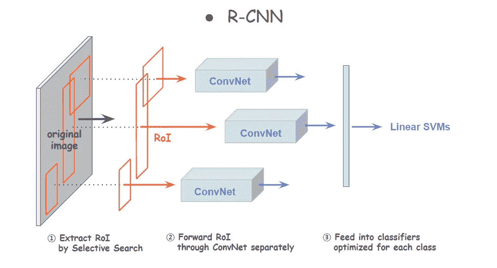
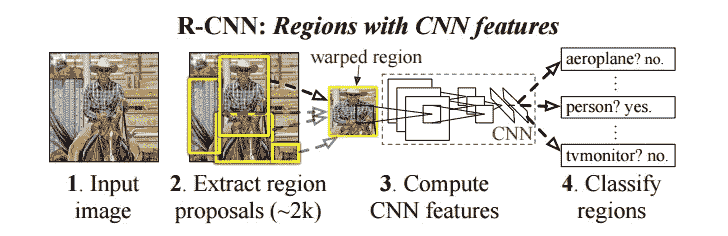
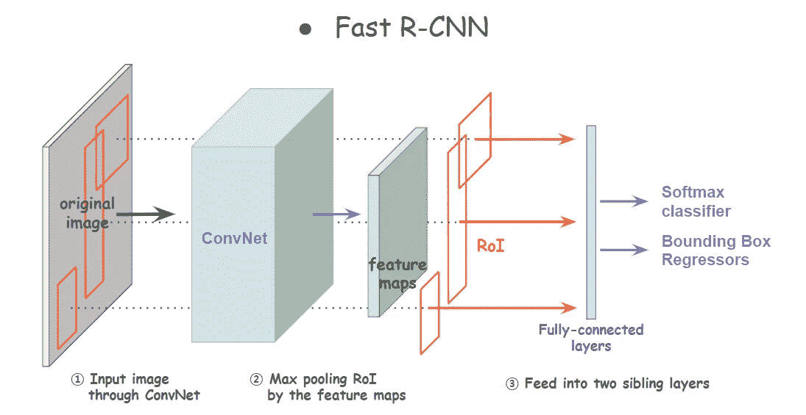
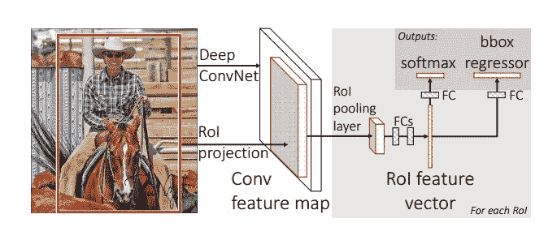
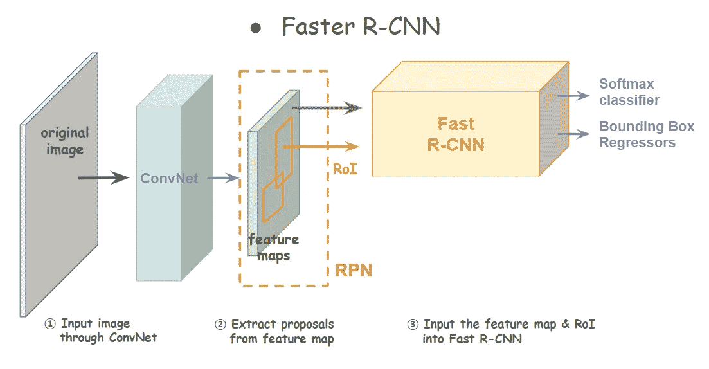
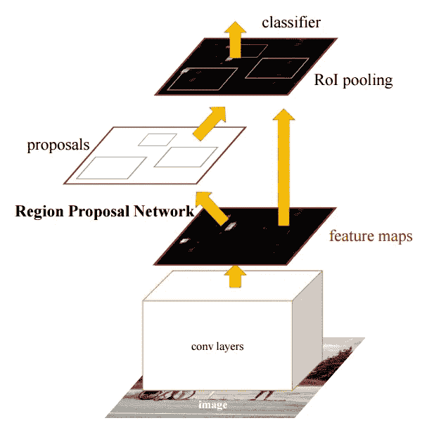
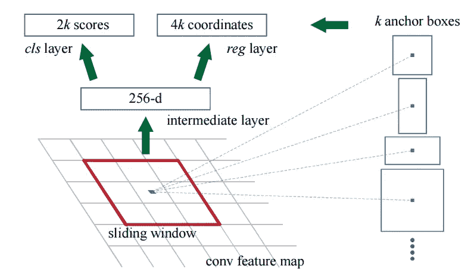

# 深入计算机视觉世界:第 2 部分

> 原文：<https://towardsdatascience.com/deep-dive-into-the-computer-vision-world-part-2-7a24efdb1a14?source=collection_archive---------21----------------------->

## 有 CNN 的地区，让我们开始物体检测！

这是“深入计算机视觉世界”的第二个故事，该系列的完整集如下:

1.  [从 VGG 开始，ResNet，Inception Network 和 MobileNet](/deep-dive-into-the-computer-vision-world-f35cd7349e16?source=friends_link&sk=449ea5da20c884dadca23b907efb7e13)
2.  CNN 地区，让我们开始目标检测
3.  [YOLO，SSD 和 RetinaNet，比较统一的那些](/deep-dive-into-the-computer-vision-world-part-3-abd7fd2c64ef?source=friends_link&sk=876a90f05dcef8f9f0546b42adaec42d)
4.  从对象检测到实例分割(TBU)

在前一篇文章中，我们讨论了五个流行的网络，VGG、ResNet、Inception Network、Xception 和 MobileNet。这些网络现在是高级网络的主要组成部分，因此有必要了解它们的架构。

现在，我们进入下一页。从图像分类到目标检测。到目前为止，我们讨论的是一个大型卷积神经网络。虽然它们有很多层，但最终是一个网络。但是 R-CNN 和它的变体将是我们的焦点，这个网络是它的一部分。CNN 现在是整个“系统”的一部分，处理更复杂的任务，如对象检测和图像分割。从 R-CNN 开始，我们将看到这些网络是如何转变的，以及这些变化背后的想法。

# 从图像分类到目标检测

在我们直接进入 R-CNN“家族”之前，让我们简单检查一下图像分类和图像检测的基本思想。两者有什么区别？为了检测图像中的物体，我们还需要做哪些额外的工作？

首先，无论我们有多少个班级，都会有一个额外的班级-背景。需要一个对象检测器来回答这个问题，“有对象吗？”，这不是图像分类的情况。第二，当有一个对象时，仅仅说“是的，有”还是不够的(想象起来相当可笑..😅)它还应该告诉我们，“物体位于哪里？”我们需要探测到的物体的位置。这听起来可能很简单，但实现起来并不容易。当我们考虑速度和效率挑战时，事情变得更加复杂。

因此，物体检测就像..寻找一个物体的区域，定位它并对它进行分类。有了这个基本概念，我们现在准备开始 R-CNN 的第二个话题。

# R-CNN

R-CNN 回答问题，*“在 ImageNet 上的 CNN 分类结果能在多大程度上概括为物体检测结果？”*所以这个网络可以说是物体检测*家谱*的开始，在神经网络的应用中有很大的重要性。基本结构由三个步骤组成:提取区域建议、计算 CNN 和分类。

首先，我们从输入图像中提取一些看起来有希望有物体的区域。R-CNN 使用选择性搜索来获得那些感兴趣的区域(ROI)。选择性搜索是一种基于像素强度分割图像的区域提议算法。如果你想深入了解选择性搜索，这里有 [**原文**](http://www.huppelen.nl/publications/selectiveSearchDraft.pdf) 。基本思路如下图。它首先从过度分割的图片开始，并在每个片段周围绘制一个边界框。并且基于它们在颜色、纹理、大小和形状兼容性方面的相似性，它不断将相邻的分组并形成更大的片段。R-CNN 通过这种方法提取了大约 2000 个地区提案，并将它们提供给 CNN。这也是它被命名为 R-CNN 的原因，*具有 CNN 特色的区域*。

[Selective Search for Object Recognition](http://www.huppelen.nl/publications/selectiveSearchDraft.pdf)

得到候选后，第二步是进入一个大型卷积神经网络。每个提议都被调整为固定大小，并分别输入 CNN。R-CNN 用的是 AlexNet(那是 2014 年，当时还没有 ResNet 和 InceptionNet)我们从每一个提案中得到 4096 维的特征向量。

并且在最后一步，从 CNN 提取的输出被馈送到一组*类特定的*线性 SVM 模型。我们为每个类优化一个线性 SVM，并且我们得到具有得分高于阈值的边界框的输出图像。在具有重叠框的情况下，通过应用非最大抑制，只需要一个。

值得一提的一个有趣部分是它如何克服数据稀缺问题。研究人员面临的挑战是，仅用少量的标记数据训练如此庞大的网络。解决方案是用不同的标签数据对 CNN 进行预训练(这是监督学习)，然后用原始数据集进行微调。

[R-CNN architecture](http://www.huppelen.nl/publications/selectiveSearchDraft.pdf)

您可能已经注意到了一些可以改进的低效部分。选择性搜索是计算密集型的。并且为每个 ROI 处理 CNN 是重复的工作，这再次需要大量的计算成本。对预训练过程和分离的分类器的需要是没有吸引力的。而且这些机型的存储量太大。虽然 R-CNN 是一个里程碑式的成就，但它有几个缺点需要改进。

# 快速 R-CNN

快速 R-CNN 是上一部作品的下一个版本。这里发生了什么变化？重复处理卷积映射得到了改进。第一个变化发生在重复卷积层。

假设计算一个卷积网络需要 *N 秒。由于 R-CNN 分别向网络输入 2000 个 RoI，总处理时间将为 2000*N 秒。现在，我们不再单独处理 CNN，而是通过与所有建议共享卷积，只处理一次。*

正如您在上面看到的，这个网络接受两个数据输入，一个原始图像和一组区域建议作为输入。整个图像通过网络前馈产生特征图。有了这个特征地图，每个区域提议通过一个汇集层和完全连接的层来创建一个特征向量。因此，卷积计算是一次完成的，而不是针对每个建议。

并且用两个兄弟层替换多个分类器。一个是 softmax 函数，用于利用每一类的可能性估计对对象进行分类，另一个是边界框回归器，用于返回检测到的对象的坐标。所以得到的特征向量被送入这两层，我们从这两层得到结果。

[Fast R-CNN architecture](https://arxiv.org/pdf/1504.08083.pdf)

现在，这个模型进行了更改，以共享卷积并分离附加的分类器。通过将“多个主体”合并为一个并去掉“沉重的尾巴”，我们可以实现更少的计算和存储。这种架构允许我们一起训练所有权重，甚至包括 softmax 分类器和多元回归器的权重。这意味着传播将来回更新所有的权重。惊人的进步！然而，我们仍然有机会获得更好的表现。

# 更快的 R-CNN

然而，快速 R-CNN 很难用于实时检测。造成这种时间延迟的主要原因是选择性搜索。它存在计算瓶颈，需要用更有效的方法来替代。*但是如何？如果没有选择性搜索，我们如何获得区域提案？如何最大限度地利用 ConvNet 呢？*研究人员发现，Fast R-CNN 中的特征地图也可用于生成区域提议。因此，通过避免选择性搜索，可以开发更高效的网络。

快速 R-CNN 由两个模块组成，区域提议网络(RPN)和快速 R-CNN。我们首先输入一幅图像到一个“迷你网络”,它将输出特征图。通过在特征图上滑动小窗口，我们提取区域提议。并且每个提议被馈送到两个兄弟层，softmax 分类器和包围盒回归器。

这两层可能看起来类似于快速 R-CNN 的最后几层，但它们是为了不同的目的而衍生的。对于每个提议，分类器估计图像中对象存在的概率。回归器返回边界框的坐标。所以它们是用来产生候选者的，而不是预测实际的物体。

我们只取得分高于某个阈值的建议，将它们与特征图一起输入到快速 R-CNN。以下步骤相同。它们被输入到卷积网络和 RoI 池层。最后一层将是分类器和回归器，最终预测图像中的真实对象。

[Faster R-CNN architecture (left) and Region Proposal Network (right)](https://arxiv.org/pdf/1506.01497.pdf)

这个网络的一个重要属性是*平移不变量*，这是通过锚和它计算相对于锚的提议的方式*来实现的。* [*什么是平移不变？*](https://stats.stackexchange.com/questions/208936/what-is-translation-invariance-in-computer-vision-and-convolutional-neural-netwo) 简单来说，就是不管物体旋转、移位、大小变化什么的，我们都能检测到。图像中的对象可以位于中心或左上角。根据视角不同，同一物体可以是宽的或长的。为了防止模型因为平移而无法定位物体，我们制作了多种比例和纵横比的锚框，如上图所示。这些盒子放在推拉窗的中央。所以如果在某个位置有 **K** 个盒子，我们得到 **2K** 个盒子的分数和 **4K** 坐标。

总之，在区域提议网络，我们在特征图上滑动具有多个锚框的窗口，并通过分类器和回归器评估每个框。低于阈值的建议被拒绝，因此，只有有希望的建议进入下一步。

不仅如此，该模型通过分别微调 RPN 和 Fast R-CNN 特有的层，同时修复共享层，优化了 4 步交替训练。这允许模型共享权重，形成统一的网络，并在效率和准确性方面带来更高的性能。为了比较性能，建议更快的 R-CNN 的时间是每幅图像 10 毫秒(整个过程每秒 5 帧)，而使用 CPU 进行选择性搜索的时间是 2 秒。

# 减去

从 R-CNN 到更快的 R-CNN，网络得到了转变，不再依赖其他组件。R-CNN 可以通过丢弃线性支持向量机和共享卷积计算来增强。而快速 R-CNN 也改为共享卷积去除选择性搜索。通过将整个过程集成到一个网络中，我们可以实现更高的精度和更快的速度。

# 参考

*   J.R.R. Uijlings 等人， [*物体识别的选择性搜索*](http://www.huppelen.nl/publications/selectiveSearchDraft.pdf) ，2012
*   Ross Girshick 等人， [*用于精确对象检测和语义分割的丰富特征层次*](https://arxiv.org/pdf/1311.2524.pdf) ，2014 年
*   何等， [*视觉识别深度卷积网络中的空间金字塔池*](http://Spatial Pyramid Pooling in Deep Convolutional Networks for Visual Recognition) ，2015
*   罗斯·吉希克， [*快速 R-CNN*](https://arxiv.org/pdf/1504.08083.pdf) ，2015
*   任等， [*更快的 R-CNN:面向实时目标检测的区域提议网络*](https://arxiv.org/pdf/1506.01497.pdf) ，2015
*   何等 [*面具 R-CNN*](https://arxiv.org/abs/1703.06870) ，2018

这个故事引起你的共鸣了吗？请与我们分享您的见解。我总是乐于交谈，所以请在下面留下评论，分享你的想法。我还在 LinkedIn[**上分享有趣和有用的资源，所以请随时关注并联系我。下次我会带来另一个有趣的故事。一如既往，敬请期待！**](https://www.linkedin.com/in/jiwon-jeong/)