# 深入计算机视觉世界:第 3 部分

> 原文：<https://towardsdatascience.com/deep-dive-into-the-computer-vision-world-part-3-abd7fd2c64ef?source=collection_archive---------13----------------------->

YOLO，SSD，FPN 和 RetinaNet，比较统一的

刚开始看论文会很不舒服，很恐怖。克服这一点的一个方法是以更轻松的语气阅读一篇写得很好的文章。如果你选择的一篇论文难以消化，从解密视频或博客中获得一些直觉(比如这个😉).在你得到网络的核心概念后，再用原来的再试一次。读起来会变得更舒服，也更有趣，而不仅仅是一头扎进难读的书里。

这是“深入计算机视觉世界”的第三个故事，该系列的完整集如下:

1.  [从 VGG 开始，ResNet，Inception Network 和 MobileNet](/deep-dive-into-the-computer-vision-world-f35cd7349e16?source=friends_link&sk=449ea5da20c884dadca23b907efb7e13)
2.  [CNN 地区，让我们开始物体探测](/deep-dive-into-the-computer-vision-world-part-2-7a24efdb1a14?source=friends_link&sk=4fec4dfc9499c930f263c6808b2f369d)
3.  YOLO，SSD，FPN 和 RetinaNet，比较统一的
4.  从对象检测到实例分割(TBU)

在前一篇文章中，我们讨论了对象检测网络——R-CNN、快速 R-CNN 和更快 R-CNN。这些都是基于两级架构。在第一阶段生成对象位置的候选，在第二阶段定位对象并对检测到的对象进行分类。

现在，下一个要探索的网络是 SSD、YOLO、FPN 和 RetinaNet。这些网络基于一级架构。最大的变化是，这些不再需要区域提案，从而形成一个更统一和完全卷积的网络，从而带来更快的性能。现在让我们一个一个地看看这是如何实现的。

# （同 solid-statedisk）固态（磁）盘

SSD 代表**，**，其架构有三个要点。首先，这个网络可以在*多个尺度*进行检测。随着图层在基础网络之后出现，它产生了具有不同分辨率的多个特征地图，这使得网络能够在多尺度下工作。

第二，这些预测是以卷积的方式做出的。一组卷积过滤器对物体的位置和类别分数进行预测。这就是“单拍”这个名字的由来。取代了额外的分类器和回归器，现在检测是在一个单一的镜头！

最后，有固定数量的默认框与这些特征地图相关联。类似于更快的 R-CNN 的锚点，默认框应用于每个特征地图单元。

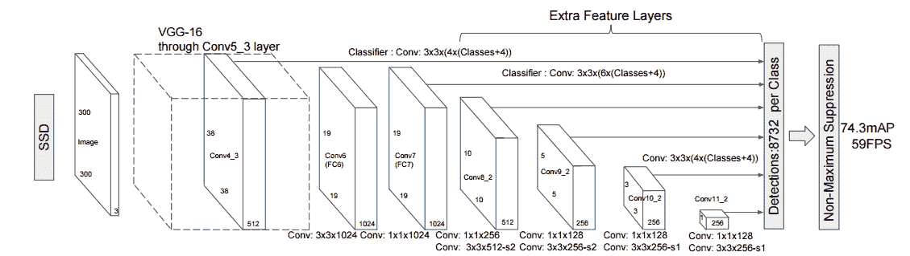

The architecture of SSD

网络的整体架构如上图所示。它使用 VGG-16 作为其基础网络，并有额外的功能层，规模逐渐减少。这个乍一看可以认为是相当复杂的，所以我们把它分成两部分。

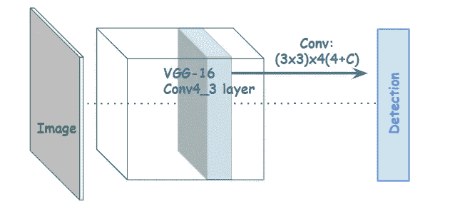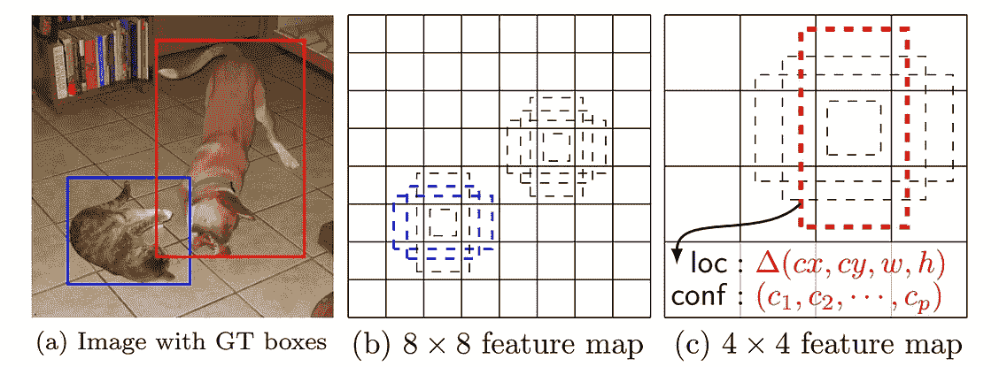

在左图中，基础网络的特征层通过卷积滤波器进行检测。当要素图层的维度大小为 N x N 带 P 个通道时，这里的滤镜大小为 **3x3xP** 。现在，正如我上面所说的，每个单元格都有一组默认的边界框。因此，如果我们有 K 个盒子和 C 个类(包括“背景”类)，我们计算原始默认盒子的四个偏移值，以及每个盒子的类分数。因此，滤波器的总数变为 **(NxN)K(4+C)** 。

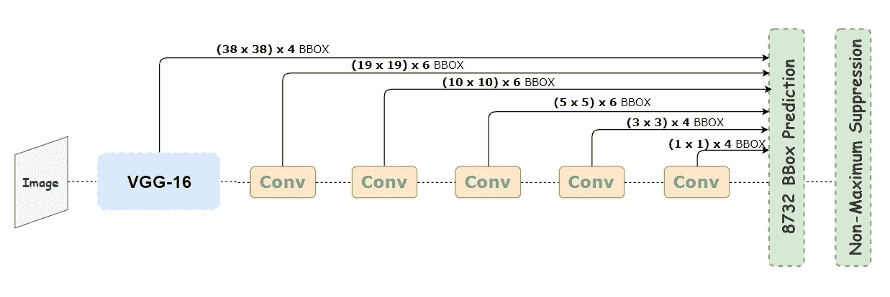

SSD 使用卷积过滤器一次对边界框位置和类别分数进行所有预测。它不再需要区域提案网络。在不同比例的额外要素图层上执行相同的过程，从而显著提高精度。回想一下不同分辨率的特征地图，在一幅图像中看到不同大小的图形或物体([我用盗梦空间](/deep-dive-into-the-computer-vision-world-f35cd7349e16?source=friends_link&sk=449ea5da20c884dadca23b907efb7e13)解释过这个)。因此，跨尺度预测在检测任务中变得至关重要。

在我们从所有这些层中获得结果后，我们将它们与地面真相框进行匹配，并选择最佳的一个。由于大部分的盒子会严重重叠，我们可以使用 [**非最大抑制**](https://www.youtube.com/watch?v=fqTyP5KILFg&t=12s) 来选择一个。但是，仍然有一个相当具有挑战性的问题，阶级不平衡。当我们使用区域提案时，它们是有对象的合理候选。但在这里，网络从每个位置的一组默认框开始，具有多种比例和形状。结果是，大多数盒子的结果都是负面的。这就造成了阶层的不平衡。例如，“背景”类变成了一个简单的例子，而真正的“对象”类变成了困难的例子。简单的反例会淹没类的分布并使模型退化。*(注意，这个问题将在 RetinaNet 中再次讨论)*

为了补救这一点，SSD 只取一些负匹配，因此正匹配和负匹配之间的比率可以是 3:1。这叫**硬负采**。硬否定挖掘是对象检测中的一个经典问题，这意味着一个否定类很难被认为是否定的。一个模型应该把它归类为负面的，但是它给出了很高的可信度，因为负面的情况比正面的情况要多得多。我们只将正匹配输入到目标函数中，以便它计算地面真实和预测边界框之间的损失。

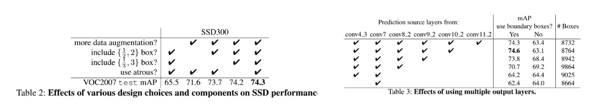

[The Experiment Results of SSD](https://arxiv.org/abs/1512.02325)

一件有趣的事情是，大约 80%的转发时间花在基础网络上，这表明更快的基础网络甚至可以进一步提高速度。并且数据扩充对于更高的准确性也起着重要的作用。与仅使用原始图像和水平翻转的更快的 R-CNN 相比，输入大小、形状和随机采样的变化提高了性能。此外，观察到各种默认的盒子形状对于准确性也是更好的。

# YOLO

YOLO 是你只看一次的缩写。与 SSD 类似，YOLO 不使用区域提案，以“单次”方式工作。YOLO 有三种主要的变体。我不会涵盖所有的转换过程，而是将所有内容打包，并探索最终版本。如果你想知道所有的详细过程，请查看[Jonathan Hui](https://medium.com/u/bd51f1a63813?source=post_page-----abd7fd2c64ef--------------------------------)的这篇优秀文章。(从字面上看，这是我见过的最好的 YOLO 教程)。

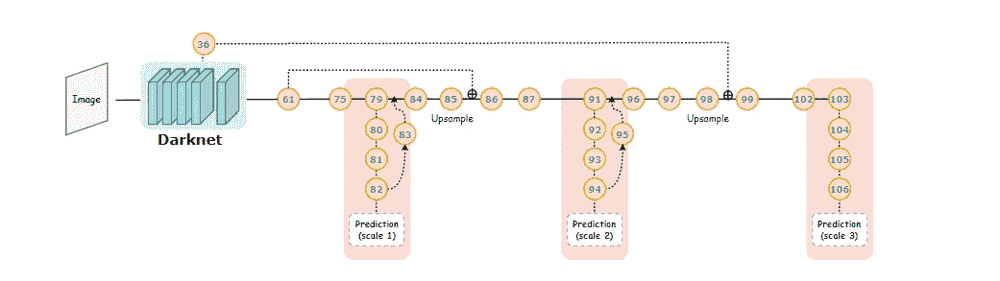

The architecture of YOLO Ver.3\. Let’s start from its tail where the predictions are made!

整个网络架构如上图。圆圈中的数字是层数。它使用 **Darknet-53** 作为它的基础网络，还有检测物体的附加层。让我们首先把注意力放在做出预测的尾部。YOLO 也是一个完全卷积网络，因此它通过卷积预测检测。经过几层后，对三种不同尺度的特征图进行 1x1 卷积检测。

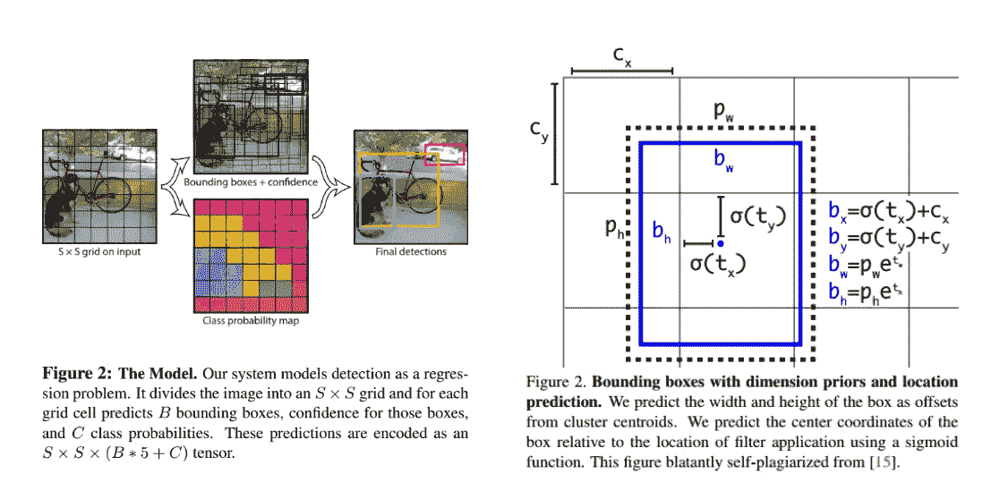

Figures from [Ver.1](https://arxiv.org/abs/1506.02640) (on the left) and [Ver.3](https://pjreddie.com/media/files/papers/YOLOv3.pdf) (on the right)

当具有 P 个通道的特征图的大小为 N×N 时，应用 1x1xP 大小的滤波器。YOLO 也有默认的包围盒(原文中称之为 ***锚点*** )。对于每个单元的每个框，预测 4 个边界框偏移值、对象性得分和类得分。客观性分数反映了该框包含一个对象的置信度。所以现在每个网格的预测数变成了 **5+C** 。所以如果盒子的数量是 **K** ，那么每一个音阶的滤镜总数就是 **(NxN)K(5+C)** 。

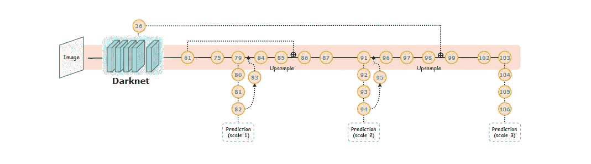

Now let’s see the main branch line. YOLO also operates in multi-scales like SSD, yet in a way a little bit different.

正如我所说的，随着深度的增加，特征地图的分辨率越来越小，当特征地图看到物体时，这会对比例产生影响。因此，为了实现多种比例，YOLO 只需通过一个穿透图层即可从上一个图层中获取更高分辨率的要素。ResNet 的快捷连接也是如此。

因此，在第 84 层，我们从前两层获取特征图，并将其向上采样 2 倍。然后，我们从第 36 层获得一个特征图，并将其与上采样特征连接起来。相同的过程在第 96 层重复一次，以得到最终的标度。通过这样做，我们可以在预测中添加更精细、更有意义的特征。

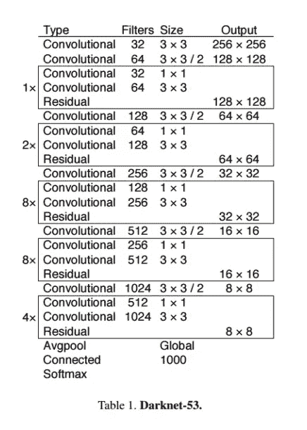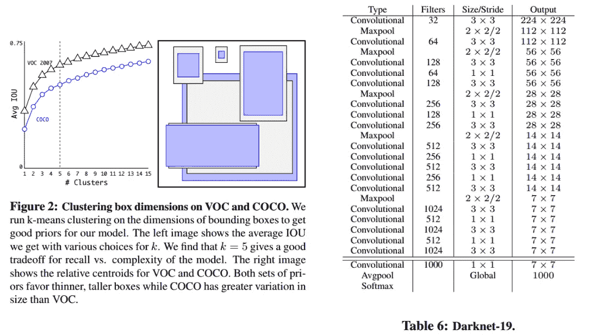

Figures from Ver.3 (on the left) and Ver. 2 (on the right)

第 1 版的基础网络是 AlexNet，第 2 版首次使用 Darknet，有 19 个卷积层。正如你在上面看到的，在第 3 版，这变成了 53 层。另一个值得一提的重要事情是，默认框是从 **K-means 聚类**中提取的，而不是手动选择的。网络在训练期间学会调整盒子，但是从一开始就有更好的先验知识肯定有助于网络。所以 YOLO 3 版通过聚类提取了 9 个默认框。通过连接前一层和一个穿透层的更高分辨率特征，与 SSD 相比，YOLO 可以更好地检测小物体。

# FPN

FPN 代表**特征金字塔网络**。在此之前已经研究并使用了具有金字塔结构的网络。而且 SSD 也是类似金字塔的结构(垂直旋转试试)。但不能说是严格如图所示的金字塔式特征层次。因为它是从更高的层次开始形成金字塔，而不是从低层次开始。(记得 VGG Conv5_3 是用于检测的第一层)

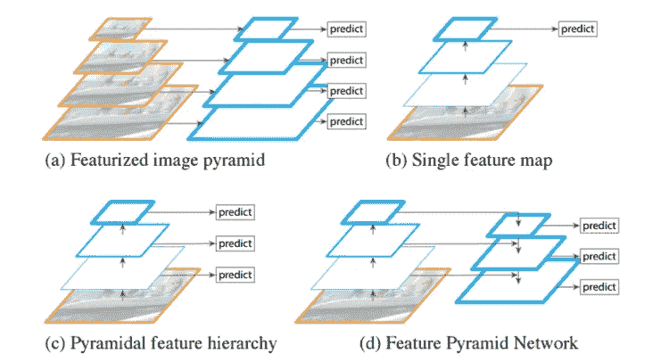

[Figures from FPN](https://arxiv.org/abs/1612.03144)

有这种架构有什么意义？可以在网络的更深层次中检测到物体的精确位置信息。相反，语义在较低的级别变得更强。(我们将在下一个系列中讨论这个问题)。当一个网络有一种更深入的方式时，没有多少语义数据可以用来在像素级别上对对象进行分类。因此，通过实现特征金字塔网络，我们可以产生来自所有级别的多尺度特征地图，并且来自所有这些级别的特征在语义上是强的。

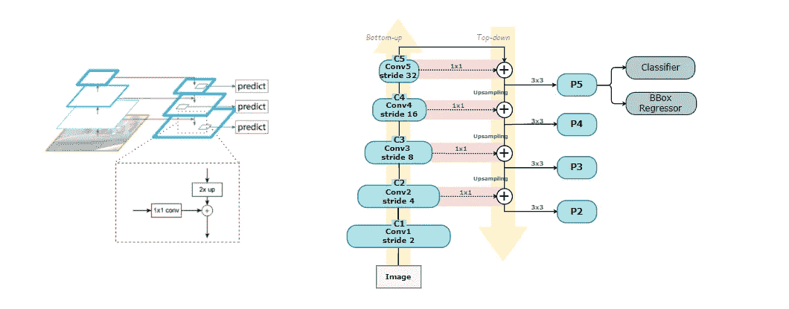

[The architecture of FPN](https://arxiv.org/abs/1612.03144)

FPN 的建筑如上图所示。有三个方向，自下而上，自上而下，横向。自底向上路径是原始论文中使用的主干 ConvNet 和 ResNet 的前馈计算。有 5 个阶段，并且每个阶段的特征图的大小具有 2 的缩放步长。他们按尺寸区分，我们称他们为 **C1、C2、C3、C4** 和 **C5** 。图层越高，沿自下而上路径的特征地图的大小就越小。

现在在级别 **C5** ，我们移动到自上而下的路径。上采样应用于每个级别的输出贴图。和具有来自自下而上路径的相同空间大小的对应地图，通过横向连接进行合并。在相加之前应用 1x1 卷积以匹配深度大小。然后，我们在合并的贴图上应用 3×3 卷积，以减少上采样的[混叠效应](https://en.m.wikipedia.org/wiki/Aliasing)。通过这样做，我们可以将低分辨率和语义强的特征(来自自顶向下路径)与高分辨率和语义弱的特征(来自自底向上路径)相结合。这意味着我们可以在所有尺度上拥有丰富的语义。如图所示，同样的过程被迭代并产生 **P2，P3 P4** 和 **P5** 。

现在网络的最后一部分是一个实际的分类。事实上，FPN 本身并不是一个物体探测器。探测器不是*内置的*，所以我们需要在这个阶段插入一个探测器。RPN 和 Fast R-CNN 在原图中使用，上图中只描绘了 RPN 情况下的 FPN。在 RPN 中，对象分类器和边界框回归器有两个兄弟层。所以在 FPN，这部分是附在 **P2、**P4、 **P5** 每一级的尾部。我在这里不会涉及太多，因为我选择 FPN 的原因是为了解释 RetinaNet。

# RetinaNet

RetinaNet 更多的是提出一个新的损失函数来处理类不平衡，而不是发布一个新颖的新网络。让我们再把阶层失衡带回来。SSD 和 YOLO 等一级检测器明显更快，但与两级检测器相比，精度仍然落后。而阶层失衡问题是造成这一弊端的原因之一。

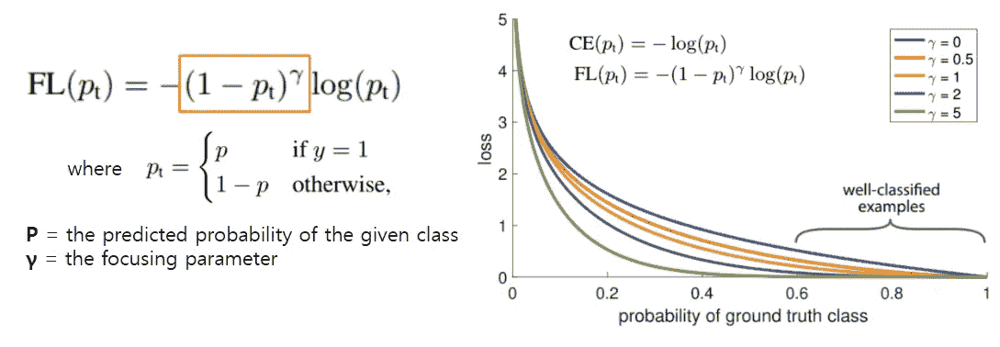

[Focal Loss](https://arxiv.org/abs/1708.02002)

因此，作者通过对简单的例子进行加权，提出了一个新的损失函数，称为**焦点损失**。数学表达式如上图。这是交叉熵损失乘以一个调节因子。调节因子减少了简单例子对损失的影响。

比如比较 ***Pₜ*** = 0.9 和 ***γ*** = 2 时的损耗。如果我们说交叉熵损失为 CE，那么焦点损失变成-0.01CE。损失变成低 100 倍。而如果 ***Pₜ*** 变大，比如说 0.968，用常数 ***γ*** ，焦损就变成了-0.001 ce(as(1–0.968)=(0.032)≈0.001)。因此，它把简单的例子写得更难，并调整不平衡作为回报。而当 ***γ*** 增加时，如右图所示，当 ***Pₜ*** 不变时，损耗随着重量的增加而变小。

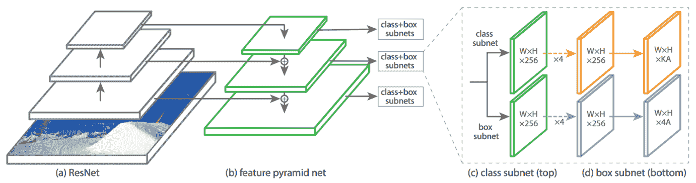

[The architecture of RetinaNet](https://arxiv.org/abs/1708.02002)

RetinaNet 的架构如上图。正如我们现在知道的 ResNet，RPN 的更快的 R-CNN 和 FPN，这里没有什么新的东西。网络可以分为两部分，一个主干网(a)和(b)，两个子网用于分类和盒回归。主干网由雷斯内特和 FPN 组成，金字塔有 **P3** 到 **P7** 级。

与 RPN 一样，也有先前的锚盒。锚的大小根据它的级别而变化。在 **P3** 处，锚*区域*为 32*32，在 **P7** 处为 512*512。锚有三种不同的比例和三种不同的大小，所以每个等级的锚 **A** 的数量为 9。因此，盒回归子网的输出维数为**(N×N)x 4A。**当数据集中的类别数为 **K** 时，分类子网的输出变为**(N×N)x KA**。

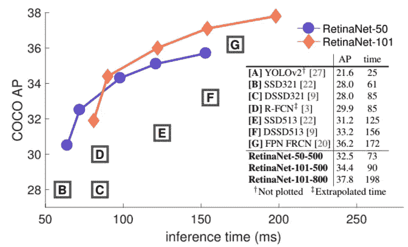

[Speed vs Accuracy on COCO dataset](https://arxiv.org/abs/1708.02002)

结果相当引人注目。RetinaNet 在准确性和速度上都超过了以前的所有网络。retina net-101–500 表示具有 ResNet-101 和 500 像素图像比例的网络。与所有两阶段方法相比，使用更大的规模可以获得更高的精度，同时也足够快。

# 减去

有两种对象检测网络，一级和两级。各有利弊。**两级网络**，比如更快的 R-CNN，虽然准确，但是对于实际应用来说不切实际。**一级网络**，如 SSD、YOLO，速度够快但准确率相对较低。这就是 RetinaNet 的动机，开发一个一阶段网络实现两个兔子。

对象检测应该在**多尺度**上工作，因为对象的尺度不是恒定的。我们看到了网络使用什么策略进行尺度不变检测。固态硬盘有多层，在某种程度上缩小了分辨率。YOLO 在多尺度中有 3 个层，具有上采样和直通层。FPN 和 RetinaNet 制作了一个自上而下和横向工作的金字塔。

类别不平衡是物体探测任务中的另一个问题。有几种方法可以解决这个问题。SSD 使用了**硬负挖掘**但是有一个主要的缺点，那就是我们只能使用收集到的一些例子。RetinaNet 提出的另一个解决方案是**聚焦损失**。通过添加权重参数，我们可以抑制简单示例的贡献，并且有效地使用所有示例。

# 参考

*   刘威等人[ [SSD:单次多盒探测器](https://arxiv.org/abs/1512.02325) ]，2016
*   Joseph Redmon 等人[ [你只看一次:统一的实时对象检测](https://arxiv.org/abs/1506.02640) ]，2016
*   约瑟夫·雷德蒙等人[ [YOLO9000:更好、更快、更强](https://arxiv.org/abs/1612.08242) ]，2016
*   聪-林逸等[ [特征金字塔网络用于物体检测](https://arxiv.org/abs/1612.03144) ]，2017
*   约瑟夫·雷德蒙等人[ [约洛夫 3:增量改进](https://pjreddie.com/media/files/papers/YOLOv3.pdf) ]，2018 年
*   聪-林逸等人[ [密集物体探测的焦损失](https://arxiv.org/abs/1708.02002) ]，2018 年

这个故事引起你的共鸣了吗？请与我们分享您的见解。我总是乐于交谈，所以请在下面留下评论，分享你的想法。我还在 LinkedIn**上分享有趣和有用的资源，欢迎随时关注并联系我。下次我会带来另一个有趣的故事。一如既往，敬请期待！**