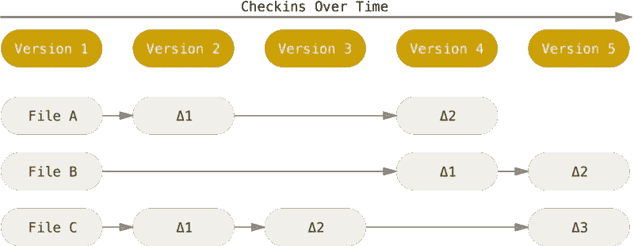
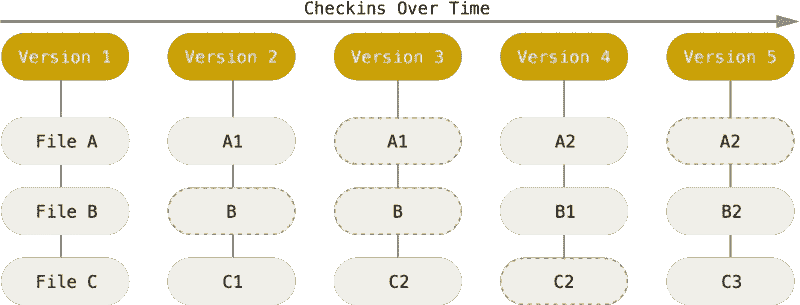
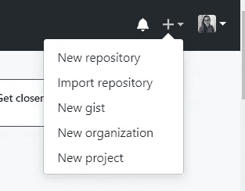
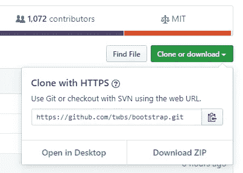

# 使用 Git 深入研究版本控制

> 原文：<https://towardsdatascience.com/deep-dive-into-version-control-using-git-f0f3018d10f9?source=collection_archive---------10----------------------->

## 掌握 Git 实现高效的代码开发和协作


Git 是一个免费的工具，它通过提供一个**分布式版本控制**系统来实现高效的代码修改。这是我开始学习编程时学到的最有用的工具之一。无论我是在从事我的业余项目、与朋友合作，还是在专业环境中工作，Git 都证明了自己非常有用。我能给你的最好的类比是在 Google Doc 这样的平台上为一个小组项目写一份报告。您的同事可以同时处理他们自己的报告部分，而不必直接修改您的部分。Git 通过允许您从主分支创建**分支**并让多人在一个项目上协作来实现这个目标。在完成安装过程后，我将解释什么是 Git 分支。如果您刚刚开始或只是独自编写项目代码，Git 仍然可以帮助您跟踪您的编码历史，恢复变更，并维护一个高效的工作流。

使用 Git 时，您有多种选择。我是在本科学习期间作为学生开始 Github 之旅的。注册成为学生的好处是可以在 Github Education 获得一个免费的私人 Github 帐户。如果你是学生，请点击这里查看[的交易。](https://education.github.com/pack)除了 Github，我还使用 Gitlab 进行项目合作。你可以选择 Github 或 Gitlab，因为它们都提供相似的功能。本教程将重点介绍如何设置 Github。如果你想将库从一个平台迁移到另一个平台，请参考迁移文档[这里](https://docs.gitlab.com/ee/user/project/import/github.html)或者下面的评论，我很乐意写一个关于它的教程。

# 装置

## Linux 操作系统

```
$ sudo apt install git-all
```

如果您有问题或者需要安装其他基于 Unix 的发行版，请访问这里的。

## 马科斯

首先，通过运行以下命令检查您是否已经安装了 Git:

```
$ git --version
```

如果您没有最新版本，应该会出现安装提示。否则，可以通过[这里的](https://git-scm.com/download/mac)获取最新版本的安装链接。

## Windows 操作系统

对于 windows，请点击[此处](https://git-scm.com/download/win)，下载将自动开始。这是 Git for windows，根据 Git 官方文档，Git for windows 不同于 Git 本身。Git windows 附带了 Git BASH，它有 BASH 模拟器，所以 Git 可以使用命令行特性在 windows 上轻松运行。这样，如果需要的话，您从在 windows 上运行 git 命令中获得的经验可以很容易地转移到其他系统。另一个[安装](https://desktop.github.com/)选项是安装 Github 桌面。

# 创建 Github 帐户

进入注册流程并创建一个账户:【https://github.com/join?source=header-home 

一旦你创建了一个 Github 帐户并登录，你现在可以创建**库**。存储库是您放置项目的地方。您可以决定每个存储库拥有一个项目，或者您可以拥有一个包含许多分支的存储库。对于后者，您的分支可以是相关的，但我见过用户在同一个存储库中创建不相关的分支，也称为孤儿分支。

# 分支

如果您是版本控制和 Git 的新手，这一切听起来会有点混乱。我喜欢把仓库想象成一顿饭。让我们把它当作感恩节晚餐。你的盘子里有火鸡、填料、蔓越莓酱和土豆泥。你将为自己提供各种食物的盘子就是储藏室。你可以选择拿起四个小盘子(四个储存库),把每样食物放在相应的盘子里。你的另一个选择可能是在一个更大的盘子(储存库)里为你自己提供四种食物中的每一种。分支是主分支的快照(主分支类似于我的项目的最接近的远景)。您获取这个特定的快照，并在不影响主分支的情况下添加额外的更改/特性。无论您喜欢哪种方法，您都可以选择使用 Git 以简洁明了的方式组织项目。我个人更喜欢用一个单一的存储库来代表一个项目，然后在这个项目的存储库中，我会创建一些分支来为我的项目添加特性。

一旦理解了 Git 数据存储的概念，Git 分支就更好理解了。当您做出更改并提交它们时，Git 将信息存储为一个对象，该对象保存了更改的快照。这是 Git 作为版本控制系统的一个特殊属性，因为其他版本控制系统将更改保存为基于文件的更改列表。

**其他版本控制系统**



Other Version Control Systems — [Image taken from git-scm](https://git-scm.com/book/en/v2/images/deltas.png)

**Git 存储数据**



Git storing data as a stream of snapshots — [image taken from git-scm](https://git-scm.com/book/en/v2/images/snapshots.png)

这意味着，一旦您初始化了本地存储库，Git 就会知道其中的任何和所有更改(下面将详细介绍初始化)。

# 州

在给定的分支中，您有文件，并且在任何给定的时间，您的文件可能处于以下三种状态之一:

1.  修改
2.  上演
3.  坚定的

*已修改*状态是指已经进行了更改，但没有任何更改被保存为其对应的快照。挑选修改过的文件，并将它们标识为您希望在下一个保存的快照中使用的项目，这被称为*暂存*。*提交*状态是指预期的更改安全地存储在本地数据库中。理解任何给定文件在本地存储库中的不同状态非常重要，这样才能安全地将更改推送到远程存储库。

# 创建您的第一个存储库

现在我们有了关于存储库和分支的背景知识，让我们创建我们的第一个存储库。点击右上角，打开“新建存储库”链接。



给存储库一个新名称，并选择隐私设置。此设置页面上的第三个选项使您能够使用自述文件初始化存储库。我们现在可以跳过它，但是 README.md 文件非常重要。这是一个文本文件，用户使用它来提供项目概述、功能、安装说明、许可证和学分。Github 将使用这个文件，如果可用的话，在主目录页面上为任何给定的存储库创建一个项目摘要。

一旦您创建了一个存储库，这就是所谓的远程存储库。Git 通常为您提供在本地创建新存储库或使用本地文件夹并将其初始化为存储库所涉及的选择和命令。对于本教程，假设已经有一个包含代码和文档的文件夹。您希望将内容添加到这个新创建的存储库中。

## 用本地文件填充远程存储库

```
$ git init
```

上面的命令在本地文件夹中创建一个空存储库，其中包含您要添加到远程存储库的文件。在将当前本地目录初始化为 git 存储库之后，如果您有文件存在于这个本地文件夹中，那么它们将处于*修改过的*状态(参见前面关于状态的讨论)。为了*暂存*这些修改过的文件，我们需要标记想要的文件。

因为我们是第一次添加到这个远程存储库中，所以您需要添加以下内容:

```
git remote add origin https://github.com/<username>/<your_repository_name>.git
```

对于此初始过程之后的提交，您可以使用以下命令之一添加文件:

```
$ git add <file_path>
# commit all files
$ git add .
```

此时，文件位于“暂存区”。

```
$ git commit -m “write your commit message here.”
```

文件现在应该安全地**提交**并记录到本地数据库。现在，提交最终可以通过以下方式推送到远程存储库:

```
$ git push
```

对于您的初始提交， *git push* 应该会毫无问题地推送您当前的更改。但是，可能会有多个分支的情况。您希望将所有本地分支推到一个特定的远程存储库。在这种情况下，请使用:

```
$ git push <remote> — all
```

随着你对 Git 的经验积累和项目的进展，你可能需要在 *git 推送*上使用 **— force** 标志。强烈建议只有在你对你的建议有绝对把握的时候才使用 **— force** 标志。

```
$ git push <remote> — force
```

当您推送您的更改时，Git 希望验证将更改推送至远程存储库的用户，并将要求您提供您在注册时创建的用户名和密码。如果您是全局用户，在全局 git 配置设置中配置用户名和密码，如下所示。

## 从远程存储库制作本地副本

上面的例子关注于这样一个场景，您在本地机器上完成了开发工作，然后您将这些工作推送到远程存储库。当您需要使用远程存储库的内容来开始本地开发时，情况正好相反。在这种情况下，您需要克隆感兴趣的存储库，为此，请确保您拥有访问权限。例如，您想使用 bootstrap 进行开发。你访问 bootstrap github 库:[https://github.com/twbs/bootstrap](https://github.com/twbs/bootstrap)。单击存储库上的克隆或下载按钮，复制远程存储库链接。



**克隆**存储库

```
$ git clone [https://github.com/twbs/bootstrap.git](https://github.com/twbs/bootstrap.git)
```

## 用远程中的更改更新本地副本

假设您已经提交了您的更改，但就在您的同事向同一分支机构提交更改之后。为了确保您的本地分支与这些变更保持同步，您需要将这些变更拉下来。

```
$ git pull <remote>
```

Git pull 通过使用(1) *git fetch* 和(2) *git merge* 从远程存储库中获取信息。获取从本地存储库与主分支发生分歧的节点开始。如果需要跟踪，您可以随时使用 *git fetch* 。Git fetch 下载本地存储库中没有的信息，然后 git merge 将这些信息集成到本地存储库中。另一个与 *git merge* 非常相似的命令是 *git rebase* 。使用 *git rebase* 优于 *git merge* 的主要优势在于，新信息的集成发生在分支上最后一次提交的末尾。这导致了更加线性的提交历史，而当使用 *git merge* 时，情况并非总是如此。在 *git pull* 的情况下，合并变更的第二个步骤也可以使用下面的代码与 rebase 交换:

```
$ git pull --rebase <remote>
```

当您对本地存储库进行更改时，您需要从远程存储库获取新的更改，切换到不同的分支，等等。您不希望您的本地更改受到直接影响，但是您希望有一个干净的工作树。在这种情况下，

```
# 1 - stash local changes
$ git stash
# 2 - pull remote changes 
$ git pull 
# 3 - view stashed list
$ git stash list
# 4 - access what you JUST stashed
$ git stash apply 
# 5 - access an older stash from the stashed list on #3
$ git stash apply <stashed-id-from-list>
```

在这一点上，你可能会问我们在 **git clone 和 git pull 中试图实现的目标有什么不同？**第一，他们的目的不同。 **Git 克隆**获取远程存储库中的信息并制作本地副本。这是一次性操作。 **Git pull** 是一个命令，用于在远程分支更新时更新您的本地变更库。这将不止一次使用，最好是在您的本地分支落后的情况下提交变更的任何时候使用。

# Git 配置

我们提到，在提交期间，Git 想要验证用户将变更提交到存储库的细节。每次提交时总是输入用户名和密码，这可能会变得重复。使用 Git 全局配置文件，您可以执行一些修改来减少重复性。

1.  用户名:

```
$ git config — global user.name <username>
```

2.电子邮件:

```
$ git config — global user.email <email>
```

3.错认假频伪信号

```
$ git config --global alias.<alias> <git-command>
```

例如，将 *git 状态*别名化为 *git s:*

```
$ git config --global alias.s status
```

可能需要查看和手动编辑 git 用来保存上述指令的配置文件。

4.访问全局配置文件

```
$ git config --global --edit
```

# 查看历史记录

Git 最有用的特性之一是能够方便地查看您的提交历史，并不断地总结您的工作。工作日中，干扰时有发生。能够简单地运行 commit log 命令并查看整个提交历史有助于您获得所有更改的摘要。

```
$ git log
```

如果您只是运行 *git log* 命令，人眼可能会有点难以理解结果。但是，我们有修饰日志、传递单行提交消息和添加图形元素的选项。

```
# --all shows you the log history in its entirety
# --oneline compresses the commit messages to a single line. 
# --decorate adds branch names and tags from commits
# --graph is a textual graph representation$ git log --all --decorate --oneline --graph
```

按模式搜索提交日志是另一个有用的特性。如果您想在一个有许多协作者的项目中找到您自己提交的特定变更，请执行以下操作:

```
$ git log — authors=<username>
```

如果是包含特定短语或模式的提交消息，请使用以下内容进行搜索:

```
$ git log --grep=”<pattern>”
```

每次提交的特定文件的更改可以用 stat:

```
$ git log --stat
```

# 改变历史

## 重定…的基准

使用 rebase，您也可以更改提交时间线。通常建议不要对已经被推送到公共存储库的提交进行重新排序。只传递 git rebase 将从当前分支获取提交，并自动将它们应用到传递的分支。我个人很欣赏交互式的基础特性，在这里你可以决定如何将提交转移到一个新的基础上。

```
# rebase current branch onto base(tag, commit ID, branch name, etc.)
$ git rebase <base>
# interactive changes
$ git rebase -i <base>
```

## 更改最后一次提交

历史最频繁的修改与更改最后的提交有关。在临时环境中，您可以决定不希望添加某个:

```
# change last commit message
$ git commit --amend
```

根据 Git 文档，建议您小心使用这个命令，并像对待一个小的 rebase 一样对待它。**如果你已经推动了你的改变，就不要修改了。**

## 从提交历史记录中删除文件

假设你养成了用 *git add 添加所有变更的习惯。*不小心添加了一个您想从所有提交历史中删除的敏感文件。使用分支过滤器流程，您可以实现以下目标:

```
$ git filter-branch --tree-filter 'rm -f sensitive_file.txt' HEAD
```

# 添加. gitignore

如果您创建了一个名为**的文件，上述场景就不会发生。gitignore** 并将你的“sensitive_file.txt”列为该文件中的一项。在您的本地目录中创建这个文件，然后添加备份文件、配置等。将使您免于将混乱推送到您的远程存储库。除了特定的文件名，您还可以指定模式。比如你有 ***。txt** 在你的。gitignore 文件，它将忽略所有文本文件。

# 观察差异

当前工作目录中的更改可以直接与远程分支上的最后一次提交进行比较:

```
$ git diff HEAD
```

HEAD 是指您所在的分支中的最后一次提交。

# 撤消更改

到目前为止，我们已经彻底讨论了 git 文件的三种不同状态。其中一个状态是 **staging。**如果您想要撤消暂存文件，请使用

```
$ git reset
# to reset specific files use a file path
$ git reset <file>
```

一旦分支被推送，我们仍然可以通过使用 **revert 更改特定的提交来撤销。**下面显示的<提交>参数是一个具体的提交参考。用 git log(如上所述)观察您的提交日志，然后对下面的命令使用 commit ref。

```
$ git revert <commit>
```

# 结论

从学习创建 Git 库到理解如何撤销我们的“错误”,我们已经走过了漫长的道路。理解 Git 并习惯本文中的命令列表可能需要一段时间，但这只是时间和实践的问题。如果有特定的命令无法记住，使用我们讨论过的**别名**方法(参见 Git 配置一节)。即使您目前没有使用 Git 的项目，也可以创建一个模拟存储库，并使用文本文件进行练习。确保你的项目用 **README.md** (参见创建你的第一个存储库一节)很好地记录，并且**经常提交**。有了这个教程，你就有足够的知识来进行项目合作，改变你的项目历史，并保持一个完美的投资组合。