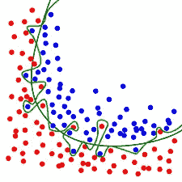
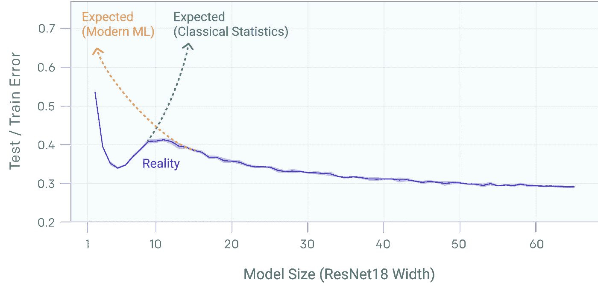
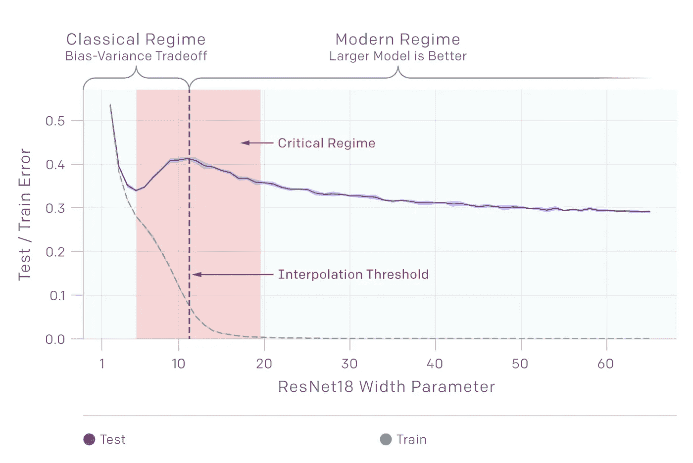
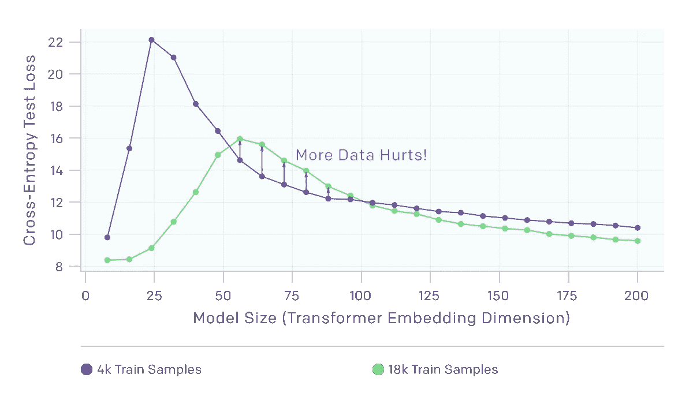
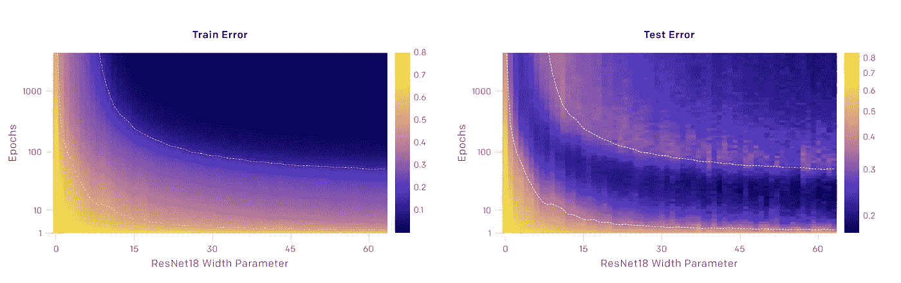

# 深度双重下降:当更多的数据是一件坏事

> 原文：<https://towardsdatascience.com/deep-double-descent-when-more-data-and-bigger-models-are-a-bad-thing-3a3f108d5538?source=collection_archive---------13----------------------->

## 解决经典统计学和现代 ML 建议之间的根本冲突

Photo by [Franki Chamaki](https://unsplash.com/@franki?utm_source=medium&utm_medium=referral) on [Unsplash](https://unsplash.com?utm_source=medium&utm_medium=referral)

最近偶然看到一篇[非常有意思的论文](https://arxiv.org/abs/1912.02292)写于 OpenAI，题目是深度双下降。该论文触及了训练机器学习系统和模型复杂性的本质。我希望在这篇文章中以一种可接近的方式总结本文中的观点，并推进对模型大小、数据量和正则化之间权衡的讨论。

## 问题是

统计学习和现代最大似然理论之间存在着根本的冲突。经典统计学认为*太大的模型是不好的。*这是因为复杂的模型更容易过度拟合。事实上，经典统计学中经常应用的一个强有力的定理是[奥卡姆剃刀](https://papers.nips.cc/paper/1925-occams-razor.pdf)，其本质是说 t *最简单的解释通常是正确的*。

这可以用一个可视化来清楚地解释。

The green line is an example of a model overfitting the training data, while the black line is a simpler model that approximates the true distribution of the data.

尽管复杂性和可推广性之间存在明显的权衡，但你经常会看到现代 ML 理论认为*更大的模型更好。有趣的是，这种说法在很大程度上似乎奏效了。来自世界上一些顶级人工智能研究团队的研究，包括来自谷歌和微软的团队，表明更深层次的模型尚未饱和。事实上，通过实施仔细的正则化和早期停止，似乎通常情况下，将您的模型的性能提高几个点的最佳方法是简单地添加更多的层或收集更多的训练数据。*

## 深度双重下降

OpenAI 论文的焦点提供了经典统计学和现代 ML 理论之间的矛盾的实际调查。

Empirical evidence shows that the truth of how modern machine learning systems work is a mixture of both classical statistics and modern theory.

深度双下降是指性能提高，然后随着模型开始过度拟合而变得更差，最后随着模型大小、数据大小或训练时间的增加而进一步提高的现象。上图以图形方式说明了这种行为。

深度双下降现象在模型的复杂性、数据量和训练时间方面有多种含义。

**有时，更大的型号更糟糕**

Before the model hits the interpretation threshold, there is a bias-variance tradeoff. Afterwards, the current wisdom of “Larger models are better” is applicable

在对 ResNet18 进行实验时，OpenAI 的研究人员发现了一个关于偏差和方差之间权衡的有趣笔记。在模型的复杂性超过**插值阈值**之前，或者模型刚好大到足以适合训练集的点之前，较大的模型具有较高的测试误差。然而，在模型的复杂性允许它适合整个训练集之后，具有更多数据的更大模型开始表现得更好。

似乎有一个复杂的区域，在那里模型更容易过度拟合，但是如果在模型中捕捉到足够的复杂性，模型越大越好。

**有时，样本越多越糟糕**

There’s a point where models with more data actually perform worse on the test set. Again, however, there is a point near the interpolation threshold at which this reverses.

有趣的是，对于低于插值阈值的模型，似乎更多的训练数据实际上会在测试集上产生更差的性能。然而，随着模型变得更加复杂，这种权衡发生了逆转，现代智慧“数据越多越好”开始再次适用。

一个有效的假设是，不太复杂的模型可能无法捕获太大训练集中所需的一切，因此无法很好地推广到看不见的数据。然而，随着模型变得足够复杂，它能够克服这个限制。

**有时，训练时间越长，过度适应就会消失**

在上面关于被训练的时期数的图表中，训练和测试误差首先随着时期数的增加而急剧下降。最终，随着模型开始过度拟合，测试误差开始增加。最后，随着过度拟合奇迹般地被消除，测试误差再次减小。

在论文中，研究人员称之为划时代的双重下降。他们还注意到，测试误差的峰值正好在插值阈值处。这里的直觉是，如果一个模型不是非常复杂，那么只有一个模型最适合训练数据。如果模型符合噪声数据，其性能将大幅下降。但是，如果模型复杂到足以通过插值阈值，则有几个模型适合训练集和测试集，并且随着训练时间的延长，可以近似这些模型中的一个。发生这种情况的原因是一个公开的研究问题，并且对训练深度神经网络的未来非常重要。

如果你对这个研究问题感兴趣，看看启发了这篇文章的[论文](https://arxiv.org/pdf/1912.02292.pdf)和[相关总结](https://openai.com/blog/deep-double-descent/)。