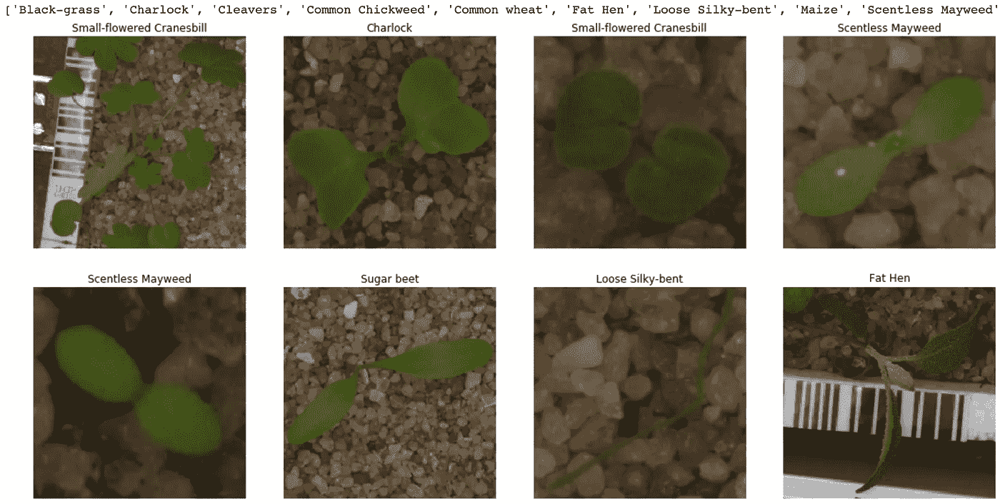
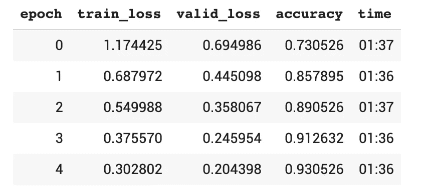

# CNN 内心深处:是不是听起来太复杂了？让我们用热图来观察体重吧！

> 原文：<https://towardsdatascience.com/deep-down-in-cnn-does-it-sound-too-complicated-lets-observe-weights-with-a-heatmap-ef666b4954f2?source=collection_archive---------14----------------------->


Source: Freepik

大家好！

我们都使用一些深度学习工具为我们的项目创建应用程序。因为在我们的时代，构建计算机视觉应用非常容易，不像过去的时代，有时这些工具会阻止我们学习算法的工作机制。

> 我们相信理解它如何工作的最好方法，就是在它工作的时候观察它！

因此，我们将实验 CNN 如何工作，以及它如何使用热图进行分类。这将使我们更好地理解神经网络中使用的卷积，以及权重在我们算法中的重要性。

在这个例子中，我们将遵循 Fastai DL-1 课程中的说明。多亏了他们的 [*让神经网络再次变得不酷*](https://www.fast.ai/) ！

# **帖子的上下文:**

1.  **选择数据集**
2.  **探索性数据分析和数据扩充**
3.  **创建模型和学习者**
4.  **培训**
5.  **使用热图分析结果**

# **1。选择数据集**

当尝试新事物时，最好的方法是使用预清洗数据集。因为我们不想在为模型清理和准备数据时失去动力。寻找高质量数据集以尝试新事物的最佳地点是[](https://www.kaggle.com/)*！*

*在这个例子中，我使用了一个名为 [*植物幼苗分类*](https://www.kaggle.com/c/plant-seedlings-classification) 的图像分类数据集。我想简单解释一下我为什么选择这个数据集；因为这是一个平衡的分类问题，而且竞赛的目的也适合我的算法。*

*在这次比赛中，我们被要求创建一个模型，成功地完成属于 12 个不同物种的图像的分类任务。该数据集包含 960 幅图像。*

**

*Images from different species in the dataset.*

*我选择这个数据集的另一个原因是，对我来说，从这些图像中分类植物类型似乎是一项艰巨的任务。它们看起来非常熟悉，而且有着相同的背景(土壤)，我认为这种算法不会真正成功地识别植物类别。我真的很想知道卷积在这个特定问题中是如何工作的。*

# ***2。探索性数据分析和数据扩充***

*在决定库、架构和其他项目需求之前，最重要的步骤是探索数据集。虽然 Kaggle 竞争数据集确实准备充分，但作为一名数据科学家，在创建解决方案之前，您始终需要首先了解问题。*

```
*tfms = get_transforms(flip_vert=True, max_lighting=0.1, max_zoom=1.05, max_warp=0.)
data = ImageDataBunch.from_folder(
    path = path,
    valid_pct = 0.2,
    bs = 16,
    size = 224,
    ds_tfms = tfms,
).normalize(imagenet_stats)
data
print(data.classes)
data.show_batch()*
```

**

*因此，在观察了来自我们数据集的图像后，我准备了一个数据模型用于训练。在这里，我想简单解释一下我在这篇代码博客中所做的事情:*

*   *首先，我决定了数据增强规格。我应用了垂直翻转和一些扭曲来增强图像。另外，由于一些图像比较暗，而且有微小的植物，我使用了一些灯光效果和缩放。*
*   *为了观察我的训练，我留出了 20%的数据集作为验证。*
*   *我在这个任务中使用了迁移学习，所以用 imagenet 统计数据对图像进行了标准化。也像原始 imagenet 数据集一样调整它们的大小。*

# ***3。创建模型和学习者***

*Fastai 是一个非常棒的深度学习库，具有易于使用和理解的特点。在这个实验中，我使用了一个 *CNN 学习器*来训练我的模型。所以我们在图书馆有一个很棒的功能叫做 *cnn_learner()* 。但我们不仅仅是复制和粘贴代码的工具用户；我们想深入了解桥下到底发生了什么。我们的库中还有另一个名为 *doc()* 的函数。那么让我们用它来理解 cnn_learner()函数:*

```
*doc(cnn_learner)Result:cnn_learner(**data**:[DataBunch](https://docs.fast.ai/basic_data.html#DataBunch), **base_arch**:Callable, **cut**:Union[int, Callable]=***None***, **pretrained**:bool=***True***, **lin_ftrs**:Optional[Collection[int]]=***None***, **ps**:Floats=***0.5***, **custom_head**:Optional[[Module](https://pytorch.org/docs/stable/nn.html#torch.nn.Module)]=***None***, **split_on**:Union[Callable, Collection[ModuleList], NoneType]=***None***, **bn_final**:bool=***False***, **init**=***'kaiming_normal_'***, **concat_pool**:bool=***True***, ********kwargs**:Any)*
```

> *所以现在我们可以研究这个函数中的每个变量了！*

*之后，我们可以创建我们的学习者。在这个问题中，我并不关注准确性。我想要一个好的结果，但不会花太多时间进行微调和其他步骤。我选择了一个预先训练好的模型，它是 resnet34。该模型有 34 层，在 imagenet 数据集上进行训练。由于我的任务中有植物，我相信结果对我来说足够了。*

*让我们创建学习者:*

```
*learn = cnn_learner(data, models.resnet34, metrics=accuracy)*
```

# *4.培养*

*我们准备了模型和学习者。现在是决定学习速度的时候了。为此，我们将使用另一个强大的函数:*

```
*learn.recorder.plot()*
```

**

*Learning rate plot.*

*让我们来训练这个模型:*

```
*lr = 0.01
learn.fit_one_cycle(5, slice(lr))*
```

**

*Training result.*

*我们有 93%的准确率，这对我来说足够了。如果我参加这次比赛，我会使用一个更复杂的架构，并进行微调，还会进行一些数据预处理，但因为我们专注于了解正在发生的事情，所以这个结果已经足够了。*

# ***5。使用热图**分析结果*

*为了准备热图函数，我们使用了另一个很棒的 Fastai 规范。在库中，我们有回调和钩子库，用它们我们可以研究训练，如反向传播，并对它们进行评估。*

```
*def show_heatmap(hm):
    _,ax = plt.subplots()
    xb_im.show(ax)
    ax.imshow(hm, alpha=0.6, extent=(0,224,224,0),
              interpolation='bilinear', cmap='magma')*
```

*我使用 0.6 alpha 值和 magma 方法为我们的 224–224 像素大小的图像创建了热图函数。让我们在一张图片上试试:*

```
*show_heatmap(avg_acts)*
```

**

*Heatmap on an example image.*

*结果比我想的要好。图像左上方的土壤对结果几乎没有影响。这很好，因为在那个区域没有植物的任何部分。此外，我们可以清楚地看到，植物的中心对结果的影响最大。之后，位于图像右上方和左下方的植物外部对结果有很大影响。*

*热图是了解卷积函数内部情况的绝佳可视化工具。我们可以将它们应用到其他研究领域。*

*这篇文章旨在用一种有趣的方法来解释卷积中的权重。我会继续写其他的例子。请和我分享你的想法！*