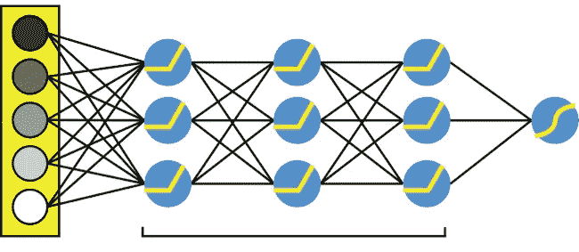
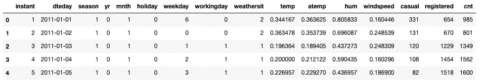
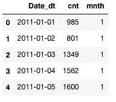
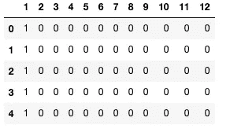
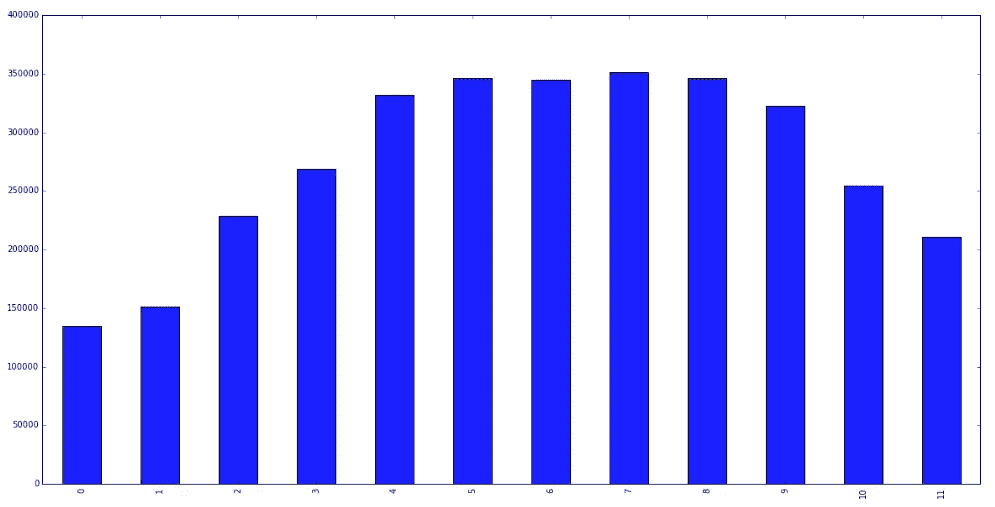
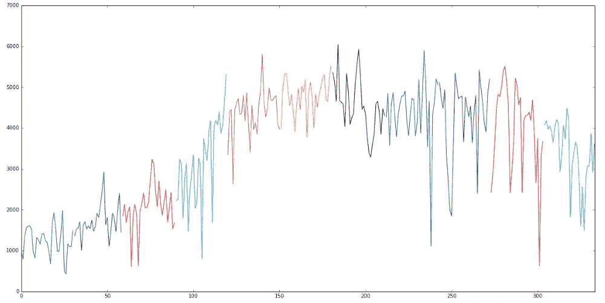
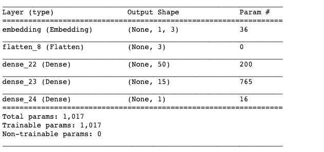
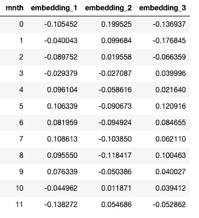
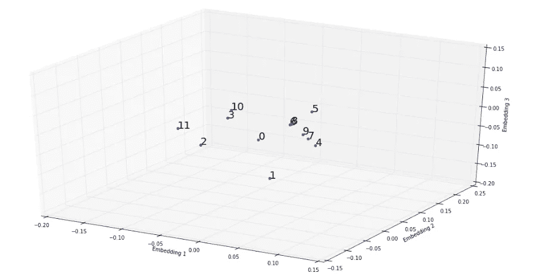

# 分类变量的深度嵌入(Cat2Vec)

> 原文：<https://towardsdatascience.com/deep-embeddings-for-categorical-variables-cat2vec-b05c8ab63ac0?source=collection_archive---------3----------------------->

## 对表格数据使用深度学习



在这篇博客中，我将带你了解在 keras 上使用深度学习网络创建分类变量嵌入的步骤。这个概念最初是由杰瑞米·霍华德在他的 fastai 课程中提出的。更多[详情](https://www.fast.ai/2018/04/29/categorical-embeddings/)请看链接。

## 传统嵌入

在我们使用的大多数数据源中，我们会遇到两种主要类型的变量:

1.  **连续变量:**通常是整数或十进制数，有无限多的可能值，如计算机存储单元，如 1GB、2GB 等..
2.  **分类变量:**这些是离散变量，用于根据某些特征分割数据。例如计算机存储器的类型，即 RAM 存储器、内部硬盘、外部硬盘等。

当我们建立一个最大似然模型的时候，在我们能够在算法中使用它之前，我们需要转换分类变量。所应用的转换对模型的性能有很大的影响，尤其是当数据具有大量高基数的分类要素时。应用的一些常见转换示例包括:

**One-Hot encoding:** 这里我们将每个类别值转换成一个新列，并为该列分配一个`1`或`0` (True/False)值。

**二进制编码**:这创建了比一个热点更少的特性，同时保留了列中值的一些唯一性。它可以很好地处理高维有序数据。

然而，这些通常的变换并不能捕捉分类变量之间的关系。有关不同类型的[编码方法](https://www.datacamp.com/community/tutorials/categorical-data)的更多信息，请参见以下链接。

# 数据

为了演示深度嵌入的应用，让我们以 Kaggle 的[自行车共享](https://www.kaggle.com/contactprad/bike-share-daily-data)数据为例。这里的也链接到 git 回购。



Data — Bike Sharing

正如我们所看到的，数据集中有许多列。为了演示这个概念，我们将只使用来自数据的 **date_dt、cnt** 和 **mnth** 列。



Selected Columns

传统的**一键编码**会产生 12 列，每个月一列。然而，在这种类型的嵌入中，一周中的每一天都具有同等的重要性，并且每个月之间没有关系。



One hot encoding of the mnth column

我们可以在下图中看到每个月的季节性模式。正如我们所见，第 4 到 9 个月是高峰期。0 月、1 月、10 月和 11 月是自行车租赁需求较低的月份。



Monthly Seasonality

此外，当我们用不同的颜色表示每个月的日使用量时，我们可以看到每个月内的一些周模式。



Daily usage trends

理想情况下，我们期望通过使用嵌入来捕获这种关系。在下一节中，我们将使用构建在 keras 之上的深层网络来研究这些嵌入的生成。

## **深度编码**

代码如下所示。我们将建立一个具有密集层网络和“relu”激活功能的感知器网络。

网络的输入，即' **x** '变量是月份号。这是一年中每个月的数字表示，范围从 0 到 11。因此，input_dim 被设置为 12。

网络的输出，即' **y** '是' cnt '的缩放列。然而，可以增加“y”以包括其他连续变量。这里我们使用一个连续变量，我们将输出密集层的最后一个数字设置为 1。我们将为 50 个迭代或时期训练模型。

```
embedding_size = 3model = models.Sequential()
model.add(Embedding(input_dim = 12, output_dim = embedding_size, input_length = 1, name="embedding"))
model.add(Flatten())
model.add(Dense(50, activation="relu"))
model.add(Dense(15, activation="relu"))
model.add(Dense(1))
model.compile(loss = "mse", optimizer = "adam", metrics=["accuracy"])
model.fit(x = data_small_df['mnth'].as_matrix(), y=data_small_df['cnt_Scaled'].as_matrix() , epochs = 50, batch_size = 4)
```

## 网络参数



Model Summary

**嵌入层:**我们在这里指定分类变量的嵌入大小。在本例中，我使用了**3****，**如果我们增加这个值，它将捕获分类变量之间关系的更多细节。杰瑞米·霍华德建议采用以下方法来选择嵌入尺寸:

```
# m is the no of categories per featureembedding_size = min(50, m+1/ 2)
```

我们使用一个具有均方误差损失函数的“adam”优化器。Adam 优于 sgd(随机梯度下降),因为它的自适应学习速率更快更优化。你可以在这里找到关于不同类型优化器[的更多细节。](https://machinelearningmastery.com/adam-optimization-algorithm-for-deep-learning/)

## **结果**

每个月的最终嵌入结果如下。这里“0”代表一月，“11”代表十二月。



Embedding Table

当我们用一个 3D 图将它可视化时，我们可以清楚地看到月份之间的关系。具有相似“计数”的月份更接近地分组在一起，例如，第 4 个月到第 9 个月彼此非常相似。



Embeddings — Months of the year

## **结论**

总之，我们已经看到，通过使用 Cat2Vec(类别变量到向量),我们可以使用低维嵌入来表示高基数类别变量，同时保留每个类别之间的关系。

在接下来的几篇博客中，我们将探讨如何使用这些嵌入来构建具有更好性能的监督和非监督机器学习模型。