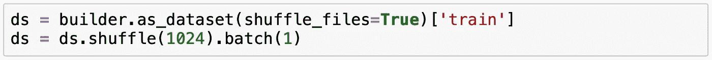
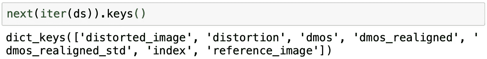
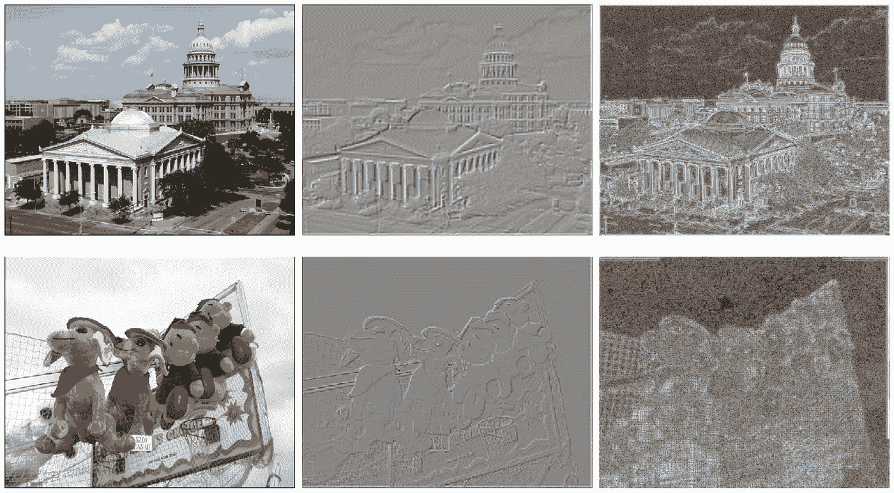
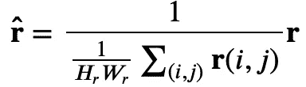

# Python 中基于深度 CNN 的图像质量盲预测器

> 原文：<https://towardsdatascience.com/deep-image-quality-assessment-with-tensorflow-2-0-69ed8c32f195?source=collection_archive---------10----------------------->

# 介绍

在本教程中，我们将实现 Jongio Kim、Anh-Duc Nguyen 和 Sanghoon Lee [1]提出的*基于深度 CNN 的盲图像质量预测器(DIQA)* 方法。此外，我将介绍以下 TensorFlow 2.0 概念:

*   使用 *tf.data.Dataset* 构建器下载并准备数据集。
*   使用 *tf.data* API 定义一个 TensorFlow 输入管道来预处理数据集记录。
*   使用 *tf.keras* 函数 API 创建 CNN 模型。
*   为客观误差图模型定义自定义训练循环。
*   训练客观误差图和主观评分模型。
*   使用训练好的主观评分模型进行预测。

*注:部分功能在*[*utils . py*](https://github.com/ocampor/image-quality/blob/master/notebooks/utils.py)*中实现，不在本指南讨论范围内。*

## 迪迦是什么？

DIQA 是一项原创提案，专注于解决将深度学习应用于图像质量评估(IQA)的一些最受关注的挑战。相对于其他方法的优势是:

*   该模型不限于专门处理自然场景统计(NSS)图像[1]。
*   通过将训练分为两个阶段(1)特征学习和(2)将学习到的特征映射到主观分数，防止过度拟合。

## 问题

生成 IQA 数据集的成本很高，因为它需要专家的监督。因此，基本的 IQA 基准仅由几千条记录组成。后者使深度学习模型的创建变得复杂，因为它们需要大量的训练样本来进行归纳。

例如，让我们考虑最频繁使用的数据集来训练和评估 IQA 方法 [Live](https://live.ece.utexas.edu/research/quality/subjective.htm) ， [TID2008](http://www.ponomarenko.info/tid2008.htm) ， [TID2013](http://www.ponomarenko.info/tid2013.htm) ， [CSIQ](http://vision.eng.shizuoka.ac.jp/mod/page/view.php?id=23) 。下表包含每个数据集的总体摘要:

其中任何一个样本的总量都不超过 4，000 条记录。

# 资料组

IQA 基准只包含有限数量的记录，可能不足以训练 CNN。然而，出于本指南的目的，我们将使用[实时](https://live.ece.utexas.edu/research/quality/subjective.htm)数据集。它由 29 幅参考图像和 5 种不同的失真组成，每种失真有 5 种严重程度。

**Fig 1\.** An example of a reference image in Live dataset.

第一项任务是下载和准备数据集。我为图像质量评估创建了几个 TensorFlow 数据集构建器，并在[图像质量](https://github.com/ocampor/image-quality)包中发布了它们。构建器是由 [tensorflow-datasets](https://www.tensorflow.org/datasets) 定义的接口。

*注意:由于数据集的大小(700 兆字节)，这个过程可能需要几分钟。*

下载并准备好数据后，将构建器转换成数据集，并对其进行洗牌。请注意，批次等于 1。原因是每个图像都有不同的形状。增加批量大小将导致错误。

输出是发电机；因此，使用括号运算符访问样本会导致错误。有两种方法可以访问发生器中的图像。第一种方法是将生成器转换成迭代器，并使用 *next* 函数提取单个样本。

输出是包含失真图像、参考图像和主观分数(dmos)的张量表示的字典。另一种方法是通过 for 循环从生成器中提取样本:

# 方法学

## 图像标准化

DIQA 的第一步是预处理图像。图像被转换成灰度，然后应用低通滤波器。低通滤波器定义为:

其中低频图像是以下算法的结果:

1.  模糊灰度图像。
2.  将它缩小 1 / 4。
3.  把它放大到原来的大小。

这种标准化的主要原因是(1)人类视觉系统(HVS)对低频带的变化不敏感，以及(2)图像失真几乎不影响图像的低频分量。

**Fig 2.** On the left, the original image. On the right, the image after applying the low-pass filter.

## 客观误差图

对于第一个模型，使用客观误差作为代理，以利用数据增加的影响。损失函数由预测误差图和地面真实误差图之间的均方误差定义。

而 *err( )* 可以是任何误差函数。对于这种实现，作者建议使用

用 *p=0.2* 。后者是为了防止误差图中的值很小或接近零。

**Fig 3.** On the left, the original image. In the middle, the pre-processed image, and finally, the image representation of the error map.

## 可靠性地图

根据作者的说法，该模型很可能无法预测具有同质区域的图像。为了防止它，他们提出了一个可靠性函数。假设模糊区域比纹理区域可靠性低。可靠性函数定义为

其中α控制可靠性图的饱和特性。sigmoid 的正部分用于将足够大的值分配给低亮度的像素。

之前的定义可能会直接影响预测得分。因此，使用平均可靠性图来代替。

对于 Tensorflow 函数，我们只需计算可靠性图，并除以其均值。

**Fig 4.** On the left, the original image, and on the right, its average reliability map.

## 损失函数

损失函数被定义为可靠性图和客观误差图之间的乘积的均方误差。误差是预测误差图和地面实况误差图之间的差异。

损失函数要求将误差乘以可靠性图；因此，我们不能使用默认的 loss 实现*TF . loss . meansquaerror*。

创建自定义损耗后，我们需要告诉 TensorFlow 如何区分它。好的一面是我们可以利用[自动微分](https://www.tensorflow.org/tutorials/customization/autodiff)使用 *tf。梯度胶带*。

## 【计算机】优化程序

作者建议使用学习速率为 *2e-4* 的那达慕优化器。

# 培养

## 客观误差模型

对于训练阶段，利用 *tf.data* 输入管道来生成更清晰易读的代码是很方便的。唯一的要求是创建应用于输入的函数。

然后，将 *tf.data.Dataset* 映射到 *calculate_error_map* 函数。

几乎很快就可以应用转换。原因是处理器还没有对数据执行任何操作，它是按需发生的。这个概念通常被称为[懒惰评估](https://wiki.python.org/moin/Generators)。

到目前为止，已经实施了以下组件:

1.  预处理输入并计算目标的生成器。
2.  定制训练循环所需的损失和梯度函数。
3.  优化器功能。

唯一缺少的是模型的定义。

**Fig 5.** The architecture for the objective error map prediction. The red and blue arrows indicate the flows of the first and stage. Source: [http://bit.ly/2Ldw4PZ](http://bit.ly/2Ldw4PZ)

在上图中，描述了如何:

*   预处理后的图像进入卷积神经网络(CNN)。
*   它用 Relu 激活函数和“相同”填充进行 8 次卷积变换。这被定义为 f()。
*   f()的输出通过与线性激活函数的最后卷积来处理。这被定义为 g()。

对于自定义训练循环，有必要:

1.  定义度量标准来衡量模型的性能。
2.  计算损耗和梯度。
3.  使用优化器更新权重。
4.  印刷精度。

*注意:使用斯皮尔曼的等级相关系数(SRCC)或皮尔逊的线性相关系数(PLCC)作为准确性指标是一个好主意。*

## 主观评分模型

为了创建主观评分模型，让我们使用 f()的输出来训练回归变量。

使用 *tf.keras.Model* 的 fit 方法训练模型需要返回两个参数的数据集。第一个是输入，第二个是目标。

然后，*拟合*主观评分模型。

# 预言；预测；预告

使用已经训练好的模型进行预测很简单。在模型中使用*预测*方法即可。

# 结论

在本文中，我们学习了如何利用 tf.data 模块来创建易于阅读且节省内存的数据管道。此外，我们使用功能性 Keras API 实现了基于深度 CNN 的盲图像质量预测器(DIQA)模型。该模型通过使用 TensorFlow 的自动微分功能的自定义训练循环进行训练。

下一步是找到最大化 PLCC 或 SRCC 准确性度量的超参数，并评估模型相对于其他方法的整体性能。

另一个想法是使用更大的数据集来训练客观误差图模型，并查看最终的整体性能。

# Jupyter 笔记本

***更新 2020/04/15:*** *包图像质量和笔记本更新修复了 LiveIQA 和 Tid2013 TensorFlow 数据集的一个问题。现在一切正常，检查一下！*

 [## o import/图像质量

### Image quality 是一个用于自动图像质量评估(IQA)的开源软件库。该包是公共的…

github.com](https://github.com/ocampor/image-quality.git) 

# 文献学

[1] Kim，j .，Nguyen，A. D .，& Lee，S. (2019)。基于深度 CNN 的图像质量盲预测器。神经网络和学习系统汇刊。[https://doi.org/10.1109/TNNLS.2018.2829819](https://doi.org/10.1109/TNNLS.2018.2829819)