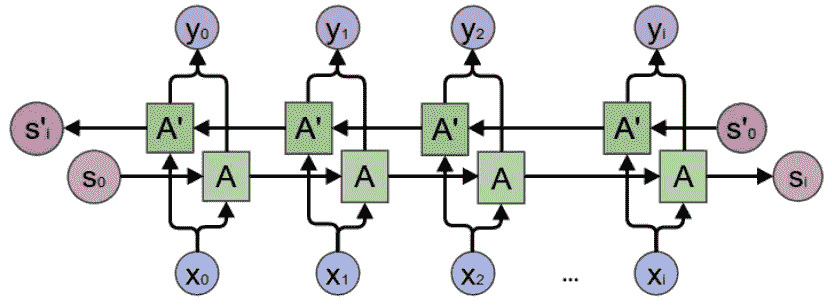
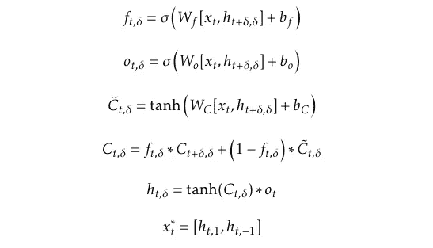
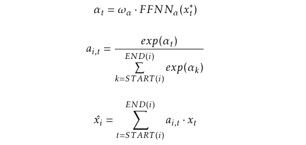
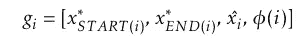
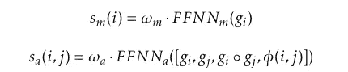
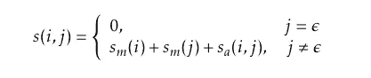
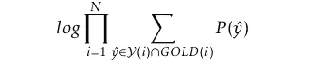
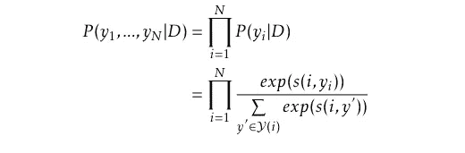
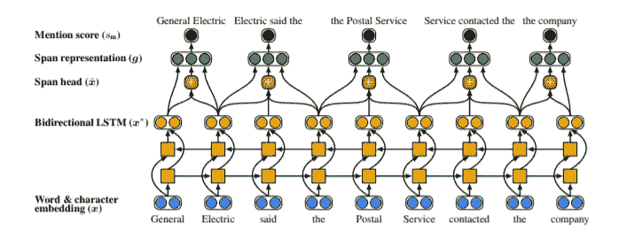
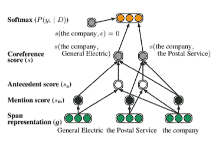

# 深入到端到端的神经共指模型

> 原文：<https://towardsdatascience.com/deep-into-end-to-end-neural-coreference-model-58c317cfdb83?source=collection_archive---------7----------------------->

Credit to Victor Vasarely

在之前关于端到端神经共指模型的文章中，我们已经看到了结果及其在 chatbot 上的应用。您想更深入地了解模型的工作原理吗？这篇文章将满足你的好奇心。

> 这篇文章包含了更详细的公式，但是我已经尽力使论文中理论部分的描述更容易理解。Medium 不支持上标、下标或类似 latex 的语法，这给阅读本文带来了一些不便。

在我们开始了解这个模型之前，关于共指的几个概念有助于我们的理解。

# 1.共指消解研究

一些重要的共指模型被建立起来，如提及对模型和提及排序模型。

## 1.1 提及对模型

提及对模型是受监督的。根据共指数据集，对名词短语共指进行标注。该模型提出了一个二元分类器来预测两个名词短语是否相关。然而，就以下问题而言，该模型并不实用。首先，不能保证共指关系中的传递性。然后，对于大多数非共指名词短语，非共指标签的数量远远多于共指标签。因此，带标签的数据集可能具有偏斜的类分布。为了实现该模型，需要特征、训练实例创建方法和聚类算法。

## 1.2 提及排名模型

给定一个要解决的 NP，提及排序模型考虑最可能的候选先行词。对于每个提及，计算该提及和先行候选项的成对共指得分。将选择得分最高的先行词来匹配该提及。成对共指得分由提及得分和先行得分组成。提及分数意味着表达式被提及的可能性。类似地，先行词得分表明先行候选词是该提及的真实先行词的可能性。机器学习方法从数据集中训练一些标准。这允许我们训练一个提及排序器，而不是对所有候选人的经历进行排序。提及排序模型优于提及对模型。但是，它不能利用集群级别的功能。

Rahman 和 Ng (2009)提出了另一种改进的聚类排序模型。不是仅对候选前因进行排序，而是对前面的聚类进行排序。提及排名模型的一个缺省是只对候选先行词进行排名，所以如果提及实际出现在某些候选先行词之前，非回指 NP 就会被错误解析。这不是我们所期望的。模型本身不能决定提及是否是回指。其他几个决议被提出来识别非照应名词短语。

## 1.3 最先进的共指消解模型

该论文(Clark 和 Manning，2016a)提出了一种基于神经网络的基于实体的模型，该模型为共指聚类对产生高维向量表示。该系统通过使用从学习到搜索的算法来学习如何使聚类合并，从而提供高分的最终共指划分。因为真实的观察依赖于先前的动作，所以在这种情况下不能支持共同的 i.i.d .假设。学习搜索算法可以通过优化策略分数来解决这个问题。最终结果是 F1 得分的平均值为 65.29%。

在 Clark 和 Manning (2016b)的论文中，通过两种方法优化了提及排名模型，即强化学习和奖励重标度最大利润目标。应用了 Clark 和 Manning (2016a)的论文中描述的相同提及排名模型。代替从学习到搜索的算法，强化学习被提议作为学习算法，以直接针对共指度量来优化模型。最后，使用奖励重标最大间隔目标的模型优于增强算法，也优于 Clark 和 Manning 的先前论文，在英语任务中给出 65.73%。

# 2.端到端神经共指模型

第一个端到端共指消解模型优于以前的最先进的模型，这些模型使用手动提及检测、语法分析器和大量特征工程。它将所有跨度(即表达式)视为潜在提及，并为每个跨度找出可能的前因。通过结合上下文相关的边界表示和头部寻找注意机制来表示跨度。对于每个跨度，跨度排序模型提供了前一个跨度是一个好的前因的决定。训练一个剪枝函数来消除较少可能的提及。最终模型是具有不同参数的 5 模型集合。与提及排序模型相比，跨度排序模型具有更大的发现提及空间。跨度由单词嵌入来表示。这些表示考虑了两个重要部分:围绕提及区间的上下文和区间内的内部结构。LSTMs 和字符上的一维卷积神经网络(CNN)由向量表示组成。代替通常在共指消解中使用的句法分析器，对每个区间中的词应用了一种寻找中心的注意机制。在学习过程中，黄金聚类中所有正确前件的边际对数似然被优化。在优化目标的过程中，跨度被修剪。设置跨度的长度、要考虑的前提的数量。并且对跨度进行排序，并且仅取那些具有最高提及分数的跨度。

集成模型的最终结果是 68.8%，优于以往的所有论文。现在，更好的结果是通过由粗到细推理的高阶共指消解给出的(Lee 等人，2018)。出于实际考虑，我们实现了端到端模型，而不是最新的模型。

## 2.1 任务介绍

端到端共指消解是为文档中每个可能的跨度构建的。任务是为每个跨度找出最可能的先行词 *yi* 。可能的前件集合是一个虚拟前件ε和所有前面的跨度。两种情况导致虚拟先行词ε: (1)跨度不是实体提及或(2)跨度是实体提及，但它不与任何先前的跨度共指。我们假设文档是 *D* ，它包含 *T* 个单词以及用于特性的元数据。文档中可能的
跨度数为 *N = T(T + 1) / 2* 。我们用 *START(i)* 和 *END(i)* 、 *1≤i≤N* 来表示 *D* 中一个区间 *i* 的开始和结束索引。

## 2.2 跨度表示

跨度表示是端到端神经共指模型的核心。强大的跨度表示可以提取提及跨度周围的上下文和跨度内部结构的语义和句法信息。该模型可以根据跨度表示提供的单词相似性来理解单词之间的关系。首先，矢量嵌入是至关重要的。每个单词都有它的向量嵌入。向量表示， *{x1，…，xT}* ，由固定的预训练单词嵌入(300 维手套嵌入和 50 维图瑞安嵌入)和字符上的 1 维卷积神经网络(CNN)组成。

## 2.3 双向 LSTMs

单向 LSTMs 只能感知来自过去的信息。但是，以前的词不能提供表达的所有信息或它所指的内容，这将造成歧义。而双向 LSTMs 可以获得过去和未来的信息。这对于共指消解来说是一个很大的优势，因为对单词之间关系的理解很大程度上依赖于周围的上下文。

除了具有两个 lstm 之外，双向 lstm 具有与 lstm 几乎相同的组件。其中一个接受正向序列，而另一个接受反向序列作为输入。该架构如图所示。

Bi-LSTMs — Credit to Colah’s Blog

双向 LSTMs 的每一层都是独立的 LSTMs。而输出是两个输出向量的连接。因此，双向 lstm 的公式不同于 lstm，因为它也取决于方向。我们假设方向由方向指示器δ= {-1，1}表示。

formulas of Bi-LSTMs

## 2.4 注意机制

句法中心是一段时间内最重要的句法信息，由注意机制检测。在以往的研究中，句法中心被表示为特征。注意机制的基本思想是决定一段时间内最重要的部分，即一段时间内最重要的信息。注意机制的输入是双向 LSTMs 的输出。通过前馈神经网络，向量表示被转化为单词得分 *αt* 。接下来，每个单词 *ai，t* 的权重由对齐模型计算，该模型测量该单词在该跨度中的重要性。单词向量的加权和是一个区间的注意机制的最终结果。

formulas of Attention Mechanism

最终的跨度表示是边界表示、软头词向量和特征向量的组合。

formula of the final span representation

## 2.5 评分和修剪策略

我们提醒，任务是为每个跨度找到最可能的前因。根据由提及分数 *sm* 和前因分数 *sa* 组成的成对共指分数 *s* 对前因候选项进行排序。提及分数暗示了 span 是否是提及。而先行词得分表示 span 是否是先行词。提及得分 *sm* 和前因得分 *sa* 都是通过标准的前馈神经网络计算的。

formulas of the scores sm and sa

成对共指分数考虑一对跨度，跨度 *i* 和跨度 *j* :

formula of the coreference score

虚拟先行词ε用于两种情况。第一，span 不是一个实体。第二个是跨度是一个实体提及，但它不与任何先前的跨度共指。一旦我们有了共指得分，即输出层，softmax 将决定哪一个先行词更有可能用于区间 *i* 。
在训练和评估期间，模型不会保留第一步中生成的所有跨度。原因是模型的记忆复杂度高达 *O(T4)* 。应用修剪策略可以删除不太可能包含在共指聚类中的区间。span 是否会被修剪取决于提及分数 *sm* 。我们只考虑宽度不超过 10 的跨度，并计算它们的提及分数 *sm* 。仅保留提及分数最高的 *λT* 个区间。对于每个跨度，只考虑最多 *K* 个前件。根据这篇论文，即使我们使用这些积极的剪枝策略，当 *λ = 0.4* 时，我们仍然保持高提及召回率，超过 92%。

## 2.6 学习和优化步骤

在学习过程中，gold 聚类所隐含的所有正确前因的边际对数似然性:

formula of the marginal log-likelihood for the learning process

该模型的输出层是一个 softmax，它依赖于成对共指得分。我们将学习一个条件概率分布 *P(y1，…，yN|D)* ，这意味着这个分布的配置可以找到正确的聚类。对于每个区间，寻找其前因的过程独立于其他区间，我们可以将该分布分解为每个区间的多项式的乘积:

formula of the distribution of the coreference clustering

## 2.7 模型的架构

现在我们知道这个模型是如何工作的了。至于模型的架构，由两部分组成。一部分是跨度，另一部分是乐谱架构。

The Architecture of Generating Span Representations

拿一句话来说，“通用电气说是邮政联系了公司。”首先，这个句子中的每个单词将被表示为一个向量嵌入，它由一个单词嵌入和一个 CNN 字符嵌入组成。在下一步中，向量嵌入作为双向 LSTMs 的输入，lst ms 为每个单词输出另一个向量嵌入。注意机制将双向 LSTMs 的输出作为其在跨度级的输入，并提供向量嵌入。此外，嵌入特定维度的特征也将在跨度表示中发挥作用。

The Score Architecture

最后，我们利用区间的边界信息、由注意机制生成的表示和特征嵌入来实现区间表示。我们只考虑一定数量的单词来计算提及分数。通过应用修剪策略，我们可以保持一定数量的跨度。
然后我们计算前因得分和共指得分。softmax 输出层将决定为每个跨度选择哪个先行项。

# 参考资料:

[1]凯文·克拉克和克里斯托弗·曼宁。通过学习实体级分布式表示提高共指消解。*计算语言学协会第 54 届年会论文集(第 1 卷:长篇论文)*，2016。

[2]凯文·克拉克和克里斯托弗·曼宁。提及排序共指模型的深度强化学习。*2016 自然语言处理经验方法会议论文集*，2016。

[3] Kenton Lee，Luheng He，，和 Luke Zettlemoyer。端到端的神经共指消解。*2017 自然语言处理经验方法会议论文集*，2017。

*我对数据科学、人工智能和区块链方面的商业合作机会感兴趣:*

[*https://www.linkedin.com/in/lingjin2016/*](https://www.linkedin.com/in/lingjin2016/)

*如果你觉得我的文章有用，请用可爱的比特币多鼓励我:*

*3 ay dni 2 tocphslr 9 pdb 3 hcxkdcuxpdz 4h*

*感谢阅读和支持！*