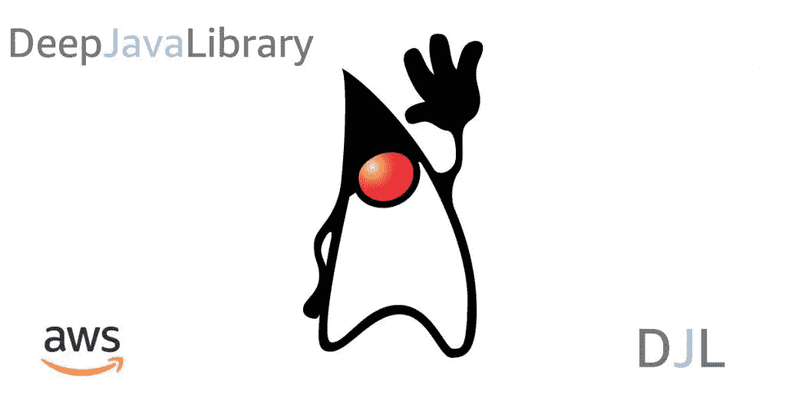
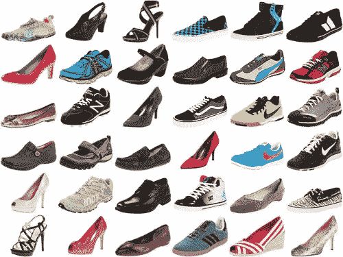
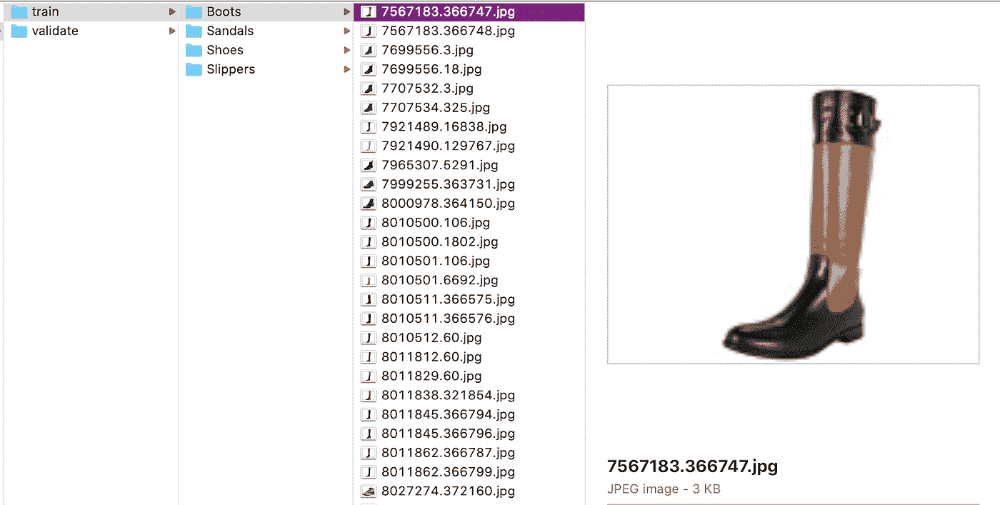
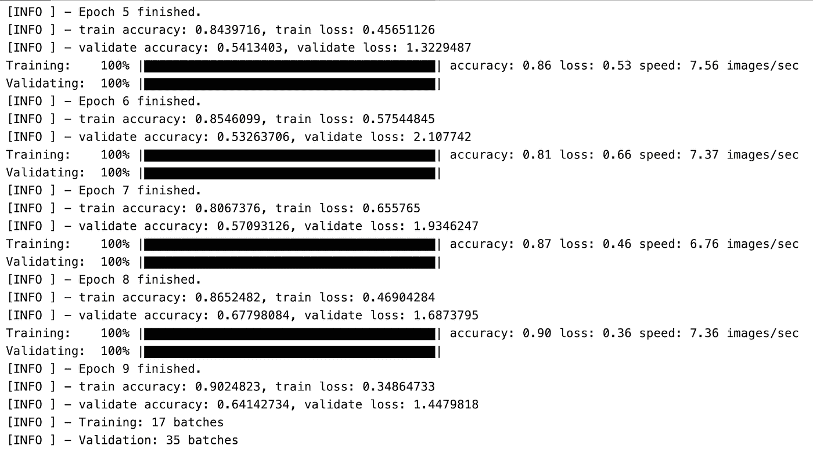
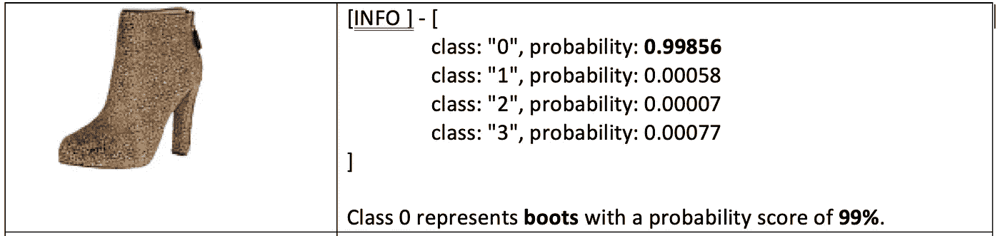
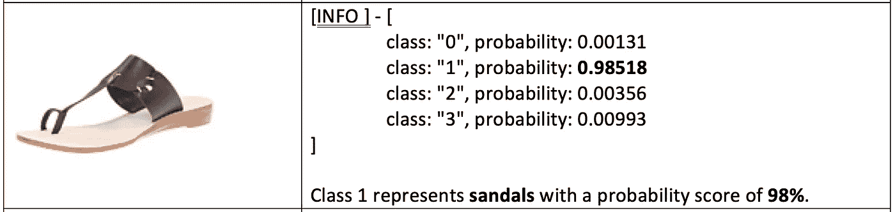
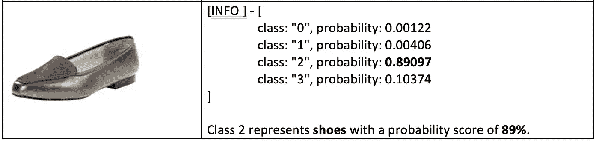
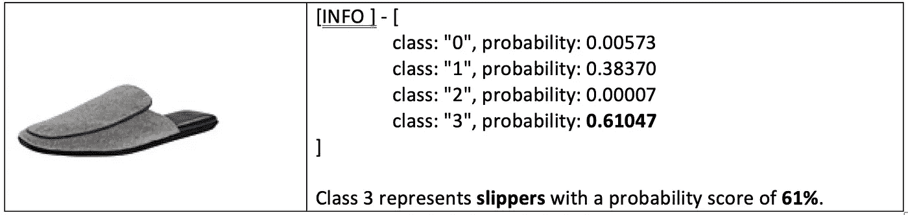

# 深度 Java 库(DJL)——面向 Java 开发人员的深度学习工具包

> 原文：<https://towardsdatascience.com/deep-java-library-djl-a-deep-learning-toolkit-for-java-developers-55d5a45bca7e?source=collection_archive---------24----------------------->

## [现实世界中的数据科学](https://towardsdatascience.com/data-science-in-the-real-world/home)

## 亚马逊发布深度 Java 库(DJL ),为 Java 开发者提供深度学习的快速入门



[Deep Java Library (DJL)](https://djl.ai/) ，是亚马逊创建的开源库，用于在 Java 中本地开发机器学习(ML)和深度学习(DL)模型，同时简化深度学习框架的使用。

我最近用 DJL 开发了一个鞋类分类模型，发现这个工具包超级直观和易用；很明显，在设计和 Java 开发人员将如何使用它上花了很多心思。DJL API 抽象出常用的功能来开发模型和编排基础设施管理。我发现用于训练、测试和运行推理的高级 API 允许我使用 Java 和 ML 生命周期的知识，用最少的代码在不到一个小时的时间内开发一个模型。

# 鞋类分类模型

鞋类分类模型是使用监督学习训练的多类分类计算机视觉(CV)模型，它将鞋类分类为四类标签之一:靴子、凉鞋、鞋子或拖鞋。



Image 1: footwear data (source UT Zappos50K)

## 关于数据

开发精确的 ML 模型最重要的部分是使用来自可靠来源的数据。鞋类分类模型的数据源是由德克萨斯大学奥斯汀分校提供的数据集，可免费用于学术和非商业用途。鞋子数据集由从[Zappos.com](https://www.zappos.com/)收集的 50，025 张带标签的目录图片组成。

## 训练鞋类分类模型

训练是通过给学习算法训练数据来产生 ML 模型的过程。术语模型是指在训练过程中产生的工件；该模型包含在训练数据中发现的模式，并可用于进行预测(或推断)。在开始培训过程之前，我设置了本地开发环境。你将需要 JDK 8(或更高版本)，IntelliJ，一个用于训练的 ML 引擎(像 [Apache MXNet](https://mxnet.apache.org/) )，一个指向你的引擎路径的环境变量和 DJL 的构建依赖。

```
dependencies **{**compile "org.apache.logging.log4j:log4j-slf4j-impl:2.12.1"compile "ai.djl:api:0.2.0"compile "ai.djl:basicdataset:0.2.0"compile "ai.djl:examples:0.2.0"compile "ai.djl:model-zoo:0.2.0"compile "ai.djl.mxnet:mxnet-model-zoo:0.2.0"runtimeOnly "ai.djl.mxnet:mxnet-native-mkl:1.6.0-a:osx-x86_64"**}**
```

通过成为引擎和深度学习框架不可知者，DJL 忠于 Java 的座右铭，“编写一次，在任何地方运行(WORA)。开发人员可以编写一次运行在任何引擎上的代码。DJL 目前提供了 Apache MXNet 的实现，这是一个简化深度神经网络开发的 ML 引擎。DJL API 使用 JNA，Java 原生访问，来调用相应的 Apache MXNet 操作。从硬件的角度来看，培训是在我的笔记本电脑上使用 CPU 进行的。然而，为了获得最佳性能，DJL 团队建议使用至少带有一个 GPU 的机器。如果你没有可用的 GPU，总有一个选项可以在[亚马逊 EC2](https://aws.amazon.com/ec2/) 上使用 Apache MXNet。DJL 的一个很好的特性是，它提供了基于硬件配置的自动 CPU/GPU 检测，以始终确保最佳性能。

## 从源加载数据集

鞋类数据保存在本地，并使用 DJL `ImageFolder`数据集加载，该数据集可以从本地文件夹中检索图像。用 DJL 的术语来说，一个`Dataset`只是保存训练数据。有些数据集实现可用于下载数据(基于您提供的 URL)、提取数据以及自动将数据分成定型集和验证集。自动分离是一个有用的功能，因为绝不使用训练模型所用的相同数据来验证模型的性能是很重要的。训练验证数据集用于在数据中查找模式；验证数据集用于在训练过程中估计鞋类模型的准确性。

```
*//identify the location of the training data*String trainingDatasetRoot = **"src/test/resources/imagefolder/train"**;*//identify the location of the validation data*String validateDatasetRoot = **"src/test/resources/imagefolder/validate"**;//create training ImageFolder dataset
ImageFolder trainingDataset = initDataset(trainingDatasetRoot);//create validation ImageFolder dataset
ImageFolder validateDataset = initDataset(validateDatasetRoot);**private** ImageFolder initDataset(String datasetRoot) **throws** IOException { ImageFolder dataset = **new** ImageFolder
          .Builder()
          .setRepository(**new** SimpleRepository(Paths.get(datasetRoot))).optPipeline( *// create preprocess pipeline* **new** Pipeline()
          .add(**new** Resize(NEW_WIDTH, NEW_HEIGHT))
          .add(**new** ToTensor()))
          .setSampling(BATCH_SIZE,**true**)
          .build(); dataset.prepare();
     **return** dataset;
}
```

当在本地构建数据时，我没有深入到 UTZappos50k 数据集确定的最细粒度级别，如脚踝、膝盖高、小腿中部、膝盖以上等。靴子的分类标签。我的本地数据保存在最高级别的分类中，只包括靴子、凉鞋、鞋子和拖鞋。



Image 2: structure of local training data

## 训练模型

现在，我已经将鞋类数据分为训练集和验证集，我将使用神经网络来训练模型。

```
**public** final class **Training** extends **AbstractTraining** { . . . **@Override**
     **protected** **void** **train**(Arguments arguments) **throws** IOException {

          . . . **try** (Model model = Models.getModel(NUM_OF_OUTPUT, 
                                   NEW_HEIGHT, NEW_WIDTH)) { TrainingConfig config = setupTrainingConfig(loss); **try** (Trainer trainer = model.newTrainer(config)) {      
                    trainer.setMetrics(metrics);
                    trainer.setTrainingListener(**this**);
                    Shape inputShape = **new** Shape(1, 3, NEW_HEIGHT, 
                                                 NEW_WIDTH);

                    *// initialize trainer with proper input shape* trainer.initialize(inputShape); *//find the patterns in data* fit(trainer, trainingDataset, 
                        validateDataset, **"build/logs/training"**); *//set model properties* model.setProperty(**"Epoch"**, 
                                      String.valueOf(EPOCHS));
                    model.setProperty(**"Accuracy"**, 
                                      String.format(**"%.2f"**,         
                                          getValidationAccuracy())); *//save the model after done training for 
                    //inference later model saved 
                    //as shoeclassifier-0000.params* model.save(Paths.get(modelParamsPath), 
                               modelParamsName); }
          }
}
```

通过将训练数据输入到[模块](https://djl-ai.s3.amazonaws.com/java-api/0.1.0/index.html)开始训练。用 DJL 的术语来说，`Block`是形成神经网络的可组合单元。你可以组合积木(就像乐高积木一样)形成一个复杂的网络。在训练过程的最后，一个`Block`代表一个完全训练好的模型。第一步是通过调用`Models.getModel(NUM_OF_OUTPUT, NEW_HEIGHT, NEW_WIDTH)`获得一个模型实例。`getModel()`方法创建一个空模型，构造神经网络，将神经网络设置到模型上。

```
*/*
Use a neural network (ResNet-50) to train the model**ResNet-50 is a deep residual network with 50 layers; good for image classification
*/***public class** Models {
     **public static** ai.djl.Model getModel(**int** numOfOutput, 
                                         **int** height, **int** width) 
     {
         *//create new instance of an empty model* ai.djl.Model model = ai.djl.Model.newInstance(); *//Block is a composable unit that forms a neural network;
         //combine them like Lego blocks to form a complex network* Block resNet50 = **new** ResNetV1.Builder()
              .setImageShape(**new** Shape(3, height, width))
              .setNumLayers(50)
              .setOutSize(numOfOutput)
              .build(); *//set the neural network to the model* model.setBlock(resNet50);
         **return** model; }
}
```

下一步是通过调用`model.newTrainer(config)`方法来设置和配置一个`Trainer`。config 对象是通过调用`setupTrainingConfig(loss)`方法初始化的，该方法设置训练配置(或超参数)来确定如何训练网络。

```
**private static** TrainingConfig setupTrainingConfig(Loss loss) {
     *// epoch number to change learning rate* **int**[] epoch = {3, 5, 8}; **int**[] steps = Arrays
                       .stream(epoch)
                       .map(k -> k * 60000 /  BATCH_SIZE).toArray(); *//initialize neural network weights using Xavier initializer* Initializer initializer = **new** XavierInitializer(
         XavierInitializer.RandomType.UNIFORM,
         XavierInitializer.FactorType.AVG, 2); *//set the learning rate
     //adjusts weights of network based on loss* MultiFactorTracker learningRateTracker = LearningRateTracker
          .multiFactorTracker()
          .setSteps(steps)
          .optBaseLearningRate(0.01f)
          .optFactor(0.1f)
          .optWarmUpBeginLearningRate(1e-3f)
          .optWarmUpSteps(500)
          .build(); *//set optimization technique
     //minimizes loss to produce better and faster results
     //Stochastic gradient descent* Optimizer optimizer = Optimizer
          .sgd()
          .setRescaleGrad(1.0f / BATCH_SIZE)
          .setLearningRateTracker(learningRateTracker)
          .optMomentum(0.9f)
          .optWeightDecays(0.001f)
          .optClipGrad(1f)
          .build(); **return new** DefaultTrainingConfig(initializer, loss)
          .setOptimizer(optimizer)
          .addTrainingMetric(**new** Accuracy())
          .setBatchSize(BATCH_SIZE);
}
```

为训练设置了多个超参数:

*   `**newHeight**`和`**newWidth**` —图像的形状。
*   `**batchSize**` —用于训练的批量；根据你的模型选择合适的尺寸。
*   `**numOfOutput**` —标签的数量；鞋类分类有 4 个标签。
*   `**loss**` —损失函数根据衡量模型好坏的真实标签评估模型预测。
*   `**Initializer**` —标识初始化方法；在这种情况下，Xavier 初始化。
*   `**MultiFactorTracker**` —配置学习率选项。
*   `**Optimizer**`:最小化损失函数值的优化技术；在这种情况下，随机梯度下降(SGD)。

下一步是设置`Metrics`，一个训练监听器，并用正确的输入形状初始化`Trainer`。`Metrics`在培训期间收集和报告关键绩效指标(KPI ),这些指标可用于分析和监控培训绩效和稳定性。接下来，我通过调用`fit(trainer, trainingDataset, validateDataset, **“build/logs/training”**)` 方法开始训练过程，该方法迭代训练数据并存储在模型中找到的模式。

```
**public void** fit(Trainer trainer, Dataset trainingDataset, Dataset validateDataset,String outputDir) **throws** IOException { *// find patterns in data* **for** (**int** epoch = 0; epoch < EPOCHS; epoch++) 
     {
         **for** (Batch batch : trainer.iterateDataset(trainingDataset)) 
         {
              trainer.trainBatch(batch);
              trainer.step();
              batch.close();
         }

         *//validate patterns found* **if** (validateDataset != **null**) {
           **for** (Batch batch:             
                trainer.iterateDataset(validateDataset)){
                     trainer.validateBatch(batch);
                     batch.close();
           }
         } *//reset training and validation metric at end of epoch* trainer.resetTrainingMetrics(); *//save model at end of each epoch* **if** (outputDir != **null**) {
              Model model = trainer.getModel();
              model.setProperty(**"Epoch"**, String.valueOf(epoch));
              model.save(Paths.get(outputDir), **"resnetv1"**);
         }
      }
}
```

在训练的最后，使用`model.save(Paths.get(modelParamsPath), modelParamsName)`方法，一个运行良好的经验证的模型工件及其属性被保存在本地。培训过程中报告的指标如下所示。



Image 3: metrics reported during training

## 运行推理

现在我有了一个模型，我可以用它对我不知道分类(或目标)的新数据进行推断(或预测)。在设置了模型和要分类的图像的必要路径之后，我使用`Models.getModel(NUM_OF_OUTPUT, NEW_HEIGHT, NEW_WIDTH)`方法获得一个空的模型实例，并使用`model.load(Paths.get(modelParamsPath), modelParamsName)`方法初始化它。这将加载我在上一步中训练的模型。接下来，我使用`model.newPredictor(translator)`方法，用指定的`Translator`初始化一个`Predictor`。你会注意到我将一个`Translator`传递给了`Predictor`。在 DJL 术语中，`Translator`提供模型预处理和后处理功能。例如，对于 CV 模型，需要将图像重塑为灰度；a `Translator`可以帮你做到这一点。`Predictor`允许我使用`predictor.predict(img)`方法对加载的`Model`进行推理，传入图像进行分类。我做的是单个预测，但是 DJL 也支持批量预测。推理存储在`predictResult`中，其中包含每个标签的概率估计。一旦推理完成，模型自动关闭，使得 DJL 记忆有效。

```
**private** Classifications predict() **throws** IOException, ModelException, TranslateException  {

     *//the location to the model saved during training* String modelParamsPath = **"build/logs"**; *//the name of the model set during training* String modelParamsName = **"shoeclassifier"**; *//the path of image to classify* String imageFilePath = **"src/test/resources/slippers.jpg"**; *//Load the image file from the path* BufferedImage img =       
          BufferedImageUtils.fromFile(Paths.get(imageFilePath)); *//holds the probability score per label* Classifications predictResult; **try** (Model model = Models.getModel(NUM_OF_OUTPUT, NEW_HEIGHT, NEW_WIDTH)) { *//load the model* model.load(Paths.get(modelParamsPath), modelParamsName); *//define a translator for pre and post processing* Translator<BufferedImage, Classifications> translator =       
                **new** MyTranslator(); *//run the inference using a Predictor* **try** (Predictor<BufferedImage, Classifications> predictor =  
                 model.newPredictor(translator)) {
                      predictResult = predictor.predict(img);
          }
       } **return** predictResult;
}
```

推论(每张图片)及其相应的概率得分如下所示。



Image 4: Inference for boots



Image 5: Inference for sandals



Image 6: Inference for shoes



Image 7: Inference for slippers

## 外卖和后续步骤

我从 90 年代末开始开发基于 Java 的应用程序，并在 2017 年开始了我的机器学习之旅。如果当时 DJL 在的话，我的旅程会容易得多。我强烈建议希望过渡到机器学习的 Java 开发人员给 DJL 一个机会。在我的例子中，我从头开始开发了鞋类分类模型；然而，DJL 也允许开发人员以最小的努力部署预先训练好的模型。DJL 还提供了现成的流行数据集，允许开发人员立即开始使用 ML。在开始学习 DJL 之前，我建议你对 ML 生命周期有一个牢固的理解，并且熟悉常见的 ML 术语。一旦你对 ML 有了一个基本的理解，你就可以很快熟悉 DJL API。

亚马逊有开源的 DJL，在那里可以在 DJL [网站](https://djl.ai/)和 [Java 库 API 规范](https://javadoc.djl.ai/)页面找到关于该工具包的更多详细信息。鞋类分类模型的代码可以在 [GitLab](http://bit.ly/deep-java) 上找到。祝您的 ML 之旅好运，如果您有任何问题，请随时联系我。