# 深层潜在变量模型:揭示隐藏结构

> 原文：<https://towardsdatascience.com/deep-latent-variable-models-unravel-hidden-structures-a5df0fd32ae2?source=collection_archive---------7----------------------->

source: Unsplash

理解真实世界数据的底层结构是机器学习中最引人注目的任务之一。但是随着深度生成模型的出现，研究者和实践者有了一个强有力的方法来解开它。

真实世界的数据通常是复杂和高维的。传统的数据分析方法在大多数情况下是无效的，并且只能模拟非常简单的数据分布。现在，我们可以使用机器学习模型来直接学习我们数据的结构。机器学习中最常见的方法是[*监督学习*](https://en.wikipedia.org/wiki/Supervised_learning) ，其中我们要求模型学习从输入到输出变量的映射，例如图像 x 到标签 y。然而，带标签的数据是昂贵的，并且容易被人类注释者产生错误或偏见。并且监督模型仅能够根据训练数据的质量来概括其映射函数。为了测试其推广性，使用了来自相同分布的验证集，该验证集将具有相同的误差。使用这种模型，可以执行分类或回归任务，但我们无法了解数据的实际基本组织。

机器学习社区开始关注 [*无监督学习*](https://en.wikipedia.org/wiki/Unsupervised_learning) 模型的开发。通过结合概率建模和深度学习，最近取得了一些进展。我们称这类模型为 [*生成型模型*](https://openai.com/blog/generative-models/) *。根据这句名言，*

> "我不能创造的东西，我不明白。"—理查德·费曼

生成模型应该能够发现底层结构，例如数据的有趣模式、聚类、统计相关性和因果结构，并生成类似的数据。

目前，该领域中的一个著名模型是*生成式广告网络*(GANs)【1】，例如，它能够从学习到的数据分布中生成[人脸的真实图像](https://medium.com/syncedreview/gan-2-0-nvidias-hyperrealistic-face-generator-e3439d33ebaf)。这一类的另一个模型被称为*变分自动编码器*(VAE)【2】，它也用于复杂高维分布的无监督学习，将是本文的重点。甘的训练仍然是实验性的，因为他们的训练过程缓慢且不稳定。但是他们也在进步，请看这篇关于 Wasserstein GANs 的博客文章。

一般来说，非监督学习比监督学习困难得多，因为这些模型不是预测给定输入的标签或值，而是学习数据分布本身的隐藏结构。本文将介绍我们如何实现这一点的概念，重点是静态数据，如没有序列性质的图像。学习顺序数据的底层结构是一个更困难的问题，我打算将来写一篇关于这个问题的后续文章。

在第一部分中，我们将定义潜在变量模型，在第二部分中，我们将了解如何使用深度神经网络来学习它们的参数。我试图尽可能保持一切直观，但一些概率论和深度学习的先验知识肯定是有帮助的。

# 潜在变量模型

机器学习中的一个中心问题就是学习一个复杂的概率分布*p(****x****)*，只需要从这个分布中抽取有限的一组高维数据点 ***x*** 。例如，为了学习猫的图像的概率分布，我们需要定义一个分布，该分布可以模拟形成每个图像的所有像素之间的复杂相关性。直接模拟这种分布是一项具有挑战性的任务，甚至在有限的时间内是不可行的。

与其直接建模*p(****x****)*，我们可以引入一个不可观测的潜在变量 ***z*** 并为数据定义一个条件分布*p(****x****|****z****，这就叫做*可能性*用概率术语 ***z*** 可以解释为连续的*随机变量*。对于猫图像的例子， ***z*** 可以包含猫的类型、颜色或形状的隐藏表示。*

*有了 ***z*** ，我们可以进一步引入潜在变量的先验分布*p(****z****)*来计算观察变量和潜在变量的联合分布:*

*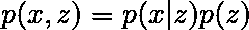*

*Joint distribution over observed and latent variables; Equation (1)*

*这种联合分布让我们可以用更易处理的方式来表达复杂的分布*p(****x****)*。其组成部分，*p(****x****|****z****)*和*p(****z****)*的定义通常要简单得多，例如通过使用中的分布*

*为了获得数据分布*p(****x****)*我们需要对潜在变量进行边缘化*

*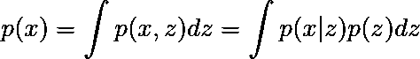*

*Marginalized data distribution p(**x**); Equation (2)*

*此外，利用贝叶斯定理我们可以计算后验分布*p(****z****|****x****)*为*

*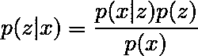*

*Posterior distribution p(**z**|**x**); Equation (3)*

*后验分布允许我们推断给定观测值的潜在变量。注意，对于我们处理的大多数数据，方程(2)中的积分没有解析解，我们必须应用某种方法来推断方程(3)中的后验概率，这将在下面解释。*

*为什么我们要做这个练习并引入一个潜在变量？优势在于，具有潜在变量的模型可以表达数据被创建的生成过程(至少这是我们的希望)。这被称为生成模型。一般来说，这意味着如果我们想要生成一个新的数据点，我们首先需要获得一个样本***【z】***~*p(****z****)*，然后使用它从条件分布****x****|****中采样一个新的观察值*在这样做的同时，我们还可以评估该模型是否为数据分布*p(****)x****)*提供了良好的近似。******

*根据定义，包含潜在变量的数学模型是潜在变量模型。这些潜在变量的维数比观察到的输入向量低得多。这产生了数据的压缩表示。您可以将潜在变量视为一个瓶颈，生成数据所需的所有信息都必须通过这个瓶颈。从 [*流形假设*](https://deepai.org/machine-learning-glossary-and-terms/manifold-hypothesis) 中我们知道，高维数据(例如真实世界的数据)位于嵌入在这个高维空间中的低维流形上。这证明了低维潜在空间的合理性。*

## *后验推断*

*后验分布*p(****z****|****x****)*，是概率推理中的一个关键组成部分，在观察到一个新的数据点后，更新我们对潜在变量的信念。然而，真实世界数据的后验常常是难以处理的，因为它们对于出现在方程(3)分母中的方程(2)中的积分没有解析解。有两种方法可以近似这种分布。一种是叫做 [*马尔可夫链蒙特卡罗*方法](/markov-chain-monte-carlo-291d8a5975ae)的抽样技术。然而，这些方法在计算上是昂贵的，并且不能很好地扩展到大型数据集。第二种方法是确定性近似技术。在这些技术中，VAE 使用的是所谓的**(VI)【4】。注意，这种方法的缺点是，即使在无限的计算时间内，它们也不能产生精确的结果。***

***VI 的总体思路是从一个易处理的分布族(例如多元高斯)中取一个近似值*q(****z****)*，然后使这个近似值尽可能接近真实的后验*p(****z****|****x****)*。这通常通过最小化两个分布之间的 *Kullback-Leibler* (KL)散度来实现，定义为***

**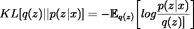**

**Kullback-Leibler Divergence; Equation (4)**

**这减少了对优化问题的推断[5]。越相似的*q(***)**p(****z****|****x****)*KL 的散度越小。请注意，这个量不是数学意义上的距离，因为如果我们交换分布，它就不是对称的。此外，在我们的例子中，交换分布意味着我们需要获取关于*p(****z****|****x****)*的期望，这被认为是难以处理的。***

**现在，方程(4)在对数内的分子中仍然有难以处理的后验概率。使用(3)，我们可以将(4)改写为:**

**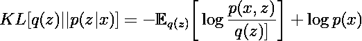****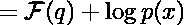**

**Evidence Lower Bound (ELBO) F(**q**); Equation (5)**

**边际可能性*log p(****x****)*可以从期望中取出，因为它不依赖于 ***z*** 。量*F(****q****)*就是所谓的*证据下界* (ELBO)。KL 总是≥ 0，因此它表示对*证据日志 p(****x****)*的下限。ELBO 越接近边际似然，变分近似就越接近真实的后验分布。因此，复杂的推理问题被简化为更简单的优化问题。**

# **变分自动编码器**

**我们还没有提到它，但是可能性和先验属于依赖于一些未知参数的分布族。为了使这一点更清楚，请看等式(1)的参数联合分布:**

**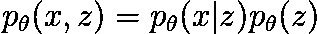**

**Parametric joint distribution; Equation (6)**

***θ*表示模型的未知参数，可以使用深度神经网络(或使用传统方法，如 [*期望最大化*](https://en.wikipedia.org/wiki/Expectation%E2%80%93maximization_algorithm) 算法)来学习。**

**VAE 使用这种深度神经网络来参数化定义潜在变量模型的概率分布。此外，它提供了一个有效的近似推理过程，规模大的数据集。它由一个*生成模型*(潜在变量模型)、一个*推理网络*(变分近似)和一种如何学习 VAE 参数的方法来定义。关于 VAE 在 Keras 的非常好的介绍和实现，你可以访问这个漂亮的[博客帖子](https://wiseodd.github.io/techblog/2016/12/10/variational-autoencoder/?source=post_page---------------------------)。**

**生成模型由等式(6)给出，这里 ***z*** 是具有 *K-* 维的连续潜变量。它的先验通常是具有零均值和单位协方差矩阵的高斯，**

**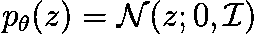**

**Gaussian prior with zero mean and identity covariance; Equation (7)**

**这种可能性被称为*解码器*，它通常是连续数据的高斯分布，其参数*θ*通过将潜在状态 ***z*** 传递通过深度神经网络来计算。这种可能性看起来如下，**

**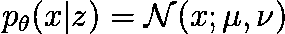**

**Likelihood as continuous Gaussian distribution; Equation (8)**

**均值和方差由两个深度神经网络参数化，其输出向量的维数为 *D* ，即观测值的维数**xT5。参数*θ*是解码器神经网络的权重和偏差。****

**推理网络被称为*编码器*，允许我们计算后验近似的参数。变分参数*φ*在所有数据点上共享，而不是每个数据点都有一组参数。同样，在 VAE 设置中，我们使用深度神经网络，该网络获取输入数据点并输出相应高斯变分近似的均值和对角协方差矩阵，**

**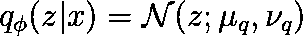**

**Posterior approximation of VAE; Equation (9)**

**共享的变分参数*φ*是编码器神经网络的权重和偏差。**

## **参数学习和 VAE 的目标函数**

**如上所述，边际分布*p(****x****)*(由*θ*参数化)在很多情况下是难以处理的，需要近似。使用 ELBO 可以获得一个近似值。为了明确 ELBO 依赖于某个参数，我们可以将它重写为**

**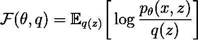**

**ELBO parametized by theta; Equation (10)**

**为了学习参数，我们可以使用期望最大化(EM)使 ELBO 相对于其参数最大化。对于 VAE 设置来说，最大化反而是超过参数*φ*的 *q* 。因此，我们可以将 ELBO 分解为两项:**

**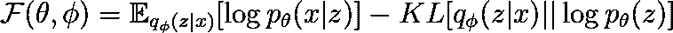**

**Objective Function. The left term represents the reconstruction loss and the right term represents the regularization loss; Equation (11)**

*****F*** 的第一项是*重构损失*，鼓励似然和推理网络准确重构数据。第二项是*正则化损失*并惩罚与先验相差太远的后验近似。具有参数*φ*和*θ*的两个神经网络都可以通过具有反向传播的梯度下降来有效地计算。此外，参数是联合更新的，而不是像 EM 那样迭代更新。**

# **结论**

**在这篇文章中，我介绍了潜在变量模型的概念，以及用深度神经网络来参数化定义潜在变量模型的概率分布。在这里，我们关注了变分自动编码器(一种生成模型)所使用的对后验分布*p(****z****|****x****)*的近似的变分推断。VAE 的真正力量在于，它们可以在完全无人监督的情况下接受训练，并学习捕捉数据自然特征的潜在空间。**

**如果我们能够将复杂的高维数据嵌入到一个潜在空间中，从这个潜在空间中我们能够生成与原始数据非常相似的新数据，我们可以假设我们的模型捕捉到了数据的主要特征。这可以给研究人员和从业人员提供许多有用的信息来研究感兴趣的数据，并确定模式、相关性甚至因果结构。**

## **参考**

**[1] Goodfellow，Ian，et al. [“生成性对抗性网络”](https://arxiv.org/pdf/1406.2661.pdf)，NIPS (2014)**

**[2]迪德里克·p·金马，马克斯·韦林。[自动编码变分贝叶斯](https://arxiv.org/abs/1312.6114)，arXiv 预印本 arXiv:1312.6114 (2014)。**

**[3] Martin Arjovsky、Soumith Chintala 和 Léon Bottou。[《瓦瑟斯坦甘》](https://arxiv.org/pdf/1701.07875.pdf)，arXiv 预印本 arXiv:1701.07875 (2017)。**

**[4]戴维·布莱、阿尔普·库库尔比尔、乔恩·麦考利夫。"[变分推断:统计学家回顾](https://arxiv.org/pdf/1601.00670.pdf)，arXiv 预印本 arXiv:1601.00670**

**[5]凯文·p·墨菲，“机器学习:概率观点”，麻省理工学院出版社(2012 年)**

## **关于变分自动编码器的进一步阅读**

**[**阿古斯蒂斯·克里斯蒂的博客**](https://wiseodd.github.io/techblog/2016/12/10/variational-autoencoder/?source=post_page---------------------------) **:** *变分自动编码器:直觉与实现***

**[**JAAN ALTOSAAR 博客**](https://jaan.io/what-is-variational-autoencoder-vae-tutorial/) **:** *教程——什么是变分自动编码器？***