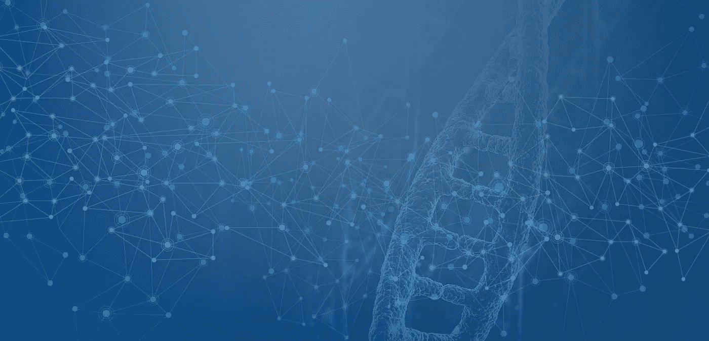
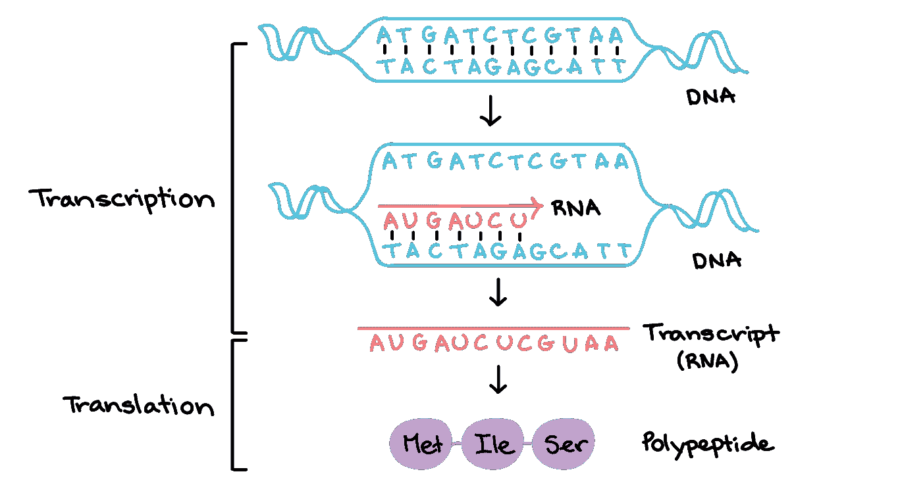
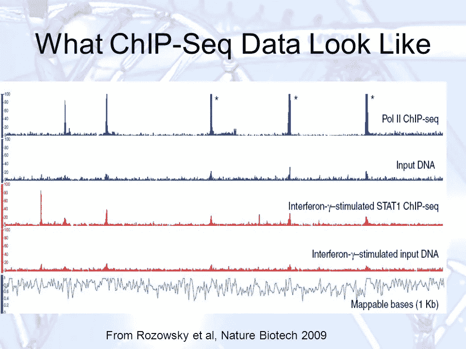
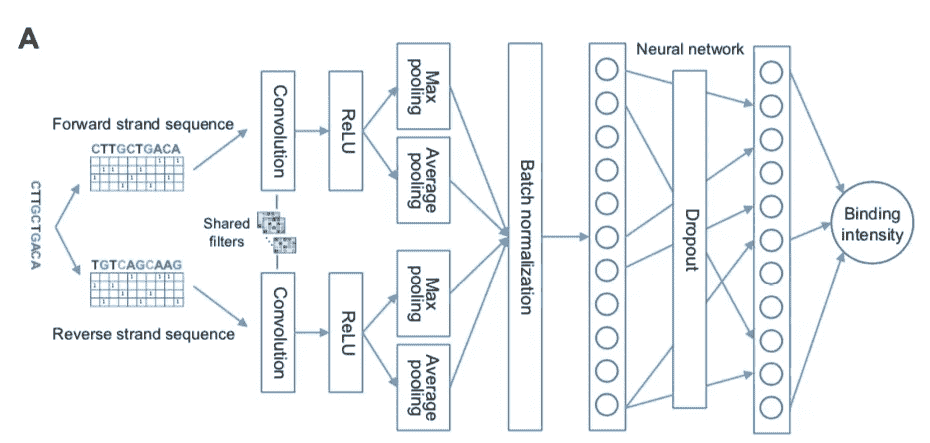
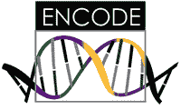

# 关于转录因子-DNA 结合的“深度学习”

> 原文：<https://towardsdatascience.com/deep-learning-about-transcription-factor-dna-binding-1d9753eabcc2?source=collection_archive---------9----------------------->

## 使用卷积神经网络测量转录因子-DNA 结合

> 如果我们能解开基因表达的秘密，我们就能真正解开自己的秘密。

我们淹没在基因信息中。

Except, imagine the coins as DNA nucleotides.

事实上，你现在就可以花大约 100 美元(如果你再等一段时间，这个价格会更低)去获取你的整个基因组序列。

**你可以自己解开背后的密码。**每一个特性、特征、不好的突变都是从你的曾曾祖父那里传下来的，但不知何故在你之前跳过了几代人(遗传统计学万岁)。

但是有个问题。

> *我们连一半是什么意思都不知道。*

(一半很可能是高估)。

这就像试图学习一种可以*编码生物生命*的编码语言。你只知道这些位是四个碱基对:A，C，T，g。

对于所谓的“经典数据”，我们已经进入了一个疯狂兴奋的阶段，试图建立机器学习模型，从中提取模式。现在，如果我们用机器来尝试理解基因组数据会怎么样？

> 如果我们尝试使用机器学习来解开基因表达的秘密会怎么样？

我们拥有的每一个行为或特征最终都可以归结为某些基因的开启和关闭。基因表达几乎控制着我们身体的一切。我们的细胞执行什么功能。你头发的颜色。它还决定了你何时、如何或是否患有致命疾病。我们可以黑掉我们自己。根除疾病。增进我们的健康。改变我们的特征。

如果基因表达是一部电影，那么**转录因子(TF)，**一种类型的蛋白质，将是导演。哪些基因开启或关闭由与**调控元件**(启动子、增强子等)结合的转录因子决定。)——这在不同的细胞类型中是不同的。

让我们进一步分析一下。

# 转录因子- DNA 结合

转录因子直接转录— **将遗传信息从 DNA 复制到信使 RNA** 。把信使 RNA 想象成邮差。它将信息(遗传密码)从 DNA 传递到核糖体，以翻译成蛋白质。

Transcription and translation of proteins. Source: Khan Academy

因此，转录因子控制着哪些信息被复制并转化为蛋白质，从而影响细胞的功能或特性。

好吧，酷。但是实际上有成千上万不同的变体。我们如何知道一个组织因子是否会与某个 DNA 序列结合？或者如果*另一个* TF 会结合同样的 DNA 序列？或者说*TF 与该序列的结合有多好？*

等等…不是也有上百种不同的 TF 吗？我们究竟该如何预测呢？猜猜看？

没错。

Excuse me?

但是不要担心，*我们*从现在开始不会再做猜测和检查……***我们会让机器学习来帮我们做这件事*** 😉

Take a deep breath. The hard stuff is coming soon.

## 如果我们可以使用机器学习来预测转录因子与特定 DNA 序列结合的可能性有多大呢？

基于过去预测 TF-DNA 相互作用的深度学习尝试，如 DeepSEA，我想看看我是否可以建立自己的算法，该算法可以预测给定转录因子与特定 DNA 序列结合的可能性。然而，我想更进一步，用**量化**这个值。

如何量化转录因子与 DNA 的结合？“非常好”或“不太好”可能不是最好的标签。

和**芯片序列**来拯救！

ChIP-seq 代表与下一代**测序相结合的**染色质免疫沉淀** (ChIP)分析。如果你不知道这意味着什么，这里有一个复习。**

基本上，**芯片测序** ( **芯片** - **序列**)是**识别转录因子和其他蛋白质的全基因组 DNA 结合*位点*的有力方法。它告诉我们 TF 将结合在 DNA 的什么位置。**

Notice the “peaks” or spikes on the graph = lot of gene activity in that area

现在，**峰值区域**是图上的黑色/彩色部分，本质上意味着在那个特定区域有大量的基因表达。每个峰都有一个**信号值**(来自该基因组位置的序列读数)。

**信号值量化了 TF 与 DNA 的结合程度。**

## 我们能用 ChIP-seq 做什么？

如果我们比较患病和非患病细胞的 ChIP-seq 峰区域，我们可以**确定导致或促成该疾病的遗传变异！**

我们可以使用它的另一种方式是**确定基因表达如何从一种细胞类型变化到另一种细胞类型**——这可以给我们一个巨大的洞察力，让我们知道如何区分诱导多能干细胞！

# 我们将如何使用机器学习？

如果给定一个特定的基因序列，我们可以预测特定转录因子的信号值，会怎么样？

基本上:

> 输入:**原始 DNA 序列**(没有关于变体的先验知识)
> 
> 输出:**实值码片序列信号值**

机器将通过**深度学习**来学习这些。

所以今天，我们将应用一个**卷积神经网络**算法。你已经看到他们擅长图像分类，但现在看到他们擅长基因组数据分析。如果图像只是一个数字矩阵，从技术上来说，基因组数据只是一个 A、T、C 和 Gs 的矩阵。*他们擅长模式识别。*

## 深度学习模型概述

首先，原始 DNA 序列被输入到模型中。每个输入序列被转换成一个具有 4 行 300 列的**独热矩阵**。4 行代表 4 个碱基对(A、C、T、G ),而序列长度为 300 b.p(核苷酸)。

因为 DNA 是双螺旋，TFs 可以识别给定位置的任何一条 DNA 链，所以**模型被输入正向序列和反向互补序列**。

It would be a more accurate representation if one of the spidermen were flipped upside down.

同样，因为 TFs 可以在给定的位置识别 DNA 的任意一条链*，所以两个序列**的卷积层共享同一套过滤器**。使用 DeFine 提出的体系结构，该体系结构看起来像这样:*

The convolutional neural network architecture in DeFine.

*   首先，我们有**两个卷积层**，它们将自动从数据中提取特征
*   接下来是 **ReLU** 层，过滤高于阈值的结果(在训练中学习到的)
*   然后，它们同时通过**最大池和平均池层**。最大池为每个滤波器输出序列中*最显著的激活信号*，而平均池通过*取序列中*每个位置的滤波器扫描结果的平均值来考虑*整个序列上下文*
*   两个输出被**组合**成一个向量
*   然后经过**批量归一化**
*   然后是**全连接层**
*   然后应用**删除层**(概率为 0.5)——帮助减轻过度拟合
*   又一个最终完全连接的层
*   以及最后的**回归层**——其预测芯片序列信号强度

现在让我们回到我们如何预处理数据。(我知道，大家最喜欢的关于机器学习的部分)。

# 数据预处理！

牛逼的[**ENCODE**](https://www.encodeproject.org/)(DNA 元素百科)项目编译了一个开源的数据库，里面有很多细胞系，各种测序。

他们有几个细胞系有 ChIP-seq 和全基因组测序。我将使用 K562 细胞系(有 79 个转录因子)。整个基因组测序从这里的[开始](https://www.ncbi.nlm.nih.gov/sra/SRX118400)。参考基因组是 GRCh37。注意:**模型必须对每个转录因子分别进行训练。**

为了准备用于训练的数据，从峰调用结果中提取每个转录因子的峰区域(信号值)。**所以现在我们有了显示基因活性的每个区域的 TF 信号值。**

*   每个 TF 的前 1%信号值被丢弃(**异常值**具有极高的信号值)
*   然后对信号值进行对数变换，并通过 0-1 之间的最小-最大标度进行归一化。*我们这样做是为了让我们的数字更容易使用！*
*   然后，根据峰区域从参考基因组中提取峰的基因组序列
*   **通过添加 Ns(代表任何核苷酸)或删除核苷酸，将峰序列固定在 300 bp(然后我们可以将其输入到我们的模型中)**

**最后，为了帮助**数据扩充**，我们做最后一步:**

*   **从与已知 TF 没有结合的**区域中随机取出序列，并将它们的信号值设置为零****
*   **具有零值的随机选择序列的数量应该等于具有信号强度值的码片序列峰值序列的数量**

**最后，数据分成 70%用于训练，15%用于验证和调整超参数，15%用于测试。**

# **评估准确性**

**对于这个模型，一个简单的百分比精度是不够的。我们将引入一些统计相关性测量！**

**该模型将基于**皮尔逊相关系数**和**斯皮尔曼相关系数**进行评估。它们都衡量两个数字是如何相互关联的。*相关性越高=两者关系越强！* [这里有一个链接](https://www.statisticssolutions.com/correlation-pearson-kendall-spearman/)快速回顾这两个术语。**

# **你刚刚“深度学习”了如何预测转录因子-DNA 结合！**

**简单回顾一下…**

*   **基因表达控制着我们身体里发生的一切**
*   **基因表达受**转录因子结合调节元件(DNA)** 的调节**
*   **深度学习可以帮助我们**预测转录因子与 DNA** 结合的可能性——通过**预测芯片序列强度值****
*   **比较 ChIP-seq 值(或总的来说 TFs 与 DNA 的结合亲和力)可以帮助我们**了解导致疾病的不同变体，帮助我们了解干细胞分化，并总的来说教会我们更多关于基因表达的知识！****

**这个项目背后的代码将很快发布在我的 GitHub 上，敬请关注！**

## **有什么问题吗？**

**如果您有任何问题，请随时联系:**

*   **电子邮件:gracelyn@gracelynshi.com**
*   **领英:【https://www.linkedin.com/in/gracelynshi/ **
*   **推特:【https://twitter.com/GracelynShi **
*   **网站:gracelynshi.com**

## **来源**

**[1] M. Wang，C. Tai，L. Wei，*定义:深度卷积神经网络精确量化转录因子-DNA 结合的强度，并促进功能性非编码变体的评估(2018)***