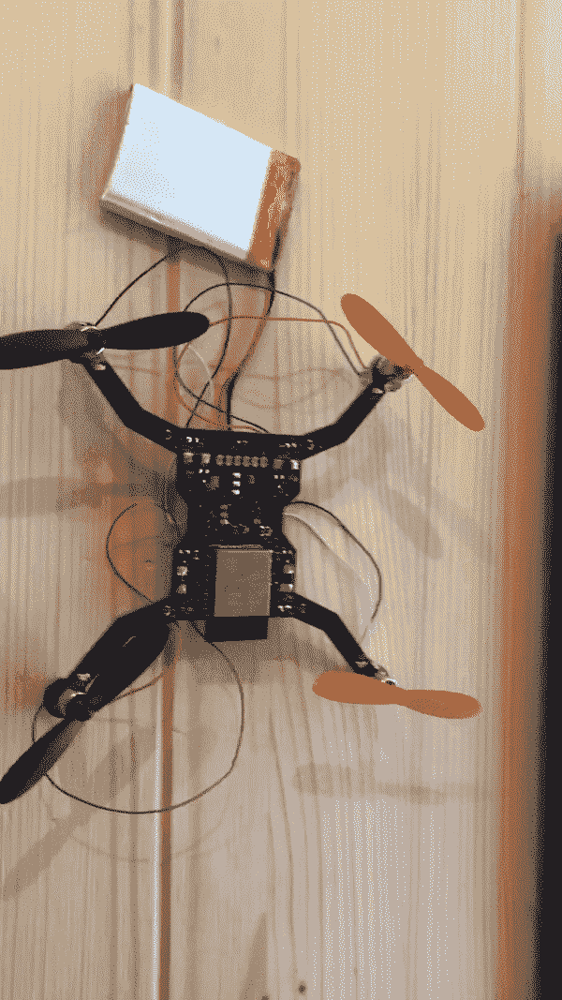

# 动态跨网格深度学习—第 1 部分:无人机

> 原文：<https://towardsdatascience.com/deep-learning-across-mesh-on-the-fly-part-1-the-drones-8bf3d7c9b4f?source=collection_archive---------21----------------------->

## [深度学习无人机](https://medium.com/tag/deep-learning-drones)

## AI 会飞会怎么样？

L **et 创造了一个微型无人机群**，它利用人工智能和网状网络来模仿自然界中常见的群体行为。

坚持住！不要走！听我说完这个概念。通过利用这些时髦的技术，我们可以创造出非常酷，而且我敢说，非常有用的东西？

当然，小型无人机有可怕的飞行时间(以及其他事情)，是的，微处理器可能不是人工智能处理的最佳解决方案。然而，如果我们保持项目的小范围，那么我们可能能够完成它。比如用装有传感器阵列的多架四轴飞行器在室内环境中模仿群体行为。

还觉得我满口胡言吗？如果我告诉你我已经造出了第一个原型呢？

让我们开始吧！

# 无人机是怎么做出来的？

当开始任何需要硬件的项目时，你应该做的第一件事就是确定你想要使用什么组件。

在这种情况下，我选择使用 PCB 作为四轴飞行器的底座。这将最大限度地减少项目所需的零件数量。它还可以让我快速原型化各种设计并做出改变，而不必制作多个零件。

四轴飞行器的上述底座尺寸为 100 毫米乘 100 毫米。它被印刷在一个两层的 PCB 上，包含了让四轴飞行器飞行所需的一切！

是时候决定飞行控制器、惯性测量单元以及如何控制马达了。

对于我的概念无人机，我选择了 [ESP32](https://www.espressif.com/en/products/hardware/esp32/overview) 作为主飞行控制器。我选择 ESP32 是因为它的多功能性、多核、大量 PWM 引脚(用于控制螺旋桨速度的脉宽调制)和网状网络功能。ESP32 还可以针对最低功耗进行优化，同时为给定任务提供足够的功率。

如果您还没有使用过 ESP32 模块，那您就错过了。

对于我的惯性测量单元，我选择了 [MPU6050](https://www.invensense.com/products/motion-tracking/6-axis/mpu-6050/) 。MPU6050 是一个六轴陀螺仪和加速度计 [IC](https://en.wikipedia.org/wiki/Integrated_circuit) 。MPU6050 非常适合确定无人机的俯仰、偏航、滚动和加速度。该芯片还通过一个[双线接口](https://en.wikipedia.org/wiki/I²C)(不能说是 I2C，因为它是有商标的)，并且非常容易从 ESP32 访问。

最后，我们需要一个电压调节器和电机电路。

稳压器是德州仪器的超低压差稳压器，具体来说就是 [TLV117LV33DCYR](https://www.mouser.com/ProductDetail/texas-instruments/tlv1117lv33dcyr/?qs=tEz3BkPb1rwzXMb8FiWhow%3D%3D&countrycode=US&currencycode=USD) (Yikes！那是一个很长的数字)。

对于电机控制器，我采用二极管/MOSFET/电阻设置。我还附加了一个 100uf 电容用于平滑。

*   二极管:[621–1n 5819 HW-F](http://www.mouser.com/ProductDetail/diodes-incorporated/1n5819hw-7-f/?qs=NQ47qNm99eDyWTEd07miYA%3d%3d&countrycode=US&currencycode=USD)
*   电容器: [581-F980J107MSA](http://www.mouser.com/ProductDetail/avx/f980j107msa/?qs=YlHR7fkrjk%2fpYfX2RHfdGQ%3d%3d&countrycode=US&currencycode=USD)
*   MOSFET: [781-SI2302CDS-E3](http://www.mouser.com/ProductDetail/vishay/si2302cds-t1-e3/?qs=%252bPu8jn5UVnHNrjAmGCs%2fuw%3d%3d&countrycode=US&currencycode=USD)
*   电阻器:1K 电阻器

Circuit diagram for the drone’s motors

上面的配置是最佳的，因为它允许 ESP32(3.3V 芯片)控制从电池接收全部 3.7V 电压的电机。电容器将有助于防止电池上的过电流保护由于突然的电流尖峰而触发。这些电流尖峰通常会在电机首次启动时或速度急剧上升时出现。

# 示意图，示意图，示意图！

零件清单做好了，无人机的基本概念也有了，是时候开始组装了！

我首先关注的是将 ESP32 连接到 MPU6050 和电机。由于许多在线参考，MPU6050 相当容易连接。然而，我犯了一个致命的错误，阻止了 ESP32 与 MPU6050 的通信-..我在 3.3V 线上使用了 10K 上拉电阻。这导致线路低于信号阈值，被视为高电平，ESP32 无法与我的概念无人机上的 MPU6050 通信。我已经修复了错误，并使用 2.2K 电阻代替，但它引起了一个主要问题，我们将在稍后讨论。

这是飞行控制器的示意图:

很酷，对吧？这是无人机最复杂的部分(到目前为止)。

在我完成了飞行控制器之后，我开始研究电源电路。它只是连接到输入线路的 3.3V 超低压差稳压器和两个 0.1uF 电容。

然后是电机控制器。

最后，连接到四轴飞行器每个臂上的发光二极管。

所有这些电路不可避免地成为第一个概念四轴飞行器。

有趣的部分是设计四轴飞行器本身和路由所有的组件。

Slimmed-down version of the 100x100mm drone to reduce weight

# 组装无人机

无人机完成后，一切都被送去生产，并在两周内回来。我花了大约 40 美元买了一架无人机(不是很好，但也不可怕)。

Baby steps…..

经过一个漫长的夜晚焊接所有的东西，一次测试一个转子，我让一切正常工作！MPU6050 除外..力量..稳定性到此为止了吧。

即使没有工作的 MPU6050 -..我能够让所有四个马达都运转起来，并动态调整速度，看看无人机是否能离开地面。

下面是我使用的测试代码。

超级简单的代码片段。在这里，我只是配置所需的引脚使用 PWM，然后慢慢调整功率输出，直到电池因过流保护而断电。

这是因为我使用了锂离子电池，而不是锂聚合物。锂聚合物电池通常比锂离子轻得多，可以输出更大的电流。虽然它们更轻，但锂电池的外壳通常也更厚。

# 第一次飞行

在充满期待之后，我上传了测试代码，并检查了无人机是否会飞。

First…flight?

**剧透警报**:它没飞起来。

还记得我之前提到的 MPU6050 的问题吗？没有稳定，我们不会走得很远。

我们在这里学到了什么？这些四轴飞行器太重了，飞行控制器需要一个合适的控制回路来稳定自身和悬停。

无人机的下一次迭代将被印刷在更薄更小的 PCB 上，我将使用锂电池代替。这将允许四轴飞行器利用发动机的全油门，获得相当大的升力。与此同时，我将创建一个更合适的控制环路，它可以与 MPU6050 接口，并调整四轴飞行器的俯仰、偏航和滚动，以保持稳定。

所有这些修复将允许建立一个工作的四轴飞行器，并让我继续这个项目的深度学习和网状网络方面。

# 深度学习和群体行为

我知道，我知道，我没有在这篇文章中详细介绍这个项目的深度学习方面。

那只是因为我还没有走到那一步。这是一个多次迭代的项目，因此，我们必须从小处着手，逐步推进。

我概述的当前步骤是:

*   原型一个能飞的 PCB 微型无人机
*   将网状网络与无人机上的 ESP32 模块结合在一起
*   创造第二代带距离传感器的微型无人机
*   训练神经网络以允许在模拟环境中的群体行为
*   将经过训练的模型应用于微型无人机

这将是一个真正的深度学习项目，即使四轴飞行器必须连接到更强大的基站进行数据处理。然而，我们的目标是看看利用分布式网络方法，我们能把这些微处理器推进到什么程度。

我希望最终产品看起来像下面显示的英特尔无人机灯光秀:

Credit: Intel

当然，规模要小得多，而且可能只是在室内环境中。

对于深度学习部分，无人机将利用深度强化学习来即时做出关于如何在周围环境中机动的决定。

深层加固网络将在模拟环境中使用 [Unity3D](https://unity.com/) 进行训练。通过这种方式，丢失无人机或手指的风险可以通过预先训练的模型来减轻。

增强模型将在连接到无人机网状网络的基站上运行，或者在每个无人机上运行。该网络将依靠网状网络中所有无人机的传感器读数来计算单个无人机的最佳可能行动。通过这种方式，他们要么能够根据其他人正在做的事情进行协调，要么网络中的中央管理器将监视无人机并指挥它们。

单一基站是这个项目的一个有吸引力的选择，但会挫败将 ESP32 推向绝对边缘的目的。然而，如果没有基站来提供神经网络所需的广泛计算能力，无人机的能力将受到明显的限制。

# 下一步是什么？

无人驾驶飞机、控制回路和网格功能。

本系列的下一篇文章将关注如何让无人机真正飞行。它还将介绍一个 ESP32 网状网络的基本实现，作为概念验证，在节点之间传递数据。

所有代码和原理图将很快可用！在传给你们之前，我想确保我有一个可行的设计！