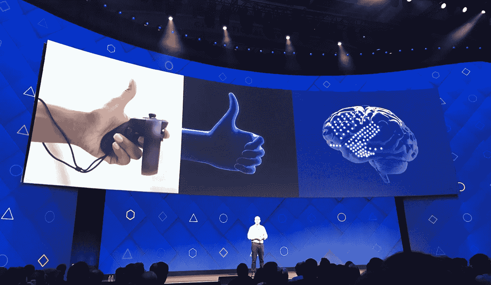
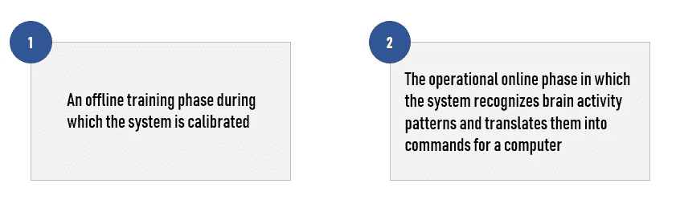
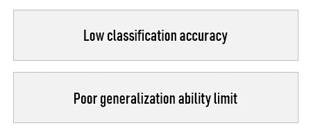
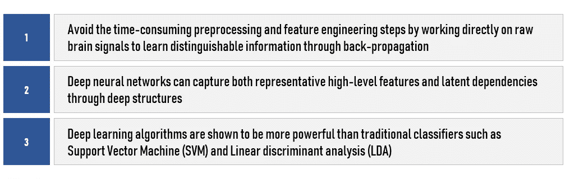

# 深度学习算法和脑机接口

> 原文：<https://towardsdatascience.com/deep-learning-algorithms-and-brain-computer-interfaces-7608d0a6f01?source=collection_archive---------18----------------------->

作为研究团队的一员，我想解释近年来深度学习(DL)如何显著提升了脑机接口系统(BCI)的性能。

对于那些不熟悉脑机接口的人来说，BCI 是一个将人脑的活动模式翻译成消息或命令以与其他设备通信的系统。

可以想象，设计 BCI 是一项复杂的任务，需要计算机科学、工程学、信号处理、神经科学等多学科知识。

要使用 BCI，通常需要两个阶段:

在 BCI 进行校准很有挑战性，因为信噪比(SNR)不理想，而且受试者之间的差异很大。根据所选范式的类型，校准所需的时间可能不同。尽管如此，校准时间可以部分减少。

BCI 的关键挑战是在大脑信号信噪比很低的情况下准确识别人类的意图。事实是低分类精度和低泛化能力限制了 BCI 的实际应用。

为了克服上述挑战，在过去几年中，深度学习技术已经被用于处理大脑信息。与传统的机器学习算法不同，深度学习可以从大脑信号中学习特定的高级特征，而无需人工选择特征，其准确性与训练集的大小成正比。此外，深度学习模型已经应用于几种类型的 BCI 信号(例如，自发 EEG、ERP、fMRI)。

# 为什么要深度学习？

首先，大脑信号容易被各种生物(例如，眨眼、肌肉伪影、疲劳和注意力水平)和环境伪影(例如，环境噪声)破坏。

使用脑电图有许多困难。由于 BCI 的主要任务是脑信号识别，因此区分性深度学习模型是最流行和最强大的算法。

> 一个 **BCI** 可以通过多种方式监控大脑活动，大致可以分为**侵入式**和**非侵入式** - **侵入式**。大多数**非** - **有创 BCI** 系统使用脑电信号；即从放置在头皮上的电极记录的脑电活动。

很难理解大脑活动的意义，这种活动从神经元相互交流，通过头骨，通过头皮，勉强进入 EEG 传感器。一般来说，EEG 数据是非常嘈杂的，因为很难获得特定事物的清晰信号。

因此，从受损的大脑信号中提取有用的数据并建立一个在不同情况下都能工作的健壮的 BCI 系统是至关重要的。

此外，由于电生理脑信号的非平稳特性，BCI 具有低信噪比。

> 在脑机接口(BCI)中对脑电图(EEG)数据进行分类的准确性取决于测量通道的数量、用于训练分类器的数据量以及信噪比(SNR)。在所有这些因素中，信噪比是现实应用中最难调整的。

虽然已经开发了几种预处理和特征工程方法来降低噪声水平，但是这些方法(例如，时域和频域中的特征选择和提取)非常耗时，并且可能导致提取的特征中的信息丢失。

第三，特征工程高度依赖于人类在特定领域的专业知识。人类经验可能有助于捕捉某些特定方面的特征，但在更普遍的情况下证明是不够的。因此，需要一种算法来自动提取代表性特征。

**深度学习为自动提取可区分特征提供了更好的选择。**

此外，当前大多数机器学习研究都专注于静态数据，因此无法准确地对快速变化的大脑信号进行分类。在 BCI 系统中，通常需要新的学习方法来处理动态数据流。

> 到目前为止，深度学习已经在 BCI 应用中得到广泛应用，并在解决上述挑战方面显示出成功。

深度学习有三个优势。首先，它通过直接在原始脑信号上工作来通过反向传播学习可区分的信息，从而避免了耗时的预处理和特征工程步骤。此外，深度神经网络可以通过深度结构捕捉代表性的高级特征和潜在的依赖性。

最后，深度学习算法被证明比支持向量机(SVM)和线性判别分析(LDA)等传统分类器更强大。**这是有道理的，因为几乎所有的 BCI 问题都可以被视为一个分类问题。**

# BCI 使用的 DL 算法

CNN 是 BCI 研究中最流行的 DL 模型，可以用来挖掘输入脑信号(如 fMRI 图像、自发脑电等)之间潜在的空间相关性。

CNN 在一些研究领域取得了巨大的成功，这使得它非常“可扩展”和可行(通过可用的公共代码)。因此，BCI 的研究人员有更多的机会了解 CNN 并将其应用到他们的工作中。

生成式深度学习模型主要用于生成训练样本或数据扩充。换句话说，生成式深度学习模型在 BCI 地区起到了辅助作用，提高了训练数据的质量和数量。在 BCI 范围内，生成算法主要用于重建或生成一批脑信号样本来增强训练集。BCI 常用的生成模型包括变分自动编码器(VAE)、生成对抗网络(GANs)等。

深度信念网络也在 BCI 用于特征提取。尽管越来越多的出版物关注于采用 CNN 或混合模型来进行特征学习和分类。

RNN 和 CNN 都具有很好的时间和空间特征提取能力，将它们结合起来进行时间和空间特征学习是很自然的。

# 未来的挑战

基于深度学习的 BCI 的一个有前景的研究领域是开发一个通用框架，该框架可以处理各种 BCI 信号，而不管用于信号收集的通道数量、样本维度和刺激类型(视觉或听觉刺激)等。

总体框架需要两种关键能力:

*   注意机制
*   捕捉潜在特征的能力。

前者保证该框架能够集中于输入信号的最有价值的部分，而后者使该框架能够捕获独特的和信息丰富的特征。

到目前为止，大多数 BCI 分类任务都集中在与人相关的场景，其中训练集和测试集来自同一个人。未来的方向是实现与人无关的分类，使测试数据永远不会出现在训练集中。高性能的独立于个人的分类对于 BCI 系统在现实世界中的广泛应用是必不可少的。

实现这一目标的一个可能的解决方案是建立一个具有迁移学习的个性化模型。

# BCI 的未来

当谈到更先进的想法时，我们可能仍然需要几年的时间，因为大脑的功能更加复杂，不容易理解。我们仍在学习大脑如何创造这些复杂的功能，尽管有些人已经在非人类物种中进行了非常初步的尝试，但结果并没有达到我们的预期。

**根据一些研究，目前只有不到 100 人在使用这项技术的一些早期形式。**

就方法论而言，复杂网络理论现在正处于早期阶段...它需要达到成熟，我们才能看到对我们理解复杂网络(如大脑)的内在机制的影响。目前的技术只能让我们接触到神经系统的某些部分。

在计算机科学中，在用更有效的算法和数据结构以省时的方式解码神经数据方面还有许多事情要做。

**要了解更多信息，我推荐你阅读这项出色的研究，它对我写这篇文章帮助很大:**
-“[基于深度学习的脑机接口调查:最新进展和新前沿](https://www.researchgate.net/publication/333041580_A_Survey_on_Deep_Learning_based_Brain_Computer_Interface_Recent_Advances_and_New_Frontiers)”