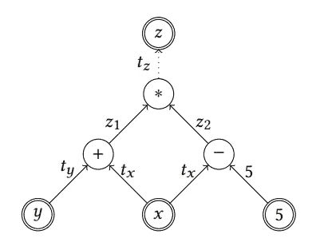
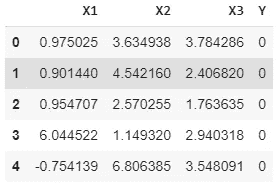

# 使用大模型支持的深度学习分析

> 原文：<https://towardsdatascience.com/deep-learning-analysis-using-large-model-support-3a67a919255?source=collection_archive---------19----------------------->

## 借助 IBM 大型模型支持，优化您的深度学习模型内存消耗。


(Source: [https://miro.medium.com/max/3512/1*d-ZbdImPx4zRW0zK4QL49w.jpeg](https://miro.medium.com/max/3512/1*d-ZbdImPx4zRW0zK4QL49w.jpeg))

# 介绍

内存管理现在是机器学习中一个非常重要的话题。由于内存限制，使用 Kaggle 和谷歌 Colab 等云工具训练深度学习模型变得非常普遍，这要归功于它们免费的 NVIDIA 图形处理单元(GPU)支持。尽管如此，在云中处理大量数据时，内存仍然是一个巨大的限制。

在我的[上一篇文章](/gpu-accelerated-data-analytics-machine-learning-963aebe956ce)中，我解释了如何加速机器学习工作流的执行。相反，本文旨在向您解释如何在实现深度学习模型时有效地减少内存使用。通过这种方式，你可能能够使用相同数量的内存来训练你的深度学习模型(即使之前因为内存错误而无法训练)。

模型导致内存不足的主要原因有三个:

*   **模型深度/复杂度** =神经网络的层数和节点数。
*   **数据大小** =使用的数据集中样本/特征的数量。
*   **批量大小** =通过神经网络传播的样本数量。

这个问题的一个解决方案传统上是通过在预处理阶段试图去除不太相关的特征来减小模型大小。这可以使用[特征重要性](/svm-feature-selection-and-kernels-840781cc1a6c)或特征提取技术(如 PCA、LDA)来完成。

使用这种方法可能会降低噪声(减少过度拟合的机会)并缩短训练时间。不过这种方法的一个缺点是准确性会持续下降。

如果模型需要很高的复杂度来捕捉数据集的所有重要特征，那么减少数据集的大小实际上不可避免地会导致更差的性能。在这种情况下，大模型支持可以解决这个问题。

# 大型模型支持

大型模型支持(LMS)是 IBM 最近推出的一个 Python 库。这个库的构想是为了训练无法容纳在 GPU 内存中的大型深度学习模型。事实上，与中央处理器(CPU)相比，GPU 通常具有更小的内存空间。

当使用 Tensorflow 和 PyTorch 等库实现神经网络时，会自动生成一组数学运算来构建该模型。这些数学运算可以用计算图来表示。

> 计算图是一个有向图，其中节点对应于**操作**或**变量**。变量可以将它们的值提供给操作，操作可以将它们的输出提供给其他操作。这样，图中的每个节点都定义了变量的函数。
> 
> —深刻的想法[1]

计算图中进出节点的值称为张量(多维数组)。

图 1 给出了一个简单的例子，说明如何使用计算图形(z =(x+y)∫(X5))来表示数学运算:



Figure 1: Computational Graph [2]

LMS 能够通过重新设计神经网络计算图来缓解 GPU 内存问题。这是通过在 CPU(而不是 GPU)上存储中间结果来实现张量运算的。

IBM 文档概述了使用 Tensorflow 库支持大型模型的三种不同方法:

*   **基于会话的培训。**
*   **基于估计器的训练。**
*   **基于 Keras 的培训。**

在本文中，我将提供一个使用基于 Keras 的培训的例子。如果您有兴趣了解其他两种方法的更多信息，IBM 文档是一个很好的起点[3]。

使用 LMS 时，我们可以调整两个主要参数来提高模型效率。目标是能够找出我们需要交换的最少数量的张量，而不会导致内存错误。

要调整的两个主要参数是:

*   **n_tensors** =交换张量的数量(例如，刷出比所需更多的张量，会导致通信开销)。
*   **lb** =张量在使用前多久换回(例如，使用较低的 lb 值会使 GPU 训练暂停)。

# 示范

现在，我将通过一个简单的例子向您介绍 LMS。这个练习使用的所有代码都可以在这个 [Google 协作笔记本](https://drive.google.com/open?id=18PFe_8mVtcZj9PhdZwUQXPZkzbKwMFEG)和我的 [GitHub](https://github.com/pierpaolo28/Artificial-Intelligence-Projects/blob/master/IBM%20Large%20Model%20Support/LargeModelSupport.ipynb) 上找到。

在这个例子中，我将训练一个简单的神经网络，首先使用具有大模型支持的 Keras，然后只使用普通的 Keras。如果是这两种情况，我将记录培训所需的内存使用情况。

## 预处理

为了按照这个例子安装所有需要的依赖项，只需在您的笔记本上运行以下单元，并启用您的 GPU 环境(例如 Kaggle、Google Colab)。

```
! git clone [https://github.com/IBM/tensorflow-large-model-support.git](https://github.com/IBM/tensorflow-large-model-support.git)
! pip install ./tensorflow-large-model-support
! pip install memory_profiler
```

一旦一切就绪，我们就可以导入所有必要的库了。

为了记录内存使用情况，我决定使用 Python[*memory _ profiler*](https://jakevdp.github.io/PythonDataScienceHandbook/01.07-timing-and-profiling.html)。

随后，我定义了将在培训中使用的 LMS Keras 回调。根据 Keras 文档，回调的定义是:

> 回调是在训练过程的给定阶段应用的一组函数。在训练期间，您可以使用回调来查看模型的内部状态和统计数据。
> 
> — Keras 文档[4]

回调通常用于通过在每个训练迭代期间自动化某些任务来控制模型训练过程(在这种情况下，通过添加大型模型支持优化)。

然后，我决定使用由三个特征和两个标签(0/1)组成的高斯分布来构建一个 200000 行的简单数据集。

已经选择了分布的平均值和标准偏差值，以便使这个分类问题相当容易(线性可分数据)。



Figure 2: Dataset Head

创建数据集后，我将其分为要素和标注，然后定义一个函数对其进行预处理。

现在我们有了训练/测试集，我们终于准备好开始深度学习了。因此，我为二元分类定义了一个简单的序列模型，并选择了 8 个元素的批量大小。

## Keras 和大型模型支持

使用 LMS 时，使用 Keras *fit_generator* 函数训练 Keras 模型。这个函数需要的第一个输入是一个生成器。生成器是一种功能，用于在多个内核上实时生成数据集，然后将其结果输入深度学习模型[5]。

为了创建本例中使用的生成器函数，我参考了[这个实现](https://stackoverflow.com/questions/46493419/use-a-generator-for-keras-model-fit-generator)。

如果你对 Keras 发电机的更详细的解释感兴趣，可以在[这里](https://stanford.edu/~shervine/blog/keras-how-to-generate-data-on-the-fly)找到。

一旦定义了我们的生成器函数，我就使用之前定义的 LMS Keras 回调来训练我们的模型。

在上面的代码中，我在第一行额外添加了 *%%memit* 命令来打印出运行这个单元的内存使用情况。结果如下所示:

```
Epoch 1/2 200000/200000 [==============================] 
- 601s 3ms/step - loss: 0.0222 - acc: 0.9984 Epoch 2/2 200000/200000 [==============================] 
- 596s 3ms/step - loss: 0.0203 - acc: 0.9984 peak memory: 2834.80 MiB, increment: 2.88 MiB
```

使用 LMS 训练此模型的注册峰值内存等于 2.83GB，增量为 2.8MB

最后，我决定测试我们的训练模型的准确性，以验证我们的训练结果。

```
Model accuracy using Large Model Support: 99.9995 %
```

## 克拉斯

使用普通 Keras 重复相同的程序，获得以下结果:

```
Epoch 1/2 1600000/1600000 [==============================] 
- 537s 336us/step - loss: 0.0449 - acc: 0.9846 Epoch 2/2 1600000/1600000 [==============================] 
- 538s 336us/step - loss: 0.0403 - acc: 0.9857 peak memory: 2862.26 MiB, increment: 26.15 MiB
```

使用 Keras 训练该模型的注册峰值内存等于 2.86GB，增量为 26.15MB

测试我们的 Keras 模型反而导致 98.47%的准确性。

```
Model accuracy using Sklearn: 98.4795 %
```

# 估价

比较使用 *Keras + LMS 与普通 Keras* 获得的结果，可以注意到，使用 LMS 可以减少内存消耗，并提高模型精度。如果给予更多的 GPU/CPU 资源(可用于优化训练)并使用更大的数据集，LMS 的性能甚至可以得到改善。

除此之外，IBM 和 NVIDIA 还决定创建一个由 **27000 个 NVIDIA TESLA GPU**组成的深度学习计算机集群，以进一步发展这方面的研究人员。如果你有兴趣了解更多，你可以在这里找到更多信息[。](https://www.ibm.com/blogs/systems/ibm-and-nvidia-further-collaboration-to-advance-open-source-gpu-acceleration/)

# 联系人

如果你想了解我最新的文章和项目[，请通过媒体](https://medium.com/@pierpaoloippolito28?source=post_page---------------------------)关注我，并订阅我的[邮件列表](http://eepurl.com/gwO-Dr?source=post_page---------------------------)。以下是我的一些联系人详细信息:

*   [领英](https://uk.linkedin.com/in/pier-paolo-ippolito-202917146?source=post_page---------------------------)
*   [个人博客](https://pierpaolo28.github.io/blog/?source=post_page---------------------------)
*   [个人网站](https://pierpaolo28.github.io/?source=post_page---------------------------)
*   [中等轮廓](https://towardsdatascience.com/@pierpaoloippolito28?source=post_page---------------------------)
*   [GitHub](https://github.com/pierpaolo28?source=post_page---------------------------)
*   [卡格尔](https://www.kaggle.com/pierpaolo28?source=post_page---------------------------)

# 文献学

[1]从零开始的深度学习 I:计算图——深度思想。访问网址:[http://www . deep ideas . net/deep-learning-from scratch-I-computational-graphs/](http://www.deepideas.net/deep-learning-from-scratch-i-computational-graphs/)

[2] TFLMS:通过图重写在张量流中支持大模型。董丁乐，今井春树等访问:[https://arxiv.org/pdf/1807.02037.pdf](https://arxiv.org/pdf/1807.02037.pdf)

TensorFlow 大型模型支持(TFLMS)入门— IBM 知识中心。访问地址:[https://www . IBM . com/support/knowledge center/en/ss5sf 7 _ 1 . 5 . 4/navigation/pai _ TF LMS . html](https://www.ibm.com/support/knowledgecenter/en/SS5SF7_1.5.4/navigation/pai_tflms.html)

[4] Kears 文件。文档->回调。访问地点:【https://keras.io/callbacks/?source=post_page -

[5]如何将数据生成器用于 Keras 的详细示例。
谢尔文·阿米迪。访问地址:[https://Stanford . edu/~ sher vine/blog/keras-how-to-generate-data-on-the-fly](https://stanford.edu/~shervine/blog/keras-how-to-generate-data-on-the-fly)