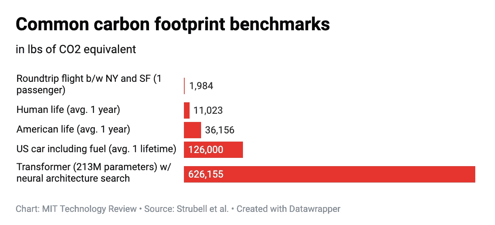
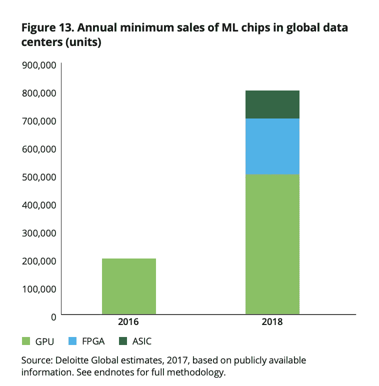
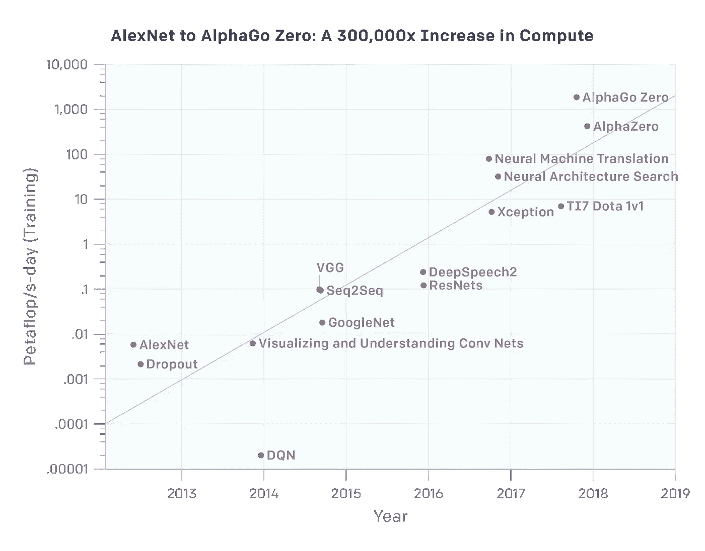
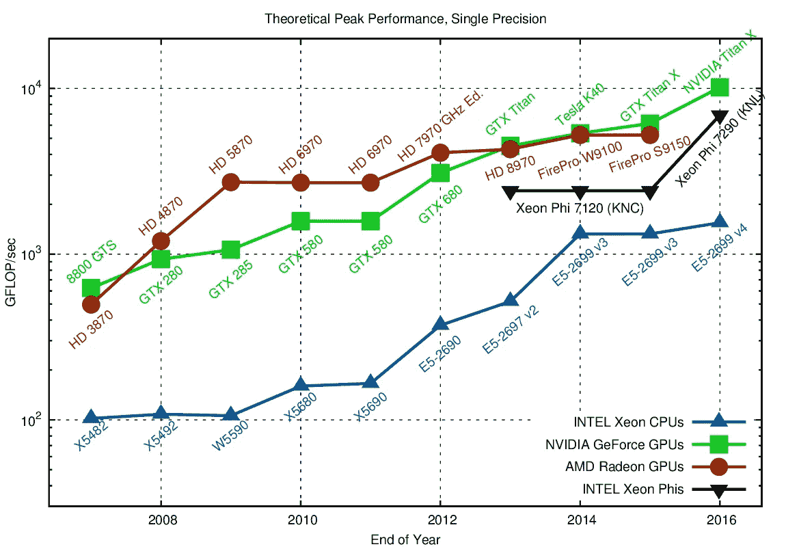

# 深度学习和碳排放

> 原文：<https://towardsdatascience.com/deep-learning-and-carbon-emissions-79723d5bc86e?source=collection_archive---------6----------------------->

由 Emma Strubell、Ananya Ganesh 和 Andrew McCallum 撰写的一篇颇具争议的论文《NLP 中深度学习的能源和政策考虑》最近正在流传。虽然论文本身是深思熟虑和有分寸的，但标题和推文一直具有误导性，比如“深度学习模型有大量的碳足迹”。一篇特别是[不负责任的文章](https://edgy.app/a-single-ai-carbon-emission-is-nearly-5x-greater-than-a-car?pfrom=science&fp=a7)将该发现总结为“一个普通的现成深度学习软件可以排放超过 626，000 磅的二氧化碳”，这是一个惊人的误解。

作为一个非常关心深度学习和环境的人，我很高兴看到机器学习从业者写的一篇关于这个主题的深思熟虑的文章，但很遗憾看到它在媒体上被严重歪曲。

我开了一家公司，Weights and Biases，帮助机器学习从业者跟踪他们的模型和实验。我已经直接看到了冗余模型训练的代价，我希望权重和偏见可以在帮助机器学习从业者更明智地使用他们的资源方面发挥作用。

**结论**

1.  模型训练的实际碳足迹可能不是什么大问题，但在未来可能是。
2.  模型推理的碳足迹现在是一个更大的问题。
3.  快速增长的 CPU/GPU 培训成本是今天的一个问题，原因有几个，我预计它会变得更糟。
4.  机器学习从业者在冗余训练上浪费了大量资源。

**如今，模型训练可能不是碳排放的重要来源(但它正呈指数增长)**

论文中的示例模型“具有神经架构搜索的变压器”在 2019 年几乎任何人真正做的计算成本方面都遥遥领先。例如，一个更具代表性的任务，在 imagenet 上训练一个标准的神经网络初始，以 95%的准确率识别图片中的对象，需要大约 40 个 GPU 小时，这将消耗大约 10 千瓦时并产生大约 10 磅的二氧化碳，这相当于运行一个中央空调大约 2-3 个小时。

我们看到的使用 Weights & Biases 的典型机器学习实践者可能有八个 GPU 可供其使用，它们的利用率不会接近 100%。即使他们这样做，能源消耗将在 2kW 左右。如果有 100，000 名机器学习从业者(可能很慷慨)，总的培训消耗将是 200 兆瓦。这并不比让一架 747 飞机停留在空中多多少能源，也可能更少碳排放。

另一种看待深度学习影响的方式是看英伟达的销售额，因为英伟达提供了大多数人用于培训的处理器。在 Q1 2019 年，他们的数据中心收入为 7.01 亿美元，这意味着他们为数据中心销售了大约 100，000 个 GPU。即使所有这些 GPU 都是训练模型(同样，不太可能)，我们也会得出类似的结论。

**为什么机器学习可能成为未来碳排放的重要组成部分**

仅仅因为模型训练可能不是今天的主要碳生产者，并不意味着我们不应该关注它在未来可能产生的影响。

尽管典型的机器学习实践者可能只使用八个 GPU 来训练模型，但在谷歌、脸书、OpenAI 和其他大型组织中，使用率可能会高得多。

美国能源部为他们的橡树岭超级计算机购买了 [27，648 个 Volta GPU](https://blogs.nvidia.com/blog/2018/06/08/worlds-fastest-exascale-ai-supercomputer-summit/) ，他们计划用于深度学习，在 100%利用率的情况下将消耗大约 1 兆瓦。

深度学习的最近趋势显然是计算量增加几个数量级。这意味着更多数量级的能源和气候影响。因为今天的影响可能很小，如果趋势继续下去，它可能会迅速改变。OpenAI 有一篇出色的博客文章， [AI 和 Compute](https://openai.com/blog/ai-and-compute/) 展示了构建最先进模型的计算成本的快速增长。

来源:[人工智能和计算](https://openai.com/blog/ai-and-compute/)

‍

GPU 性能功耗比也呈指数级增长，但它似乎更像是每 10 年增长 10 倍，而先进模型性能所需的计算每年增长 10 倍。

[https://github.com/karlrupp/cpu-gpu-mic-comparison](https://github.com/karlrupp/cpu-gpu-mic-comparison)

**模型推理比模型训练消耗更多的能量(现在如此，可能永远如此)**

模型不仅仅在训练时消耗能量，今天更大的能量消耗来源于它们被部署之后。Nvidia 估计，在 2019 年，[一款机型](https://www.forbes.com/sites/moorinsights/2019/05/09/google-cloud-doubles-down-on-nvidia-gpus-for-inference/#1fa3c4c36792)80–90%的成本都在推论中。目前还不清楚神经网络进行自动驾驶需要多少功率，但一些[原型需要多达 2500 瓦](https://www.wired.com/story/self-driving-cars-power-consumption-nvidia-chip/)，如果在世界上的每辆汽车上部署，将产生相当大的影响，尽管这比实际移动汽车要小一个数量级。

一个更直接的能源使用问题是[数据中心今天使用超过 200 瓦](https://www.nature.com/articles/d41586-018-06610-y)，而且这个数字还在增长。谷歌在数据中心的能源使用足以激励他们设计自己的处理器，用于被称为 TPU 的推理，他们现在也将它作为谷歌云的一部分提供。

**经济激励大多与模特培训的环境激励一致**

模特培训变得极其昂贵。在云中运行模型，单个 GPU 的成本约为 1 美元/小时，产生约 0.25 磅的二氧化碳——以 10 美元/吨的声誉良好的碳抵消计算，抵消这些二氧化碳将花费约 0.1 美分，仅增加我的账单 0.1%。为碳中和模型培训支付的小额增量价格。

**对于深度学习中快速增长的计算需求来说，环境影响甚至可能不是最糟糕的事情**

Ananya 的论文提到了这一点，但它值得强调:训练艺术模型的高成本有许多令人担忧的影响。如今，研究人员和初创公司很难与谷歌和脸书等公司竞争，甚至复制它们的工作，因为培训成本太高。

直到最近，模型通常被认为是数据绑定的，许多人担心大公司在拥有最多数据方面具有不容置疑的优势。但是研究人员仍然能够在像 ImageNet 这样的高质量开放数据集上取得进展。创业公司能够在他们可用的数据上建立最好的机器学习应用程序。

在一个研究人员和公司都受限于计算的世界里，很难想象他们将如何与大公司竞争甚至合作。如果最先进的模型花费数百万美元来训练，还会有人试图复制彼此的结果吗？

即使在研究人员中，更高知名度的实验室也拥有不成比例的资金和资源，导致他们发表更令人兴奋的结果，这反过来增加了他们的计算能力。这可能导致极少数机构成为唯一能够进行基础深度学习研究的机构，

‍

**大量浪费和冗余的计算正在不断增加**

这篇文章有几个极好的结论，我都同意。第一个是“作者应该报告训练时间和对超参数的敏感性”。为什么这如此重要？一个非从业者可能不会从这篇文章中意识到的一件事是，相同的深度学习模型是如何被一遍又一遍地训练的。从业者通常从现有的艺术模型开始，并尝试训练它。

例如，像脸书的 [mask rcnn 视觉模型](https://github.com/facebookresearch/maskrcnn-benchmark)这样受欢迎的机器学习知识库已经被标星超过 5000 次，分叉超过 1500 次。很难说有多少人使用这种模式进行了训练，但我认为合理的估计可能是恒星数量的十倍，也就是说，有 25，000 名不同的人尝试过这种模式。有人会对模型做的第一件事就是训练它，看看它表现如何。然后他们通常会训练它更多次，尝试不同的超参数。但是所有这些信息都丢失了，而且大多数训练都是多余的。

这是我创办公司《重量与偏见》的原因之一。我们会保存您运行的所有实验，这样您就不必再次运行它们，而那些接手您工作的人也不必再次运行它们。当我看到研究人员在我们的系统中跟踪他们的实验时，我真的很兴奋。

论文中提出的另一个要点是“NLP 和机器学习软件开发人员可以帮助减少与模型调整相关的能量的另一个途径是通过提供易于使用的 API 来实现更有效的替代超参数调整的强力网格搜索，例如随机或贝叶斯超参数搜索技术。”

换句话说，研究人员不用尝试所有可能的超参数集，而是通过让算法智能地挑选有前途的超参数来节省资金、时间和环境影响。我们真的试图让[做更智能的超参数搜索变得非常简单。](https://www.wandb.com/articles/multi-gpu-sweeps)

‍

**考虑抵消你的模特训练对环境的影响**

与在亚马逊上购买 GPU 小时相比，购买碳补偿是便宜的。那么为什么不碳中和呢？有些人不认为碳补偿真的有效，但这超出了我的专业领域。非营利的碳基金对此进行了大量的思考，并提供了我认为大多数人会认为是高质量的碳补偿，即使他们可能会对确切的“补偿”吹毛求疵。向像[地球正义](https://earthjustice.org/)这样的组织捐款可能不那么直接，但可能更有影响力。如果你左右为难，也许可以两者兼而有之。

一个简单的公式是，2019 年在加利福尼亚州的 Nvidia GPU 上训练一小时产生大约 0.25 磅[二氧化碳当量](https://ecometrica.com/assets/GHGs-CO2-CO2e-and-Carbon-What-Do-These-Mean-v2.1.pdf)的排放。

如果你想帮助计算你的模型训练碳足迹，我很乐意帮助你。

‍

**感谢**

感谢詹姆斯·查姆、埃德·麦卡洛、克里斯·范·代克、布鲁斯·比沃德、斯泰西·斯维特拉奇尼亚和诺加·莱维纳的有益反馈。