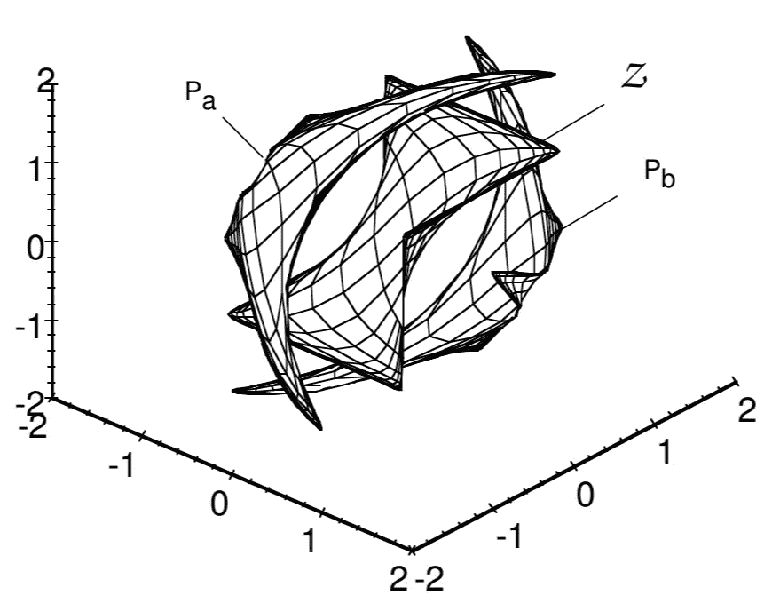
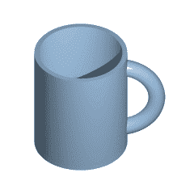
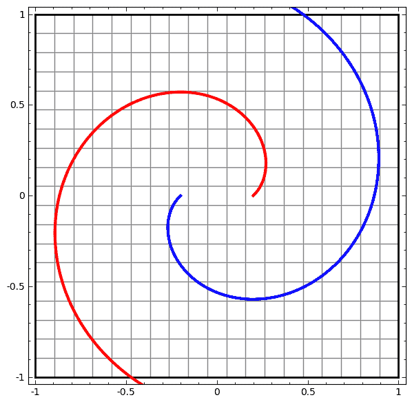
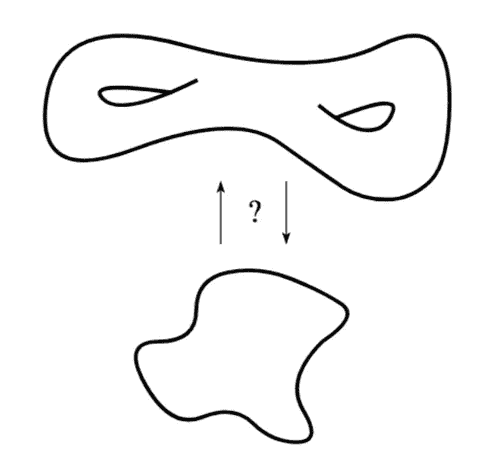
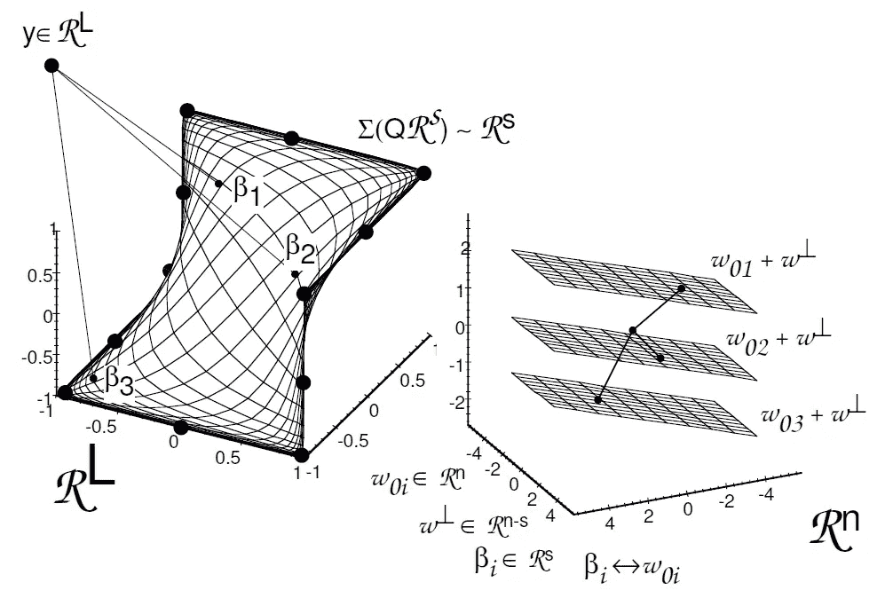

# 神经网络的自然同伦

> 原文：<https://towardsdatascience.com/deep-learning-and-doughnuts-c2f0f7b7c598?source=collection_archive---------9----------------------->

# 流形学习

在流形假设下，现实世界的高维数据集中在一个非线性的低维流形附近**【2】**。换句话说，数据大致位于一个比输入空间维度低得多的流形上，一个可以被检索/学习的流形**【8】**

为了应对维数灾难，流形假设是至关重要的:如果我们期望机器学习算法学习在高维空间中有有趣变化的函数，许多机器学习模型问题似乎是没有希望的**【6】**

幸运的是，经验证明，人工神经网络*由于其分级、分层的结构***【3】，能够捕捉普通数据的几何规律。[3]** 展示了证明处理位于低维流形上或附近的数据的能力的实验。

然而，ANN 层如何识别原始数据空间到合适的低维流形之间的映射(表示)？

# 同胚线性嵌入

根据**【10】提供的定义，**一个*同胚，也叫连续变换，是两个几何图形或拓扑空间中的点之间在两个方向上连续的等价关系和一一对应关系。*

*   同样保持距离的同胚叫做等距。
*   仿射变换是另一种常见的几何同胚。

A continuous deformation between a coffee [mug](https://en.wikipedia.org/wiki/Mug) and a doughnut ([torus](https://en.wikipedia.org/wiki/Torus)) illustrating that they are homeomorphic. But there need not be a [continuous deformation](https://en.wikipedia.org/wiki/Homotopy) for two spaces to be homeomorphic — only a continuous mapping with a continuous inverse function **[4]**

**【1】**看 tanh 图层。tanh 层 *tanh(Wx+b)* 包括:

1.  *通过“权重”矩阵 W 进行线性变换*
2.  *甲由矢乙翻译*
3.  *tanh 的逐点应用*

虽然流形学习方法明确地学习低维空间，但是神经网络层是到不一定是低维空间的非线性映射。实际情况就是这样:我们来看具有 N 个输入和 N 个输出的双曲正切层。

在这样的 tanh-layers 中，*每一层都拉伸和挤压空间，但它从不切割、破坏或折叠空间。直观上，我们可以看到它保留了拓扑性质[..如果权矩阵 W 是非奇异的，则具有 N 个输入和 N 个输出的 Tanh 层是同胚的。(尽管需要注意领域和范围)***【1】**。

A four-hidden-layers tanh ANN discriminates between two slightly entangled spirals by generating a new data representation where the two classes are linearly separable **[1]**

同胚和可逆的概念与可解释性深深交织在一起:*理解特征空间中的变换如何与相应的输入相关是迈向可解释深度网络的重要一步，可逆深度网络可以在这种分析中发挥重要作用，因为例如，人们可以潜在地从特征空间回溯属性到输入空间***【11】**

An example of problems that arise in mapping manifolds not diffeomorphic to each other. The “holes” in the first manifold prevent a smooth mapping to the second **[12]**. It is a good idea to characterize the learnability of different neural architectures by computable measures of data complexity such as persistent homology **[13]**

不幸的是，并不总是可能找到同胚映射。*如果数据集中在具有非平凡拓扑的低维流形附近，则不存在到斑点状流形(先验质量集中的区域)的连续可逆映射***【12】**

让我们回到描述 ANN 层中发生的事情的目标。通过构造同伦，我们可以分析激活函数中非线性程度的增加如何改变 ANN 层将数据映射到不同空间的方式。

# 自然同伦

两个映射 f0 和 f1 是同伦的，f0 ≃ f1，如果存在一个映射，同伦 F : X × I → Y 使得 f0(x) = F(x，0)和 f1(x) = F(x，1)对于所有的 x∈x**【9】**

**【6】**通过将单层感知器中的节点传递函数从线性映射转换为 s 形映射来构造同伦:

> 通过使用将线性网络变形为非线性网络的自然同伦，我们能够探索通常用于分析线性映射的几何表示如何受到网络非线性的影响。具体地，输入数据子空间被网络转换成曲线嵌入数据流形“***【6】***

The data manifold for L=3, s=2 and three weights at 𝜏=1 **[6]**

An intuition of how curvature relates to the existence of multiple projections of y on Z **[6]**

An example data manifold Z with boundaries Pa,b = Z ± (1/ |k|max)**n** where **n** is the normal to the surface. For all desired vectors y in the region between Pa and Pb, there exists only one solution. It is important to remark that the mapping is not homeomorphic: the mapping is not invertible and Z folds on itself, infinitely **[6]**

# 结论

在流形假设下，学习相当于发现一个非线性的、低维的流形。在这篇简短的博客中，我试图提供一个简短的、直观的、当然不完全全面的直觉，来说明人工神经网络如何将原始数据空间映射到一个合适的低维流形。

对于不同的人工神经网络体系结构和分类问题，在层级别可视化映射(表示)的一个很好的工具是可用的[这里](https://cs.stanford.edu/people/karpathy/convnetjs//demo/classify2d.html)**【15】**它是令人敬畏的。

免责声明:本博客中的观点是我的，可能的错误和误解也是我的

# 参考

**【1】**[http://colah.github.io/posts/2014-03-NN-Manifolds-Topology/](http://colah.github.io/posts/2014-03-NN-Manifolds-Topology/)

**【2】**劳伦斯·凯顿。[流形学习算法。](http://www.lcayton.com/resexam.pdf)“加州大学圣地亚哥分校。代表 12.1–17(2005 年):1。()

**【3】**巴斯里，罗嫩，大卫雅各布。"[使用深度网络有效表示低维流形。](https://openreview.net/pdf?id=BJ3filKll)*arXiv 预印本 arXiv:1602.04723* (2016)。

**【4】**[https://en.wikipedia.org/wiki/Homeomorphism](https://en.wikipedia.org/wiki/Homeomorphism)

库切、弗兰斯·m 和弗吉尼亚·l·斯通尼克。“关于线性和非线性单层网络之间的自然同伦。”神经网络汇刊 7.2(1996):307–317。

**【6】**Coetzee，Frans Martin，“[神经网络和其他非线性方程组的分析和求解的同伦方法。](http://citeseerx.ist.psu.edu/viewdoc/download?doi=10.1.1.59.2508&rep=rep1&type=pdf)*博士论文，卡耐基·梅隆大学，5 月* (1995)。

**【7】**阿迪卡里，玛希玛·兰詹。[基本代数拓扑及其应用。斯普林格](https://www.springer.com/cda/content/document/cda_downloaddocument/9788132228417-c2.pdf?SGWID=0-0-45-1588753-p179972415)，2016。

**【8】**Pierre Geurts，Gilles Louppe，Louis Wehenkel，[迁移学习及相关协议](http://www.montefiore.ulg.ac.be/~geurts/Cours/AML/aml2017_2018.html)，讲义，2018

**【9】**杰斯珀·莫勒，[初学者同伦理论](http://web.math.ku.dk/~moller/e01/algtopI/comments.pdf)，课堂讲稿

****[http://mathworld.wolfram.com/Homeomorphism.html](http://mathworld.wolfram.com/Homeomorphism.html)****

**雅各布森、约恩-亨里克、阿诺德·斯默德斯和爱德华·奥雅伦。i-revnet:深度可逆网络。“arXiv 预印本 arXiv:1802.07088 (2018)。**

****【12】**法洛西，卢卡等.[同胚变分自动编码的探索。](https://arxiv.org/pdf/1807.04689.pdf)“arXiv 预印本 arXiv:1807.04689 (2018)。**

**古斯、威廉·h 和鲁斯兰·萨拉胡季诺夫。[关于用代数拓扑来表征神经网络的能力。](https://arxiv.org/pdf/1802.04443.pdf)“arXiv 预印本 arXiv:1802.04443 (2018)。**

****【14】**古德菲勒、伊恩、约舒阿·本吉奥和亚伦·库维尔。*深度学习*。麻省理工学院出版社，2016 年。**

****【15】**h[ttps://cs . Stanford . edu/people/karpathy/convnetjs//demo/classify 2d . html](https://cs.stanford.edu/people/karpathy/convnetjs//demo/classify2d.html)**