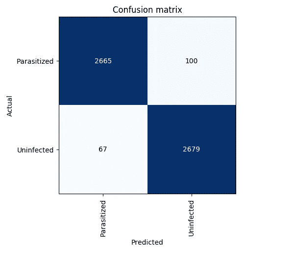
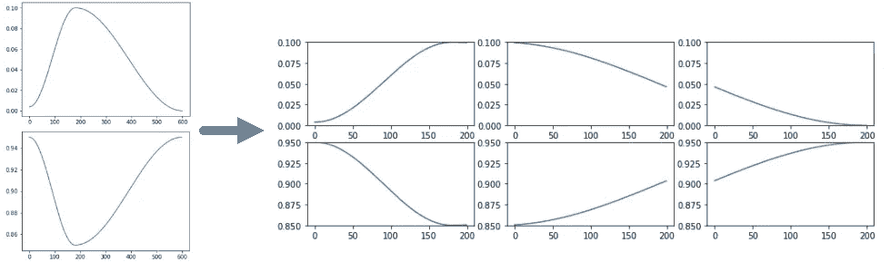

# fastai 用于疟疾检测的深度学习和医学图像分析

> 原文：<https://towardsdatascience.com/deep-learning-and-medical-image-analysis-for-malaria-detection-with-fastai-c8f08560262f?source=collection_archive---------24----------------------->

## 学习使用高级深度学习环境对血液涂片图像进行分类


Jimmy Chan/Pexels free images

在国家医学图书馆(NLM)的一部分 Lister Hill 国家生物医学通信中心(LHNCBC)提供了一个健康和受感染的血液涂片疟疾图像的[注释数据集](https://ceb.nlm.nih.gov/repositories/malaria-datasets/)之后，各种帖子和论文已经发表，展示了如何使用卷积神经网络的图像分类来学习和分类这些图像。

该数据集中的图像看起来像我们下面收集的图像:寄生的涂片将显示一些彩色点，而未感染的涂片将倾向于均匀着色。


对这些涂片进行分类应该不是一件非常困难的事情。下面列出的帖子中描述的结果表明，96%到 97%的分类准确率是可行的。

在这篇文章中，我们将展示如何使用 **fast.ai** CNN 图书馆来学习分类这些疟疾涂片。Fast.ai 是一个库，基于 PyTorch 构建，使得编写机器学习应用程序变得更快更简单。Fast.ai 还提供了一门[在线课程](https://course.fast.ai/)，涵盖了 fast.ai 和深度学习的一般使用。与较低级别的“高级”库相比，如 *Keras* 、 *TensorFlow* 。无论是 Keras 还是 pure *PyTorch* ，fast.ai 都极大地减少了制作最先进的神经网络应用程序所需的样板代码数量。

# 本公告基于以下材料:

1.  [PyImagesearch::深度学习和医学图像分析与 Keras](https://www.pyimagesearch.com/2018/12/03/deep-learning-and-medical-image-analysis-with-keras/) —以疟疾图像为例，作者 Adrian Rosebrock，2018 年 12 月 3 日；
2.  [来自 NIH](https://ceb.nlm.nih.gov/repositories/malaria-datasets/) 的疟疾数据集——来自疟疾筛查者研究活动的薄血涂片图像的分割细胞库；
3.  [TowardsDataScience::利用深度学习检测疟疾——人工智能造福社会——医疗保健案例研究](/detecting-malaria-with-deep-learning-9e45c1e34b60)——Dipanjan(DJ)Sarkar 对上述内容的评论；
4.  [PeerJ::Sivaramakrishnan Raja Raman 等人的预训练卷积神经网络作为特征提取器，用于改进薄血涂片图像中的疟原虫检测](https://peerj.com/articles/4568/) —上述帖子的作者基于其工作的原始科学论文。

我已经改编了这个材料，以便在 2019 年 5 月与 PyTorch/fast.ai 一起使用。[被评论的代码作为谷歌合作笔记本](https://drive.google.com/open?id=1a1_jjRcq6xRzQXvmwhJuhq1A97jnp9xO)免费提供。

我们去看代码吧…

# 初始化

每次运行此笔记本时，请执行以下部分中的操作一次…

```
%reload_ext autoreload
%autoreload 2
%matplotlib inline
```

# 在 Google Colab 上测试您的虚拟机…

只是为了确定，看看哪一个 CUDA 驱动和哪一个 GPU Colab 已经为你提供了。GPU 通常是:

*   一个 11 GB 内存的 **K80** 或者(如果你真的幸运的话)
*   一个 14 GB 内存的特斯拉 T4

如果谷歌的服务器很拥挤，你最终只能访问 GPU 的一部分。如果您的 GPU 与另一台 *Colab* 笔记本共享，您将看到可供您使用的内存量减少。

小贴士:避开美国西海岸的高峰期。我住在 GMT-3，我们比美国东海岸早两个小时，所以我总是试图在早上进行繁重的处理。

```
!/opt/bin/nvidia-smi
!nvcc --version
```

当我开始运行这里描述的实验时，我很幸运:我有一个 15079 MB RAM 的完整 T4！我的输出如下所示:

```
Thu May  2 07:36:26 2019       
+-----------------------------------------------------------------------------+
| NVIDIA-SMI 410.79       Driver Version: 410.79       CUDA Version: 10.0     |
|-------------------------------+----------------------+----------------------+
| GPU  Name        Persistence-M| Bus-Id        Disp.A | Volatile Uncorr. ECC |
| Fan  Temp  Perf  Pwr:Usage/Cap|         Memory-Usage | GPU-Util  Compute M. |
|===============================+======================+======================|
|   0  Tesla T4            Off  | 00000000:00:04.0 Off |                    0 |
| N/A   63C    P8    17W /  70W |      0MiB / 15079MiB |      0%      Default |
+-------------------------------+----------------------+----------------------+

+-----------------------------------------------------------------------------+
| Processes:                                                       GPU Memory |
|  GPU       PID   Type   Process name                             Usage      |
|=============================================================================|
|  No running processes found                                                 |
+-----------------------------------------------------------------------------+
nvcc: NVIDIA (R) Cuda compiler driver
Copyright (c) 2005-2018 NVIDIA Corporation
Built on Sat_Aug_25_21:08:01_CDT_2018
Cuda compilation tools, release 10.0, V10.0.130
```

# 图书馆进口

在这里，我们导入所有必需的包。我们将使用 [fast.ai V1 库](http://www.fast.ai/2018/10/02/fastai-ai/)，它位于 [Pytorch 1.0](https://hackernoon.com/pytorch-1-0-468332ba5163) 之上。fast.ai 库提供了许多有用的功能，使我们能够快速轻松地建立神经网络并训练我们的模型。

```
from fastai.vision import *
from fastai.metrics import error_rate
from fastai.callbacks import SaveModelCallback# Imports for diverse utilities
from shutil import copyfile
import matplotlib.pyplot as plt
import operator
from PIL import Image
from sys import intern   # For the symbol definitions
```

# 实用功能:导出和恢复功能

导出用于部署的网络并创建副本

```
def exportStageTo(learn, path):
    learn.export()
    # Faça backup diferenciado
    copyfile(path/'export.pkl', path/'export-malaria.pkl')

#exportStage1(learn, path)
```

恢复部署模型，例如为了继续微调

```
def restoreStageFrom(path):
  # Restore a backup
  copyfile(path/'export-malaria.pkl', path/'export.pkl')
  return load_learner(path)

#learn = restoreStage1From(path)
```

# 下载疟疾数据

我上面列出的作者使用了 NIH 疟疾数据集。让我们做同样的事情:

```
!wget  --backups=1 -q [https://ceb.nlm.nih.gov/proj/malaria/cell_images.zip](https://ceb.nlm.nih.gov/proj/malaria/cell_images.zip)
!wget  --backups=1 -q [https://ceb.nlm.nih.gov/proj/malaria#/malaria_cell_classification_code.zip](https://ceb.nlm.nih.gov/proj/malaria/malaria_cell_classification_code.zip)
# List what you've downloaded:
!ls -al
```

*wget* 的 *backups=1* 参数将允许您在下载失败的情况下多次重复命令行，而无需创建大量新版本的文件。

最后一行应该产生以下输出:

```
total 345208
drwxr-xr-x 1 root root      4096 May  2 07:45 .
drwxr-xr-x 1 root root      4096 May  2 07:35 ..
-rw-r--r-- 1 root root 353452851 Apr  6  2018 cell_images.zip
drwxr-xr-x 1 root root      4096 Apr 29 16:32 .config
-rw-r--r-- 1 root root     12581 Apr  6  2018 malaria_cell_classification_code.zip
drwxr-xr-x 1 root root      4096 Apr 29 16:32 sample_data
```

现在解压缩 NIH 疟疾细胞图像数据集:

```
!unzip cell_images.zip
```

这将产生一个非常大的详细输出，如下所示:

```
Archive:  cell_images.zip
   creating: cell_images/
   creating: cell_images/Parasitized/
 extracting: cell_images/Parasitized/C100P61ThinF_IMG_20150918_144104_cell_162.png  
 extracting: cell_images/Parasitized/C100P61ThinF_IMG_20150918_144104_cell_163.png  
 extracting: cell_images/Parasitized/C100P61ThinF_IMG_20150918_144104_cell_164.png  
 extracting: cell_images/Parasitized/C100P61ThinF_IMG_20150918_144104_cell_165.png  
 extracting: cell_images/Parasitized/C100P61ThinF_IMG_20150918_144104_cell_166.png  
 extracting: cell_images/Parasitized/C100P61ThinF_IMG_20150918_144104_cell_167.png  
 extracting: cell_images/Parasitized/C100P61ThinF_IMG_20150918_144104_cell_168.png  
 extracting: cell_images/Parasitized/C100P61ThinF_IMG_20150918_144104_cell_169.png  
 extracting: cell_images/Parasitized/C100P61ThinF_IMG_20150918_144104_cell_170.png  
 extracting: cell_images/Parasitized/C100P61ThinF_IMG_20150918_144104_cell_171.png  
 extracting: cell_images/Parasitized/C100P61ThinF_IMG_20150918_144348_cell_138.png  
 extracting: cell_images/Parasitized/C100P61ThinF_IMG_20150918_144348_cell_139.png  
 extracting: cell_images/Parasitized/C100P61ThinF_IMG_20150918_144348_cell_140.png  
 extracting: cell_images/Parasitized/C100P61ThinF_IMG_20150918_144348_cell_141.png  
 extracting: cell_images/Parasitized/C100P61ThinF_IMG_20150918_144348_cell_142.png  
 extracting: cell_images/Parasitized/C100P61ThinF_IMG_20150918_144348_cell_143.png  
 extracting: cell_images/Parasitized/C100P61ThinF_IMG_20150918_144348_cell_144.png  
 extracting: cell_images/Parasitized/C100P61ThinF_IMG_20150918_144823_cell_157.png  
 extracting: cell_images/Parasitized/C100P61ThinF_IMG_20150918_144823_cell_158.png  
 extracting: cell_images/Parasitized/C100P61ThinF_IMG_20150918_144823_cell_159.png
....
....
....
...and so on...
```

# 准备您的数据

将 **cell_images** 文件夹的名称改为 **train** ，然后将 *mv* 放在一个新的 *data* 文件夹上面，这样 *fast.ai* 就可以用它来*自动*生成 *train，验证*和*测试*集合，而不用再大惊小怪了…

```
!mv cell_images train
!mkdir data
!mv train data
```

# 看看你的文件夹

如果还没有安装 *tree* 命令，使用*来安装 tree* :

```
!apt install tree
```

现在运行它:

```
!tree ./data --dirsfirst --filelimit 10
```

这将显示文件树的结构:

```
./data
└── train
    ├── Parasitized [13780 exceeds filelimit, not opening dir]
    └── Uninfected [13780 exceeds filelimit, not opening dir]3 directories, 0 files
```

不要忘记设置一个*文件限制*，否则你会有大量的输出…

# 初始化一些变量

```
bs = 256        # Batch size, 256 for small images on a T4 GPU...
size = 128      # Image size, 128x128 is a bit smaller than most 
                # of the images...
path = Path("./data")   # The path to the 'train' folder you created...
```

# 创建您的培训和验证数据集

在使用 *Keras* 的 *PyImagesearch* 的原始资料中，有一个很长的例程从数据中创建训练、验证和测试文件夹。有了 *fast.ai* 就没必要了:如果你只有一个‘train’文件夹，你可以在创建 **DataBunch** 时通过简单地传递几个参数来自动分割它。我们将把数据分成一个*训练集* (80%)和一个*验证集* (20%)。这是通过*imagedatabunch . from _ folder()*构造函数方法中的 **valid_pct = 0.2** 参数完成的:

```
# Limit your augmentations: it's medical data! 
# You do not want to phantasize data...
# Warping, for example, will let your images badly distorted, 
# so don't do it!
# This dataset is big, so don't rotate the images either. 
# Lets stick to flipping...
tfms = get_transforms(max_rotate=None, max_warp=None, max_zoom=1.0)
# Create the DataBunch!
# Remember that you'll have images that are bigger than 128x128 
# and images that are smaller, o squish them all in order to 
# occupy exactly 128x128 pixels...
data = ImageDataBunch.from_folder(path, ds_tfms=tfms, size=size, resize_method=ResizeMethod.SQUISH, **valid_pct = 0.2**, bs=bs)
#
print('Transforms = ', len(tfms))
# Save the DataBunch in case the training goes south... 
# so you won't have to regenerate it..
# Remember: this DataBunch is tied to the batch size you selected. 
data.save('imageDataBunch-bs-'+str(bs)+'-size-'+str(size)+'.pkl')
# Show the statistics of the Bunch...
print(data.classes)
data
```

*print()* 将输出转换和类:

```
Transforms =  2
['Parasitized', 'Uninfected']
```

最后一行， *data* 将简单地输出 *ImageDataBunch* 实例的返回值:

```
ImageDataBunch;Train: LabelList (22047 items)
x: ImageList
Image (3, 128, 128),Image (3, 128, 128),Image (3, 128, 128),Image (3, 128, 128),Image (3, 128, 128)
y: CategoryList
Uninfected,Uninfected,Uninfected,Uninfected,Uninfected
Path: data;Valid: LabelList (5511 items)
x: ImageList
Image (3, 128, 128),Image (3, 128, 128),Image (3, 128, 128),Image (3, 128, 128),Image (3, 128, 128)
y: CategoryList
Parasitized,Uninfected,Parasitized,Uninfected,Uninfected
Path: data;Test: None
```

# 查看您的数据集群，看看增加是否可以接受…

```
data.show_batch(rows=5, figsize=(15,15))
```


# 培训:resnet34

如果你不知道用什么，从 34 层的剩余网络开始是一个好的选择。不要太小也不要太大…在上面列出的教程中，作者使用了:

*   一个自定义的小 ResNet (PyImagesearch)
*   VGG19(面向数据科学)

我们将采用现成的 fast.ai 残差网络(ResNets)。让我们创建我们的第一个网络:

```
learn = cnn_learner(data, models.resnet34, metrics=error_rate)
learn.model
```

最后一行将以文本流的形式输出网络的架构。它看起来会像这样:

```
Sequential(
  (0): Sequential(
    (0): Conv2d(3, 64, kernel_size=(7, 7), stride=(2, 2), padding=(3, 3), bias=False)
    (1): BatchNorm2d(64, eps=1e-05, momentum=0.1, affine=True, track_running_stats=True)
    (2): ReLU(inplace)
    (3): MaxPool2d(kernel_size=3, stride=2, padding=1, dilation=1, ceil_mode=False)
    (4): Sequential(
      (0): BasicBlock(
        (conv1): Conv2d(64, 64, kernel_size=(3, 3), stride=(1, 1), padding=(1, 1), bias=False)
        (bn1): BatchNorm2d(64, eps=1e-05, momentum=0.1, affine=True, track_running_stats=True)
        (relu): ReLU(inplace)
        (conv2): Conv2d(64, 64, kernel_size=(3, 3), stride=(1, 1), padding=(1, 1), bias=False)
        (bn2): BatchNorm2d(64, eps=1e-05, momentum=0.1, affine=True, track_running_stats=True)
      )
      (1): BasicBlock(
        (conv1): Conv2d(64, 64, kernel_size=(3, 3), stride=(1, 1), padding=(1, 1), bias=False)
        (bn1): BatchNorm2d(64, eps=1e-05, momentum=0.1, affine=True, track_running_stats=True)
        (relu): ReLU(inplace)
        (conv2): Conv2d(64, 64, kernel_size=(3, 3), stride=(1, 1), padding=(1, 1), bias=False)
        (bn2): BatchNorm2d(64, eps=1e-05, momentum=0.1, affine=True, track_running_stats=True)
      )
      (2): BasicBlock(
        (conv1): Conv2d(64, 64, kernel_size=(3, 3), stride=(1, 1), padding=(1, 1), bias=False)
        (bn1): BatchNorm2d(64, eps=1e-05, momentum=0.1, affine=True, track_running_stats=True)
        (relu): ReLU(inplace)
        (conv2): Conv2d(64, 64, kernel_size=(3, 3), stride=(1, 1), padding=(1, 1), bias=False)
        (bn2): BatchNorm2d(64, eps=1e-05, momentum=0.1, affine=True, track_running_stats=True)
      )
    )
....and so on....
```

即使像 ResNet34 这样的“小”网络也仍然非常大。不要费心去理解输出。你可以稍后阅读更多关于剩余网络的内容。有许多关于 ResNets 的介绍性帖子。

# 培训策略

fast.ai 的一大区别就来了:易用的 HYPOs(超参数优化策略)。超参数优化是 CNN 的一个有点神秘的分支学科。这是因为 CNN 有如此多的参数，试图通过设置一些非标准值来选择我们将改变的参数，以便为我们的网络提供更好的性能，这是一个非常复杂的问题，也是一项研究*本身*。fast.ai 库提供了一些非常先进但易于使用的 HYPOs，它们对快速实现更好的 CNN 有很大的帮助。

我们将采用 Leslie N. Smith 开发的 *fit1cycle* 方法，详情如下:

*   https://docs.fast.ai/callbacks.one_cycle.html
*   神经网络超参数的训练方法:第一部分——学习速率、批量大小、动量和权重衰减——https://arxiv.org/abs/1803.09820
*   超级收敛:使用大学习率快速训练残差网络—[https://arxiv.org/abs/1708.07120](https://arxiv.org/abs/1708.07120)
*   有一篇来自 [Nachiket Tanksale](https://towardsdatascience.com/@nachiket.tanksale) 的非常有趣的文章，名为[寻找好的学习率和单周期政策](/finding-good-learning-rate-and-the-one-cycle-policy-7159fe1db5d6)，其中讨论了周期学习率和动量。

由于这种方法很快，我们将在第一个迁移学习阶段仅使用 10 个时期。如果性能变得更好，我们也将在每个时期保存网络:[https://docs.fast.ai/callbacks.html#SaveModelCallback](https://docs.fast.ai/callbacks.html#SaveModelCallback)

```
learn.fit_one_cycle(10, callbacks=[SaveModelCallback(learn, every='epoch', monitor='accuracy', name='malaria-1')])
# Save it!
learn.save('malaria-stage-1')
# Deploy it!
exportStageTo(learn, path)
```

这将生成一个如下所示的表作为输出:


上表显示，验证集的准确率为 96.4%，而且这仅仅是在迁移学习的情况下！ *error_rate* fast.ai 显示您将始终看到与训练集相关联的那个。作为比较，Adrian Rosebrock 在 PyImagesearch 帖子中使用他的自定义 ResNet 实现了 97%的搜索率。

# ResNet34 的结果

让我们看看我们得到了什么额外的结果。我们将首先查看哪些是模型相互混淆的实例。我们将尝试看看模型预测的结果是否合理。在这种情况下，错误看起来是合理的(没有一个错误看起来明显幼稚)。这表明我们的分类器工作正常。

此外，我们将绘制混淆矩阵。这在 fast.ai 中也很简单。

```
interp = ClassificationInterpretation.from_learner(learn)losses,idxs = interp.top_losses()len(data.valid_ds)==len(losses)==len(idxs)
```

看看你的 **9 个最差结果**(首先不使用热图):

```
interp.plot_top_losses(9, figsize=(20,11), heatmap=False)
```


现在，进行同样的操作，但使用热图突出显示导致错误分类的原因:

```
interp.plot_top_losses(9, figsize=(20,11), heatmap=True)
```


# 显示混淆矩阵

fast.ai 的*ClassificationInterpretation*类有一个高级实例方法，允许快速轻松地绘制混淆矩阵，以更好的方式向您显示 CNN 的表现有多好。只有两个类并没有多大意义，但我们还是要这么做:它生成了漂亮的图片…你可以设置结果图的大小和分辨率。我们将 5x5 英寸设置为 100 dpi。

```
interp.plot_confusion_matrix(figsize=(5,5), dpi=100)
```


# 展示你的学习曲线:

观察学习和验证曲线是很有趣的。它将向我们显示网络是否以稳定的方式学习，或者它是否振荡(这可能表明质量差的数据)，以及我们是否有一个好的结果，或者我们是否过度拟合或欠拟合我们的网络。

再说一次 fast.ai 有高级方法可以帮助我们。每个 fast.ai *cnn_learner* 都有一个自动创建的*记录器*实例。记录器记录训练期间的历元、损失、最优和度量数据。*plot _ loss()*方法将创建一个带有训练和验证曲线的图形:

```
learn.recorder.plot_losses()
```


这个结果看起来真的太好了，网络微调没有意义。如果我们仔细观察，我们会发现在大约 500 个批次时，验证损失比训练损失更严重，这表明网络可能在这一点上开始过度拟合。这表明我们已经接受了足够的培训，至少对于这个 ResNet 模型是如此。

我们观察到的过度拟合可能表明我们采用的网络模型对于数据的复杂性来说是过度的，这意味着我们正在训练一个学习单个实例而不是数据集泛化的网络。测试这一假设的一个非常简单实用的方法是尝试用一个更简单的网络学习数据集，看看会发生什么。

让我们使用一个更小的网络，再试一次…

# ResNet18

这个网络简单多了。让我们看看它是否有效。

ResNet18 要小得多，所以我们会有更多的 GPU RAM。我们将再次创建*数据群发*，这一次批量更大…

```
# Limit your augmentations: it's medical data! 
# You do not want to phantasize data...
# Warping, for example, will let your images badly distorted, 
# so don't do it!
# This dataset is big, so don't rotate the images either. 
# Lets stick to flipping...
tfms = get_transforms(max_rotate=None, max_warp=None, max_zoom=1.0)
# Create the DataBunch!
# Remember that you'll have images that are bigger than 128x128 
# and images that are smaller, so squish them to occupy 
# exactly 128x128 pixels...
data = ImageDataBunch.from_folder(path, ds_tfms=tfms, size=size, resize_method=ResizeMethod.SQUISH, valid_pct = 0.2, **bs=512**)
#
print('Transforms = ', len(tfms))
# Save the DataBunch in case the training goes south... so you won't have to regenerate it..
# Remember: this DataBunch is tied to the batch size you selected. 
data.save('imageDataBunch-bs-'+str(bs)+'-size-'+str(size)+'.pkl')
# Show the statistics of the Bunch...
print(data.classes)
data
```

注意，我们坚持使用我们的 *valid_pct = 0.2* :我们仍然让 fast.ai 随机选择数据集的 20%作为验证集。

上面的代码将输出如下内容:

```
Transforms =  2
['Parasitized', 'Uninfected']
```

并且:

```
ImageDataBunch;Train: LabelList (22047 items)
x: ImageList
Image (3, 128, 128),Image (3, 128, 128),Image (3, 128, 128),Image (3, 128, 128),Image (3, 128, 128)
y: CategoryList
Uninfected,Uninfected,Uninfected,Uninfected,Uninfected
Path: data;Valid: LabelList (5511 items)
x: ImageList
Image (3, 128, 128),Image (3, 128, 128),Image (3, 128, 128),Image (3, 128, 128),Image (3, 128, 128)
y: CategoryList
Parasitized,Uninfected,Parasitized,Uninfected,Parasitized
Path: data;Test: None
```

现在，创建学习者:

```
learn18 = cnn_learner(data, models.resnet18, metrics=error_rate)
```

如果您的 Colab 环境没有 ResNet18 的预训练数据，fast.ai 会自动下载它:

```
Downloading: "https://download.pytorch.org/models/resnet18-5c106cde.pth" to /root/.torch/models/resnet18-5c106cde.pth
46827520it [00:01, 28999302.58it/s]
```

看模型:

```
learn18.model
```

这将列出你的网的结构。它比 ResNet34 小得多，但仍然有很多层。输出将如下所示:

```
Sequential(
  (0): Sequential(
    (0): Conv2d(3, 64, kernel_size=(7, 7), stride=(2, 2), padding=(3, 3), bias=False)
    (1): BatchNorm2d(64, eps=1e-05, momentum=0.1, affine=True, track_running_stats=True)
    (2): ReLU(inplace)
    (3): MaxPool2d(kernel_size=3, stride=2, padding=1, dilation=1, ceil_mode=False)
    (4): Sequential(
      (0): BasicBlock(
        (conv1): Conv2d(64, 64, kernel_size=(3, 3), stride=(1, 1), padding=(1, 1), bias=False)
        (bn1): BatchNorm2d(64, eps=1e-05, momentum=0.1, affine=True, track_running_stats=True)
        (relu): ReLU(inplace)
        (conv2): Conv2d(64, 64, kernel_size=(3, 3), stride=(1, 1), padding=(1, 1), bias=False)
        (bn2): BatchNorm2d(64, eps=1e-05, momentum=0.1, affine=True, track_running_stats=True)
      )
      (1): BasicBlock(
        (conv1): Conv2d(64, 64, kernel_size=(3, 3), stride=(1, 1), padding=(1, 1), bias=False)
        (bn1): BatchNorm2d(64, eps=1e-05, momentum=0.1, affine=True, track_running_stats=True)
        (relu): ReLU(inplace)
        (conv2): Conv2d(64, 64, kernel_size=(3, 3), stride=(1, 1), padding=(1, 1), bias=False)
        (bn2): BatchNorm2d(64, eps=1e-05, momentum=0.1, affine=True, track_running_stats=True)
      )
    )
    (5): Sequential(
      (0): BasicBlock(
        (conv1): Conv2d(64, 128, kernel_size=(3, 3), stride=(2, 2), padding=(1, 1), bias=False)
        (bn1): BatchNorm2d(128, eps=1e-05, momentum=0.1, affine=True, track_running_stats=True)
        (relu): ReLU(inplace)
        (conv2): Conv2d(128, 128, kernel_size=(3, 3), stride=(1, 1), padding=(1, 1), bias=False)
        (bn2): BatchNorm2d(128, eps=1e-05, momentum=0.1, affine=True, track_running_stats=True)
        (downsample): Sequential(
          (0): Conv2d(64, 128, kernel_size=(1, 1), stride=(2, 2), bias=False)
          (1): BatchNorm2d(128, eps=1e-05, momentum=0.1, affine=True, track_running_stats=True)
        )
      )
...and so on...
```

# 让我们训练它

我们将再次使用 *fit_one_cycle* HYPO 训练策略。将训练限制在 10 个时期，以观察这个较小网络的行为:

```
learn18.fit_one_cycle(10, callbacks=[SaveModelCallback(learn, every='epoch', monitor='accuracy', name='malaria18-1')])
# Save the network
learn18.save('malaria18-stage-1')
# Deploy it also
exportStageTo(learn18, path)
```


该表显示网络学习到大约 96.1%的准确度，并且建议网络不应该被进一步训练:时段#8 和#9 之间的损失显示出 0.005 的减少，但是准确度保持不变，这表明网络已经开始过拟合。

让我们生成一个*分类解释*并查看混淆矩阵和损失曲线。

```
interp = ClassificationInterpretation.from_learner(learn18)
losses,idxs = interp.top_losses()interp.plot_confusion_matrix(figsize=(5,5), dpi=100)
```


这个混淆矩阵比我们为 ResNet34 生成的稍微差一点，但只是非常差一点。ResNet18 是否不太适合这个问题？

让我们来看看损失:


该图显示，ResNet18 在大约 290 批次后开始有点过度拟合。记住我们的 *bs* 在这里是 512，在 ResNet34 是 256。

让我们看看我们能否更好地微调网络。

# 微调一下！

这里我们将介绍另一个 fast.ai HYPO:自动选择的可变学习率。我们将让 fast.ai 为每个历元和每个层选择使用哪个学习速率，提供一个我们认为足够的学习速率范围。我们将训练 30 个纪元的网络。

```
# Unfreeze the network
learn18.unfreeze()
# Learning rates range: max_lr=slice(1e-4,1e-5)
learn18.fit_one_cycle(30, **max_lr=slice(1e-4,1e-5)**, 
                    callbacks=[SaveModelCallback(learn, 
                    every='epoch', monitor='accuracy', 
                    name='malaria18')])
# Save as stage 2...
learn18.save('malaria18-stage-2')
# Deploy
exportStageTo(learn18, path)
```


**97%的准确率！**这正是 Adrian Rosebrock 在 [PyImagesearch 帖子](https://www.pyimagesearch.com/2018/12/03/deep-learning-and-medical-image-analysis-with-keras/)中使用他的定制 Keras ResNet 实现所实现的，该帖子在上述三篇参考文献中提供了最佳的准确性结果。

然而，*验证失败*在过去的时代变得**更糟**。这表明我们从大约第 20 纪元开始就已经*过度拟合*。如果你想部署这个网络，我建议你从 epoch 20 加载结果并生成一个部署网络。它似乎没有变得更好，没有这个网络。

# 看看结果

```
interp = ClassificationInterpretation.from_learner(learn18)
losses,idxs = interp.top_losses()interp.plot_confusion_matrix(figsize=(5,5), dpi=100)
```



这比我们以前吃过的要好。让我们看看损失曲线:


在这里，我们看到网络似乎在 500 批次后开始过度拟合，这将证实我们从上面的结果表中推断的怀疑。如果你看上面的曲线，你会看到**验证损失**在训练的最后三分之一开始增加，表明这部分训练只是过度拟合了网络。

# 如果培训中途中断，我该怎么办？

如果你的训练被打断了，你会怎么做？这可能是因为你在 Google Colab 笔记本上达到了连续 12 小时的“免费”操作时间，或者因为你的计算机由于某种原因停止了。我住在巴西，电力短缺是常事…

*fit_one_cycle* 方法适用于变化的自适应学习速率，遵循速率先增大后减小的曲线。如果您在第 10 个时期(比如说 20 个时期)中断训练，然后重新开始 9 个时期以上的训练，**您将不会得到与不间断训练 20 个时期相同的结果**。您必须能够记录您停止的位置，然后从该点重新开始训练周期，并使用该周期部分的正确超参数。



A fit_one_cycle training session divided into three subsessions. Image by PPW@GitHub

你要做的第一件事就是保存你的网络:

```
learn.fit_one_cycle(20, max_lr=slice(1e-5,1e-6), 
       callbacks=[SaveModelCallback(learn, every='epoch',  
                  monitor='accuracy', name=***<callback_save_file>***)])
```

这将使您的网络在每个时期都被保存，您提供的名称后跟*_ #时期*。所以在纪元#3，文件 *saved_net_3.pth* 将被写入。您可以在完成以下操作后加载此文件:

*   重新创建了*数据束*和
*   用它重新实例化了网络。

重新加载*后。pth* 文件，你可以重新开始你的训练，只是你要告诉 *fit_one_cycle* 考虑 20 个历元，但是要从历元#4 开始训练。

要了解这是如何做到的，请看这里:

*   [将一个长周期政策分成几个小周期——PPW 的 GitHub](https://github.com/PPPW/deep-learning-random-explore/tree/master/divide_1cycle?source=post_page---------------------------)

你是怎么做到的？

fast.ai 中的 *fit_one_cycle* 方法已经开发出来，允许您告诉它从周期的哪个部分恢复中断的训练。恢复培训的代码如下所示:

```
# Create a new net if training was interrupted and you had to 
# restart your Colab sessionlearn = cnn_learner(data, models.<your_model_here>, 
                    metrics=[accuracy, error_rate])# If you're resuming, only indicating the epoch from which to 
# resume, indicated by ***start_epoch=<epoch#>*** will load the last 
# saved .pth, it is not necessary to explicitly reload the last 
# epoch, you only should **NOT** change the name given in 
# name=<callback_save_file>:
# when resuming fast.ai will try to reload 
# ***<callback_save_file>_<previous_epoch>.pth***
# Unfreeze the network
learn50.unfreeze()# Use start_epoch=<some_epoch> to resume training...
learn.fit_one_cycle(20, max_lr=slice(1e-5,1e-6), 
                    ***start_epoch=<next_epoch#>***,
                    callbacks=[SaveModelCallback(learn, 
                    every='epoch', monitor='accuracy', 
                    ***name=<callback_save_file>***)])
```

fast.ai 会告诉你“*已加载<回调 _ 保存 _ 文件> _ <上一个 _ 纪元# >* ”，恢复训练。

您可以在此查看 *fit_one_cycle* 方法支持的所有参数:

*   [https://docs.fast.ai/train.html#fit_one_cycle](https://docs.fast.ai/train.html#fit_one_cycle)

# 我们学到了什么？

与其他方法相比，作者分别使用纯 *Keras* 和 *TensorFlow。Keras* 为了解决这个问题，借助 *fast.ai* 我们能够使用更少的代码解决同样的疟疾血液涂片分类问题，同时使用高级超参数优化策略，使我们能够更快地进行训练。同时，一组高级功能也允许我们以表格和图形的形式轻松检查结果。

利用 fast.ai 提供的现成残差网络模型，在 ImageNet 上进行预训练，我们获得的精度结果比上面三篇文章中的两篇(包括发表在 PeerJ 上的科学论文)高出 1%，相当于上面文章的最佳表现。这表明 fast.ai 是更传统的 CNN 框架的一个非常有前途的替代方案，特别是如果手头的任务是一个“标准”的深度学习任务，如图像分类、对象检测或语义分割，可以通过微调现成的预训练网络模型来解决。

# 想看看更有野心的例子吗？

用 fast.ai 看我们的皮肤癌检测教程:

*   [**towards data science**:*利用 fastai 进行皮肤图像诊断的深度学习*——*学习从皮肤镜图像中识别皮肤癌和其他病症*](/deep-learning-for-diagnosis-of-skin-images-with-fastai-792160ab5495) 作者 Aldo von Wangenheim

在本例中，我们将向您展示如何处理更大的数据集并调整最佳学习率。