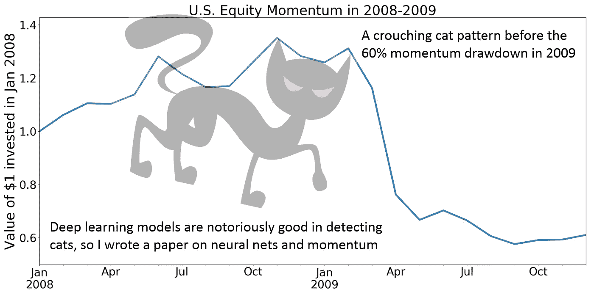
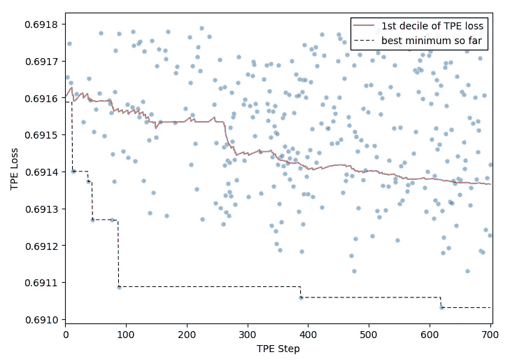
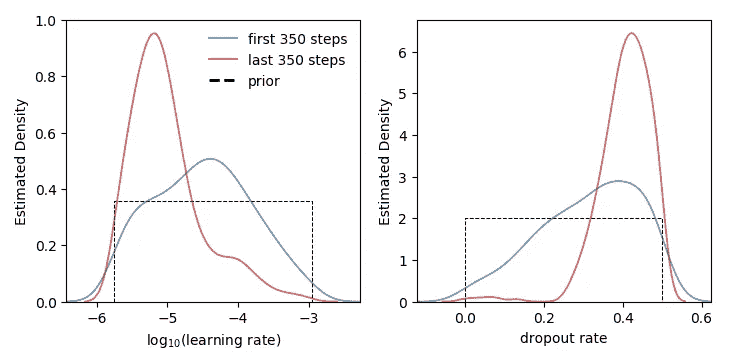
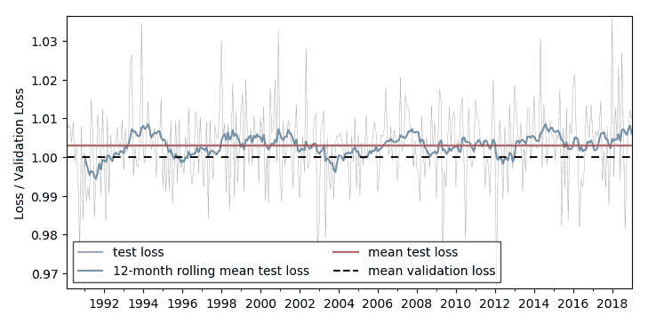
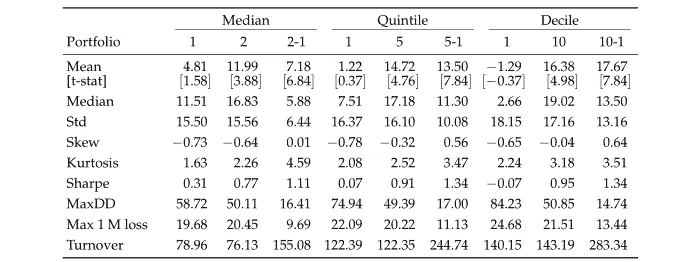
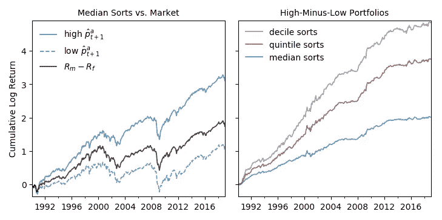
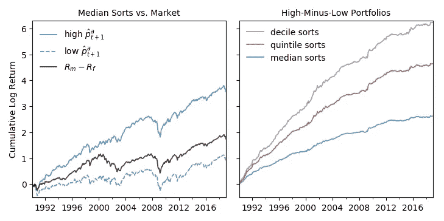
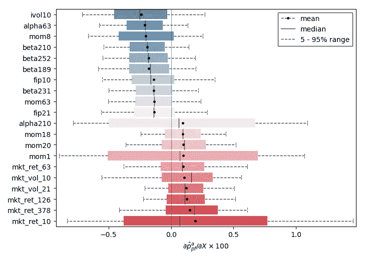

# 深度学习和动量投资

> 原文：<https://towardsdatascience.com/deep-learning-and-momentum-investing-2273e8db5b86?source=collection_archive---------4----------------------->

## 了解如何以规范和可解释的方式将深度学习模型应用于金融数据

在这篇文章中，我概述了我关于深度学习和美国股票动量的新工作论文。我从论文的简短摘要[开始，强调研究问题和主要结果，然后我故意戴上我的实践者的帽子(买方 quant / PM，目前在工作和新机会之间转换，*提示提示*)，并专注于纪律量化研究的以下实际方面:](#1644)

1.  [主动选择特性和特性工程](#0fb3)
2.  [选择最佳网络架构和构建集成的系统方法](#324f)
3.  [模型预测的解释](#89c9)

> 该论文可在 SSRN[网站](https://papers.ssrn.com/sol3/papers.cfm?abstract_id=3424793)上获得，论文摘要可在[这里](https://drive.google.com/open?id=1PAQDyeBm9cgSLN8sdY7AU0YB7guNZos-)找到。我们欢迎并热切期待您的评论、建议和反馈。

这篇文章相当长，所以这里是关键的要点:

*   我在深度学习框架中调查了一系列动量相关变量的预测能力，并记录了丰富的非线性时变结构对预期回报的影响。建立在深度学习模型预测基础上的投资策略积极利用非线性和互动效应，产生高且具有统计显著性的回报，具有稳健的风险特征，其表现实际上与既定的风险因素不相关。
*   对模型输入的深思熟虑的方法是至关重要的:金融数据的常见问题，例如稀缺性、非平稳性和状态依赖性，可以通过主动选择功能和功能工程来缓解。
*   自动化超参数优化非常重要，不仅因为它可以带来更好的模型架构，还因为它增加了一层额外的建模规则，增强了结果的可重复性。
*   机器学习模型预测的可解释性至关重要。将预测与资产行为的既定事实联系起来的能力是对结果的健全性检查。

## 一.导言和总结

在金融学中，动量指的是通过过去的价格数据对横截面收益的可预测性。一个标准的例子是，在过去 1 至 12 个月中有高回报的股票继续跑赢同期表现不佳的股票。买入过去的赢家，卖出过去的输家，从而获得正回报，这是金融研究中长期存在的市场异常现象，记录了几乎每一种资产类别，实际上已经有几百年了。请注意，由于股票是与同类股票相比较的，我们谈论的是横截面的可预测性，而不是时间序列动量或趋势跟踪，在时间序列动量或趋势跟踪中，买卖股票的决定仅取决于其过去的表现。在过去的四分之一世纪里，金融文献提出了许多衡量动量的方法，例如从回望视野的角度，并确定了许多令人困惑的变量，如市场波动性，作为一种投资策略来预测其表现。新兴的金融机器学习领域进一步发现，过去的价格数据是未来回报的最强预测因素之一，主导着账面市值比等基本变量。

在本文中，我在深度学习框架中，在不同的时间范围内，研究了一系列基于价格的特征的预测能力。我的成果和贡献如下:

*   **实证:**我记录了这些特征对美国股票市场预期回报的影响中丰富的非线性结构。冲击的大小和符号表现出显著的时间变化，并受特征间相互作用的影响。预期回报的非线性程度也会随着时间的推移而发生很大变化，在不景气的市场中这种程度最高。
*   **方法论:**我利用神经网络输出相对于输入的可微性来研究特征对模型预测的方向性影响、它们随时间的演变以及与其他变量的相互作用。这种分析允许明确地将预测与动量的程式化事实联系起来，从而增加结果的透明度，并展示臭名昭著的黑盒算法的可解释性。我进一步展示了如何利用超参数优化和集成构建方法，以系统的方式选择性能最佳的模型。
*   **实用:**建立在深度学习模型的样本外预测基础上的投资策略积极利用非线性和交互效应，产生高且具有统计意义的回报，具有稳健的风险特征，其表现实际上与既定的风险因素无关，包括动量和来自当前文献的机器学习投资组合。

该员额的其余部分组织如下:

[二。特性工程](#0fb3)
[III 的重要性。型号和数据](#3d13)T5 IV[。超参数优化与集成构建](#324f)
[五、测试集结果与预测的可解释性](#79b1)
[六、测试集结果与预测的可解释性。结束语](#a889)

## 二。为什么特性选择和特性工程很重要？

财务数据是特殊的，需要深思熟虑的方法。首先，与机器学习应用的数据集标准相比，它在范围和可用性方面相当有限——事实上，对于绝大多数市场，我们在 20 世纪 90 年代之前没有高质量的数据。其次，金融数据不是平稳的，这进一步加剧了这个问题。概括地说，管理数据生成过程的规则可以随着时间的推移而改变，例如，三十年前的交易成本比现在高一个数量级，尤其是对于较小的股票，因此保持其他一切都相同，相对于较大和流动性更好的股票，预期回报更高。此外，驱动回报的许多重要变量可能会从模型中忽略，或者在训练集上无法体验到它们的全部值。这个问题的一个具体例子是资产价格在高市场波动期和低市场波动期的截然不同的行为，或*制度—* 在覆盖仅对应于其中一个制度的时间段的数据子集上训练模型会削弱模型在测试集上进行概括的能力。当然，不仅是市场波动，还有其他变量，如宏观经济统计数据、货币政策声明情绪等。可以概括市场的整体状态。第三，金融数据表现出非常低的信噪比。鉴于像神经网络这样最强大的模型是低偏差和高方差的学习器，这意味着模型*将*过度适应数据中的噪声。总而言之，在金融领域，我们没有几十亿张猫图片来训练模型；金融猫也大多看起来像噪音，如果环境温度低于零度，它们可以在每个闰年的第三个星期四以未知的概率变成绦虫或猫头鹰。

上述所有问题意味着，我们不能依赖绞肉机方法，简单地插入所有可用的原始数据，希望算法将拾取重要的特征，而不会严重过度拟合固有噪声。幸运的是，我们在回报可预测性方面有几十年的研究，基本上是在做功能工程。更重要的是，这些工程特征在它们预测回报的能力背后有一些理论或经验上的正当理由。

例如，帖子顶部的数字显示了 2009 年初多空标准动量策略(即买入过去的赢家，卖出过去的输家)的回报率暴跌。标准的动量交易是根据股票在过去 12 个月的表现来买卖股票，跳过最近一个月，它通常被称为 12-1 动量交易。崩盘的机制很好理解:单个股票回报率的大部分差异都可以归因于一个因素——市场。当市场上涨时，表现出与市场高度同步的股票表现优于与市场相关性较低的股票。在市场低迷时期，情况正好相反。我们可以通过估计斜率系数来衡量共同运动的规范化程度，或在以下股票收益率对市场收益率的简单线性回归中估计*β*、*T3，也称为*市场模型*:*

其中回归的截距，或 *alpha，*衡量股票 *i* 收益中与市场正交的部分。到 2007 年底，美国股市进入低迷期，到 2009 年初市值损失了一半以上，因此 12-1 momentum 策略投资于低贝塔股票，这些股票在 2008 年市场崩溃中相对未受影响，并做空损失最大的高贝塔股票。请注意，策略或投资组合是其组成部分的线性组合:多头头寸的低贝塔减去空头头寸的高贝塔导致投资组合的总体贝塔为负。换句话说，在 2009 年初，12 比 1 的势头与市场背道而驰。当市场迅速反弹时，这一势头遭受了大萧条后历史上第二次最严重的崩溃，在此期间，12 比 1 的势头踩在同一耙子上。图 1 通过绘制标准普尔 500 指数(顶部面板)的值以及单个股票过去的赢家和输家之间的平均一年市场贝塔值的差异，提供了一个直观的说明。动量策略的平均贝塔值在 2009 年 6 月才再次变为正值，当时市场已经比最低点回升了约 25%。

Figure 1: S&P 500 and market beta of momentum strategy

> 参见[丹尼尔和莫斯科维茨(2016)](#f82a) 了解更多关于动量碰撞的信息。
> 参见[这篇文章](/aifortrading-2edd6fac689d)的第 2.1 节，作者 [Boris B](https://medium.com/u/dbe185b1f1d0?source=post_page-----2273e8db5b86--------------------------------) 举例说明为什么某些特征作为 ML 算法的输入变量是有意义的

事实上，现有的研究可以为一个好的模型应该能够解释什么提供有力的见解。几段推理立刻给我们一种直觉，市场回报、贝塔系数及其相互作用可能是至关重要的特征。事实上，上面看似简单的单变量回归提供了两个具有经验和理论支持的额外特征:截距或 alpha 的估计值，以及衡量特质波动率的残差的标准差。这里的关键点是，我们可以利用我们对预测回报的特性及其转换的*先验*知识，设计一组更简洁和可解释的变量，而不是将回报的整个时间序列输入模型，希望它能够自己计算出估计值，并冒着遇到本节开头概述的问题的风险。

我甚至没有触及数据质量问题，这本身是一个重要的话题，但对于动量研究来说是一个较小的问题，因为价格数据与基本会计比率相比相当干净，例如，基本会计比率可以滞后报告，并受到数据提供商的修订，这意味着我们用于训练模型的数据可能与我们在实际应用中的数据有很大不同。

> 我向对机器学习应用中金融数据的警告感兴趣的读者推荐[阿诺特、哈维和马科维茨(2019)](#c484) 。

## 三。模型和数据

*A .型号*

我将回报预测任务指定为一个分类问题，并估计股票下个月的回报高于和低于整个横截面的中值回报的概率。股票 *i* 的预测目标或标签定义如下:

给定股票 *i 在 *t，X(i，t)，*的*特征向量，预测概率是特征和权重的函数:

我选择最简单的架构——多层感知器——并通过使用 Adam optimizer 最小化二进制交叉熵来训练模型。我进一步在每个迷你批次中执行了类的平等表示，发现这极大地提高了训练的稳定性。为了正规化，我采用提前停止和辍学。

分类提供了几个优于回归的优势，回归是实证资产定价的主要方法。首先，通过构造，标签在时间上具有相同的分布和相同的幅度，从而通过减轻收益率的横截面分布中的时间变化问题来简化训练。第二，由于二元分类覆盖了整个样本空间，假设测量误差是随机的，则高于某个常数(在我们的情况下是横截面中值)的估计回报率与预期回报率成正比。第三，在实践中，我们往往更关心一项资产相对于其同行的预期表现，而不是对其未来回报的点估计。

*B .数据*

我使用的是 1965 年 1 月至 2018 年 12 月期间美国股票的标准 CRSP 数据集。在应用数据可用性过滤器后，样本中只剩下大约 20，000 只不同的股票。我还特意将分析的主要部分集中在最大股票的子样本上，每月选择市值最高的 500 只股票，将其余股票作为稳健性检查。由此得出的子样本平均覆盖了美国股票市场总资本的四分之三，在每日回报方面与标准普尔 500 在统计上没有区别。关注大盘股的主要原因是，最近的重复研究提供了令人信服的证据，表明预测回报的绝大多数变量的预测能力都集中在小盘股和小盘股上，这在交易成本和交易价格影响是现实的实践中非常重要。

我将预测范围设置为一个月，并将样本划分如下:训练集涵盖了从 1965 年 1 月到 1982 年 12 月的时间，包括 105，177 个股票月样本；验证集是从 1983 年 1 月到 1989 年 12 月(41，408 个例子)；并且测试集是从 1990 年 1 月到 2018 年 12 月(170385)。包括所有股票的附加测试集包含超过 1，200，000 个示例。

根据上一节的讨论，我构建了一组特征，这些特征是由先前研究中的发现激发的，并具有一些为什么或如何与预期回报相关联的基本原理。例如，我包括了 10 天、1、2、3、6、12、18、24 个月的市场回报和波动性，或者上一节中估计的 10 天到 12 个月的市场模型回归的 alpha 和 beta。在论文的第二部分可以找到特征的完整列表、它们背后的基本原理以及相应研究的参考文献。

为了便于训练，我将特定股票的变量标准化，即股票的过去收益、贝塔系数、阿尔法系数等。，通过计算每个时间段的 z 分数。对于市场波动和回报的时间序列，我计算了相对于他们自己的历史到估计日期的 z 分数，以避免前瞻偏差。

## 四。选择最佳神经网络结构并构建集成

*A .超参数优化*

深度学习模型对决定模型架构和指导估计过程的超参数的选择非常敏感。模型的性能通常更多地取决于超参数，而不是特定模型的复杂程度。 [Bergstra 等人(2013)](#c72a) 认为超参数调整应该是模型评估的正式、量化和可重复的一部分。 [Bergstra 等人(2011)](#ec88) 介绍了 TPE 算法——一种允许将超参数调整任务形式化为外部优化问题的顺序贝叶斯优化技术。他们证明 TPE 优于手动和随机搜索。该算法的思想是从超参数 *θ* 的先验分布开始，将损耗建模为 *θ* 的随机函数，然后从与低于某个阈值的损耗值相对应的“良好”分布中采样超参数，并挑选最大化下一个优化步骤的预期损耗改善的超参数值。随着优化的进行，采样的超参数收敛到它们的真实值。算法的正式数学描述可以在我论文的附录中找到。以下是几个链接，其中举例说明了如何在 Python 中使用 TPE 和其他超参数优化算法:

> [一个教程由](https://medium.com/vooban-ai/hyperopt-tutorial-for-optimizing-neural-networks-hyperparameters-e3102814b919) [Vooban](https://medium.com/u/82cd2667e8f5?source=post_page-----2273e8db5b86--------------------------------)
> [应用一个密切相关的方法——高斯过程由](/aifortrading-2edd6fac689d) [Boris B](https://medium.com/u/dbe185b1f1d0?source=post_page-----2273e8db5b86--------------------------------)
> [贝叶斯优化算法由 Yurii Shevchuk 在纽皮](http://neupy.com/2016/12/17/hyperparameter_optimization_for_neural_networks.html#bayesian-optimization)
> [一个教程由 Dawid Kopczyk](http://dkopczyk.quantee.co.uk/hyperparameter-optimization/)

我将超参数优化目标函数定义如下:对于一组超参数值，我首先估计模型五次，并挑选每个模型实现的验证损失的五个最佳值，目标值是这 25 个值的平均验证损失。由于训练在很大程度上是随机的，我明确地寻找能够在每次评估运行中和不同运行之间持续实现较低损失的架构。表 1 报告了超参数的先验分布:

Table 1: Hyperparameter priors

我使用随机搜索对目标进行 25 次评估来初始化算法，然后执行 700 次 TPE 迭代。图 2 描绘了 TPE 优化过程中的平均损失:蓝点是最佳 50%评估的损失；红色实线是扩大的第一个十分位数的损失，黑色虚线表示每个 TPE 步骤达到的最小损失。

Figure 2: TPE optimization progress

随着时间的推移，该算法不断提出更好的超参数配置。下图显示了 TPE 如何在迭代过程中调整超参数的分布，绘制了 TPE 优化的前半部分(蓝色)和后半部分(红色)的学习率(左侧图)和辍学率(右侧图)的十进制对数的先验(黑色虚线)和经验密度:分布向学习率的低值和辍学率的高值收敛。

Figure 3: Distributions of hyperparameters during TPE optimization

*B .最优系综*

神经网络是低偏差和高方差算法，因此像模型集成这样的方差减少技术提供了巨大的优势，同时计算成本低廉。更重要的是，我们可以以简单的方式为集合的每个成分的预测分配最优的权重，而不是简单地平均几个模型的预测。我挑选了在超参数优化过程中实现最低验证损失的 20 个模型规范作为集成的初始候选，然后遵循[卡鲁阿纳等人(2004)](#f246) 算法:从具有最佳模型的大小为 1 的集成开始，每次迭代我从模型池中添加一个新模型(带有替换)，使得集成的平均预测产生最低的验证损失。图 4 绘制了算法迭代过程中的集合验证损失:黑色虚线对应于最佳模型的损失，蓝色实线绘制了优化过程中的集合损失。

Figure 4: Validation loss during ensemble optimization

在大约 12 次迭代之后，该算法停止考虑新的模型，而是继续调整现有成分的权重。由于集成优化在计算上是廉价的，所以我在测试集上的每次预测之前，使用新的可用信息重新优化集成。

## 动词 （verb 的缩写）测试集结果和预测的可解释性

*答:样本外结果*

首先，为了衡量模型对看不见的数据进行归纳的能力，让我们看一下测试集损失。图 5 绘制了总体损失相对于其验证损失的曲线(黑色虚线归一化为 1)。红线表示测试集的平均损失，灰线表示每个月所有股票的平均损失，蓝线表示这个平均值的 12 个月的滚动平均值。就损失而言，与验证集相比，模型的测试集性能平均下降了约三分之一个百分点。这并不奇怪，因为我使用相同的验证数据估计了数百个规范:在验证集上尝试的规范越多，最好的模型偶然超过验证集的可能性就越大——这一点要永远记住。尽管如此，差异还是很小。更重要的是，随着时间的推移，测试损失是稳定的，围绕其长期均值波动。

Figure 5: Test set loss

回想一下，该模型输出了下个月的回报率高于横截面中值回报率的估计概率。因此，我们可以直接将预测转化为投资策略，在给定的预测概率范围内购买股票。表 2 报告了最大的 500 只股票样本的等权重投资组合的回报(超过无风险利率)的描述性统计数据。例如，第一组三列报告中位数排序的统计数据:投资于预测概率低于中位数预测概率的股票的投资组合(第一列)；高于这个概率(第二列)；多空投资组合卖出第一个投资组合中的股票，买入第二个投资组合(第三列)中的股票。类似地，第二个和第三个三元组报告最低和最高预测概率组合的统计数据，概率分别分成五分位数和十分位数。均值、中值回报及其标准差以百分比表示。[夏普比率](https://en.wikipedia.org/wiki/Sharpe_ratio)衡量每单位风险的回报，按年计算；[最大提现](https://en.wikipedia.org/wiki/Drawdown_(economics))(一项投资经历过的最差回报)，最大单月亏损和平均月成交量以百分比表示。括号中的数字是均值回报等于零的零假设的 HAC t 统计量。

Table 2: Descriptive statistics of ensemble portfolios: 500 largest stocks

有效做空一半标准普尔 500 成份股并投资另一半的投资组合平均年收益率为 7.2%，这在任何传统水平上都具有显著的统计意义。随着极端十分位数投资组合之间的差异越来越大，高投资组合和低投资组合之间的差距扩大到每年 17.7%。这种增长同时来自“高”和“低”投资组合的较高(较低)回报，为模型捕捉预期回报的横截面分布提供了证据。中位数和十分位数的年度夏普比率分别从 1.11 升至 1.34。对于更集中的种类，投资组合的回报也变得更加正偏。相比之下，同期美国股市的超额收益率为 7.1%，夏普比率为 0.48，最大提取率超过 50%。

下图描绘了投资于整体投资组合的 1 美元的价值(以自然对数表示)。顶部和底部的子图分别显示最大的 500 只股票和所有股票的结果。左图描绘了根据预测概率中值(蓝色实线和虚线)排序的高低投资组合的回报，以及整个股票市场的超额回报(黑色)。右边的面板显示了多空投资组合的回报:中位数、五分位数和十分位数分别用蓝色、红色和灰色绘制。关于“所有股票”样本，表现甚至进一步改善:例如，十分位数投资组合(右下角面板中的灰线)之间的平均收益率差增加到每年 22.3%(t 统计值为 10.5)，夏普比率上升到 2 以上。然而，这些原始数据是根据 g̵r̵a̵i̵n 的一卡车盐得出的，没有仔细分析交易成本和可交易性问题。

Figure 6.a: Out-of-sample performance of ensemble portfolios: 500 largest stocks

Figure 6.b: Out-of-sample performance of ensemble portfolios: all stocks

现有的风险因素能解释整体投资组合的回报吗？

不，他们不能。表 3 报告了时间序列跨度测试的结果，即 [Fama 和 French (2015)](#cb7d) plus momentum 投资组合的五个因素对总体投资组合超额收益的回归(关于 Fama-French 因素的简要讨论可参见[此处](https://en.wikipedia.org/wiki/Fama%E2%80%93French_three-factor_model))。这些回归的目标是确定*测试资产*(在我们的例子中是神经网络投资组合)的回报是否可以表示为*因素*(通常是以前建立的非零回报投资策略，如市场风险溢价)的线性组合。在零假设下，测试资产被因子跨越，回归中的截距或 alphas 为零；斜率估计值衡量测试资产的回报与给定因素的回报的相关程度。

Table 3: Spanning tests, 6-factor model

对于表 3 中的每个测试资产(跨行),第一列报告了估计截距α，单位为百分比 p.a，接下来的六列报告了因子的系数，最后一列显示了回归的调整 R。从这一练习中得出的关键结论是，整体投资组合的回报不能被其他风险因素捕捉到，从而产生大量具有统计显著性的阿尔法值。P2-P1 的长短结合投资组合的回报基本上与任何解释变量都不相关。在论文中，我进一步表明，这一结果适用于其他投资组合类别，并且当这组因素包括对冲基金回报和当前金融机器学习文献中其他投资组合的回报时，这一结果是稳健的。

c .哪些特征推动了绩效？

让我们回顾一下目前我们所掌握的信息:

> 1.该模型很好地概括了样本外的情况，并捕捉到了预期回报的横截面分布。
> 2。基于整体预测的投资组合会产生高回报，且具有统计学意义。
> 3。整体投资组合的表现与其他投资策略和既定风险因素无关。

跳过头寸规模和交易成本的重要话题，让我们关注哪些特征推动了预测，它们是如何做到的，以及它是否有意义。

图 7 显示了相对于模型输入，股票回报高于下个月横截面中值回报的预测概率的偏导数。根据平均梯度排列的顶部和底部 10 个输入变量横跨纵轴。对于给定的特征，彩色条和晶须分别代表测试集上所有梯度评估的四分位数和 5–95%范围。每个条形内的黑色实线和圆点表示梯度的中值和平均值。由于变量被标准化为均值为零，标准差为一，解释如下:在其他条件不变的情况下，一只股票的一年 alpha 相对于横截面增加一个小的δ，会使股票收益在下个月高于横截面中位数的预测概率增加大约 100×δ%。

Figure 7: Gradients of predicted probabilities w.r.t. inputs

本质上，上图报告了*无条件的*预期收益预测值。预测正回报的最显著的横截面特征是 9 个月到 1 年的市场模型 alpha，以及 6 个月和 1 年的价格动量。事实上，一年的 alpha 非常稳健:在超过 170，000 个观察值中，只有两个相对于该变量具有负梯度。在无条件预测因素中，唯一的市场状态变量是 2 年的市场回报。除了与短期反转和信息离散性一致的短期价格特征外， *fip* (旨在衡量回报是以几次大的跳跃还是以许多小的增量累积的特征)，价格动量和市场模型 alpha 在 7 至 8 个月的时间范围内是低预期回报的主要预测因素。事实上，价格动量对预测概率的最大积极贡献出现在 6 个月和 12 个月的回望期，下图(图 8)显示了预测概率相对于价格动量(左图)和市场模型 alpha(右图)对回望期的平均偏导数。少于一个月的跨度被聚集到一个月的仓位中。另一方面，在短于 9 个月的时间范围内，alpha 的贡献恢复为负值。一个特殊的特征是，在六个月的时间范围内，两个变量的梯度都比周围回望期的高得多。总的来说，上面概述的影响与金融文献中的经验证据一致(我在文中提供了参考相关研究的详细讨论)。

Figure 8: Gradients of predicted probabilities w.r.t. to inputs by lookback horizon

如果预测更高预期回报的主要特征是 alpha 和动量，那么为什么多空组合投资与使用这些变量的投资策略无关，例如使用过去回报的动量，以及当动量在 2008-2009 年期间受到压制时，这些投资组合如何设法表现出非凡的表现？答案是:功能与市场状态变量的相互作用。

图 9 显示了根据预测概率排序的长短十分位数投资组合的 10 个最大和最小平均梯度。梯度的解释变得有点麻烦，例如:在其他条件相同的情况下，10 天市场回报的一个小的δ变化平均会将股票在投资组合长线中的预测概率增加 0.2*×*100×δ%。尽管许多变量是回报的相当强的无条件预测器，但多空神经网络投资组合并不简单地买入一年的 alpha 并卖出短期动量。事实上，该投资组合并未表现出任何系统性的横截面特征风险，其幅度与仅做多案例中的风险相似。当然，平均而言，投资组合倾向于押注于贝塔系数、信息离散性和短期特质波动性，但大约有 25%的股票月押注相反。平均而言，投资组合也具有长期市场波动性和市场回报，但这些梯度的变化也是显著的。市场状态变量的优势以及梯度方面的分散赌注使得表 3 中的时间序列测试中的经典静态资产定价因子在捕捉神经网络投资组合回报的变化方面几乎没有解释力，这并不令人惊讶。

Figure 9: Gradients of predicted probabilities of long-short portfolio

为了证明市场状态特征如何调节横截面特征的重要性，我绘制了长-短十分位数投资组合的 Hessian 分割图，包括 alpha(图 10)、beta(图 11)和市场状态特征(横轴)。随着市场波动性上升，长期衡量的阿尔法值(以及价格动量，因为两者高度相关)的重要性下降，而短期阿尔法值的梯度上升。最长三个月的市场回报正好相反。换句话说，在不景气的市场中，当回报率低而波动性高时，该模型会动态地将更多的重要性分配给近期表现。

Figure 10: Second order effects, impact of market state features on alphas

Figure 11: Second order effects, impact of market state features on betas

对贝塔系数来说，市场波动性增加的影响总体上是积极的，除了短期。如果类似期限的市场回报高于其长期平均水平，则贝塔系数在更长的期限内获得更高的梯度。短期市场回报非常积极地调节贝塔系数，例如，允许直接利用[第二节](#0fb3)中讨论的病态动量行为:当市场趋势恢复向上时，即短期市场回报增加时，关于贝塔系数的预测梯度也增加，这对于 10 天市场回报尤为突出。

## 不及物动词结束语

当然，拥有将传统金融预测方法打得落花流水的模型是件好事，但《邮报》的信息更加微妙:

首先，正确处理数据在金融机器学习中至关重要:除了确保数据集的质量，提出关于哪些功能应该工作以及为什么工作的假设或心理模型也是有用的。这至少有两个目的:(I)通过消除主导原始数据的噪声，工程特征使得算法更容易学习输入和预测之间的关联；(二)缓解了倾听的问题——在结果已知后的假设——人类非常擅长愚弄自己。

其次，自动化超参数优化不仅允许以系统的方式搜索性能最佳的架构，更重要的是，它还有助于结果的再现性。

第三，预测的可解释性对于理解模型如何工作以及结果是否通过健全性检查至关重要。此外，掌握模型在什么条件下会失效也很关键。

欢迎评论和反馈。感谢您的阅读。

## 参考

r .阿诺特、C. R .哈维和 h .马科维茨(2019 年)。机器学习时代的回溯测试协议。*《金融数据科学杂志》*， *1* (1)，64–74。在 https://ssrn.com/abstract=3275654[有售](https://ssrn.com/abstract=3275654)

伯格斯特拉、J. S .、巴登内特、r .、本吉奥、y .、凯格尔、B. (2011 年)。超参数优化算法。在*神经信息处理系统的进展*(第 2546–2554 页)。

伯格斯特拉，j .，亚明斯，d .，，考克斯，D. D. (2013)。创建模型搜索的科学:视觉架构的数百维超参数优化。

Caruana，r .，Niculescu-Mizil，a .，Crew，g .，& Ksikes，A. (2004 年 7 月)。模型库中的集成选择。在*第二十一届机器学习国际会议论文集*(第 18 页)。ACM。

丹尼尔，k .，&莫斯科维茨，T. J. (2016)。动量崩溃。*财经杂志*， *122* (2)，221–247。在[https://ssrn.com/abstract=2371227](https://ssrn.com/abstract=2371227)有售

Fama，E. F .，& French，K. R. (2015 年)。五因素资产定价模型。*财经杂志*， *116* (1)，1–22。