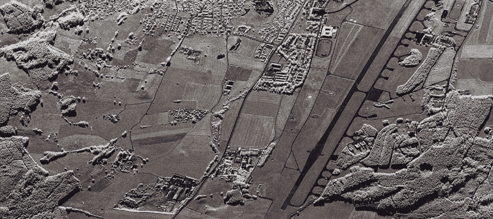
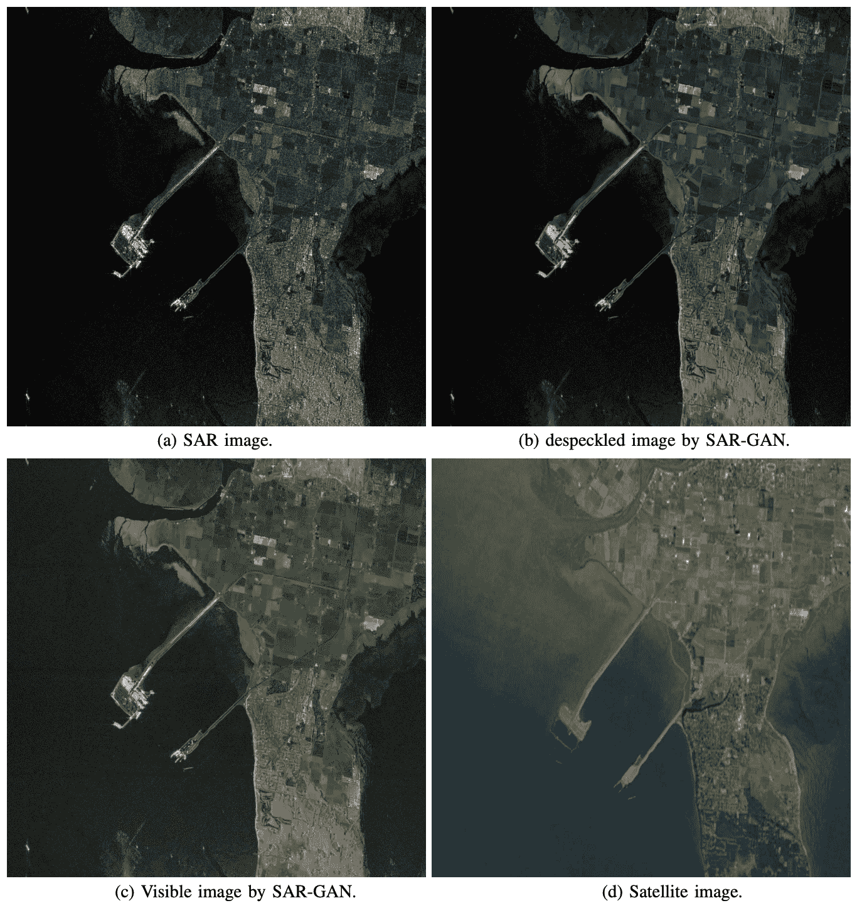

# 深度学习和 SAR 应用

> 原文：<https://towardsdatascience.com/deep-learning-and-sar-applications-81ba1a319def?source=collection_archive---------3----------------------->

## 地球观测应用的进展和挑战概述

High resolution (25cm) SAR data from F-SAR, a DLR airborne system. Image courtesy of DLR, the German Aerospace Center

# 介绍

虽然深度学习的炒作周期似乎正在消退一点([神经网络人工智能很简单！](https://www.linkedin.com/pulse/neural-network-ai-simple-so-stop-pretending-you-genius-brandon-wirtz/))，神经网络和计算机视觉的复兴正在成为常态，在过去五年中，这些技术在遥感领域出现了许多有用的应用。目标检测和土地覆盖分类似乎是深度学习在遥感中研究最多和商业化程度最高的应用，但[还有许多其他领域也受益于](https://arxiv.org/pdf/1710.03959.pdf)，如数据融合、3D 重建和图像配准。深度学习在遥感中日益广泛的使用是由于两个趋势:1)无处不在、易于使用的云计算基础设施，包括 GPUs2)易于使用的机器学习工具的开发和越来越多的采用，如谷歌的 Tensorflow、AWS SageMaker 和许多其他的[开源框架](https://hackernoon.com/open-source-frameworks-for-creating-machine-learning-models-955e975da4cc)；以及 3)一个不断扩大的服务生态系统，用于创建带标签的训练数据([规模](https://scale.ai/)、[数字 8](https://www.figure-eight.com/))以及开放的带标签数据集，如 AWS 上的[SpaceNet](https://spacenetchallenge.github.io/datasets/datasetHomePage.html)。

深度学习、神经网络和计算机视觉近年来也越来越频繁地用于合成孔径雷达(SAR)数据。大多数领先的卫星地球观测分析公司，如 [Orbital Insight](https://medium.com/from-the-macroscope/its-always-sunny-at-orbital-insight-our-work-with-sar-imagery-9907c850fe45) 、[笛卡尔实验室](https://medium.com/descarteslabs-team/measuring-volcanic-earth-displacement-using-interferometric-sar-f307613b692)和 [Ursa](https://www.satellitetoday.com/innovation/2018/08/21/ursa-rre-on-new-funding-and-the-future-of-geospatial-intelligence/) 已经在其分析工作流程中扩大了 SAR 数据的使用。据我所见，从这些技术的使用中受益最大的领域是:目标检测(自动目标识别)、土地覆盖分类、变化检测和数据扩充。最近似乎也有一些关于深度学习的应用如何有利于干涉 SAR 分析的调查。然而，使用 SAR 数据进行深度学习存在一些挑战。其中，明显缺乏大的标记训练数据集，并且因为 SAR 数据具有斑点噪声，并且比光学数据稍不直观，所以对于人类标记器和模型来说，正确地对特征进行分类可能是一个挑战。

我将重点介绍一些将受益于深度学习和高重访、高分辨率 SAR 数据的应用，比如来自[五车二星座](https://www.capellaspace.com/technology/)的数据。我还将概述一些挑战，五车二希望帮助更广泛的 SAR 用户群体解决这些挑战。

# 目标检测

[Automated target recognition with a CNN and the MSTAR dataset.](https://arxiv.org/pdf/1805.06298.pdf)

SAR 深度学习应用的大多数研究和开发都是针对对象检测和土地覆盖分类的。在合成孔径雷达领域，目标检测通常被称为自动目标识别(ATR)。ATR 的研究在 90 年代获得了动力，起源于军事应用，但后来扩展到广泛的民用商业用途。文献中已经研究了一系列 ATR 问题，从在已知地形和杂波中找到一个很好理解的目标，到根据视角和其他目标的遮挡识别可能具有明显不同的 SAR 响应的目标。一般来说，这个问题涉及到寻找相对较小的目标(车辆、船只、电力基础设施、石油和天然气基础设施等)。)在杂乱主导的大场景中。

最近，卷积神经网络(CNN)的使用提高了各种目标的目标识别模型的性能。[CNN 在 SAR ATR 中的首次出现似乎是在最近的 2015 年](http://spie.org/Publications/Proceedings/Paper/10.1117/12.2176558)，当时证明了 CNN 的使用与当时被认为是最先进的其他方法具有竞争力。其他人已经扩展了这项工作，并且[展示了](https://arxiv.org/pdf/1801.08558.pdf) [MSTAR](https://www.sdms.afrl.af.mil/index.php?collection=mstar) 数据集中特征的> 99%的分类准确率，其中包括军用车辆。近年来，更多使用 CNN 的民用和商用例子不断涌现，包括一个绘制电网图的项目，一个辨别船只和冰山的竞赛，以及一些识别浮油钻井平台的研究。到目前为止，我接触到的大部分工作都集中在雷达反向散射图像上，但一些论文强调了使用相位数据获得额外目标信息的潜力。

# 土地覆盖分类

[Classifying sea ice depth from Sentinel-1 data using a CNN.](https://uwaterloo.ca/vision-image-processing-lab/sites/ca.vision-image-processing-lab/files/uploads/files/2015-jan-tgrs_cnnsariceconcentration_3.pdf)

较大特征和土地覆盖的分类也受益于深度学习方法和独立于天气的可靠 SAR 监测的应用。虽然使用神经网络进行 SAR 数据分类并不新鲜，但自 2015 年引入完全卷积神经网络以来，深度学习用于土地覆盖分类的使用似乎大大增加了。已经有很多研究在探索使用 CNN 对常见土地覆盖进行分类的可行性，比如[道路](https://arxiv.org/pdf/1802.01445.pdf)、[建筑](https://arxiv.org/pdf/1808.06155.pdf)、[洪水](https://www.ncbi.nlm.nih.gov/pmc/articles/PMC6165191/)、[城市区域](https://www.tandfonline.com/eprint/j23faThXvkzUvFSvvTUI/full)和[农作物](https://www.mdpi.com/2072-4292/10/8/1217)。深度学习还被用于一些有趣的非典型土地覆盖(或水覆盖)应用，如[识别石油泄漏](https://www.researchgate.net/publication/329767434_Dark_Spot_Detection_in_SAR_Images_of_Oil_Spill_Using_Segnet)和[对不同厚度的海冰进行分类](https://uwaterloo.ca/vision-image-processing-lab/sites/ca.vision-image-processing-lab/files/uploads/files/2015-jan-tgrs_cnnsariceconcentration_3.pdf)。通常，深度学习的使用优于经典方法，尽管它在时间和计算成本上可能不会更有效。然而，与所有监督学习技术一样，性能高度依赖于标记训练数据的质量。

# 变化检测

[Detecting urban change in UAVSAR data using stacked autoencoders.](https://www.researchgate.net/profile/Shaunak_De/publication/321785034_A_novel_change_detection_framework_based_on_deep_learning_for_the_analysis_of_multi-temporal_polarimetric_SAR_images/links/5b21112da6fdcc69745dd2a9/A-novel-change-detection-framework-based-on-deep-learning-for-the-analysis-of-multi-temporal-polarimetric-SAR-images.pdf)

高分辨率、高节奏的 SAR 数据非常适合变化检测应用，因为它能够看穿云层并捕捉反射能量振幅和相位相干性的变化。我惊讶地发现，对于深度神经网络在 SAR 数据变化检测中的应用，已经有了如此多的研究。与主要使用 CNN 的目标检测不同，已经有多种神经网络方法用于解决识别 SAR 数据中表面变化的问题。一般来说，这些方法要么依赖于对多时相叠加的土地覆盖进行分类，然后比较分类后的结果，要么对多时相数据之间的辐射差异或相位差进行分类。有使用[受限玻尔兹曼机器](https://www.researchgate.net/profile/Jiaojiao_Zhao4/publication/278039595_Change_Detection_in_Synthetic_Aperture_Radar_Images_Based_on_Deep_Neural_Networks/links/5a6cdb9eaca2722c947dea91/Change-Detection-in-Synthetic-Aperture-Radar-Images-Based-on-Deep-Neural-Networks.pdf)、 [PCANet](https://ieeexplore.ieee.org/abstract/document/7589111) 、[堆叠自动编码器和多层感知器](https://www.researchgate.net/profile/Shaunak_De/publication/321785034_A_novel_change_detection_framework_based_on_deep_learning_for_the_analysis_of_multi-temporal_polarimetric_SAR_images/links/5b21112da6fdcc69745dd2a9/A-novel-change-detection-framework-based-on-deep-learning-for-the-analysis-of-multi-temporal-polarimetric-SAR-images.pdf)、[监督收缩自动编码器(sCAE)和聚类](https://www.researchgate.net/profile/Chen_Chen252/publication/328743527_Deep_Learning_and_Superpixel_Feature_Extraction_based_on_Sparse_Autoencoder_for_Change_Detection_in_SAR_Images/links/5bfa21c2a6fdcc538818ce26/Deep-Learning-and-Superpixel-Feature-Extraction-based-on-Sparse-Autoencoder-for-Change-Detection-in-SAR-Images.pdf)、 [sCAEs 和模糊 c 均值](https://ieeexplore.ieee.org/abstract/document/7958819)以及 [CNNs](https://www.sciencedirect.com/science/article/abs/pii/S0924271616301459) 的后一种方法的例子。还有另一类有趣的方法，使用 SAR 和光学图像作为输入，并使用[深度卷积耦合网络](https://ieeexplore.ieee.org/abstract/document/7795259)来识别异构数据的变化。大多数研究得出结论，深度学习方法比以前使用马尔可夫随机场和主成分分析的方法表现出更好的性能(更低的假阳性和假阴性率)。

# 变形监测和 InSAR

在使用深度学习方法分析干涉图或支持 InSAR 处理方面，似乎迄今为止还没有太多的研究。然而，有证据表明人们对这一领域感兴趣，一些早期研究使用 CNN 识别包裹阶段的[变形模式，以及](https://arxiv.org/abs/1803.00380)[资助的项目](https://techport.nasa.gov/view/94551)将深度学习方法集成到 InSAR 处理链中。在将深度学习方法应用于[相位展开](https://www.researchgate.net/publication/328767544_PhaseNet_A_Deep_Convolutional_Neural_Network_for_2D_Phase_Unwrapping)方面，也有一些更广泛适用的工作。我们很可能会在未来几年看到更多关于这些主题的公开研究，因为各种机构都有公开的博士职位，专注于将机器学习应用于 InSAR 工作流。

# 数据扩充

[Generating High Quality Visible Images from SAR Images Using a GAN](https://arxiv.org/pdf/1802.10036.pdf).

已经有一些有趣的研究将 CNN 和生成对抗网络(GANs)应用于 SAR 数据增强和数据融合。一个有益于目标探测的研究领域是使用[CNN 来估计和减少 SAR 振幅数据中的斑点噪声](https://arxiv.org/pdf/1706.00552.pdf)。结果是通过单个前馈过程产生“干净”的 SAR 图像。还可以使用 GANs 提高 SAR 数据的*表观*分辨率。在文献中，有从 Sentinel-1 分辨率到 TerraSAR-X 分辨率的图像转换的[例子。虽然这些方法似乎不能很好地保持特征结构，但它们对 SAR 的超分辨率和风格转换的未来是一个有趣的观点。还可以使用 GANs](https://www.mdpi.com/2072-4292/10/10/1597/htm)[通过去斑点和彩色化使高分辨率 SAR 数据看起来更像光学图像](https://arxiv.org/pdf/1802.10036.pdf)，这可以帮助 SAR 图像的视觉解释。现在有[新的数据集可用](https://www.isprs-ann-photogramm-remote-sens-spatial-inf-sci.net/IV-1/141/2018/isprs-annals-IV-1-141-2018.pdf)，这将有助于推进这种类型的工作和其他需要 SAR 和光学数据融合的应用。

# 挑战

当我回顾关于这些应用的文献时，一个共同的挑战是显而易见的:缺乏高质量的标注 SAR 训练数据，特别是在高分辨率下。与所有监督学习方法一样，模型的性能和结果高度依赖于训练数据输入。最常用的高质量训练数据集是 MSTAR 数据集，但它只包含有限数量的军事特征。其他研究人员已经求助于创建他们自己的带注释的训练数据集，但是组装大型全球数据集可能会非常昂贵，因为高分辨率源数据的选项有限，并且很少有开放许可证(例如 [UAVSAR](https://uavsar.jpl.nasa.gov/) )。有一些方法可以通过模拟和迁移学习来增强训练数据，但您仍然需要一个合理的数据集作为起点。我计划在以后的博客文章中讨论这一挑战、一般的搜救训练数据以及五车二的设想。

*五车二致力于通过支持为各种商业和政府用例创建大型高分辨率标记 SAR 训练数据集的工作，为使用 SAR 数据开发深度学习应用的社区做出贡献。如果您正在使用航空或卫星 SAR 数据进行对象检测、变化检测和其他深度学习应用，* [*我们希望收到您的来信*](https://www.capellaspace.com/contact/) *，了解更多关于您的工作和您面临的挑战。*