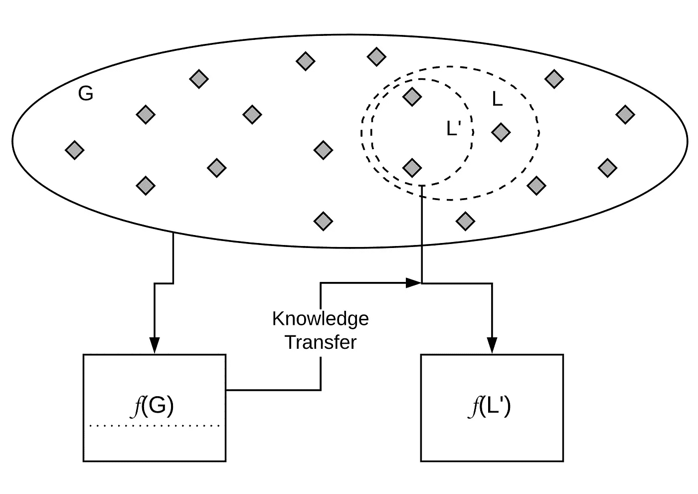

# 深度学习和土壤科学—第 3 部分

> 原文：<https://towardsdatascience.com/deep-learning-and-soil-science-part-3-c793407e4997?source=collection_archive---------17----------------------->

## **土壤光谱学和迁移学习**

这是我致力于深度学习在土壤科学中的应用的系列文章的第二篇。这是一个正在进行的系列，到目前为止还包括:

 [## 深度学习和土壤科学—第 1 部分

### 预测土壤性质的土壤光谱学。根据光谱图预测多种土壤特性的多任务卷积神经网络。

towarsdatascience.com](https://medium.com/@spadarian/deep-learning-and-soil-science-part-1-8c0669b18097)  [## 深度学习和土壤科学—第二部分

### 使用上下文空间信息的数字土壤制图。从点信息生成土壤图的多任务 CNN。

towardsdatascience.com](/deep-learning-and-soil-science-part-2-129e0cb4be94) 

其他与地球科学相关的文章:

 [## 用 SHAP 解释 CNN 生成的土壤地图

### 使用 SHAP 来证实数字土壤制图 CNN 捕捉到了合理的关系。

towardsdatascience.com](/explaining-a-cnn-generated-soil-map-with-shap-f1ec08a041eb)  [## GeoVec:用于地球科学的单词嵌入

### 词语嵌入的类比、分类、关联和空间插值。

towardsdatascience.com](/geovec-word-embeddings-for-geosciences-ac1e1e854e19) 

在[系列的第一部分](/deep-learning-and-soil-science-part-1-8c0669b18097)中，我介绍了一个多任务卷积神经网络(CNN ),用于从光谱数据中同时预测多种土壤特性。我们观察到，与传统方法相比，预测误差显著降低，这要归功于 a)CNN 处理复杂信号的卓越能力，以及 b)多任务学习的协同效应。

在这篇文章中，我将谈论土壤光谱学背景下的迁移学习。这是之前工作的延伸，所以我将跳过土壤光谱数据、光谱图和多任务学习等概念。

# 语境

## 规模问题

据信，在特定区域或土壤范围内生成的模型在该区域表现最佳，而在应用于其他对比土壤类型时表现不佳。在土壤学中，土壤属性的高度空间依赖性意味着为特定区域生成的模型应在该空间域之外小心使用，因为它们可能会失去有效性。反过来，**将全球、大陆或国家光谱库应用于局部地区或区域也会有问题**。国家模型在该国的局部地区应用时往往表现不佳。当在国家一级应用全球模式时，观察到同样的情况。这是可以理解的，因为全球或国家模型通常能够捕捉到跨越不同土壤类型的更广泛的总体趋势。另一方面，局部区域可能具有全球模型无法捕捉的短尺度变化。

本文使用的术语“全球”模型是指基于大规模光谱库(本系列第一部分的[中使用的同一欧洲光谱库)校准的模型，而“本地”是指“全球”数据集(国家)内的一个区域。全局和局部模型都是有价值的，理想情况下，我们希望将从更一般的全局模型中学到的一些规则转移到局部领域。在机器学习中，这种共享域内信息的过程被称为迁移学习。](/deep-learning-and-soil-science-part-1-8c0669b18097)

**这项工作旨在评估迁移学习的有效性，将通用土壤光谱校准模型**“本地化”到一个国家的背景下，模拟全球数据集对当地用户不可用的情况。据我们所知，这是迁移学习首次应用于土壤光谱建模。

# 迁移学习

> “我手上的一幅连环漫画是关于制造专家系统的公司之间的工业间谍活动的。一家公司通过开发超级专家系统获得了市场领先地位，另一家公司雇佣了一名间谍来了解他们是如何做到的。这名间谍闯入另一家公司，却发现他们正在捕获人类专家，取走他们的大脑，将他们切成薄片，然后将这些薄片插入他们最畅销的模型中。”
> 
> 哈利·柯林斯。人类、机器和知识结构。

Original image: [https://pixabay.com/photo-1787622/](https://pixabay.com/photo-1787622/)

作为人类，我们能够将之前获得的知识应用到具有相似特征的任务中。迁移学习，也称为归纳学习，是 ML 的一个分支，试图模拟这一过程。在我们的特殊情况下，给定一个全局数据域 *G* 和一个局部数据域 *L* ，以及 *L* ⊂ *G* ，传统的 ML 方法认为两个域是不同的，生成两个独立的模型， *f* ( *G* )和 *f* ( *L* )。相比之下，承认 *G* 和 *L* 在某种程度上相关，迁移学习能够使用由 *f* ( *G* )结合数据域*l’*、⊆*l*所学习的部分概括来生成模型*f*(*l’*)。值得注意的是，在实践中，有可能|*L '*|<|<|*L*|，这给迁移学习带来了相当大的优势，尤其是在数据收集和分析有限的情况下。

Global and local domains.

该过程背后的逻辑是，在第一次训练中(在全局数据集上)，算法生成光谱数据性质的内部表示。为了成功地学习这种表示，模型需要大量的观察，这正是全局数据集所提供的。在随后的训练(在本地数据集上)中，模型已经“知道”光谱数据如何表现，只需要足够的观察来微调模型并将其调整到本地条件。

# 模型

我们使用多任务 CNN 同时预测有机碳含量、阳离子交换容量、粘土含量和 pH 值。我们比较了 3 种类型的模型:

*   **本地:**仅利用相应国家的数据。从可用数据中，我们随机保留了 10%作为测试数据集。其余数据中，90%用于训练，10%用于验证和超参数选择。
*   **全球:**从整个 [LUCAS 数据集](https://esdac.jrc.ec.europa.eu/projects/lucas)(约 20000 个来自欧洲各地的样本)中，排除了对应国家的数据。其余数据中，90%用于训练，10%用于验证和超参数选择。
*   **转移:**相应国家的训练集用于“本地化”先前用全球数据训练的全球模型。相应国家的验证集用于超参数选择。

整个转移过程可总结如下图:

“Localisation” of a global model. Coloured Layers represent trained weight, which are not modified after being learned.

# 结果

## 逐国

在 21 个国家中的 18 个国家，与当地和全球模型相比，迁移学习显示至少一种土壤特性有显著改善。四个国家在所有四个方面都有显著改善。即使在没有发现显著变化的情况下，转移模型也有降低平均 RMSE 的明显趋势。在 14 个国家中，所有四项资产的平均 RMSE 都有所下降，在总共 84 项国家和资产组合中，有 76 项(90.5%)有所下降。与第二个表现最好的模型相比，转移模型产生的平均 RMSE 减少量分别为 OC、CEC、粘土和 pH 值的 10.5%、11.8%、12.0%和 11.5%。

在少数情况下，转移模型的性能比全局或局部模型差。原因是全局模型的误差远大于局部，产生负迁移。在实践中，当开发局部模型时，通过在训练期间跟踪模型的性能来确定源模型(全局)是否有益，或者是否需要更积极的转移总是有用的。理想情况下，当正转移发生时，转移模型的误差应显示较低的初始和最终量值，如下所示。

# 最后的话

迁移学习被证明是有效的本地化一个通用的土壤光谱校准模型产生的大陆数据集。对于本研究中考虑的大多数国家而言，与使用全球模型(一般模型)或地方模型(仅使用各自国家的数据生成)相比，都有所改善。

我们的发现也强调了全球数据库的重要性。它们对于理解行星尺度的过程至关重要，但对于补充我们在局部尺度的知识也很重要。合作对每个人都有好处，甚至对数据丰富的国家或组织也是如此。

迁移学习模型不要求全局数据集可用于本地培训。一旦校准了全局模型，就只能共享需要重新训练的模型。这是数据隐私问题的潜在解决方案。重要的是要记住，如果全局数据集对本地用户可用，则所提出的方法也是适用的。

# 引用

关于这项工作的更多细节可以在相应的论文中找到。

Padarian，j .，Minasny，b .和 McBratney，A.B .，2019。迁移学习定位大陆土壤 vis-NIR 校准模型。Geoderma(出版中)。

[https://www . research gate . net/publication/330145641 _ Transfer _ learning _ to _ localise _ a _ continental _ soil _ vis-NIR _ calibration _ model](https://www.researchgate.net/publication/330145641_Transfer_learning_to_localise_a_continental_soil_vis-NIR_calibration_model)