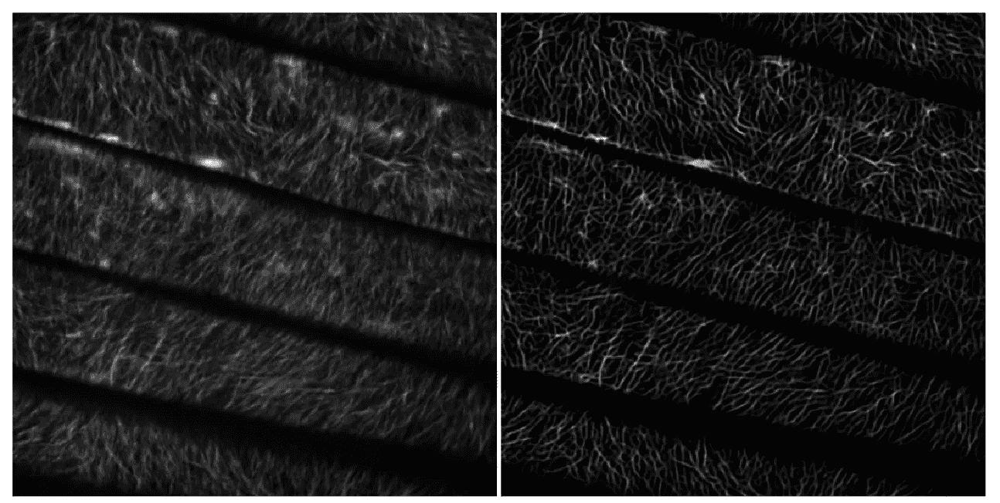
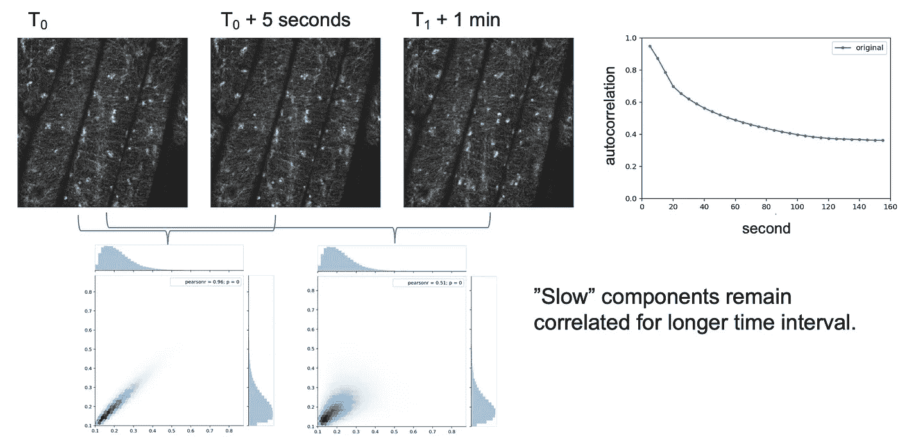
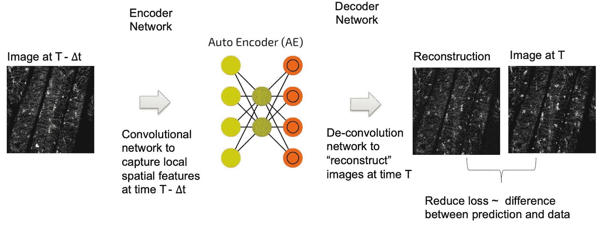
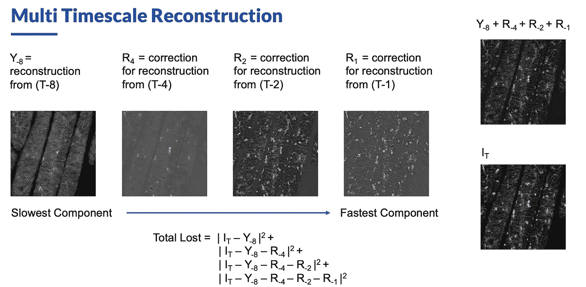
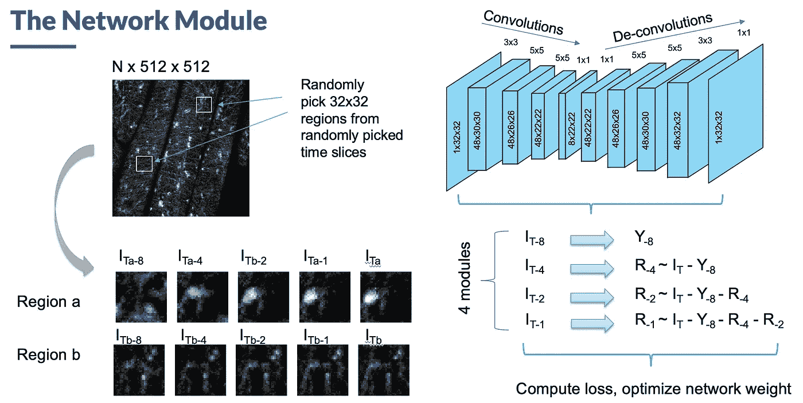
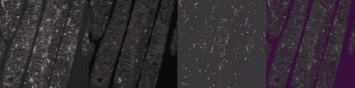
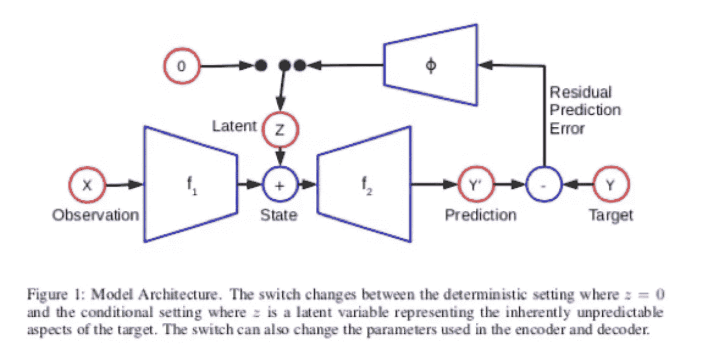
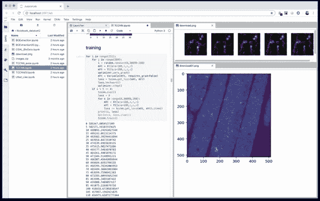

# 用于分离快分量和慢分量的深度学习方法

> 原文：<https://towardsdatascience.com/deep-learning-approach-for-separating-fast-and-slow-components-2e6142d041dc?source=collection_archive---------19----------------------->

# 一些背景

(这项工作的幻灯片可以在 https://speaker deck . com/jchin/decompositing-dynamics-from-different-time-scale-for-time-lapse-image-sequences-with-A-deep-CNN 找到)

在经历了 9 年帮助单分子测序对科学界变得有用的冒险后，我辞去了在 PacBio 的研究员工作(见[我在 PacBio 头几年的故事](https://medium.com/@infoecho/the-end-of-a-chapter-a-memoir-on-bioinformatics-development-work-for-single-molecule-sequencing-19455c288280))。我的大部分技术/科学工作都与 DNA 序列有关。虽然有一些令人兴奋的深度学习方法可以解决一些有趣的问题，但我确实喜欢探索 DNA 测序空间之外的一些东西。

我不久前加入了 DNAnexus。该公司已成为生物数据/测序数据处理云计算平台的领导者。我认为用该平台演示开发除 DNA 序列之外的生物数据的深度学习模型是有用的。怀着这样的目标，前首席安全官 Andrew Carroll 和我决定看看我们能为一些生物成像相关的工作做些什么。

当我们在寻找一些例子的时候， [Gene Myers](https://en.wikipedia.org/wiki/Eugene_Myers) (是的，第一个完成[全人类基因组鸟枪法组装](http://science.sciencemag.org/content/291/5507/1304)的人)发表了一个工具 [CSBdeep](http://csbdeep.bioimagecomputing.com) 来自德国德累斯顿[马普分子细胞生物学和遗传学研究所(MPI-CBG)](https://www.mpi-cbg.de/home/) 的他的实验室[用于从光片共焦图像中创建超分辨率图像，用于研究生物发育过程。](https://www.mpi-cbg.de/research-groups/current-groups/gene-myers/group-leader/)

Example of using CSBDeep to archive super-resolution: Left: the original images. Right: the super-resolution images generated by CSBdeep. The image is provided by [Ying Gu Lab](http://www.gulilab.org).

受 CSBDeep 论文的启发，Andrew 联系了一位正式的合作者， [Ying Gu](http://www.gulilab.org) ，看看她是否有一些有趣的图片让我们在我们的平台上演示使用 CSBDeep。利用 DNAnexus 云计算平台，重现 CSBDeep 结果并将其应用于新图像相对容易。尽管如此，我在想我们是否可以做一些不同的，新的事情，至少对我来说。

# 一部电影不仅仅是静态图像，它更有趣

原来，英古的研究工作是跟踪涉及纤维素合成的特定蛋白质，解决生物能源的重要问题。我们得到的图像是追踪细胞内分子的延时电影。最初，我认为我们可能能够通过使用多帧的深度学习来实现超分辨率。虽然我们在这个问题上取得了一些初步的成功，但我却“分心”去解决另一个不同的问题。

In the image stack, the slow changing background contributes to the non-zero auto-correlation at longer timescales.

当我看延时电影时，很难不注意到一些背景成分(例如，植物细胞的主干微管)，以及以不同速度移动的不同斑点或粒子。我认为可以使用深度学习(作为一种无监督的学习方法)来分离背景，慢速组件和激活组件。

**在这样的延时电影中，我们怎样才能把运动部分和静止部分分开呢？**

第一，背景图的获取其实并不太难。我们可以对堆栈中的所有图像的每个像素取平均值或中值来获得背景。为了得到前景图像，我们可以从每幅图像中减去平均背景。如果背景真的是静态的，这应该是最容易做到的事情。然而，这种方法也假设只有一个有趣的“前景”事实上，潜在的生物过程可能具有不同的组件，这些组件具有不同的动态范围，我们可能能够使用深度学习架构来分解不同的组件。

**From (T —** ∆**t) to T:** If ∆t is longer than the typically “faster” components, then we can
catch the slow component using such autoencoder architecture.

# 使用多个自动编码器预测不同时间尺度的未来

这样的延时电影有什么背景？在深度学习神经网络架构中，自动编码器可以学习具有隐藏层的简化表示，以再现输入。训练期间的损失函数通常是输出和输入之间的 L2 差。如果我们认为背景是电影的不变部分，我们应该希望我们可以使用这样的自动编码器来学习简化的表示，该表示可以从早期的输入预测后期的输出。图像的不变部分**在不同的时间点**应该可以被自动编码器学习。

我们可以认为，一幅特定时间的图像可以从更早时间不同尺度的特征或成分中重建出来。我们使用自动编码器从(t-∆t)预测时间 t 的图像。如果 t 很大，那么我们希望自动编码器能够学习背景部分。我们可以用更小的 t 来学习更快的部分等等。例如，我们可以将时间 t 的图像构建为 t-8(帧)、t-4(帧)、t-2(帧)和 t-1(帧)的图像的预测组合，以捕捉不同时间尺度的贡献。

沿着这一思路，我们测试了下面的一个建筑展示，用于分解英姑小组生成的延时电影。我认为我们得到了相当好的结果。

From left to right: (a) Original (b) Slow Components (c ) Fast Component (d) Pseudo-color composition from the slow and fast components

# 其他相关作品

虽然我认为我们提出的方法很有趣，并且很容易用 PyTorch 实现，但肯定有一些以前的工作解决了类似的问题。例如，Mikael Henaff、Junbo Zhao 和 Yann LeCun 的论文“[使用误差编码网络](https://arxiv.org/abs/1711.04994) (EEN)在不确定性下的预测”使用从预测误差到潜在空间的反馈机制来获得更好的预测结果。

ENN Model Architecture

视频背景去除是图像处理领域的一个重要研究课题，对此我们并不感到奇怪。我要感谢来自 [Grail](https://grail.com) 的 [Earl Hubbell](https://www.linkedin.com/in/earl-hubbell-28a5634/) ，当我在 2018 年末的一次当地生物信息学会议上介绍这项工作时，他向我指出了用于视频背景去除的[鲁棒 PCA 方法](https://sites.google.com/site/backgroundsubtraction/recent-background-modeling/background-modeling-via-rpca)。

# 利用 DNAnexus 云平台构建深度学习模型

我在这里的一部分练习也是为了作为 DNAnexus 平台的新手练习“[吃自己的狗粮](https://en.wikipedia.org/wiki/Eating_your_own_dog_food)”。下面是一个原型的截图，我和我的同事在 DNAnexus 平台上开发了一个支持云的 Jupyter 实验室工作站的集成解决方案。通过这样的集成，我们可以无缝集成数据管理、模型构建和评估。

我们学到了许多关于在 GPU 实例上使用 Jupyter Lab 和 Docker 后端的利弊的经验，并希望我们学到的经验可以帮助我们尽快更好地改进 DNAnexus 产品。

# 承认

我要感谢小然·辛和应谷与我们分享了他们的研究成果来验证这个想法。我也要感谢安德鲁·卡罗尔把我们连接到英姑的实验室。当然，对于我在 DNAnexus 的同事们帮助我快速入门，以便我可以开始利用这个平台进行有趣的 ML/AI 工作，我永远不会足够感谢。