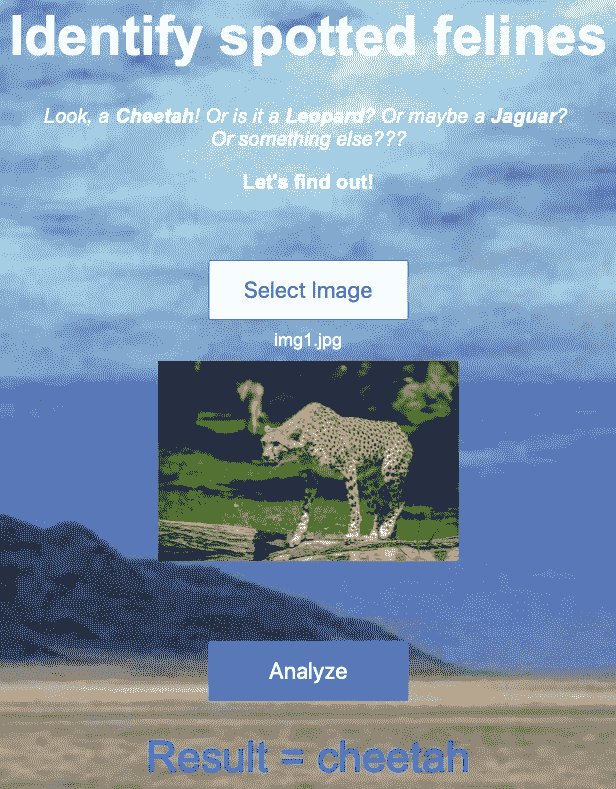

# 基于深度学习的 web 应用:从数据收集到部署

> 原文：<https://towardsdatascience.com/deep-learning-based-web-application-from-data-collection-to-deployment-9e89f29b67df?source=collection_archive---------19----------------------->

## 从头开始构建图像分类器 web 应用程序，不需要 GPU 或信用卡。


这篇文章描述了如何在不需要 GPU 或信用卡的情况下为**图像分类**、*构建一个基于深度学习的网络应用*！

尽管有很多文章描述这种东西，但我找不到完整的指南来描述**从数据收集到部署的所有步骤**，而且一些细节也很难找到(例如，如何在 Google Drive 上克隆 Github repo)。

文章很大程度上基于 [fast.ai](https://docs.fast.ai/index.html) 的程序员实用深度学习课程(简直太神奇了)。它分为以下几个部分:

1.  **数据采集**
2.  **培训**
3.  **部署**

本指南面向已经具备基本编码和深度学习经验的人*；如果有些概念是全新的，你最好从更具体的文章开始。*

我们将看到一个如何构建*猫科动物分类器的例子。***完整代码**在[这里](https://github.com/davide-burba/spotted_feline_classifier)有，你可以在这里 [测试 **web 应用(如果不行说明我已经关机了；可以看看 fast.ai 玩具模型**](https://spotted-feline-identifier.onrender.com)**[这里](https://fastai-v3.onrender.com))！**

# 1.数据收集

第一个问题是数据收集。虽然在像 [Kaggle](https://www.kaggle.com) 这样的网站上有许多预先存在的数据集，但你可能会对构建**我们自己的数据集**感兴趣。在这种情况下，**我们对区分斑点猫科动物**感兴趣，如下图所示。


Cheetah, Jaguar, Leopard and … Other


因此，给定一幅图像，我们的分类器应该告诉我们它是否包含一只**猎豹**、一只**美洲豹**、一只**豹**或其他什么。是的，我知道这完全没用。然而，这有利于练习和娱乐:)。

第一件事是收集每个班级的图像样本。有几种方法可以从网上抓取图像；我们将利用 [fast.ai](https://docs.fast.ai/index.html) 提供的 [**image_cleaner 模块**](https://docs.fast.ai/widgets.image_cleaner.html) 。其他的选择可能是[Google _ images _ download](https://pypi.org/project/google_images_download/)包，或者你可以试着从浏览器使用 javascript 控制台，就像这里的[一样](https://github.com/fastai/course-v3/blob/master/nbs/dl1/lesson2-download.ipynb)。

[**image _ cleaner**](http://image_cleaner)**提供可从 Jupyter 笔记本使用的应用程序。你需要做的就是[安装 fastai 库](https://docs.fast.ai/install.html)并在 Jupyter 笔记本中运行以下代码:**

****Warning**: to be run in Jupiter Notebook, it doesn’t work in Jupyter Lab and CoLab**

**这将导致类似这样的结果:**

****

**You need to set the keywords for the search, the number of images and the minimum quality.**

**比你想象的容易，对吧？我们只需要注意**几个细节**:**

1.  **在你的搜索中要精确；可能值得使用特殊字符来强制包含("")或排除(-)。例如:*猫科动物“美洲虎”——汽车。***
2.  **要下载超过 100 张图片，你需要安装 selenium 和 chromedriver。**
3.  **有不同的方法来训练分类器 ***理解图像是否不对应于任何考虑的类别。*** 一种方法是创建一个"**其他"**类包含随机图像。对于“**other”**类，我们的搜索是:*动物-美洲虎-猎豹-豹。***
4.  **您的数据集中很可能会有一些噪声图像；应该“用手”将它们移除。拥有一个相对较小的干净数据集比拥有一个巨大的嘈杂数据集要好。**

**现在我们有了一个全新的干净的数据集。训练时间到了！**

# **2.培养**

***现在呢？每个人都知道，为了能够训练一个图像分类器，你需要大量的图像和图形处理器！或者……也许不是？***

**我们不需要收集这么多图像，这是因为两个惊人的技术:**数据增强**和**迁移学习**。第一种技术是通过从现有图像开始构建新图像来自动扩充数据集，如下图所示:**

************

**Example of Data Augmentation**

**第二种技术是使用预先训练好的模型，在我们的例子中是 [**ResNet34**](https://arxiv.org/abs/1512.03385) **。**这个网络已经在 [ImageNe](http://www.image-net.org) t 数据集上进行了训练，可以检测数千个类别。因此，我们可以预期*由最后一个隐藏层给出的图像表示“捕捉”了大量复杂的图案*，即它提供了智能特征。**

**即使这些概念可能看起来不完全清楚，这也不应该阻止我们部署我们的应用程序。事实上， [fast.ai](https://docs.fast.ai/index.html) 库使得这些技术变得非常容易使用。**

**为了在不需要信用卡的情况下免费访问 GPU，我们可以使用 Google Colab，这是 Google 提供的一项服务，因此与 Google Drive 高度集成。**

**在谷歌实验室中创建和运行一个 Jupyter 笔记本相当简单。要启用 GPU，请按“*运行时*”、“*运行时类型*，并将“*硬件加速器”*设置为 GPU。**

**然而，我们还需要:**

1.  ****连接驱动****
2.  ****与 Git/GitHub 通信****

**一旦我们将数据放入 Google Drive，要从 Colab Notebook 访问它，我们只需运行以下代码:**

**现在我们可以从“*路径”加载数据。***

**要从 Drive 使用 Github，我们基本上使用 Colab 笔记本作为命令行，如这里的[所述](https://lalorosas.com/blog/github-colab-drive)。就我个人而言，我在我称为***git _ communicator . ipynb .***的项目之外使用过一个 Colab 笔记本**

**因此，要克隆 Github 存储库，我们只需在 Colab 的笔记本上运行以下代码:**

**一旦我们完成了修改，我们就可以运行通常的 git 命令(以“！”开头)提交和推送修改)来自 Colab 笔记本手机。**

**一旦我们为我们的项目创建了一个 GitHub 库，我们就能够**在 Google Drive 上克隆**，利用一个免费的 GPU**在 Colab 上运行**现有的笔记本，然后**提交**修改！**

**既然我们已经解决了技术问题，是时候训练我们的分类器了。还是那句话， [fast.ai](https://docs.fast.ai/index.html) 让它超级简单。首先，让我们**加载数据**:**

**这段代码创建了一个 *DataBunch* 对象:**

1.  **保留 20%的数据进行验证**
2.  **应用标准数据扩充技术**
3.  **应用 ImageNet 数据集规范化**

**很好，现在我们将使用带有预训练权重的 ResNet34 网络架构，并且**仅训练最后一个隐藏层与输出层**的连接。这可以通过两行代码来完成:**

**该代码使用了[**fit-one-cycle**](https://docs.fast.ai/callbacks.one_cycle.html#What-is-1cycle?)策略，这是一种智能技术，通过使用开始时逐渐增加，后来逐渐减少的学习速率，在短时间内训练网络。这使我们得出以下结果:**

****

**在不到 6 分钟的时间里，我们在验证集上达到了几乎 93%的准确率。然而，我们可以观察到**培训损失仍然大于验证损失。**这意味着仍有改进的空间！**

**现在也许值得对整个网络进行**训练，**不仅仅是最后一层。这也可以通过两行代码来实现:**

**在策略中为最大学习速率设置一个片而不是单个值允许**用不同的学习速率训练网络**。第一层将用较小的学习率来训练，因为它们“检测”在不同图像数据分布中不应该改变太多的简单模式。**

**让我们看看我们现在得到的混淆矩阵:**

****

**哇，这是验证集上 **98.73 %的准确率**！**

**如果我们将它作为专业应用**，我们将不得不提供一个单独的测试集**来评估我们的分类器的性能。然而，对于像我们这样的玩具项目来说，这个结果已经足够了！**

**由于我们对模型感到满意，我们可以通过运行以下命令将其导出以进行部署:**

```
learn.export()
```

**运行模型所需的一切都将存储在一个名为 **export.pkl 的文件中，在我们的例子中**放在“data”目录中。**

# **3.部署**

**如果说训练很容易，那么部署就更容易了，多亏了[**Docker**](https://www.docker.com/why-docker) 和 [**Render**](https://render.com) 。**

**[**Docker**](https://www.docker.com/why-docker) 是一个允许使用容器轻松部署和运行应用程序的工具。简而言之，它是一种虚拟机，而不是虚拟化整个操作系统，使用与运行系统相同的 Linux 内核，从而提高性能。**

**[**Render**](https://render.com) 是一个 web 服务，允许非常容易地构建和运行 web 应用程序(以及其他)。**

**同样，我们甚至不需要理解这些东西实际上是如何工作的。我们可以简单地使用 fast.ai 提供的示例代码[(这里是](https://github.com/render-examples/fastai-v3))，把它添加到我们的存储库中(或者从头开始分支)。**

**要在渲染时部署,只需:**

1.  **创建一个渲染帐户，并将其连接到 Github**
2.  **将训练好的模型文件 **export.pkl** 上传到 Google Drive 并使其可下载**
3.  **用 URL 编辑`model_file_url`变量到 **export.pkl** 和**更新文件`server.py`中的行`classes`****
4.  **编辑**index.html**以更改网站文本和布局(可选)**
5.  **启动新服务**

**所有这些步骤在[和](https://course.fast.ai/deployment_render.html)中详细描述。**

**最后，你现在应该有一个基于深度学习的 web 应用程序！它应该是这样的:**

************

# **结束语**

1.  **数据决定一切。整个过程最重要的是得到一个像样的数据集。**
2.  **在这个应用程序中，我们**只对动物的图像进行训练**。网络可能会对其他主题的图像表现出意想不到的行为。**
3.  **我们基于验证集来评估性能。在现实世界的应用中，**我们应该使用测试集**来避免有偏见的估计。**
4.  **fast.ai 库非常酷，它让复杂的高级技术变得非常容易使用。然而，**如果你需要更多地控制正在发生的事情**，直接使用它的后端 [PyTorch](https://pytorch.org) 可能会更好。**