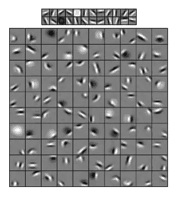
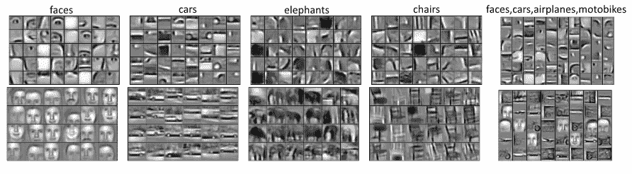
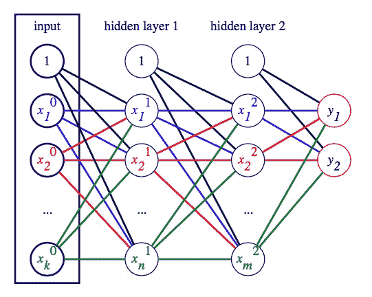

# 深度学习基础:速成课程

> 原文：<https://towardsdatascience.com/deep-learning-basics-a-crash-course-3213aa9e477c?source=collection_archive---------17----------------------->

了解什么是深度学习，以及深度学习算法在现实应用中是如何使用的！

**机器学习** (ML)和**深度学习** (DL)技术正在被应用于各个领域，数据科学家在许多不同的行业都受到追捧。

通过机器学习，我们可以识别出我们获取知识的过程，而这些知识并不是从数据中显而易见的，从而做出决策。机器学习技术的应用可能会有很大的不同，可以在医学、金融和广告等不同的学科中找到。

深度学习利用了比 20 世纪 80 年代使用的更先进的神经网络。这不仅是理论发展的结果，也是计算机硬件进步的结果。

在这个速成课程中，我们将学习深度学习和**深度神经网络** (DNNs)，即具有多个隐藏层的神经网络。我们将讨论以下主题:

*   深度学习简介
*   深度学习算法
*   深度学习的应用

我们开始吧！

> 这个速成课程改编自 Next Tech 的 **Python 深度学习项目(第一部分:基础)**课程，该课程探索了深度学习的基础知识，建立了一个 DL 环境，并构建了一个 MLP。它包括一个浏览器内沙盒环境，预装了所有必要的软件和库。这里可以开始[！](https://c.next.tech/2ra6R1e)

# 深度学习简介

给定[通用近似定理](https://en.wikipedia.org/wiki/Universal_approximation_theorem)，你可能想知道使用多个隐藏层有什么意义。这绝不是一个天真的问题，在很长一段时间里，神经网络都是这样使用的。

使用多个隐藏层的一个原因是，逼近一个复杂的函数可能需要隐藏层中大量的神经元，这使得它不实用。使用深度网络的一个更重要的原因是，深度网络不仅仅学习在给定输入 X 的情况下预测输出 Y，它还理解输入的基本特征，深度网络与隐藏层的数量没有直接关系，而是与学习的水平有关。

让我们看一个例子。

在 H. Lee、R. Grosse、R. Ranganath 和 A. Ng 于 2009 年发表的《机器学习国际会议记录》(*ICML*)(Proceedings of the International Conference on Machine Learning)中，作者用不同类别的物体或动物的图片训练了一个神经网络。在下图中，我们可以看到网络的不同层如何学习输入数据的不同特征。在第一层中，网络学习检测一些基本特征，例如所有类别中所有图像共有的线条和边缘:

The first layer weights (top) and the second layer weights (bottom) after training

在接下来的图层中，如下图所示，它将这些线和边组合在一起，以构成特定于每个类别的更复杂的要素:

Columns 1–4 represent the second layer (top) and third layer (bottom) weights learned for a specific object category (class). Column 5 represents the weights learned for a mixture of four object categories (faces, cars, airplanes, and motobikes)

在最上面一行，我们可以看到网络如何检测每个类别的不同特征。人脸的眼睛、鼻子和嘴巴，汽车的门和轮子，等等。这些特征是**的抽象**。也就是说，网络已经学习了特征的一般形状，例如嘴或鼻子，并且可以在输入数据中检测该特征，尽管它可能有变化。

在上图的第二行中，我们可以看到网络的深层是如何将这些特征组合成更复杂的特征的，比如人脸和整辆汽车。深度神经网络的优势在于，它们可以通过从训练数据中推导出这些高级抽象表示来自己学习这些表示。

# 深度学习算法

我们可以将深度学习定义为一类机器学习技术，其中信息在分层中进行处理，以理解越来越复杂的数据的表示和特征。在实践中，所有的深度学习算法都是神经网络，它们共享一些共同的基本属性。它们都由相互连接的神经元组成，这些神经元被组织成层。它们的不同之处在于网络架构(神经元在网络中的组织方式)，有时还在于它们的训练方式。

考虑到这一点，让我们看看神经网络的主要类别。下面的列表并不详尽，但它代表了当今使用的绝大多数算法。

## 多层感知器

一种具有前馈传播、全连接层和至少一个隐藏层的神经网络。

该图展示了一个具有两个隐藏层的 3 层全连接神经网络。输入层有 *k* 个输入神经元，第一隐层有 *n* 个隐神经元，第二隐层有 *m* 个隐神经元。在这个例子中，输出是两个类 *y* ₁和 *y* ₂.上面是永远开启的偏置神经元。一层中的一个单元连接到上一层和下一层中的所有单元(因此是完全连接的)。

## 卷积神经网络

CNN 是一种前馈神经网络，具有几种特殊的层。例如，卷积层对输入图像(或声音)应用一个滤波器，方法是在输入信号上滑动该滤波器，以产生一个 *n* 维的激活图。有一些证据表明，中枢神经系统中的神经元的组织方式类似于大脑视觉皮层中生物细胞的组织方式。今天，在大量的计算机视觉和自然语言处理任务上，它们优于所有其他的 ML 算法。

## 递归神经网络

这种类型的网络有一个内部状态(或内存)，它是基于所有或部分已输入网络的输入数据。递归网络的输出是其内部状态(以前输入的记忆)和最新输入样本的组合。同时，内部状态发生变化，以合并新输入的数据。由于这些特性，递归网络是处理序列数据(如文本或时间序列数据)的任务的理想选择。

## 自动编码器

一类无监督学习算法，其中输出形状与输入形状相同，允许网络更好地学习基本表示。它由输入层、隐藏层(或瓶颈层)和输出层组成。虽然这是一个单一的网络，但我们可以将其视为两个组件的虚拟组合:

*   **编码器**:将输入数据映射到网络的内部表示。
*   **解码器**:试图从网络的内部数据表示中重建输入。

## 强化学习

强化算法学习如何通过许多步骤实现一个复杂的目标，当它们做出错误的决定时使用惩罚，当它们做出正确的决定时使用奖励。这是一种经常用来教机器如何与环境互动的方法，类似于人类行为由负面和正面反馈形成的方式。RL 通常用于构建电脑游戏和自动驾驶汽车。

# 深度学习的应用

机器学习，特别是深度学习，在预测质量、特征检测和分类方面产生了越来越多令人惊讶的结果。许多最近的结果甚至成为了新闻！以下是这些技术在今天或不久的将来可以应用的几种方式:

## 自动驾驶汽车

如今，新车有一套安全和便利的功能，旨在使驾驶体验更安全，压力更小。其中一个功能是当汽车遇到障碍物时自动紧急制动。另一个是车道保持辅助系统，它允许车辆停留在当前车道上，而无需驾驶员用方向盘进行校正。为了识别车道标志、其他车辆、行人和骑自行车的人，这些系统使用一个前向摄像头。我们可以推测，未来的自动驾驶汽车也将使用深度网络进行计算机视觉。

## 图像和文本识别

[谷歌的视觉 API](https://cloud.google.com/solutions/image-search-app-with-cloud-vision) 和[亚马逊的 Rekognition](https://aws.amazon.com/rekognition/faqs/) 服务都使用深度学习模型来提供各种计算机视觉能力。这些包括识别和检测图像中的对象和场景、文本识别、人脸识别等等。

## 医学成像

医学成像是各种创建身体内部视觉表示的非侵入性方法的总称。其中一些包括**磁共振图像** ( **MRIs** )、超声波、**计算机轴向断层扫描** ( **CAT** )扫描、X 射线和组织学图像。典型地，这样的图像由医学专业人员分析以确定患者的状况。机器学习，特别是计算机视觉，正在实现计算机辅助诊断，它可以通过检测和突出图像的重要特征来帮助专家。

例如，为了确定结肠癌的恶性程度，病理学家必须使用组织学成像来分析腺体的形态。这是一项具有挑战性的任务，因为形态学可以有很大的不同。深度神经网络可以自动从图像中分割出腺体，让病理学家来验证结果。这将减少分析所需的时间，使其更便宜和更容易获得。

## 病史分析

另一个可以受益于深度学习的医疗领域是病历记录的分析。在医生诊断病情和开出治疗处方之前，他们会查阅患者的病史以获得更多的信息。深度学习算法可以从这些大量记录中提取最相关和最重要的信息，即使它们是手写的。这样，医生的工作可以变得更容易，同时也降低了出错的风险。

## 语言翻译

[谷歌的神经机器翻译](https://arxiv.org/abs/1611.04558) API 使用——你猜对了——深度神经网络进行机器翻译。

## 语音识别和生成

Google Duplex 是深度学习的另一个令人印象深刻的真实世界演示。这是一个新系统，可以通过电话进行自然对话。例如，它可以代表用户预订餐馆。它使用深度神经网络来理解对话，并生成现实的、类似人类的回复。

Siri、谷歌助手和亚马逊 Alexa 也依靠深度网络进行语音识别。

## 赌博

最后，AlphaGo 是一台基于深度学习的**人工智能** ( **AI** )机器，它在 2016 年 3 月因击败世界围棋冠军 Lee Sedol 而成为新闻。AlphaGo 在 2016 年 1 月已经成为新闻，当时它击败了欧洲冠军范辉。虽然，在当时，它似乎不太可能继续击败世界冠军。几个月后，AlphaGo 以 4 比 1 的比分横扫对手，实现了这一非凡的壮举。

这是一个重要的里程碑，因为围棋比国际象棋等其他游戏有更多可能的游戏变化，而且不可能事先考虑到每一步可能的棋。此外，与国际象棋不同，在围棋中，甚至很难判断棋盘上单个棋子的当前位置或价值。2017 年，DeepMind 发布了名为 [AlphaZero](https://arxiv.org/abs/1712.01815) 的 AlphaGo 更新版本。

在这个速成课程中，我们解释了什么是深度学习，以及它与深度神经网络的关系。我们讨论了不同类型的网络和深度学习的一些现实应用。

这只是一个开始——如果你想了解更多关于深度学习的信息，Next Tech 有一个 **Python 深度学习项目**系列，探索跨计算机视觉、自然语言处理(NLP)和图像处理的真实世界深度学习项目。*本系列的第 1 部分*涵盖了 DL 的基本概念，如何建立 DL 环境，以及如何构建 MLP。这里可以开始[！](https://c.next.tech/2ra6R1e)