# 深度学习丛书 3.1 到 3.3 概率质量和密度函数

> 原文：<https://towardsdatascience.com/deep-learning-book-series-3-1-to-3-3-probability-mass-and-density-functions-fe7e41ca6539?source=collection_archive---------16----------------------->

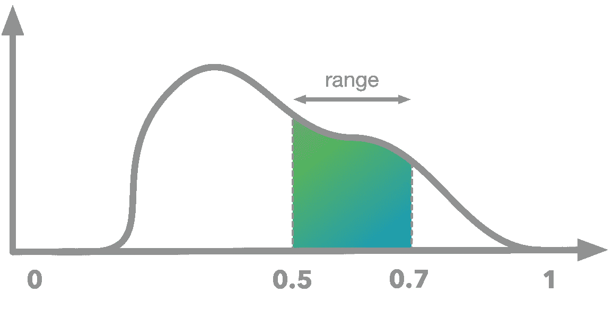

该内容是古德费勒(Goodfellow，I .)、本吉奥(Bengio，y .)和库维尔(a .)(2016 年)的深度学习书籍中关于概率的第三章系列的一部分。它旨在提供关于数学理论的直觉/绘图/python 代码，并作为我对这些概念的理解而构建。

**Github** :相应的 Python 笔记本可以在这里找到[。](https://github.com/hadrienj/deepLearningBook-Notes/tree/master/3.1-3.3%20Probability%20Mass%20and%20Density%20Functions)

我很高兴在这里展示我的深度学习系列(Goodfellow 等人的书)的以下内容。这是根据第三章概率制作的第一个帖子/笔记本。对于那些已经知道我关于线性代数第二章的帖子/笔记的人来说，目标和结构是一样的。目的是让没有深厚数学背景的人更容易理解这本书。更多信息可以参考[入门帖](/boost-your-data-sciences-skills-learn-linear-algebra-2c30fdd008cf)。

我认为通过使用代码(这里是 Python)和可视化来获得对数学概念更好的直觉是可能的。该结构遵循书的子章节，它可以作为额外的内容，给出例子和细节。

这第一部分是关于第 3.1 至 3.3 章。第 3.1 章是对概率的介绍，不包含任何技术难度。因此，您可以在此处直接阅读[。第 3.2 章实际上只是一个定义，所以主要部分是 3.3 关于**概率质量函数**和**概率密度函数**。看完之后，**随机变量**及其概率分布(对于**离散和连续变量**)对你来说就没有秘密了🏄🏾‍♂️.](https://www.deeplearningbook.org/contents/prob.html)

为了理解它，我们还将学习一些非常有用的数学工具:

🔧**离散变量与连续变量**

🔧**衍生**

🔧**积分**

🔧**曲线下面积**

这些概念对于一般数据科学和机器学习来说非常重要。

# 3.2 随机变量

概率的目标是处理不确定性。它给出了描述随机事件的方法。随机变量是一个可以根据随机事件的结果取多个值的变量。可能的结果是变量可能取的值。

如果结果是有限的(例如掷骰子事件中的 6 种可能性)，则称随机变量为**离散的**。

如果可能的结果不是有限的(例如，在 0 和 1 之间画一个数可以给出无穷多个值)，则称随机变量为**连续**。

和书中一样，我们将使用下面的符号:一个小写的普通字体字母代表一个随机变量:x。

# 例 1。

假设变量 x 是一个随机变量，表示掷骰子的结果🎲。变量可以取值 1、2、3、4、5 或 6。它是一个离散的随机变量。

# 3.3 概率分布

所以一个随机变量可以取多个值。很重要的一点是，要知道某些值是否会比其他值更经常遇到。一个随机变量可以取的每一个可能值的概率的描述叫做它的**概率分布**。

离散变量和连续变量的概念很重要，我们将研究两种情况下概率分布的概念。即使它们是相关的，也存在一些差异。

反正一个随机变量 x 的概率分布描述的是每一个结果的概率(概率 1 表示变量会一直取这个值，概率 0 表示永远不会遇到)。这个函数叫做概率分布。更具体地说，它被称为离散变量的**概率质量函数**和连续变量的**概率密度函数**。

# 3.3.1 离散变量和概率质量函数

**概率质量函数**是描述与随机变量 x 相关的概率的函数，为避免混淆，该函数被命名为 *P* (x)或 *P* (x = *x* )。 *P* (x = *x* )对应随机变量 x 取值 *x* 的概率(注意字体不同)。

# 例 2。


*说明离散随机变量和概率质量函数的骰子实验*

让我们把一个骰子掷无限次，看看 1 的比例，2 的比例等等。我们称 x 为随机变量，它对应于掷骰子的结果。因此，随机变量 x 只能取下列离散值:1、2、3、4、5 或 6。因此它是一个**离散随机变量**。

概率质量函数的目的是描述每个可能值的概率。在我们的例子中，它描述了得到 1 的概率，得到 2 的概率等等。在骰子滚动实验的情况下，我们有相同的概率获得每个值(如果我们假设骰子是完美的)。这意味着我们可以写:

*P*(x = 1)=*P*(x = 2)=*P*(x = 3)=*P*(x = 4)=*P*(x = 5)=*P*(x = 6)

现在，我们如何计算概率 *P* (x = 1)， *P* (x = 2)等等。？因为我们有 6 种可能的结果，并且它们是等概率的，所以我们有:

*P*(x = 1)=*P*(x = 2)=*P*(x = 3)=*P*(x = 4)=*P*(x = 5)=*P*(x = 6)= 1/6

顺便说一下，这个分布显示了每个值的相同概率:它被称为**均匀分布**。

概率质量函数可能看起来像这样:

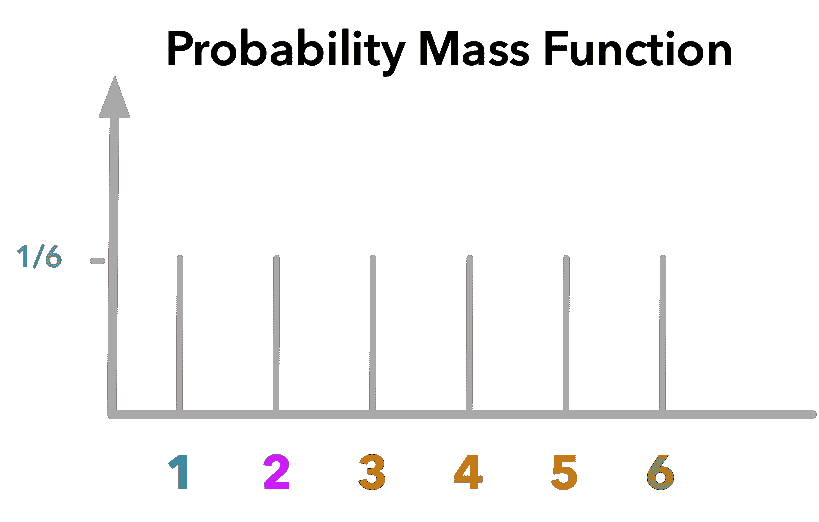

*骰子实验的概率质量函数*

y 轴给出概率，x 轴给出结果。

让我们用代码重现第一个例子，以确保一切都很清楚:

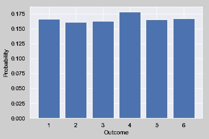

我用 Numpy 函数`zeros()`创建了一个填充了 0 的数组。每次投掷时，我从 6 种可能性中选择一个值。然后，我使用参数`return_counts`设置为`True`的 Numpy 函数`unique()`来获得每个可能结果的数量。我画出了每个可能值的比例。

我们可以看到，分布看起来像均匀分布，每个结果的概率约为 1/6(约为 0.17)。

# 联合概率分布

现在让我们看看如果掷两个骰子会发生什么。对于每个骰子，结果都与某个概率相关联。我们需要两个随机变量来描述这个博弈，假设 x 对应第一个骰子，y 对应第二个骰子。我们还有两个与随机变量相关的概率质量函数: *P* (x = *x* )和 *P* (y = *y* )。这里，对于两个骰子，随机变量(1、2、3、4、5 或 6)和概率质量函数的可能值实际上是相同的，但不需要如此。

在我们对 x 取一个特定值而 y 取另一个特定值的概率感兴趣的情况下，**联合概率分布**很有用。例如，第一次掷骰子得到 1，第二次掷骰子得到 2 的概率是多少？每对值对应的概率写成 *P* (x = *x，* y = *y* )或 *P* (x，y)。这就是我们所说的**联合概率**。

# 例 3。

例如，让我们计算第一个骰子为 1，第二个骰子为 2 的概率:

*P* (x = *x，* y = *y* ) = 1/6。1/6 = 1/36 = 0.028

# 概率质量函数的性质

一个函数是概率质量函数，如果:

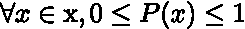

∀这个符号的意思是“为了任何人”。

这意味着对于 x 范围内的每个可能值 *x* (在掷骰子实验的例子中，所有可能值为 1、2、3、4、5 和 6)，结果对应于该值的概率在 0 和 1 之间。概率为 0 表示事件不可能发生，概率为 1 表示您可以确定结果将符合该值。

在骰子的例子中，每个可能值的概率是 1/6，介于 0 和 1 之间。此属性已实现。

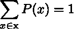

这意味着与每个可能值相关联的概率之和等于 1。

在骰子实验的例子中，我们可以看到有 6 种可能的结果，每种都有 1/6 的概率，总共是 1/6 * 6 = 1。此属性已实现。

# 3.3.2 连续变量和概率密度函数

有些变量不是离散的。它们可以在一定范围内取无限多的值。但是我们仍然需要描述与结果相关的概率。连续变量的概率质量函数的等价物被称为**概率密度函数**。

在概率质量函数的情况下，我们看到 y 轴给出了一个概率。例如，在我们用 Python 创建的图中，得到 1 的概率等于 1/6 = 0.16(查看上面的图)。它是 1/6，因为它是 6 种可能性中的一种。

但是，对于连续变量，我们不能这样做，因为可能性的总数是无限的。例如，如果我们画一个介于 0 和 1 之间的数字，我们有无限多种可能的结果(例如 0.320502304……)。在上面的例子中，我们有 6 种可能的结果，导致大约 1/6 的概率。现在，我们有每个概率等于 1/+ [∞](https://www.infinitysymbol.net/) = 0。这样的功能不会很有用。

因此，概率密度函数的 y 轴不代表概率值。为了得到概率，我们需要计算曲线下的**面积(我们将在下面看到关于曲线下面积的一些细节)。这样做的好处是，它导致了根据一定范围(在 x 轴上)的概率:如果范围增加，曲线下的面积也增加。让我们看一些例子来澄清这一切。**

# 例 4。

假设我们有一个随机变量 x，可以取 0 到 1 之间的值。这是它的概率密度函数:

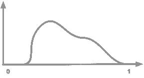

*概率密度函数*

我们可以看到，0 似乎是不可能的(概率在 0 左右)，1 也不是。pic 约为 0.3，这意味着将在该值附近获得很多结果。

通过计算该范围的曲线下面积，可以从某个范围的值之间的概率密度函数中找到概率。例如，绘制 0.5 到 0.6 之间的值的概率对应于以下区域:

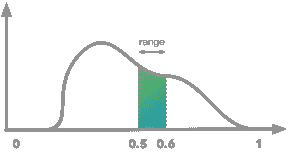

*概率密度函数和曲线下面积在 0.5 到 0.6 之间。*

我们很容易看到，如果我们增加范围，概率(曲线下的面积)也会增加。例如，对于 0.5–0.7 的范围:

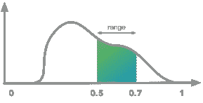

*概率密度函数和曲线下面积在 0.5 到 0.7 之间。*

我们一会儿会看到如何计算曲线下的面积，并得到与特定范围相关的概率。

# 概率密度函数的性质

概率质量函数和概率密度函数之间的这些差异导致概率密度函数的不同性质:

在这种情况下， *p* (x)不一定小于 1，因为**与概率**不对应(概率本身仍需在 0 和 1 之间)。

# 例 5。

例如，假设我们有一个连续的随机变量，取值范围在 0 到 0.5 之间。该变量由均匀分布描述，因此我们将得到以下概率分布函数:

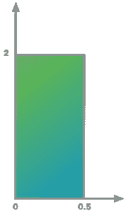

*概率密度函数(均匀分布)。曲线下的面积等于 1 (2 * 0.5)，y 值大于 1。*

我们可以看到 y 值大于 1。概率由曲线下的面积给出，因此它也取决于 x 轴。

🤨如果您想亲自看看，我们将用 Python 再现这个例子。为此，我们将创建一个随机变量 x，它可以随机取 0 到 0.5 之间的值。由于 Numpy 函数`random.uniform()`，将使用均匀分布。该函数的参数是最低值(包括)、最高值(不包括)和样本数。因此`np.random.uniform(0, 0.5, 10000)`将创建 10000 个随机选择为> 0 且≤0.5 的值。

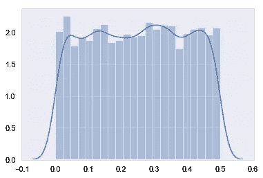

看起来不错！🏄🏽‍♀️

我们可以看到，这个形状看起来像我上面画的那样，所有的 *x* 在 0 到 0.5 之间，y 轴值都在 2 左右。

然而，在这个情节中有一件事很耐人寻味。我们讨论过连续变量，这里我们用条形表示分布。解释和之前一样:我们需要离散化函数来统计每个区间的结果数。实际上，间隔的数量是函数`distplot()`的一个参数。让我们试着使用许多箱子:

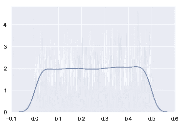

我们可以看到，我们仍然在 2 左右，但可变性比以前更大(条形可以从 1 到 4，而在上一个图中不是这种情况)。知道为什么吗？🤔

💡这是因为由于我们采用了更多的箱，每个箱中的值数量较少，导致估计不太准确。如果这个假设是真的，我们可以通过增加样本数量来减少这种可变性。让我们试试:

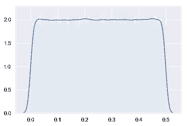

太好了🤸🏼‍♂️

我们现在可以去第二处房产了！

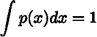

对于概率质量函数，我们已经看到概率之和必须等于 1。这不是概率密度函数的情况，因为概率对应于曲线下的面积，而不是直接对应于 *y* 值。然而，这意味着**曲线下的面积必须等于 1** 。

我们在上一个例子中看到，面积实际上等于 1。由于均匀分布的平方形状，它可以很容易地获得和可视化。因此，可以将高度乘以宽度:2 * 0.5 = 1。

然而，在许多情况下，形状不是正方形，我们仍然需要计算曲线下的面积。让我们看看如何做到这一点！

# 🔧曲线下面积

特定数值范围的函数曲线下的面积可通过函数的**积分**计算。我们会看到，计算函数的积分与计算导数是相反的。这意味着如果你得到一个函数 *f* ( *x* )并计算结果函数*f*’(*x*)的积分，你将得到 *f* ( *x* )。😮

函数在某一点的导数给出了它的**变化率**。描述另一个函数(导数)变化率的函数和曲线下面积之间有什么联系🤔？

先说一个关于导数的点！然后，通过下一个图形示例，它将变得非常清晰。🔮

# 例 6。

我们想模拟车辆的速度。假设函数 *f* ( *x* ) = *x* 在时间(x 轴)的函数中定义了它的速度(y 轴)。

首先，我们将绘制函数 *f* (x)= *x* it 以查看其形状:

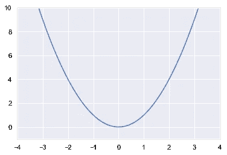

形状是抛物线！它表明速度在开始时缓慢增加，但在恒定的持续时间内增加得越来越多。

我已经创建了一个包含 x 轴所有点的变量 *x* (使用 Numpy 的函数`arange()`)。所以它只是从-10 到 10 的所有值，步长为 0.1。让我们看看前 10 个值。

```
array([-10\. , -9.9, -9.8, -9.7, -9.6, -9.5, -9.4, -9.3, -9.2, -9.1])
```

这里是 Numpy 的`arange()`函数的[文档](https://docs.scipy.org/doc/numpy-1.15.0/reference/generated/numpy.arange.html)。

在我们的例子中，函数定义了车辆的速度与时间的函数关系，因此负值没有意义。让我们只取 x 轴的正的部分，以避免负的时间(我们会说 0 是实验的开始)。

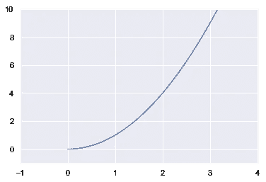

好，这样更好！

这个函数的导数是 *f* '(x)=2 *x* 。欲了解更多关于衍生规则的信息，请点击查看[。](https://www.mathsisfun.com/calculus/derivatives-rules.html)

下面是一个*f*’(*x*)的情节:

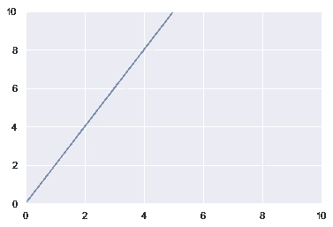

# 🔧导数

导数的这个表示表示加速度。 *f* ( *x* )描述了车辆的速度与时间的函数关系，导数 *f* '( *x* )表示速度与时间的函数关系的**变化率**，即加速度。

我们可以看到车辆的加速度随时间线性增加。导数告诉我们，车速的变化率是 2 *x* 。例如，当 *x* =0 时，变化率等于 2 * 0 = 0，因此速度不变。当 *x* =3 时，变化率为 2 * 3 = 6。这意味着此时，时间增加 1，速度增加 6。

总而言之，函数的导数给出了它的变化率。在我们的例子中，变化率是另一个函数( *f* '( *x* ) = 2 *x* )，但是它可以是常数(变化率总是相同的，例如 *f* '( *x* )=2)或者是二次函数(例如*f*'(*x*)=*x*)。

# 🔧积分

能够计算导数是非常强大的，但是有没有可能反过来:从变化率到变化本身😮。哇，太酷了！答案由函数的积分给出。

对 *f* '( *x* )的积分还给我们 *f* ( *x* )。符号如下:

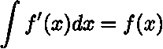

这意味着我们拿 *f* '( *x* )去拿回 *f* ( *x* )。这里的符号 *dx* 意味着我们对 *x* 进行积分，也就是说，我们对由 *y* 加权的切片求和(参见这里的[和](https://www.mathsisfun.com/calculus/integration-introduction.html))。

如果我们再举一个例子:

我们可以看到有一个区别:增加了一个常数 *c* 。这是因为无穷多个函数可以给出导数 2 *x* (例如 *x* + 1 或者*x*+294……)。我们丢失了一些信息，而且无法恢复。

现在，图形解释(我喜欢这个💛):我们已经看到 2 *x* 是描述函数 *x* 的变化率(斜率)的函数。现在如果我们从 *f* '( *x* )到 *f* ( *x* )我们可以看到 *f* '( *x* )曲线下的面积对应于 *f* ( *x* ):

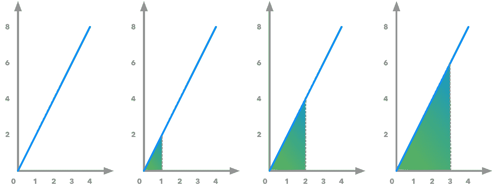

*f’(x)的曲线下面积对应 f(x)。这说明了积分和导数是如何逆向运算的。*

该图显示了函数*f*'(*x*)= 2*x*，我们可以看到曲线下的面积呈指数增长。该区域代表不同的范围([0–0]、[0–1]、[0–2]、[0–3])。我们可以计算曲线下的面积(使用勾股定理并除以 2，因为面积是半平方)并找到以下值:0，1，4，9…这对应于原函数*f*(*x*)=*x*！🎺

# 结论

总而言之，我们已经看到了什么是随机变量，以及离散变量(概率质量函数)和连续变量(概率密度函数)的概率分布是如何表示的。我们还学习了联合概率分布的概念和基础数学工具，如导数和积分。

现在，您拥有了深入研究概率的所有工具。下一部分将是 3.4 到 3.8 章。我们将看到我们称之为边际和条件概率、链式法则和独立性的概念。

如果你想继续关注: [Twitter](https://twitter.com/_hadrienj) ， [Github](https://github.com/hadrienj/deepLearningBook-Notes) ， [Linkedin](https://www.linkedin.com/in/hadrienj/) 。

我希望这能帮助你对这一切有更好的直觉！如有任何问题/注意事项/更正，请随时联系我！😀

*最初发布于*[https://hadrienj . github . io/posts/Probability-Mass-and-Density-Functions/](https://hadrienj.github.io/posts/Probability-Mass-and-Density-Functions/)