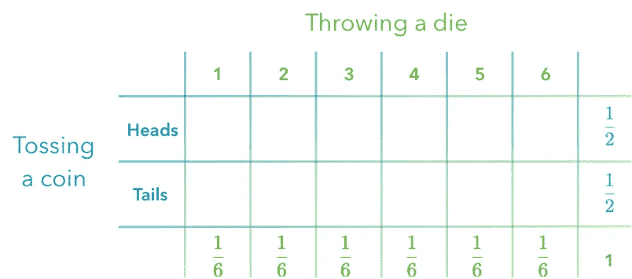
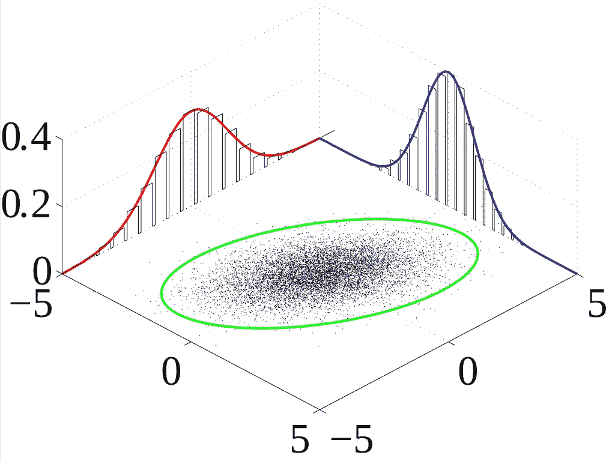
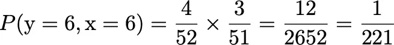

# 深度学习丛书 3.4 和 3.5 边际和条件概率

> 原文：<https://towardsdatascience.com/deep-learning-book-series-3-4-and-3-5-marginal-and-conditional-probability-8c6239e453b8?source=collection_archive---------21----------------------->


The sum rule allows to calculate marginal probability from joint probability.

该内容是古德费勒(Goodfellow，I .)、本吉奥(Bengio，y .)和库维尔(a .)(2016 年)的深度学习书籍中关于概率的第三章系列的一部分。它旨在提供关于数学理论的直觉/绘图/python 代码，并作为我对这些概念的理解而构建。

**Github** :相应的 Python 笔记本可以在这里找到[。](https://github.com/hadrienj/deepLearningBook-Notes/tree/master/3.4–3.5%20Marginal%20and%20Conditional%20Probability/3.4%20-%203.5%20Marginal%20and%20Conditional%20Probability.ipynb)

我们已经在[上一篇](https://hadrienj.github.io/posts/Probability-Mass-and-Density-Functions/) / [笔记本](https://github.com/hadrienj/deepLearningBook-Notes/tree/master/3.1-3.3%20Probability%20Mass%20and%20Density%20Functions)关于深度学习书的 3.1 到 3.3 章学习了概率的基础知识。我们已经学习了什么是随机变量，概率质量函数或概率密度函数。我们的目标也是为了获得对非常常用的工具的更多直觉，比如导数、曲线下面积和积分。

在这第二篇关于边际和条件概率的文章/笔记中，你将学习离散和连续变量的联合和边际概率。然后，我们会看到条件概率的概念，以及相依事件和独立事件的区别。这些都对应了深度学习这本书的 3.4 章和 3.5 章。

我们将坚持概率中使用的数学符号。你会发现这是一种表达思想的富有表现力和综合性的方式！

# 3.4 边际概率

在前面的文章中，我们已经看到了一次一个随机变量的概率。在某些情况下，查看多个事件的概率可能会很有趣。例如，我们会问:“如果我掷硬币两次，恰好得到一个‘正面’和一个‘反面’的概率是多少？要回答这类问题，我们需要考虑多个事件。

# 注释

让我们从符号的一些细节开始。像往常一样，确保每一个数学符号都清晰明了是很重要的。下图总结了我们将在本文中使用的符号🔧：


Dictionary of mathematical expressions and their corresponding English traductions.

上一篇帖子我们已经看到，P(x= *x* ，y= *y* )是指 x 取特定值*x*和 y 取特定值 *y* 的**联合概率**。关于符号的详细信息，您也可以参考上一篇文章。你也可能遇到交集符号:∩。例如，P(x ∩ y)对应于 x 和 y 同时出现的概率。

# 例 1。

让我们从一个处理边际概率概念的例子开始。

在这个实验中，我们抛硬币(第一个事件)和掷骰子(第二个事件)。我们看每个事件的概率。例如，得到“正面”的概率是 1/2。掷出 1 的概率是 1/6。下图分别显示了每个事件的每个结果的概率:



The probabilities of two events (tossing a coin and throwing a dice) are represented individually.

你可能会对我在表格中显示概率感到惊讶。实际上，我把问题倒过来了:这些概率就是**边际概率**。“marginal”这个名字提醒我们可以把它们写在表格的空白处。

问题是:我们可以写在表格中间的其他概率是什么？它们是**联合概率**。它是获得两种特定结果的概率:


Marginal probability. The probabilities of two events (tossing a coin and throwing a dice) are represented. The marginal probabilities are in the ‘margin’ and correspond to the probabilities of each event alone.

例如，我们可以看到，得到 1 和“头”的概率等于 1/6 * 1/2 = 1/12。**边际概率**表示在边际上，对应于变量子集的概率分布。

**求和规则**

有时，您知道事件的联合概率，并需要从中计算边际概率。边际概率是用**求和规则**计算出来的。如果你回头看最后一张表，你可以看到写在页边空白处的概率是相应行或列的概率之和。

从数学上来说，我们有:


我们将研究这个方程的细节。

第一，提醒字体重要，表示不同的东西。x 是离散随机变量(例如，对应于掷骰子)，x*是随机事件的结果(例如，一个可能的骰子结果:1、2、3、4、5 或 6)。同样，y 是随机变量(假设对应于掷硬币)，而 *y* 是 y 的结果(“正面”或“反面”)。*


-第一个蓝色部分可以读作“对于 x 中的所有 *x* ”。这里，这是方程为真的一个条件。因此，只有当结果 *x* 在 x 的可能结果中时，表达式才为真。例如，如果随机变量 x 对应于掷骰子，我们知道 *x* 可以取值 1、2、3、4、5 或 6。只有当 *x* 实际上取这些值中的一个时，该等式才成立。


-绿色部分是 x 取特定值 *x* 的概率。例如，仍然在骰子实验中，P(x=6)对应于掷出 6 的概率。


-橙色的 sum 符号表示我们将对该符号之后的元素求和(这里 P(x= *x* ，y= *y* ))。sum 符号下的小 *y* 表示我们对 y (P(x= *x* ，y=1)，P(x= *x* ，y=2 等所有可能的值求和。).


-红色部分是 x 取值*x*y 取值 *y* 的概率。

那么这个方程说明了什么呢？

这意味着 x= *x* 的概率等于在每个可能的 *y* 上对应于 x= *x* 的概率之和。下面的例子将阐明这种说法。

# 例 2。

和上一个例子一样，我们将做一个投掷骰子和硬币的实验。上表的中间给出了 x 和 y 取特定值的概率，也就是说，我们得到了投掷和投掷的特定结果。例如，掷出 1 并掷出“正面”的概率是 P(x=1，y=“正面”)= 1/12。


Joint probability to toss a head and to throw a 1.

我们可以使用前面的等式


假设我们想计算掷出 1 的概率:


这是 x=1 时 y 上的概率之和。有两种可能:我们可以有 x=1 和 y= '正面'或者 x=1 和 y= '反面'。用更数学的术语来说，我们可以说:


这有意义吗？由于 y 的每一种情况都被考虑在内，这只是掷出 1 的概率。这叫做**边际概率**。

我希望现在注释清楚了。如果你还没有掌握这些数学符号，不要担心:这只是一个习惯问题💪🏼。你会发现这是一种有用的综合思维方式。

# 连续变量

同样的技巧可以用于连续变量，但是我们需要用积分代替求和。提醒一下，对于连续变量，变量取某个特定值的概率接近$0$因为有无限的可能性(参见[上一篇](https://hadrienj.github.io/posts/Probability-Mass-and-Density-Functions/) / [笔记本](https://github.com/hadrienj/deepLearningBook-Notes/tree/master/3.1-3.3%20Probability%20Mass%20and%20Density%20Functions))。

# 例 3。

假设我们有两个变量 x 和 y 的联合概率密度函数，我们想计算一个边际概率。首先，我们需要三个维度来表示概率密度函数:变量 x 的值、变量 y 的值以及与获得这两个值相关联的概率。

例如，让我们用正态分布来表示两个变量 x 和 y。Numpy `random.normal()`(参见 [doc](https://docs.scipy.org/doc/numpy/reference/generated/numpy.random.normal.html) )中的函数创建一个从正态分布中提取的值的向量。第一个参数是分布的平均值，第二个是标准偏差，第三个是样本数。

例如，`np.random.normal(0, 1, 1000)`创建一个长度为 1000 的向量:

```
np.random.seed(123)
x = np.random.normal(0, 1, 1000)
x.shape
```

这返回`(1000,)`。

如果我们取这个向量中所有值的平均值，我们会得到一个接近 0 的值:

标准差告诉我们单个值是否或多或少偏离了平均值。

让我们创建两个连续分布:

```
np.random.seed(123)
x = np.random.normal(0, 1, 1000)
y = np.random.normal(0, 1, 1000)sns.distplot(x)
plt.title(‘x’)
plt.xlim(-4, 4)
plt.show()sns.distplot(y)
plt.title(‘y’)
plt.xlim(-4, 4)
plt.show()
```


让我们试着理解这些图到底代表了什么。我使用了 Seaborn 包中的函数`distplot`。y 轴给出了变量取 x 轴给出的值的概率密度**。你可以在[上一篇文章](https://hadrienj.github.io/posts/Probability-Mass-and-Density-Functions/) / [笔记本](https://github.com/hadrienj/deepLearningBook-Notes/tree/master/3.1-3.3%20Probability%20Mass%20and%20Density%20Functions)中找到更多关于概率密度函数的细节。简而言之，对于 x 轴的某个范围，必须计算曲线下的面积，以获得在该范围内获得值的概率。**

那么，边际概率呢？如果想得到 x 的边际概率，需要得到概率密度函数的曲线下沿 y 轴的**面积。您可以想象我们只从 y 轴(或该轴上的投影)看 3D 图，并获得曲线下的面积。**

对于离散变量 x 和 y，我们已经看到边际概率 P(x)是 y 的每个值的概率之和。现在我们的变量是连续的，我们必须使用**积分**，但原理是相同的:

-为了计算边际概率 P(x)，我们计算变量在 x 轴上投影的曲线下的面积。

-为了计算边际概率 P(y)，我们计算变量在 y 轴上投影的曲线下的面积。



Probability density functions of two gaussian variables — [source](https://en.wikipedia.org/wiki/Marginal_distribution).

当我们知道联合概率分布时，这用于恢复一个变量的概率分布。

这可以用下面的等式来表示:


和


关于整合的更多解释，你可以看看这个[帖子](https://hadrienj.github.io/posts/Probability-Mass-and-Density-Functions/) / [笔记本](https://github.com/hadrienj/deepLearningBook-Notes/tree/master/3.1-3.3%20Probability%20Mass%20and%20Density%20Functions)。方程式末尾小 *d* 后面的变量表示用于积分的变量。在第一个方程中，我们对 y 积分，这意味着我们把 x 看作一个常数。我们在第二个等式中做相反的事情。

# 3.5 条件概率

条件概率是指给定一个事件发生另一个事件的概率。

# 从属和独立事件

首先，区分依赖事件和独立事件非常重要！这两种情况下的直觉都有点不同。

**独立事件的例子:骰子和硬币**

在这个例子中，我们做了一个扔骰子和硬币的实验。我们将调用两个随机变量来描述这些事件，x 对应于掷骰子，y 对应于掷硬币。

我们可以问的一个问题是:掷骰子得到 3，掷硬币得到 1 的概率是多少？

我们可以看到这两个事件是独立的，因为我们不期望一个事件对另一个事件有任何影响。

**相关事件示例:一副牌中的两张牌**

在这个例子中，我们将得到一副牌中的两张牌而不替换。当我们拿第一张牌(所有 52 张牌都在这副牌中)和拿第二张牌(现在有 51 张牌，少了一张)时，概率是不同的。这意味着事件是相关的:第一次抽奖的结果将影响第二次抽奖的概率。

我们可以问的一个问题是:当我们第一次抽中 6 时，第二次抽中 6 的概率是多少？

# 注释


Conditional probability.

下面介绍一些新的记法:P(y= *y* | x= *x* 描述了**条件概率**:是给定随机变量 x 取特定值 *x* 的情况下，随机变量 y 取特定值*y*的概率。它不同于 P(y= *y* ，x= *x* )对应的是随机变量 y 得到结果 *y* 和随机变量 x 得到结果 *x* 的概率，在条件概率的情况下，与随机变量 x 相关联的事件已经产生了它的结果( *x* )。

在数学上，条件概率和联合概率之间有一个方便的关系:


我们来啰嗦一下，用通俗易懂的英语把等式转换一下:

假定随机变量 x 取值 *x* ，随机变量 y 取值 *y* 的概率是两个事件发生的概率(y 取值*y*x 取值 *x* )与 x 取值 *x* 的概率之比。

换个方向看可能更直观:


可以这样理解:要计算两个事件发生的概率，我们得取第一个事件发生的概率(P(x=x)乘以给定第一个事件发生的情况下第二个事件发生的概率(P(y= *y* | x= *x)* )。清楚了吗？

# 概率倍增

这最后一个解释引出了一个问题。我们用概率乘法(P(x= *x* )乘以 P(y= *y* | x= *x* ))来表示多个事件发生的概率(P(y= *y* ，x= *x* )。让我们看看为什么这是有意义的。


The probability is the ratio between the number of successful outcomes over the total number of outcomes.

以两个独立的事件为例:我们投掷硬币两次(第一次对应于第一个事件，第二次对应于第二个事件)，我们希望计算得到两个“正面”的概率。我们知道，每次试验得到“正面”的概率是 1/2。

为了理解为什么必须使用概率乘法，我们需要理解每个事件的概率是多少。先来关注第一个事件，第一次抛硬币。概率 1/2:1 对应于“成功”结果的数量(即得到一个“头”)。分母(2)对应于可能性的总数。可能的结果是“正面”或“反面”，所以有两种结果。这就导致了我们的概率 1/2。

如果我们考虑这两个事件，这是所有可能的结果:

*   头和头
*   正面和反面
*   “反面”和“正面”
*   “尾巴”和“尾巴”

我们仍然有 1 个成功结果(“正面”和“正面”)，并且有 4 个可能的结果。因此，得到“正面”和“正面”的概率是 1/4。

诀窍就在这里。要得到可能结果的总数，我们只需将每个事件的结果数相乘。在这种情况下是 2 * 2。如果我们将事件概率相乘，我们得到:1/2 * 1/2 = 1/4。

为了确保条件概率非常清楚，我们将举一个独立和相关事件的例子。此外，独立概念的更多细节将在 3.7 中解释。

我们将从独立事件的情况开始。

# 例 4。

首先，让我们回顾一下我们需要的所有数学符号。P(x= *x* )是变量 x 取状态 *x* 的概率。例如，P(x=3)对应于在骰子上掷出 3 的概率。同理，P(y= *y* )是随机变量 y 取值 *y* 的概率。例如，P(y='heads ')对应于得到' head '的概率。

P(y= *y* ，x= *x* )是这些事件的联合概率。例如，P(x=3，y=“正面”)是在骰子上掷出 3 并在硬币上得到“正面”的概率。对于这个例子，假设我们知道 P(x=3，y='heads')=1/12。

P(y= *y* | x= *x* )对应于给定 x= *x* 时 y= *y* 的概率。因此，这是一个条件概率。例如，P(y= '正面' | x=3)对应于我们已经在骰子上掷出 3 的情况下得到正面的概率。

注意 P(y='heads' | x=3) = P(y='heads ')，因为这些事件是独立的。这意味着 x 的概率对于 y 的任何结果都是一样的。

在我们的示例中，我们有:


我们可以看到确实 P(y = ' heads ' | x = 3)= P(y = ' heads ')= 0.5。

我们将用一个依赖事件的例子来结束这篇文章。

# 例子

在这个例子中，我们抽取两张没有替换的卡片。第一步是运用我们所学的知识，用数学符号写出问题。我们称 x 为对应于第一次抽取的变量，y 为对应于第二次抽取的变量。随机变量 x 和 y 都可以取值 1、2、3、4、5 或 6。这些是变量的可能结果。

我们已经看到，计算条件概率的一般公式是:


假设我们在第一次抽牌时抽了 6，我们想知道在第二次抽牌时抽 6 的概率。我们可以这样写:P(y=6 | x=6)。

我们需要:

-第一次抽中 6 的概率(P(x=6))

-在第一次**和第二次**中均抽到 6 的概率(P(y=6，x=6))

在第一次抽牌时，抽到 6 的概率是 4/52(52 张牌中有 4 张 6)，所以 P(x=6)=4/52。抽对 6 的概率是:



我们要计算的条件概率是:


这意味着，一旦我们已经拿到了一张 6，我们有 13 次机会(几乎是 6%)拿到 6。我们可以注意到它对应的是 3/51(更多细节在下一章)。

# 结论

我们已经看到，边际概率是指在多个事件的实验中，单个事件发生的概率。在这些边际概率和表示两个事件发生的概率的联合概率之间存在关系。

我们也谈到了条件概率。它对应于特定条件下的概率，例如，在一副牌中得到一个 6 的概率，知道我们已经得到一个 6 并且没有替换它。我们研究了非独立事件和独立事件的情况。

我希望这篇文章能帮助你使用和阅读这些概念背后的数学符号。