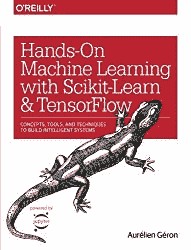
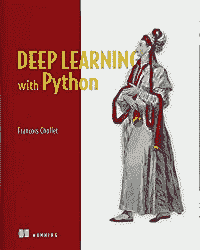
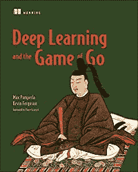
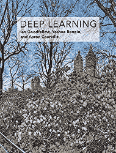

# 2020 年你应该读的深度学习书籍

> 原文：<https://towardsdatascience.com/deep-learning-books-you-should-read-in-2020-7806048c1dc5?source=collection_archive---------11----------------------->

## 现在关于深度学习最好的书是什么？

随着机器学习和数据科学的兴起，它们被应用到每一个地方，并改变着每一个行业，难怪机器学习方面的专家会获得丰厚的报酬和很多关注。如果你已经读过几本[数据科学](/data-science-books-you-should-read-in-2020-358f70e1d9b2)和[机器学习书籍](/machine-learning-books-you-should-read-in-2020-344b44d9a11e)，那么是时候关注深度学习了:神经网络、Keras、Tensorflow、Scikit-learn 等。

Deep Learning books to read in 2020

# 入门水平

如果你刚刚进入机器学习领域，有一本书是我不能不推荐的。简直太棒了！

[用 Python 介绍机器学习](https://www.amazon.com/gp/product/1449369413/ref=as_li_tl?ie=UTF8&camp=1789&creative=9325&creativeASIN=1449369413&linkCode=as2&tag=petacrunch-20&linkId=8669cacfe298d25c2832d9062642dd44)是机器学习和深度学习的顺利入门。它没有假设任何关于编码和 Python 的知识，它介绍了机器学习的基本概念和应用，通过例子讨论了各种方法。那是我见过的最适合入门级深度学习工程师的书。

# 中间能级

如果你已经完成了几个机器学习项目，你对 Keras 或 Tensorflow 有所了解，你使用过 scikit-learn，那么我有两条建议给你。

[使用 Scikit-Learn 和 TensorFlow 的动手机器学习](https://www.amazon.com/gp/product/1491962291/ref=as_li_tl?ie=UTF8&camp=1789&creative=9325&creativeASIN=1491962291&linkCode=as2&tag=petacrunch-20&linkId=8d26b4a376e2e4f6d50deec487694bce)涵盖了深度学习的所有基础知识，工作代码和充满色彩的惊人可视化。读起来真的很有趣，它是一个完整的 400+页的指南，通过分类，聚类，神经网络和其他方法，有很多例子可以自己尝试。

[使用 Python 进行深度学习](https://www.amazon.com/gp/product/1617294438/ref=as_li_tl?ie=UTF8&camp=1789&creative=9325&creativeASIN=1617294438&linkCode=as2&tag=petacrunch-20&linkId=fa7304c5324df649a4ba536bd74927d2)就是使用 Keras 作为深度学习的主要框架。Keras 的创建者 Francois Chollet 对这种易于使用且高效的框架做了很好的概述。从 MNIST 到 CNN，从计算机视觉到 NLP。都在一个地方，以简洁的形式给出。

[深度学习和围棋游戏](https://www.amazon.com/gp/product/1617295329/ref=as_li_tl?ie=UTF8&camp=1789&creative=9325&creativeASIN=1617295329&linkCode=as2&tag=petacrunch-20&linkId=0e4c17bcda09e79de9b186f2d8c26ffb)的目标是使用围棋作为指导示例，向您教授神经网络和强化学习。在这本书的过程中，你将学习如何创建你自己的机器人/代理人来玩这个游戏，这非常棒。

# 专家级

[如果你对深度学习很认真，深度学习](https://www.amazon.com/gp/product/0262035618/ref=as_li_tl?ie=UTF8&camp=1789&creative=9325&creativeASIN=0262035618&linkCode=as2&tag=petacrunch-20&linkId=00701393c949f16bfd3a89d9c3240b35)是必读书。它没有给出代码，假设您在这个阶段能够自己编写所有代码，但是它给出了为什么某些层工作得更好、如何优化超参数、使用什么网络架构等等的解释。它给出了深度学习的最新描述。

[机器学习:概率视角](https://www.amazon.com/gp/product/0262018020/ref=as_li_tl?ie=UTF8&camp=1789&creative=9325&creativeASIN=0262018020&linkCode=as2&tag=petacrunch-20&linkId=a52c63d00ba9f01f29e1db95d6b4c171)是关于机器学习的数学视角。很难阅读，但当你建立深度学习模型时，对于你可能遇到的任何数学问题来说，这是一个很好的参考。作为百科全书式的参考资料，它非常有用。仅供专家使用。

如果您想要更多书籍推荐，请参阅以下列表:

*   [人工智能书籍](/artificial-intelligence-books-you-should-read-in-2020-4d3cecd21efa)
*   [数据科学书籍](/data-science-books-you-should-read-in-2020-358f70e1d9b2)
*   [机器学习书籍](/machine-learning-books-you-should-read-in-2020-344b44d9a11e)
*   [启动书](/startup-books-you-should-read-in-2020-ba8684000128)

 [## 加入我的深度学习时事通讯

### 让我们保持联系。每周或双周电子邮件。](https://creative-producer-9423.ck.page/c3b56f080d) 

Data Science Job

最后，如果你想了解成为一名数据科学家意味着什么，那么看看我的书[数据科学工作:如何成为一名数据科学家](https://amzn.to/3aQVTjs)，它将指导你完成这个过程。