# 深度学习:如何使用 CNN 构建狗检测器和品种分类器？！

> 原文：<https://towardsdatascience.com/deep-learning-build-a-dog-detector-and-breed-classifier-using-cnn-f6ea2e5d954a?source=collection_archive---------4----------------------->

这项工作是 Udacity 的数据科学顶点项目的一部分。

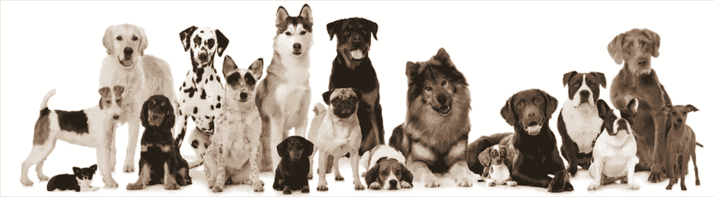

**概述:**

你可能会认为在图像中识别狗的品种对你来说是一件容易的事情。你是对的！找到具有最小类间差异的犬种配对可能并不困难，例如，卷毛寻回犬和美国水猎犬。

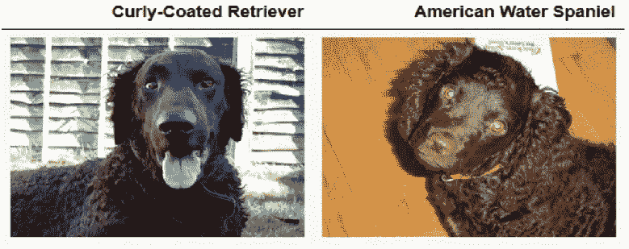

但是，这两个呢？！

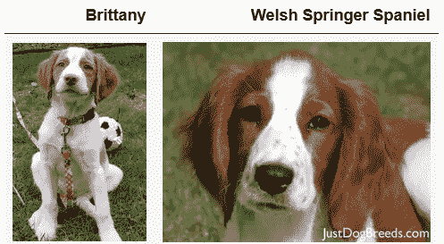

哼，没那么容易！

在最近十年，使用深度学习技术和几行 python 代码来区分图像中的狗品种要容易得多。在这篇博客中，我将带你从头开始创建卷积神经网络(CNN ),并利用 ImageNet 上最新的图像分类技术。这个模型可以作为现实世界和用户提供的图像的移动或 web 应用程序的一部分。给模型一个图像，它确定是否有狗，并返回估计的品种。如果图像是人类，它将返回最相似的狗品种。你可以在我的 [GitHub repo](https://github.com/RahilBA/Dog-Breed-Classifier) 里找到代码。

**人体探测器**

我使用 [OpenCV 的](https://docs.opencv.org/trunk/db/d28/tutorial_cascade_classifier.html)实现的基于 Haar 特征的级联对象分类器来检测人脸。级联函数是一种基于机器学习的方法，在许多带有正面(有人脸)和负面(没有任何人脸)标签的图像上进行训练。detectMultiScale 获取所有面的坐标，然后将它们作为矩形列表返回。但是不要忘记在使用之前将 RGB 图像转换成灰度。

下面的 face_detector 函数计算照片中有多少张人脸:

```
def face_detector(img_path):
    img = cv2.imread(img_path)
    gray = cv2.cvtColor(img, cv2.COLOR_BGR2GRAY)
    faces = face_cascade.detectMultiScale(gray)
    return len(faces) > 0
```

人脸检测器的性能在 100 个人和狗的图像样本上进行评估。这个检测器从人类数据中识别所有的人脸，但是在狗数据集上表现不佳。它有大约 11%的假阳性。

**狗探测器**

是时候使用另一个在狗数据集上表现更好的检测器了。我在 Keras 的 ImageNet 上使用了预训练的 ResNet50 权重，该权重在包含 1000 个标签的超过 1000 万张图像上进行训练。

在下面的代码中，paths_to_tensor 获取图像的路径，并返回一个可用于 ResNet50 的 4D 张量。但是，Keras 中的所有预训练模型都需要额外的处理，如归一化，这可以通过使用 preprocess_input 来完成。如果在存储于 img_path 的图像中检测到狗，dog_detector 函数返回“True”。

```
from keras.preprocessing import image                  
from tqdm import tqdm
from keras.applications.resnet50 import preprocess_input, decode_predictionsdef path_to_tensor(img_path):
    img = image.load_img(img_path, target_size=(224, 224)
    return np.expand_dims(x, axis=0)def paths_to_tensor(img_paths):
    list_of_tensors = [path_to_tensor(img_path) for img_path in       tqdm(img_paths)]
    return np.vstack(list_of_tensors)def ResNet50_predict_labels(img_path):
    img = preprocess_input(path_to_tensor(img_path))
    return np.argmax(ResNet50_model.predict(img))def dog_detector(img_path):
    prediction = ResNet50_predict_labels(img_path)
    return ((prediction <= 268) & (prediction >= 151))
```

为了评估狗检测器，我检查了 ImageNet 上 RestNet50 的预测类别是否属于狗品种类别。狗检测器表现良好，没有任何假阴性。

既然我们在图像中认出了狗，那么是时候预测狗的品种了。但首先我们应该更详细地分析训练数据集:

**数据集**

该数据集共有 133 个不同品种的 8，351 幅图像。可供模型学习的图像数量大约是每种 62 张，这对于 CNN 来说可能还不够。在这个现实世界的设置中，图像有不同的分辨率，大小，照明条件，也有一些图像有一只以上的狗。通过比较相同标签图像的像素强度分布，我注意到，例如，American_staffordshire_terrier 的照片在对比度、大小和亮度方面有所不同。这两幅图像中的红色、绿色和蓝色通道的强度值分布不同。数据的这种变化使得给狗分配品种的任务变得更加具有挑战性。

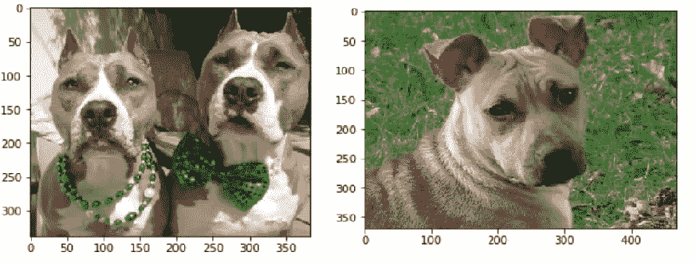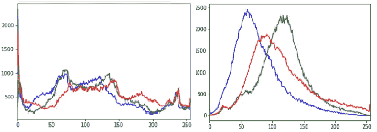

训练数据中品种标签的分布显示数据略有不平衡，平均每类 53 个样本。大多数品种在训练、有效和测试数据集中具有几乎相同的分布。

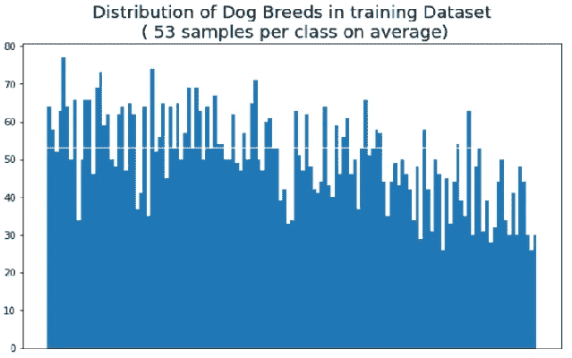

此外，作为数据处理的一部分，我通过将每个图像中的每个像素除以 255 来对图像进行去标度。

**指标**

由于我们在这里处理的是一个多分类问题，并且数据略有不平衡，所以我使用了准确性评估度量和分类交叉熵成本函数。但是，首先，标签必须是分类格式。目标文件是与这种格式的图像相关的编码狗标签列表。如果预测的概率导致与实际不同的标签并导致更高的准确性，则这种多类对数损失会惩罚分类器。一个完美的分类器的损失为零，准确率为 100%。

**对狗的品种进行分类**

这里我用 Relu 激活功能在 Keras 中创建了一个 4 层 CNN。该模型从 224 *224*3 个颜色通道的输入图像开始。这个输入图像很大但很浅，只有 R、G 和 b。卷积层通过减少宽度和高度来挤压图像，同时逐层增加深度。通过添加更多的过滤器，网络可以学习照片中更重要的特征，并更好地进行归纳。

我的第一层产生 16 个特征通道的输出，作为下一层的输入。过滤器是 16 个方阵的集合，输出特征图是输入特征和内核的加权和。在训练过程中，通过 ImageNet 数据计算内核的权重，它所做的是滑过输入特征映射并产生输出特征。因此，输出特征的形状取决于内核和输入特征的大小。

查看本页可以更好地理解 CNN 是如何工作的。

我认为输入和输出特征具有相同的大小是最理想的。所以，我决定使用相同的填充去图像的边缘，所有的层都用零填充，步幅为 2。我还使用了 max-pooling 操作来确保我不会丢失图片中的信息，同时降低过度拟合的可能性。最大池取一个位置周围的最大像素。经过四个卷积层和最大池，然后是两个完全连接的层，我训练了分类器。卷积层提取图像特征，分类器根据之前获得的特征进行分类。下图显示了顶部的特征块序列和分类器如何从原始图像传输信息并预测所需的目标值。

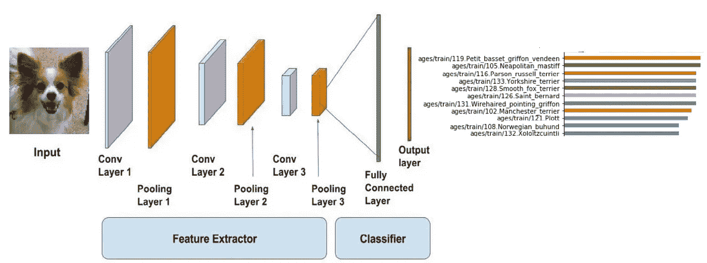

CNN 的模型架构是:

```
from keras.layers import Conv2D, MaxPooling2D, GlobalAveragePooling2D
from keras.layers import Dropout, Flatten, Dense
from keras.models import Sequential# Model Architecture
model = Sequential()model.add(Conv2D(filters=16, kernel_size=2, padding='same', activation='relu', input_shape=(224,224,3)))
model.add(MaxPooling2D(pool_size=2)) model.add(Conv2D(filters=32, kernel_size=2 , padding='same' , activation='relu'))
model.add(MaxPooling2D(pool_size=2))model.add(Conv2D(filters=64 , kernel_size=2 , padding='same' , activation='relu'))
model.add(MaxPooling2D(pool_size=2))
model.add(Dropout(0.4))model.add(Conv2D(filters=128 , kernel_size=2 , padding='same' , activation='relu'))
model.add(MaxPooling2D(pool_size=2))
model.add(Dropout(0.4))model.add(Flatten())
model.add(Dense(512, activation='relu'))
model.add(Dropout(0.4))
model.add(Dense(133,activation='softmax'))model.summary()
```

由于没有足够的图像数据来训练模型，从头开始创建的模型表现不佳，精度为 12%。一个潜在的改进是数据扩充，以添加更多的数据。该策略通过随机填充、裁剪和旋转图像来修改图像。它还使模型能够更好地概括，而不会过度拟合，当然，使用适当的参数。

正如前面提到的，在这样的小数据上训练从头制作的 CNN 分类器会导致欠拟合，并且有这么多层，参数调整经常会导致过拟合。因此，是时候利用迁移学习预训练网络来创建 CNN 品种分类器了，尽管这些模型并不是为这项任务而明确创建的。但是这些网络的一个优点是，它们是在大数据集上训练的，ImageNet 有数百万张带标签的图像，并且达到了 90%的准确率。此外，它们可以推广到 ImageNet 之外的其他图像。

我在 Keras 中实现了预训练的模型，如 VGG、Inception V3 和 ResNet，并比较了它们的准确性。我将它们用作固定的特征提取器，并通过使用随机梯度下降、0.001 的学习率和内斯特罗夫动量最小化交叉熵损失函数来微调全连接层。同样，最后一个完全连接的层被更改为狗的品种数，133。然后，每个模型被训练 25 个时期，每批 20 个样本。

```
# model Architecture
Xception_model = Sequential()
Xception_model.add(GlobalAveragePooling2D(input_shape=(train_Xception.shape[1:])))
Xception_model.add(Dense(133, activation='softmax'))checkpointer = ModelCheckpoint(filepath='saved_models/weights.best.Xception.hdf5', verbose = 0, save_best_only=True)sgd = SGD(lr= 1e-3 , decay=1e-6, momentum=0.9 , nesterov = True)# compile the model
Xception_model.compile(loss='categorical_crossentropy', optimizer=sgd, metrics=['accuracy'])# Training the model 
Xception_model.fit(train_Xception , train_targets, 
               validation_data = (valid_Xception, valid_targets),
               shuffle = True,
               batch_size = 20,
               epochs = 25,
               verbose = 1)
```

Xception 模型优于所有其他模型，准确率为 86%，测试数据损失为 0.4723。总的来说，基于盗梦空间的模型在 ImageNet 上略胜 VGG 和雷斯网；此外，它的计算效率更高。可以通过应用更合适的微调技术来提高模型性能。例如，训练与特定狗特征相关的几个顶层，并冻结检测更一般特征的其他层。因为它们已经在 ImageNet 权重中被捕获。

**结果**

现在，是时候将检测器和异常预测繁殖结合起来，并在不同大小和分辨率的几幅图像上测试它们了。如前所述，准确性被选为该分类器的模型评估指标。该代码获取一个图像路径，首先确定图像是狗、人还是两者都不是，然后返回预测的相似品种:

```
def Xception_predict_breed (img_path):
    bottleneck_feature = extract_Xception(path_to_tensor(img_path)) 
    predicted_vector = Xception_model.predict(bottleneck_feature) 
    return dog_names[np.argmax(predicted_vector)]def display_img(img_path):
    img = cv2.imread(img_path)
    cv_rgb = cv2.cvtColor(img, cv2.COLOR_BGR2RGB)
    imgplot = plt.imshow(cv_rgb)
    return imgplotdef breed_identifier(img_path):
    display_img(img_path)
    prediction = Xception_predict_breed(img_path)
    if dog_detector(img_path) == True:
        print('picture is a dog')
        return print (f"This dog is a {prediction}\n")

    if face_detector(img_path) == True:
        print('picture is a human')
        return print (f"This person looks like a {prediction}\n")

    else:
        return print('The picture is neither dog nor human')
```

结果表明，该模型运行良好。例如，它可以在测试数据中预测 American_staffordshire_terrier，同时对不同亮度、大小和缩放级别的图像进行训练。

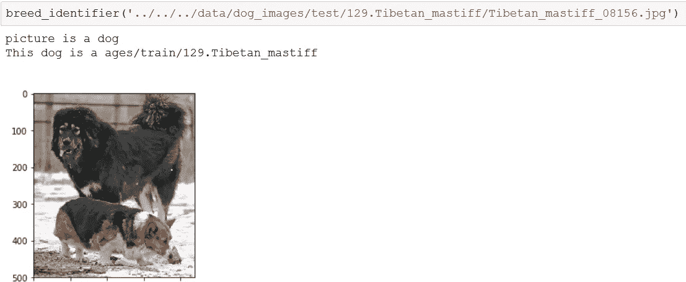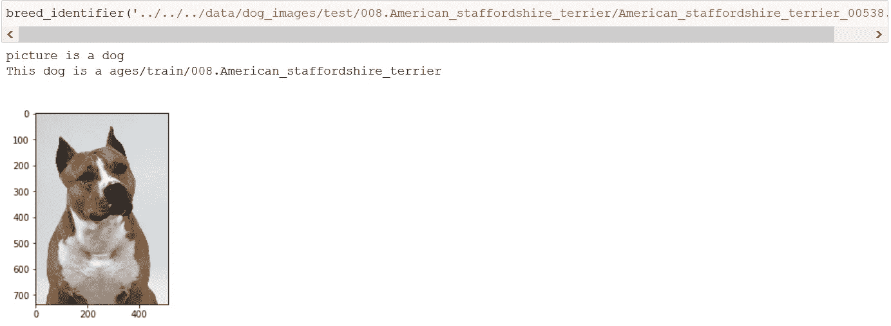

下面是在人类图像上的结果:

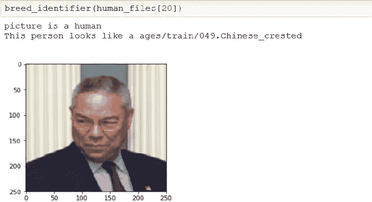

测试数据预测的混淆矩阵如下所示。但是，很难想象哪些品种被错误分类。

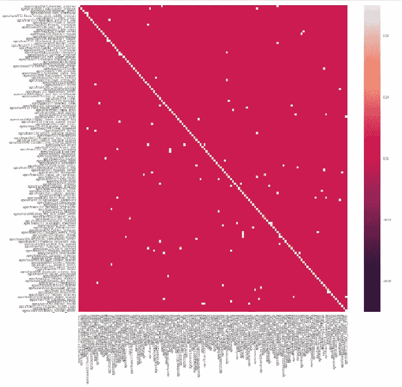

为了更好地理解错误分类的情况，我将预测值和实际值配对。该模型无法在大白熊和库瓦斯之间进行分类，这两种动物都是白色、体型大且毛茸茸的。它也分不清獒和牛獒，后者是牛头犬和獒的混种。通过添加更多的数据，该模型将能够学习更多的具体特征，并区分这些相似的品种，这甚至让人类感到困惑。

**潜在的改进**

由于模型存在轻微的不平衡，可以通过数据扩充和增加更多的训练标记数据来提高模型的精度。随着获取更多数据，Convnet 模型将更有能力从图像中学习更多相关和特定的狗特征。但是，它需要大量的时间和内存使用。另一种提高模型准确性的可能方法是对几个网络的预测进行平均，以获得最终的预测，称为集成技术。正如我之前提到的，一个改进可以是应用更合适的微调策略来根据数据调整权重。此外，对最终模型的正确分析是给图像添加一些噪声，并观察它的表现。

**结论**

在这项工作中，我实现了 haar 级联分类器和 ResNet50 预训练的权重来检测人脸和狗。我还花了一些时间探索数据，以找到图像特征，这有助于我应用更合适的技术。对于犬种分类，我已经开始使用一些卷积层数作为基线网络。该模型的表现比随机猜测要好，133 分之一，但仍然不足。

在给定的时间和内存能力下，我决定利用几个迁移学习架构来增强 CNN 的性能，这导致了显著的改进。我使用预先训练的模型作为固定特征提取器，并改变了全局平均池层、完全连接层，并应用了其他微调方法。Xception 和 ResNet50 产生了比其他更高的准确率，大约 86%。由于混合品种之间存在一些相似性，这类数据集非常复杂，因此要获得更高的准确性是非常具有挑战性的。

最后，我在不同强度分布的相同标记照片上测试了该模型，它的性能相当好。

这个项目最令人兴奋的部分是现代通信网络如何通过几行代码让我们轻松完成甚至人类都觉得具有挑战性的任务。但是在给定的时间和记忆能力下，很难对模型进行改进。我计划探索上述的改进方法，并将更新这个博客以获得更好的结果。

如果你觉得有趣，请随意使用我的代码。