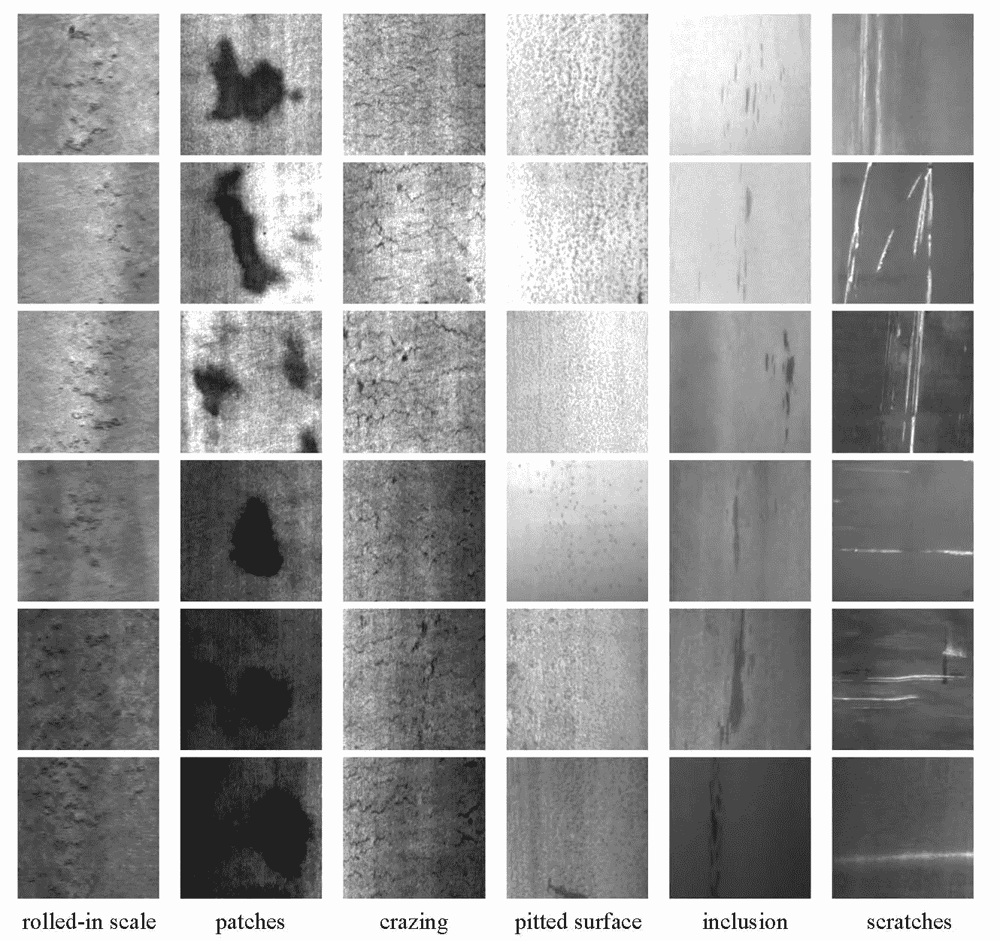

# 深度学习、计算机视觉和自动光学检测

> 原文：<https://towardsdatascience.com/deep-learning-computer-vision-and-automated-optical-inspection-774e8ca529d3?source=collection_archive---------10----------------------->

## 热轧带钢表面缺陷分类实例研究

**自动光学检测**常用于电子工业和制造业，在生产过程中检测产品或部件的缺陷。从概念上讲，图像分类、对象检测和语义分割的深度学习中的常见实践都可以应用于**自动光学检查**。图 1 显示了图像识别中的一些常见任务，图 2 显示了钢零件表面缺陷的一些示例，以供交叉参考。

**Figure 1\. Different tasks in image recognition. [**[**source**](https://medium.com/@nikasa1889/the-modern-history-of-object-recognition-infographic-aea18517c318)**]**

**Figure 2\. NEU Surface Defect Dataset: Image Classification (left) and Object Detection (right). [**[**source**](http://faculty.neu.edu.cn/songkechen/zh_CN/zhym/263269/list/index.htm)**]**

本文介绍了深度学习在热轧带钢表面缺陷图像分类中的应用研究。这篇文章的其余部分组织如下。首先，我们将讨论数据和任务。其次，我们将讨论三种用于评估的深度学习模型:基线模型、InceptionV3 和 MobileNet。最后，我们将介绍实验，然后评估结果。

# NEU 表面缺陷数据库

[**NEU 表面缺陷数据库**](http://faculty.neu.edu.cn/songkechen/zh_CN/zhym/263269/list/index.htm) 收集了六种典型的热轧带钢表面缺陷。该数据集由 1800 张 200x200 的灰度图像组成，均匀标记在 6 个类别上，即*滚入比例*、*补丁*、*龟裂*、*麻面*、*内含物*和*划痕*。图 3 显示了数据库中的示例图像。

**Figure 3\. Sample images in NEU Surface Defect Database. [**[**source**](http://faculty.neu.edu.cn/songkechen/zh_CN/zhym/263269/list/index.htm)**]**

我们在这里的任务是探索这种多类分类问题的深度学习模型。注意，根据数据库的来源，该数据集对图像分类提出了两个困难的挑战，即**类内变异**和**类间相似度**:

*   **类内变异**，即同一类中可能出现不同的模式。例如*划痕*(图 3 最后一栏)的类别包括水平划痕、垂直划痕、倾斜划痕等。此外，由于照明和材料变化的影响，类内缺陷图像的灰度是变化的。
*   **类间相似度**，即相似的方面可能出现在不同的类下。例如，*滚入比例*、*龟裂*和*麻面*中的一些图像可能看起来很像。

虽然类内变异和类间相似性已经在不同的应用中得到解决，但在这种情况下，这些问题肯定会成为一个问题。

# 模型选择和微调

Keras 2.2.2(以 Tensorflow 1.10.0 为后端)实现了三个深度学习模型进行评估:

*   **一个简单的卷积神经网络作为基线模型** : 3 个*Conv2D*/*MaxPooling2D*对作为特征提取器，3 个*密集*层作为分类器；(图 4)
*   **InceptionV3** : [Keras 应用 InceptionV3](https://keras.io/applications/#inceptionv3) 使用 1 个*globalaveragepool2d*层和 2 个 *Dense* 层对分类器进行微调；(图 5)
*   **MobileNet** : [Keras 应用 MobileNet](https://keras.io/applications/#mobilenet) 使用 1 个*globalaveragepooli2d*层和 2 个 *Dense* 层对分类器进行微调；(图 6)

更多关于数据处理和模型训练的共同工程决策:

*   没有数据增强；
*   培训/验证分成 90/10；
*   没有预先训练的重量；
*   20 个时期没有提前停止；

**Figure 4\. simple convolutional neural network.**

**Figure 5\. InceptionV3 Fine-Tuning.**

**Figure 6\. MobileNet Fine-Tuning.**

# 实验和评估

*   **图 7** 简单卷积神经网络(基线):验证准确率高达 52.78%；
*   **图 8** **InceptionV3 微调**:验证准确率高达 98.89%。这个模型似乎在 14 个时代后过度拟合；
*   **图 9** **MobileNet 微调**:验证准确率高达 100.00%。该模型在时期 4 达到 99.44%，然后在时期 10 和时期 14 达到 100.00%。(好得不像真的？！[查看这里的完整日志](https://gist.github.com/f-rumblefish/d7edc4370645894c0692cfb60f54398c)

**Figure 7\. training/validation history of the simple convolutional neural network.**

**Figure 8\. training/validation history of InceptionV3 Fine-Tuning.**

**Figure 9\. training/validation history of MobileNet Fine-Tuning.**

# 结论

本文对热轧带钢表面缺陷的分类进行了研究。为**自动光学检测**实施缺陷分类解决方案实际上类似于在图像分类的深度学习中进行常见实践。显然，知道如何对 MNIST 数据集进行分类并从 Keras 应用程序中导入/调整模型的人应该能够完成这项工作。然而，我仍然想写下这个帖子，原因有几个。

1.  虽然自动光学检测在工业中非常重要，但是自动光学检测的公共数据集相对较少，因为大多数拥有这些数据的公司可能不想公开这些数据。因此，研究人员和从业人员可能缺乏数据集和调查基准。**NEU 表面缺陷数据集**为图像分类和目标检测提供数据，这无疑是一个很好的实践设置。
2.  一般来说，**自动光学检测**数据集的大小小于教科书数据集(如 MNIST 或 CIFAR)和流行数据集(如 ImageNet 或 COCO)。)在**NEU 表面缺陷数据集**的情况下，每类只有 300 幅图像用于训练和验证。此外，由于要考虑类内差异、类间相似性和受检产品/组件/材料的性质，正确应用数据扩充可能是一个挑战。
3.  一些深度学习模型适用于**自动光学检查**的任务，但一些模型可能不是好的选择。然而，模型选择和微调没有金科玉律。使用从 ImageNet 学习的权重进行迁移学习(或者应该使用多少预先训练的权重)是否可以帮助我们执行**自动光学检测**的任务，这是事先未知的。

最后评论:如果读者想知道深度学习方法和机器学习方法在这项任务中的区别，请查看英特尔人工智能学院下的[这篇博客](https://software.intel.com/en-us/articles/use-machine-learning-to-detect-defects-on-the-steel-surface)。

感谢阅读。如果您有任何意见或问题，请随时留言。